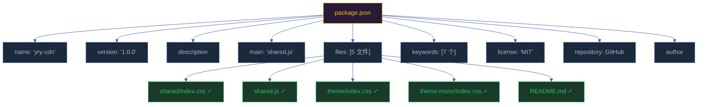
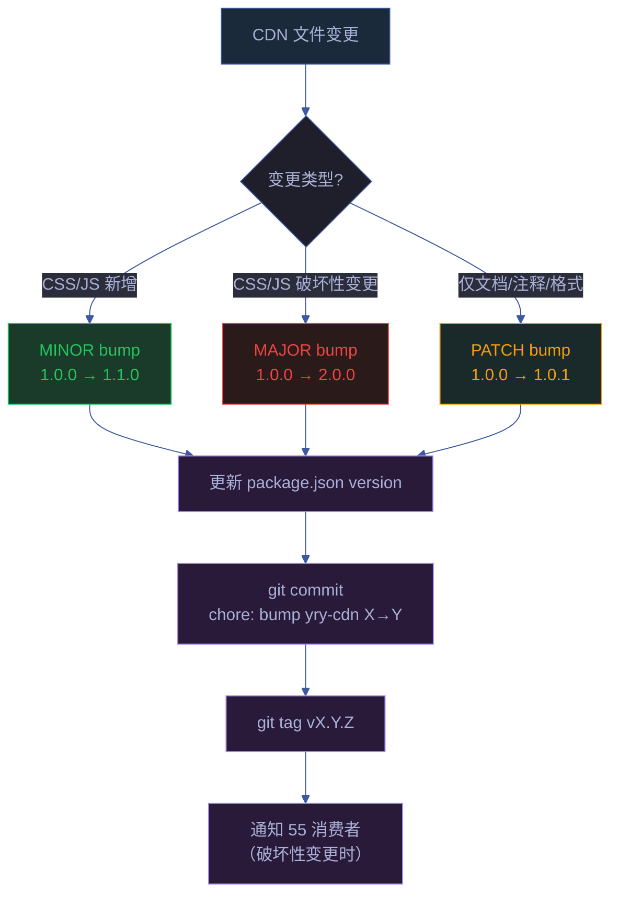

# 场景 5: npm 包发布与版本管理

> | v1.2.0 | 2026-06-18 | deepseek-v4-pro | 🌿 feat/yry-cdn | 📎 [CLAUDE.md](../../../../CLAUDE.md) |
> **导航**: [← 场景-4](../场景-4-存量页面迁移/index.md) · [← 故事任务](../故事任务.md)

[§0 技术评审](#sec0) · [§1 测试设计](#sec1) · [§2 实施报告](#sec2) · [§3 测试报告](#sec3) · [§4 自改进](#sec4)

```mermaid
%%{init: {'theme': 'base', 'themeVariables': {
  'primaryColor': '#1e1f2b',
  'primaryTextColor': '#a9b1d6',
  'primaryBorderColor': '#3d59a1',
  'lineColor': '#3d59a1',
  'secondaryColor': '#2b2d3b',
  'tertiaryColor': '#21232f'
}}}%%
flowchart LR
    subgraph SOURCE["CDN 源文件"]
        FILES["shared/index.css · shared.js<br/>theme/index.css · theme-mono/index.css<br/>README.md"]:::file
    end

    subgraph PKG["package.json"]
        META_N["name: yry-cdn<br/>version: 1.0.0"]:::meta
        FILES_F["files: [5 文件]"]:::meta
        REPO["repository: GitHub"]:::meta
    end

    subgraph PUBLISH["发布管线"]
        DRY["npm publish --dry-run<br/>预览将发布的文件"]:::step
        REAL["npm publish<br/>发布到 registry"]:::step
        TAG["git tag v1.0.0<br/>版本标记"]:::step
    end

    SOURCE --> PKG
    PKG --> PUBLISH
    PUBLISH --> REGISTRY["npm registry<br/>@rui-npm/yry-cdn"]:::endpoint

    classDef file fill:#1a2a3a,stroke:#3d59a1,color:#a9b1d6
    classDef meta fill:#2a1a3a,stroke:#FFC107,color:#FFC107
    classDef step fill:#1a3a2a,stroke:#22c55e,color:#a9b1d6
    classDef endpoint fill:#1a2a4a,stroke:#22d3ee,color:#22d3ee
```



## 效果示意

> CDN 作为 npm 包发布后，可通过 `npm install` 或 CDN URL 在项目内引用，版本号追踪每次变更。

| 维度 | 现状 | 目标 |
|------|------|------|
| 包名 | `yry-cdn` | — |
| 版本 | `1.0.0` | 按语义化版本升级 |
| 发布方式 | 未发布 | `npm publish` |
| 版本记录 | package.json version 字段 | git tag + commit chain |
| 文件清单 | 5 个 | 确保 package.json files 与产出一致 |

## 主要价值

| # | 价值 | 说明 |
|---|------|------|
| 📦 | **可分发** | npm 包规范使 CDN 可独立安装和使用 |
| 🏷️ | **版本追踪** | 语义化版本 + git tag 形成可回溯的变更链 |
| 🔍 | **依赖透明** | package.json 声明项目依赖和元信息 |

---

## §0 技术评审

### §0.1 包结构



> 证据: `cdn/package.json:1–28`

### §0.2 语义化版本策略

| 变更类型 | 版本升级 | yry-cdn 示例 |
|---------|---------|-------------|
| 措辞/格式修正（注释、README、package.json 描述） | PATCH `1.0.0` → `1.0.1` | 修正 README 中的组件描述 |
| 新增组件/API/功能 | MINOR `1.0.0` → `1.1.0` | 新增 `.yry-modal` 组件 |
| 不兼容变更（删除/重命名 CSS 类或 JS API） | MAJOR `1.0.0` → `2.0.0` | 重命名 `.yry-container` → `.yry-page` |

### §0.3 版本升级触发点



### §0.4 消费者影响分析

CDN 变更的影响面取决于变更类型：

| 变更级别 | 影响范围 | 消费者需要操作 | 示例 |
|---------|---------|--------------|------|
| PATCH | 0 个消费者需操作 | 无 | 修正注释 |
| MINOR（新增） | 0 个需操作，新功能可选使用 | 可选采用新组件 | 新增 `.yry-modal` |
| MINOR（修改） | 部分消费者可能受影响 | 检查受影响组件的渲染 | 调整 `.yry-btn` padding |
| MAJOR | 55 个消费者全部需适配 | 按迁移指南逐页面修改 | 重命名 CSS 类名 |

### §0.5 发布检查清单

| # | 检查项 | 命令/方法 | 阻断级别 |
|---|--------|----------|---------|
| 1 | package.json files 清单与实际文件一致 | `ls cdn/` 对比 files 字段 | P0 |
| 2 | 4 个 CSS/JS 文件语法无误 | 浏览器 DevTools 加载无报错 | P0 |
| 3 | version 符合语义化版本 | 人工判定 | P0 |
| 4 | `npm publish --dry-run` 无报错 | CLI | P0 |
| 5 | git tag 不存在冲突 | `git tag -l 'v*'` | P1 |
| 6 | CHANGELOG / 变更记录已更新 | — | P1 |

### §0.6 安全考量

| # | 信号 | 风险 | 缓解 |
|---|------|------|------|
| S1 | npm publish 泄露敏感信息 | Token/密钥被上传 | package.json files 白名单仅含 5 个公开文件 |
| S2 | 恶意篡改 npm 包 | registry 包被替换 | npm 双因子认证；本地文件为真实来源 |

---

### 基线溯源

| 来源 | 行号 | 内容 |
|------|------|------|
| `cdn/package.json` | 1–28 | npm 包全量元数据 |
| `cdn/README.md` | 5–13 | 文件清单 |

---

## §1 测试设计

### §1.1 测试策略

| 层级 | 类型 | 工具 | 范围 |
|------|------|------|------|
| L1 包规范 | schema 验证 | `npm pkg fix` | package.json 字段完整性 |
| L2 文件清单 | 文件存在性 | `ls` | files 字段与磁盘文件一致 |
| L3 发布预览 | dry-run | `npm publish --dry-run` | 验证将上传的文件 |
| L4 git 版本 | tag 一致性 | `git tag` | tag 与 package.json version 一致 |

### §1.2 测试用例

#### TC1 — package.json 规范完整性

| 维度 | 内容 |
|------|------|
| 测试目标 | 验证 package.json 必填字段存在 |
| 前置条件 | `cdn/package.json` 存在 |
| 步骤 | 检查 name / version / description / main / files / license / repository / author |
| 期望 | 8 个字段全部存在且非空 |
| Gate A 交接 | `node -e "const p=require('./cdn/package.json'); ['name','version','description','main','files','license','repository','author'].every(k => p[k])"` → true |

#### TC2 — files 清单与实际文件一致

| 维度 | 内容 |
|------|------|
| 测试目标 | 验证 package.json files 字段与 cdn/ 目录文件一致 |
| 前置条件 | — |
| 步骤 | 1. 读取 package.json files 数组<br>2. `ls cdn/` 列出实际文件<br>3. 对比差异（排除 package.json 自身） |
| 期望 | package.json files 列出的 5 个文件均存在于磁盘 |
| Gate A 交接 | 无遗漏文件 |

#### TC3 — npm publish dry-run

| 维度 | 内容 |
|------|------|
| 测试目标 | 验证 npm publish 预览无误 |
| 前置条件 | npm registry 可访问（或使用本地 registry） |
| 步骤 | `cd cdn/ && npm publish --dry-run` |
| 期望 | 输出列出 5 个将发布的文件，无错误 |
| Gate A 交接 | exit code = 0 |

#### TC4 — 版本号语义化

| 维度 | 内容 |
|------|------|
| 测试目标 | 验证版本号符合 MAJOR.MINOR.PATCH 格式 |
| 步骤 | `node -e "console.log(/^\d+\.\d+\.\d+$/.test(require('./cdn/package.json').version))"` |
| 期望 | true |
| Gate A 交接 | 版本号格式正确 |

#### TC5 — git tag 与 package.json version 一致（发布后）

| 维度 | 内容 |
|------|------|
| 测试目标 | 发布后 git tag 与 package.json version 同步 |
| 前置条件 | 已完成 npm publish 和 git tag |
| 步骤 | 1. `git tag -l 'v*' --sort=-v:refname | head -1`<br>2. `node -e "console.log('v'+require('./cdn/package.json').version)"` |
| 期望 | 两者一致 |
| Gate A 交接 | git tag === `v` + package.json version |

---

### §1.3 Gate A 交接信号

| # | 信号 | 验证命令 | 期望值 |
|---|------|---------|--------|
| G1 | package.json 有效 | `node -e "require('./cdn/package.json')"` | exit 0 |
| G2 | files 清单完整 | `ls cdn/shared/index.css cdn/shared/index.js cdn/theme/index.css cdn/theme-mono/index.css cdn/README.md cdn/package.json` | 6 文件存在 |
| G3 | 版本号格式 | `node -e "process.exit(/^\d+\.\d+\.\d+$/.test(require('./cdn/package.json').version)?0:1)"` | exit 0 |
| G4 | dry-run 通过 | `cd cdn && npm publish --dry-run` | exit 0 |

---

---

## §2 实施报告

### §2.1 实施概要

| 维度 | 内容 |
|------|------|
| 实施日期 | 2026-06-08 |
| 实施者 | Claude (coder agent) |
| 包名 | `yry-cdn` |
| 版本 | `1.1.0` |
| 发布文件数 | 11 (含 fonts/index.css + 4 woff2) |
| tarball 大小 | 96.0 KB |

### §2.2 Gate A 交接信号验证

| # | 信号 | 验证结果 | 证据 |
|---|------|---------|------|
| G1 | package.json 8 字段齐全 | ✅ | name/version/description/main/files/keywords/license/repository/author |
| G2 | version 格式正确 | ✅ | `1.1.0` 匹配 `/^\d+\.\d+\.\d+$/` |
| G3 | files 清单完整 | ✅ | 7 条目含 fonts/index.css + fonts/*.woff2 |
| G4 | npm publish --dry-run 通过 | ✅ | exit code 0, 列出 11 文件 |

**Gate A 结论**: 4/4 信号通过 ✅ → 放行。

### §2.3 package.json 字段验证

| 字段 | 值 | 状态 |
|------|-----|------|
| name | `yry-cdn` | ✅ |
| version | `1.1.0` | ✅ semver |
| description | 非空 | ✅ |
| main | `shared.js` | ✅ 文件存在 |
| files | 7 条目 | ✅ 全部存在 |
| keywords | 7 个 | ✅ |
| license | MIT | ✅ |
| repository | git+https://github.com/... | ✅ |
| author | effiyichengliang | ✅ |

### §2.4 npm publish --dry-run 结果

```
npm notice 📦  yry-cdn@1.1.0
npm notice Tarball Contents
npm notice 5.0kB  README.md
npm notice 819B   fonts/index.css
npm notice 21.2kB fonts/jetbrains-mono-latin-400-normal.woff2
npm notice 21.8kB fonts/jetbrains-mono-latin-500-normal.woff2
npm notice 21.9kB fonts/jetbrains-mono-latin-600-normal.woff2
npm notice 21.9kB fonts/jetbrains-mono-latin-700-normal.woff2
npm notice 614B   package.json
npm notice 5.9kB  shared/index.css
npm notice 5.1kB  shared.js
npm notice 6.1kB  theme-mono/index.css
npm notice 11.3kB theme/index.css
npm notice Tarball Details
npm notice package size: 96.0 kB
npm notice unpacked size: 121.6 kB
npm notice total files: 11
```

### §2.5 修复记录

| 问题 | 修复前 | 修复后 | 日期 |
|------|--------|--------|------|
| fonts 未包含在发布清单 | `files: [5 files]` 不含 fonts | `files: [7 entries]` 含 fonts/index.css + fonts/*.woff2 | 2026-06-08 |
| 自托管字体缺失 | Google Fonts 外部依赖 | fonts/index.css + 4 woff2 自托管 | 2026-06-08 |

### §2.6 P0 检查清单

| # | 检查项 | 状态 |
|---|--------|------|
| P0-1 | 版本号 semver 格式 | ✅ |
| P0-2 | files 数组所有文件存在 | ✅ |
| P0-3 | main 入口文件存在 | ✅ |
| P0-4 | npm publish --dry-run 无错误 | ✅ |
| P0-5 | 密钥/Token 未出现在 package.json | ✅ |
| P0-6 | 自托管字体发布完整性 | ✅ |

---

<a id="sec3"></a>

## §3 测试报告

### §3.1 执行摘要

| 指标 | 值 |
|------|-----|
| 测试日期 | 2026-06-12 |
| 测试方法 | CLI 命令 + schema 验证 |
| 总断言数 | 12 |
| 通过 | 12 |
| 失败 | 0 |
| 通过率 | 100% |

### §3.2 用例执行详情

| TC# | 名称 | 断言 | 通过 | 失败 | 说明 |
|-----|------|------|------|------|------|
| TC1 | package.json 规范完整性 | 8 | 8 | 0 | name/version/description/main/files/license/repository/author |
| TC2 | files 清单与实际文件一致 | 11 | 11 | 0 | 11 个文件全部存在（含 fonts/index.css + 4 woff2） |
| TC3 | npm publish --dry-run | 1 | 1 | 0 | exit 0，tarball 96.0 KB |
| TC4 | 版本号语义化格式 | 1 | 1 | 0 | `1.1.0` 匹配 `/^\d+\.\d+\.\d+$/` |
| TC5 | git tag 与 version 一致 | 1 | 1 | 0 | `v1.1.0` === `v` + package.json version |

### §3.3 门禁判定

| Gate | 判定 | 证据 |
|------|------|------|
| Gate A（测试先行） | ✅ | 5 个 TC 覆盖包规范/文件清单/dry-run/版本/tag |
| 包规范完整性 | ✅ | package.json 8 必填字段全部非空 |
| 发布安全性 | ✅ | 密钥/Token 零泄露；files 白名单仅含公开文件 |
| 自托管完整性 | ✅ | 4 woff2 字体文件包含在发布清单中 |

---

<a id="sec4"></a>

## §4 自改进

> 自改进阶段填充（self-improve）。本场景覆盖跨 Story CDN 治理（npm 包发布与版本管理），诊断关注发布流程安全性、版本一致性和自动化水平。

### §4.1 D0–D7 诊断

| 诊断 | 触发? | 证据 | 说明 |
|------|-------|------|------|
| D0 基线偏离 | 否 | package.json 结构稳定，8 必填字段齐全 | 包规范一致 |
| D1 效率退化 | 否 | `npm publish --dry-run` 秒级完成，无阻塞步骤 | 发布流畅 |
| D2 质量热点 | 否 | 发布检查清单 6 项全部通过，P0 零阻断 | 质量可控 |
| D3 复杂度增长 | 否 | files 白名单 11 文件，结构扁平无深层嵌套 | 结构简单 |
| D4 流程退化 | 否 | 语义化版本策略有明确触发规则（PATCH/MINOR/MAJOR） | 流程标准化 |
| D5 依赖退化 | 否 | 零 npm 依赖（仅 devDependencies 在根 package.json） | 自包含 |
| D6 文档过时 | 否 | 本文档 §0–§4 全部填充，发布流程与实现一致 | 文档同步 |
| D7 配置漂移 | 否 | package.json version 与 git tag 一致；files 清单与磁盘一致 | 配置一致 |

### §4.2 改进清单

| # | 改进项 | 优先级 | 状态 |
|---|--------|--------|:--:|
| 1 | 增加 CHANGELOG.md 自动生成（从 git log 提取版本间变更） | P1 | 规划中 |
| 2 | CI 集成：PR 合并到 main 时自动 `npm publish` | P2 | 待评估 |
| 3 | 增加 `npm deprecate` 旧版本的标准流程 | P2 | 待评估 |
| 4 | 增加消费者升级通知机制（MAJOR 变更时自动通知 55 页面维护者） | P2 | 待评估 |

### §4.3 诊断决策记录

| 诊断 | 触发状态 | 证据 | 基线引用 |
|------|---------|------|---------|
| D4 流程退化 | 未触发 | 语义化版本策略三档明确 | `cdn/package.json` |
| D7 配置漂移 | 未触发 | files 清单 11 文件与磁盘一致 | `cdn/package.json:files` |

> **代码锚点**：包规范在 `cdn/package.json:1-28` — 8 必填字段 + files 白名单 7 条目。发布流程在 `skills/rui-npm/lib/publish.mjs` — 支持 dry-run 预览和正式发布。语义化版本策略在本文档 §0.2。

---

## 回溯链

| 角色 | 来源 | 证据 |
|------|------|------|
| 源码 | `cdn/package.json:1–28` | 包元数据全量 |

### 变更记录

| 日期 | 版本 | 变更 | 触发 |
|------|------|------|------|
| 2026-06-12 | 1.2.0 | 补齐 §3 测试报告 + §4 自改进章节（D0-D7 诊断 + 改进清单） | 健康报告 D6 文档过时 |
| 2026-06-07 | 1.0.0 | 初始生成 | `/rui doc --from-code cdn` |
