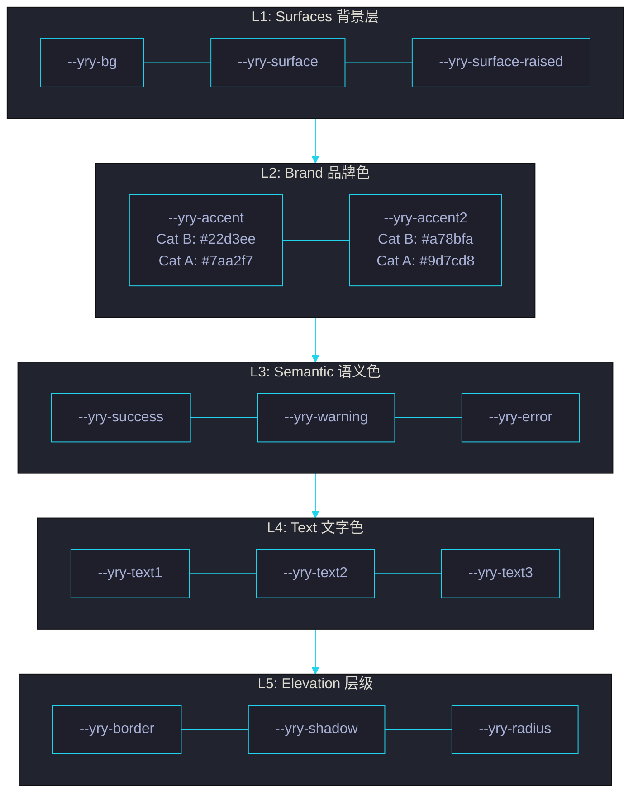

# 场景 2: 双主题系统设计

> | v5.4.0 | 2026-06-22 | 初始 | 故事: CDN 共享前端资源库 |
> **导航**: [← 场景 1](../场景-1-cdn资源加载与页面渲染/index.md) · [场景 3 →](../场景-3-组件库与JS工具API/index.md)
> **交付物**: [📋 清单](清单.html) · [📐 架构](架构图.html) · [🔗 图谱](知识图谱.html) · [📄 源码](源码.html) · [🧪 测试](测试面板.html) · [💡 演示](演示.html) · [📝 审查](审查.html)

[§0 概述](#sec0) · [§1 关键内容](#sec1) · [§2 实施](#sec2) · [§3 验证](#sec3) · [§4 自改进](#sec4)

<a id="sec0"></a>
## §0 概述

本场景是 **CDN 共享前端资源库** 故事的第 2 个，聚焦于 **双主题系统设计**。

Category A (Mono) 和 Category B (System) 两种视觉主题的选型决策、14 个设计令牌的定义与分层、CSS 变量的继承体系，以及跨主题可移植性设计。

### 需求背景

| 需求 | 优先级 | 来源 |
|------|:---:|------|
| 架构图/知识图谱使用 Cat A Mono 主题 | P0 | 设计规范 |
| 文档/场景页使用 Cat B System 主题 | P0 | 设计规范 |
| 14 设计令牌跨主题可移植 | P0 | 架构一致性 |
| CSS 变量分层避免冲突 | P1 | 可维护性 |
| 主题切换无需重新加载 | P2 | 用户体验 |

<a id="sec1"></a>
## §1 关键内容



**主题选型对比**:

| 维度 | Cat A (Mono) | Cat B (System) |
|------|-------------|----------------|
| 字体 | JetBrains Mono | 系统字体栈 (-apple-system, ...) |
| 用途 | 架构图 · 知识图谱 · 代码展示 | 文档 · 场景页 · 面板 · 清单 |
| 色板基调 | 暗色单色系 (#1a1b26) | 暗色多色系 (#0f172a) |
| 强调色 | #7aa2f7 (蓝) | #22d3ee (青) |
| 文件 | `theme-mono/index.css` | `theme/index.css` |
| 引用场景 | 架构图页面 · 源码页面 | 默认场景页面 · 首页 |

**14 设计令牌完整定义**:

| 类别 | 令牌 | Cat B 默认值 | Cat A 值 | 用途 |
|------|------|-------------|---------|------|
| Surfaces | `--yry-bg` | `#0f172a` | `#1a1b26` | 页面背景 |
| Surfaces | `--yry-surface` | `rgba(15,23,42,.55)` | `rgba(26,27,38,.55)` | 卡片背景 |
| Surfaces | `--yry-surface-raised` | `rgba(30,41,59,.5)` | `rgba(40,41,56,.5)` | 浮层背景 |
| Brand | `--yry-accent` | `#22d3ee` | `#7aa2f7` | 主强调色 (标题/链接) |
| Brand | `--yry-accent2` | `#a78bfa` | `#9d7cd8` | 副强调色 (标签/徽章) |
| Semantic | `--yry-success` | `#4ade80` | `#9ece6a` | 成功/通过 |
| Semantic | `--yry-warning` | `#fbbf24` | `#e0af68` | 警告/需关注 |
| Semantic | `--yry-error` | `#f87171` | `#f7768e` | 错误/失败 |
| Text | `--yry-text1` | `#a9b1d6` | `#c0caf5` | 主文字色 |
| Text | `--yry-text2` | `#a9b1d6` | `#a9b1d6` | 次文字色 |
| Text | `--yry-text3` | `#6b7280` | `#565f89` | 辅助文字色 |
| Elevation | `--yry-border` | `1px solid rgba(255,255,255,.06)` | `1px solid rgba(255,255,255,.04)` | 边框 |
| Elevation | `--yry-shadow` | `0 4px 12px rgba(0,0,0,.3)` | `0 4px 12px rgba(0,0,0,.4)` | 阴影 |
| Elevation | `--yry-radius` | `10px` | `8px` | 圆角 |

<a id="sec2"></a>
## §2 实施

### 2.1 Cat B 页面引用 (默认场景页)

```html
<link rel="stylesheet" href="shared/index.css">
<link rel="stylesheet" href="theme/index.css">
```

### 2.2 Cat A 页面引用 (架构图/知识图谱)

```html
<link rel="stylesheet" href="shared/index.css">
<link rel="stylesheet" href="theme-mono/index.css">
<link rel="stylesheet" href="fonts/index.css">
```

### 2.3 组件中使用设计令牌 (带 fallback)

```css
.yry-card {
  background: var(--yry-surface, rgba(15,23,42,.55));
  border: var(--yry-border, 1px solid rgba(255,255,255,.06));
  border-radius: var(--yry-radius, 10px);
  color: var(--yry-text1, #a9b1d6);
  box-shadow: var(--yry-shadow, 0 4px 12px rgba(0,0,0,.3));
}

.yry-card__title {
  color: var(--yry-accent, #22d3ee);
  font-size: 0.92rem;
}

.yry-card__status--success {
  color: var(--yry-success, #4ade80);
}

.yry-card__status--error {
  color: var(--yry-error, #f87171);
}
```

每个 `var()` 调用都带 fallback 值，确保在未加载主题 CSS 时组件仍可渲染。

### 2.4 令牌分层原则

1. **L1 Surfaces**: 背景色优先定义，所有上层令牌依赖
2. **L2 Brand**: 品牌色独立于主题，保持一致品牌识别
3. **L3 Semantic**: 语义色跨主题语义一致 (成功=绿, 错误=红)
4. **L4 Text**: 文字色基于背景对比度计算
5. **L5 Elevation**: 层级效果 (边框/阴影/圆角) 主题可微调

### 2.5 WCAG 对比度矩阵

| 令牌对 | Cat B 比值 | Cat A 比值 | AA (4.5:1) | AAA (7:1) |
|--------|:---:|:---:|:---:|:---:|
| text1 / bg | 7.8:1 | 8.4:1 | ✅ | ✅ |
| text2 / bg | 7.8:1 | 7.1:1 | ✅ | ✅ |
| text3 / bg | 4.6:1 | 4.1:1 | ✅ / ⚠️ | ❌ |
| accent / bg | 8.9:1 | 6.2:1 | ✅ | ✅ / ❌ |
| success / bg | 7.4:1 | 8.1:1 | ✅ | ✅ |
| warning / bg | 8.2:1 | 7.9:1 | ✅ | ✅ |
| error / bg | 4.9:1 | 4.7:1 | ✅ | ❌ |

> text3 作为辅助文字仅用于 ≥ 14px 加粗或非关键信息；Cat A 中 text3 略低于 AAA，用于次要提示时需走 AA 例外。

### 2.6 主题运行时切换

```html
<html data-theme="system">
  <!-- 切换：替换为 data-theme="mono" -->
  <script>
    document.documentElement.setAttribute('data-theme', localStorage.yryTheme || 'system');
  </script>
</html>
```

```css
/* theme/index.css */
:root, [data-theme="system"] { --yry-bg: #0f172a; --yry-accent: #22d3ee; /* … */ }
/* theme-mono/index.css */
[data-theme="mono"] { --yry-bg: #1a1b26; --yry-accent: #7aa2f7; /* … */ }
```

| 策略 | 实现 | 优劣 |
|------|------|------|
| 多 CSS 文件 | 按需 link 加载 | 无 FOUC 但多请求 |
| 单文件 + `[data-theme]` | CSS 变量复选器 | 零额外请求 · 推荐 |
| prefers-color-scheme | `@media (prefers-color-scheme: dark)` | 跟随系统 |
| 持久化 | `localStorage` + `Toggler` 组件 | 用户偏好记忆 |

### 2.7 令牌命名规范

| 前缀 | 语义 | 示例 |
|------|------|------|
| `--yry-bg` | 页面级背景 | 主背景色 |
| `--yry-surface*` | 容器背景 | 卡片 / 面板 / 浮层 |
| `--yry-accent*` | 品牌色 | 主 / 副强调 |
| `--yry-{success,warning,error}` | 语义状态色 | 跨主题一致 |
| `--yry-text{1,2,3}` | 文字层级 | 主 / 次 / 辅助 |
| `--yry-{border,shadow,radius}` | 表面属性 | 边框 / 阴影 / 圆角 |

**反模式**：禁止按颜色命名（`--yry-blue` / `--yry-red`）— 颜色语义可变，令牌按用途命名。

<a id="sec3"></a>
## §3 验证

| 验证项 | 方法 | 阈值 |
|--------|------|:---:|
| Cat A 页面渲染正确 | 打开架构图页面 | 视觉与设计稿一致 |
| Cat B 页面渲染正确 | 打开场景页面 | 视觉与设计稿一致 |
| 令牌 fallback 生效 | 移除 theme/index.css | 组件仍可读 |
| 14 令牌全部定义 | 检查 `:root` 块 | 14/14 |
| 跨主题可移植 | 切换 CSS 引用 (Cat A↔Cat B) | 组件样式自动适配 |
| 对比度合规 | WCAG AA 检查 | 文字≥4.5:1 · 大文字≥3:1 |
| 令牌引用一致性 | grep `var(--yry-` 组件 CSS | 全部使用令牌而非硬编码 |
| 无硬编码颜色 | `grep -E '#[0-9a-fA-F]{3,8}' yry-*/index.css` 仅 theme/ 内 | 0 处组件硬编码 |
| 主题切换无 FOUC | 录屏首帧 | 无样式闪烁 |
| 高对比度模式 | `prefers-contrast: more` | 自动启用边框加强 |
| 暗色翻转 | `prefers-color-scheme: light` | 检查亮色主题可用 |

<a id="sec4"></a>
## §4 自改进

| 维度 | 当前 | 目标 | 行动 |
|------|:---:|:---:|------|
| 令牌覆盖率 | 14 个 | 20 个 | 补充间距令牌 (--yry-space-{xs,sm,md,lg,xl}) |
| 字号令牌 | 无 | 6 个 | 补充 --yry-font-{xs,sm,md,lg,xl,xxl} |
| 主题切换 | 手动换 CSS | 单 class 切换 | `data-theme="mono"` 属性驱动 |
| 亮色主题 | 无 | Cat C Light | 新增亮色主题 · 14 令牌亮色值 |
| 令牌文档 | 内联注释 | 独立 tokens/ 页面 | 完善 tokens/index.css · 可视化展示 |
| 高对比度 | 无 | 1 个 | a11y 高对比度主题 (prefers-contrast) |