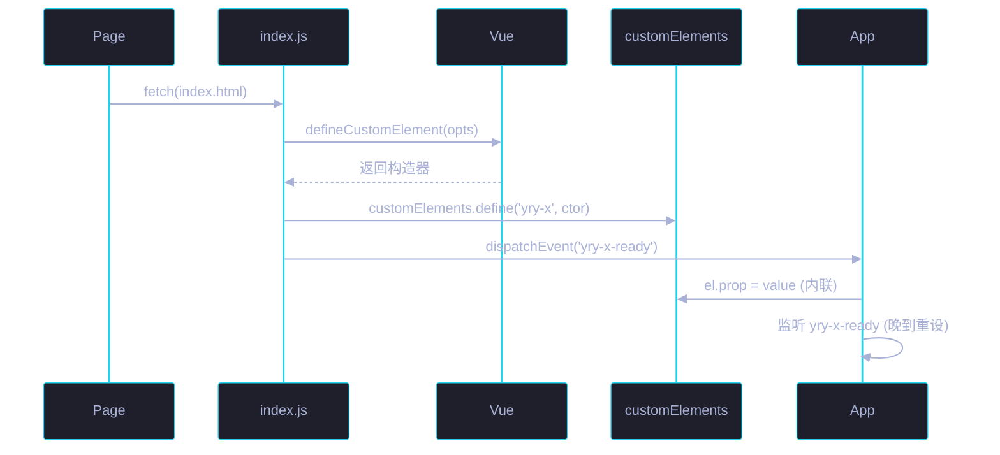

# 场景 3: 组件库与 JS 工具 API

> | v5.4.0 | 2026-06-22 | 初始 | 故事: CDN 共享前端资源库 |
> **导航**: [← 场景 2](../场景-2-双主题系统设计/index.md) · [场景 4 →](../场景-4-存量页面迁移/index.md)
> **交付物**: [📋 清单](清单.html) · [📐 架构](架构图.html) · [🔗 图谱](知识图谱.html) · [📄 源码](源码.html) · [🧪 测试](测试面板.html) · [💡 演示](演示.html) · [📝 审查](审查.html)

[§0 概述](#sec0) · [§1 关键内容](#sec1) · [§2 实施](#sec2) · [§3 验证](#sec3) · [§4 自改进](#sec4)

<a id="sec0"></a>
## §0 概述

本场景是 **CDN 共享前端资源库** 故事的第 3 个，聚焦于 **组件库与 JS 工具 API**。

107 个 CDN 组件（10 大功能类别）的组织架构、9 个 `YrY.*` 工具 API 的设计与实现、54 个 Vue 3 自定义元素的命名空间与语义化规范。

### 需求背景

| 需求 | 优先级 | 来源 |
|------|:---:|------|
| 107 组件统一命名空间 `yry-*` | P0 | 架构规范 |
| 10 大功能类别清晰划分 | P0 | 可发现性 |
| 9 个 YrY.* API 工具函数 | P0 | 跨页面复用 |
| 54 Vue 3 自定义元素零打包 | P0 | 技术约束 |
| 组件 API 向后兼容 | P1 | 稳定性 |

<a id="sec1"></a>
## §1 关键内容

```mermaid
%%{init: {'theme': 'base', 'themeVariables': {
  'primaryColor': '#1e1f2b', 'primaryTextColor': '#a9b1d6',
  'primaryBorderColor': '#22d3ee', 'lineColor': '#22d3ee',
  'secondaryColor': '#2b2d3b', 'tertiaryColor': '#21232f'
}}}%%
flowchart TB
    subgraph CAT["📂 10 大功能类别"]
        LAYOUT["📐 布局与结构<br/>9 个"]
        NAV["🧭 导航<br/>5 个"]
        CARD["🃏 卡片与展示<br/>11 个"]
        SCENE["🎬 场景组件<br/>7 个"]
        STATS["📊 统计与健康<br/>5 个"]
        CHECK["✅ 检查清单<br/>5 个"]
        RISK["⚠️ 风险与审查<br/>4 个"]
        PANEL["🪟 浮动面板<br/>4 个"]
        INTERACT["🔧 交互与反馈<br/>12 个"]
        VIZ["📦 展示与可视化<br/>10 个"]
    end
    subgraph FORM["🧬 形态分布"]
        VUE["Vue 3 CE<br/>54 个"]
        VANILLA["Vanilla JS<br/>44 个"]
        CSS["纯 CSS<br/>22 个"]
        CE["Custom Element<br/>4 个"]
    end
    subgraph API["🔧 YrY.* API"]
        TOAST["toast"]
        COPY["copyCmd"]
        PANEL_API["switchPanel"]
        TOGGLE["suiteToggle"]
        META["sceneMeta"]
        FETCH["fetchData"]
        DEBOUNCE["debounce"]
        THROTTLE["throttle"]
        READY["ready"]
    end
    CAT --> FORM
    FORM --> API
```



**10 大功能类别**:

| # | 类别 | 数量 | 代表组件 |
|:---:|------|:---:|------|
| 1 | 布局与结构 | 9 | yry-layer · yry-doc-layer · yry-breadcrumb · yry-sub-title · yry-card-grid |
| 2 | 导航 | 5 | yry-panel-hub · yry-cross-nav · yry-page-nav · yry-scene-nav · yry-back-top |
| 3 | 卡片与展示 | 11 | yry-item-card · yry-story-card · yry-scene-card · yry-tag-chip · yry-kpi-card |
| 4 | 场景组件 | 7 | yry-scene-header · yry-scene-footer · yry-scene-chrome · yry-scene-stats |
| 5 | 统计与健康 | 5 | yry-stats-grid · yry-health-bar · yry-kpi-grid · yry-progress-bar · yry-phase-strip |
| 6 | 检查清单 | 5 | yry-checklist-head · yry-check-item · yry-verify-item · yry-step-card |
| 7 | 风险与审查 | 4 | yry-risk-cat-card · yry-risk-matrix · yry-risk-row · yry-review-cards |
| 8 | 浮动面板 | 4 | yry-cron-panel · yry-notify-panel · yry-selfimprove-panel · yry-faq-panel |
| 9 | 交互与反馈 | 12 | yry-accordion · yry-code-block · yry-tooltip · yry-toast · yry-typewriter |
| 10 | 展示与可视化 | 10 | yry-concept-radar · yry-cytoscape-graph · yry-gantt · yry-timeline-hero |

**9 个 YrY.* 工具 API**:

| API | 签名 | 用途 | 使用频率 |
|-----|------|------|:---:|
| `YrY.toast` | `(msg, type?, duration?)` | 弹出 toast 通知 (success/error/warning/info) | 高 |
| `YrY.copyCmd` | `(text, el?)` | 复制命令到剪贴板 + 视觉反馈 | 高 |
| `YrY.switchPanel` | `(panelName)` | 切换浮动面板 (cron/notify/selfimprove/faq) | 中 |
| `YrY.suiteToggle` | `(selector)` | 折叠/展开套件 (details/summary) | 中 |
| `YrY.sceneMeta` | `(basePath)` | 从 basePath 生成 7 交付物链接数组 | 高 |
| `YrY.fetchData` | `(url, options?)` | 带超时 + 重试的 fetch 封装 | 中 |
| `YrY.debounce` | `(fn, delay)` | 防抖函数 (输入框搜索等) | 低 |
| `YrY.throttle` | `(fn, delay)` | 节流函数 (scroll/resize 等) | 低 |
| `YrY.ready` | `(el, eventName)` | 自定义元素就绪检测 Promise | 中 |

**Vue 3 自定义元素规范**:

| 规范项 | 约定 | 示例 |
|--------|------|------|
| 命名空间 | `yry-*` (kebab-case) | `<yry-item-card>` |
| 注册方式 | `Vue.defineCustomElement()` | `customElements.define('yry-item-card', YryItemCard)` |
| 就绪事件 | `*-ready` 事件 | `yry-item-card-ready` |
| 属性赋值 | property 赋值 (非 attribute) | `el.items = [...]` |
| 双设策略 | 内联立即赋值 + ready 事件二次赋值 | 覆盖组件晚于元素出现的场景 |
| 文件拆分 | 三文件 (index.html/js/css) | 模板/逻辑/样式各司其职 |

<a id="sec2"></a>
## §2 实施

### 2.1 组件文件结构

```
yry-{component}/
├── index.html    # 模板源 (Vue template <script type="text/x-template">) + Demo 预览
├── index.js      # Loader: fetch 模板 → defineCustomElement → 派发 ready 事件
└── index.css     # 组件样式 (使用 --yry-* 设计令牌 + fallback)
```

### 2.2 组件注册模式 (以 yry-item-card 为例)

```javascript
// yry-item-card/index.js
fetch('yry-item-card/index.html')
  .then(r => r.text())
  .then(html => {
    const template = html.match(/<template[^>]*>([\s\S]*?)<\/template>/)[1];
    const YryItemCard = Vue.defineCustomElement({
      template,
      props: {
        icon: String, name: String, badge: String,
        desc: String, tags: Array, meta: String,
        links: Array, nameHref: String, nameTarget: String,
        iconModifier: { type: String, default: 'skill' }
      },
      emits: ['item-card-ready']
    });
    customElements.define('yry-item-card', YryItemCard);
    document.dispatchEvent(new CustomEvent('yry-item-card-ready'));
  });
```

### 2.3 组件依赖关系

```
tag-chip → item-card → card-grid → doc-layer
                                → story-card
                                → scene-card
```

基础组件 (tag-chip, item-card) 必须先于复合组件 (card-grid, doc-layer) 注册。

### 2.4 Vue 3 自定义元素生命周期



| 阶段 | 触发 | 数据就绪保证 |
|------|------|------|
| connectedCallback | 元素插入 DOM | 仅 attribute 解析完成 |
| Vue mount | 首次 render | props 已传入 |
| yry-*-ready | customElements.define 后 | API 可调用 |
| 二次赋值 | ready 事件回调 | 覆盖晚到数据 |

### 2.5 API 错误契约

| API | 失败模式 | 降级 | 调用方提示 |
|-----|---------|------|------|
| `toast` | DOM 未就绪 | console.warn(msg) | 不阻塞调用 |
| `copyCmd` | 权限拒绝 (非 https) | 退回 `document.execCommand('copy')` | toast 提示失败 |
| `switchPanel` | 面板不存在 | 无操作 + 日志 | 静默降级 |
| `fetchData` | 超时 / 5xx | 指数退避重试 3 次 | 返回 Promise.reject |
| `ready` | 元素未注册 | 5s 超时 reject | 调用方 catch 处理 |

### 2.6 命名空间与版本兼容

| 约定 | 规则 | 向后兼容策略 |
|------|------|------|
| 标签名 | 全小写 kebab-case + `yry-` 前缀 | 不变 |
| Props 名 | camelCase (JS) / kebab-case (HTML) | 双向兼容 |
| 事件名 | `{component}-{action}` | 仅追加 · 不改名 |
| Slot 名 | default + named slots | 新增 slot 不破坏 |
| CSS 变量 | `--yry-{component}-{token}` | 仅新增 · 不删除 |

**SemVer 兼容矩阵**:

| 版本变化 | 含义 | 组件 API | CSS 变量 | 事件 |
|---------|------|------|------|------|
| Patch (1.2.x) | Bug 修复 | 不变 | 不变 | 不变 |
| Minor (1.x.0) | 向后兼容新增 | 可新增 prop | 可新增变量 | 可新增事件 |
| Major (x.0.0) | 破坏性变更 | 可删除/改 | 可改 | 可改 |

<a id="sec3"></a>
## §3 验证

| 验证项 | 方法 | 阈值 |
|--------|------|:---:|
| 107 组件注册成功 | `customElements.get('yry-*')` 遍历 | 全部已注册 |
| 9 API 可用 | 控制台调用 `typeof YrY.{api}` | 全部 !== undefined |
| 命名空间唯一 | 检查无重名 `customElements.define` | 0 冲突 |
| 双设策略生效 | 内联赋值 + ready 事件 | 数据正确渲染 |
| 组件 Demo 可预览 | 浏览器打开 `yry-*/index.html` | 全部可渲染 |
| 三文件完整 | 检查 `yry-*/` 含 index.{html,js,css} | 94+/107 |
| Props 向后兼容 | 对比 v1.0→v1.2 组件 API | 无 breaking change |
| 依赖加载顺序 | DevTools Console 检查 ready 事件序列 | 基础组件先于复合 |
| 错误降级 | 断网 / 故意构造超时 | API 返回 reject · 不抛未捕获异常 |
| Props 类型校验 | `Vue.warn` 控制台 | 0 类型告警 |
| 内存泄漏 | chrome://memory 三次切换面板 | detached DOM ≤ 0 |

<a id="sec4"></a>
## §4 自改进

| 维度 | 当前 | 目标 | 行动 |
|------|:---:|:---:|------|
| 组件完整度 | 94/107 | 107/107 | 完善 13 个待完善组件 (补 CSS/JS) |
| API 文档 | 内联注释 | 独立 API 参考页 | 生成 `docs/api/` 文档 |
| 组件测试 | 部分 | 全覆盖 | vitest 补充单元测试用例 |
| 组件发现 | 手动分类 | 搜索+筛选 | search-bar 组件集成 |
| Props 类型 | 运行时 | 编译时 | JSDoc/TypeScript 类型声明 |
| 组件版本 | 无版本号 | 语义化版本 | 组件级 CHANGELOG |
| 组件清单自动校验 | 手动维护 | CI 强制 | build-manifest 阻断 PR |
| 组件 a11y | 部分覆盖 | WCAG AA | axe-core 自动审计 |
| 组件懒加载 | 全量注册 | 按需注册 | IntersectionObserver 触发 |
| 组件沙箱 | 全局命名空间 | Shadow DOM 封装 | 关键组件开启 ShadowRoot |