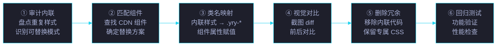
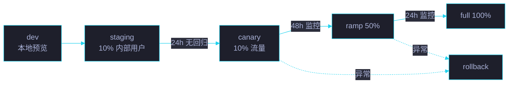

# 场景 4: 存量页面迁移

> | v5.4.0 | 2026-06-22 | 初始 | 故事: CDN 共享前端资源库 |
> **导航**: [← 场景 3](../场景-3-组件库与JS工具API/index.md) · [场景 5 →](../场景-5-npm包发布与版本管理/index.md)
> **交付物**: [📋 清单](清单.html) · [📐 架构](架构图.html) · [🔗 图谱](知识图谱.html) · [📄 源码](源码.html) · [🧪 测试](测试面板.html) · [💡 演示](演示.html) · [📝 审查](审查.html)

[§0 概述](#sec0) · [§1 关键内容](#sec1) · [§2 实施](#sec2) · [§3 验证](#sec3) · [§4 自改进](#sec4)

<a id="sec0"></a>
## §0 概述

本场景是 **CDN 共享前端资源库** 故事的第 4 个，聚焦于 **存量页面迁移**。

55+ 页面从内联样式迁移到 CDN 组件的完整流程：6 步迁移路径、类名替换策略、内联消除率度量，以及页面专属 CSS 的保留原则。

### 需求背景

| 需求 | 优先级 | 来源 |
|------|:---:|------|
| 55+ 页面迁移到 CDN 组件 | P0 | 架构统一 |
| 内联重复代码消除 40-60% | P0 | 代码质量 |
| 页面专属 CSS 可保留 | P1 | 渐进迁移 |
| 迁移前后视觉一致 | P0 | 回归要求 |
| 6 步迁移路径可复现 | P1 | 可操作性 |

<a id="sec1"></a>
## §1 关键内容



**迁移评估矩阵**:

| 页面类型 | 数量 | 迁移难度 | 内联消除率 | 关键组件 | 状态 |
|---------|:---:|:---:|:---:|------|:---:|
| 场景文档页 (审查/演示/测试) | 25+ | 低 | 60% | scene-header · breadcrumb · cross-nav | ✅ |
| 架构图/知识图谱 | 10+ | 中 | 40% | arch · cytoscape-graph · concept-radar | ✅ |
| 计划清单/验证报告 | 8+ | 中 | 50% | checklist · verify-item · step-card | ✅ |
| 故事面板/健康报告 | 7+ | 高 | 30% | story-card · scene-card · health-bar | 🔄 |
| 首页/导航页 | 5+ | 低 | 50% | home · panel-hub · stats-grid | ✅ |

**迁移前后对比 (典型页面)**:

| 页面 | 迁移前 | 迁移后 | 减少 | 组件引用 |
|------|--------|--------|:---:|------|
| 审查.html | 850 行 (含 200 行内联) | 620 行 | -27% | scene-header · breadcrumb · cross-nav |
| 演示.html | 720 行 (含 180 行内联) | 490 行 | -32% | scene-chrome · item-card · tag-chip |
| 测试面板.html | 650 行 (含 150 行内联) | 480 行 | -26% | verify-item · progress-bar · stats-grid |
| 架构图.html | 1100 行 (含 350 行内联) | 700 行 | -36% | arch · export-toolbar · cytoscape-graph |

<a id="sec2"></a>
## §2 实施

### 2.1 迁移前: 内联样式

```html
<style>
  .card {
    background: rgba(15,23,42,.55);
    border: 1px solid rgba(255,255,255,.06);
    border-radius: 10px;
    padding: 20px 24px;
    margin-bottom: 16px;
  }
  .card h3 { font-size: .92rem; color: #22d3ee; }
  .card p { font-size: .76rem; color: #a9b1d6; }
  .card .tags { display: flex; gap: 6px; }
  .card .tag {
    font-size: .64rem; padding: 2px 8px;
    border-radius: 4px; background: rgba(34,211,238,.15);
    color: #22d3ee;
  }
</style>
<div class="card">
  <h3>标题</h3>
  <p>内容描述</p>
  <div class="tags"><span class="tag">标签</span></div>
</div>
```

### 2.2 迁移后: CDN 组件

```html
<link rel="stylesheet" href="../../cdn/yry-item-card/index.css">
<link rel="stylesheet" href="../../cdn/yry-tag-chip/index.css">
<script src="../../cdn/yry-item-card/index.js"></script>
<script src="../../cdn/yry-tag-chip/index.js"></script>

<yry-item-card
  icon="📋" name="标题" badge="Vue 3"
  desc="内容描述"
  tags='[{"text":"标签","modifier":"accent"}]'
  meta="元信息">
</yry-item-card>
```

### 2.3 保留页面专属 CSS

以下情况保留页面专属 CSS (不迁移到组件):

| 场景 | 示例 | 原因 |
|------|------|------|
| 页面特有布局 | 特定网格列数 (如 5 列相册) | 组件不提供通用网格 |
| 页面特有动画 | 首屏入场动画序列 | 组件应保持动画无关 |
| 视觉细节 | 特定间距微调 | 组件间距由设计令牌控制 |
| 临时样式 | A/B 测试变体 | 不应污染组件样式 |

### 2.4 迁移检查清单

- [ ] 确认目标 CDN 组件存在且版本兼容
- [ ] 在 `<head>` 中添加组件 CSS 引用
- [ ] 在 `<body>` 底部添加组件 JS 引用
- [ ] 替换内联 HTML 为 `<yry-*>` 自定义元素
- [ ] 将内联样式数据转为组件属性 (property)
- [ ] 截图对比迁移前后视觉效果
- [ ] 删除已迁移的内联 `<style>` 块
- [ ] 回归测试页面交互功能
- [ ] 检查 Lighthouse 评分不劣于迁移前

### 2.5 迁移风险矩阵与灰度策略

| 风险 | 概率 | 影响 | 缓解 | 应急 |
|------|:---:|:---:|------|------|
| CDN 不可达 | 低 | 高 | 双 CDN 回退 (§场景 1) | 立即回滚到内联 |
| 视觉回归 | 中 | 中 | 截图 diff 评审 | 灰度 10% → 50% → 100% |
| 组件 API 不兼容 | 低 | 高 | SemVer 锁定 + 预发回归 | 降级到兼容版本 |
| 性能退化 | 低 | 中 | 性能预算门禁 | 回滚并重做迁移 |
| a11y 退化 | 中 | 中 | axe-core 自动审计 | 修复后重新发布 |

**灰度发布路径**:



### 2.6 内联消除度量方法

```bash
# 度量迁移前后的内联样式行数
grep -c '<style>' page.html          # style 块数
awk '/<style>/,/<\/style>/' file | wc -l  # 总行数
# 消除率 = (前 - 后) / 前 × 100%
```

| 指标 | 度量方式 | 目标 |
|------|---------|:---:|
| `<style>` 块数 | `grep -c '<style>'` | ≤ 1 (页面专属) |
| 内联 style 行数 | awk 区间统计 | ≤ 50 行 |
| 硬编码颜色 | `grep -E '#[0-9a-f]{3,8}'` | ≤ 0 (组件内) |
| 重复类名 | `grep -o '\.yry-' \| sort -u` | ≤ 1 处定义 |
| 组件引用率 | `<yry-*>` 标签 / 总节点 | ≥ 30% |

<a id="sec3"></a>
## §3 验证

| 验证项 | 方法 | 阈值 |
|--------|------|:---:|
| 视觉一致性 | 截图对比 (迁移前 vs 迁移后) | 0 视觉差异 |
| 内联消除率 | 统计 `<style>` 块行数变化 | ≥ 40% |
| 功能完整性 | 页面交互功能回归 | 全部通过 |
| 加载性能 | Lighthouse 评分 | 不劣于迁移前 |
| 组件引用正确 | 检查 `<link>` / `<script>` HTTP 状态 | 全部 200 |
| 组件属性正确 | 检查自定义元素 attribute→property | 数据正确渲染 |
| a11y 不退化 | axe-core 扫描 | 0 新增违规 |
| 控制台无报错 | DevTools Console | 0 error |
| 累计布局偏移 | Lighthouse CLS | ≤ 0.1 |
| 首次输入延迟 | Lighthouse FID | ≤ 100ms |
| 可交互时间 | Lighthouse TTI | ≤ 500ms |

<a id="sec4"></a>
## §4 自改进

| 维度 | 当前 | 目标 | 行动 |
|------|:---:|:---:|------|
| 迁移覆盖率 | 85% (47/55+) | 100% (55/55) | 完成剩余 8 个故事面板/健康报告页面 |
| 内联消除率 | 40-60% | 60-80% | 提取更多可复用样式为组件 |
| 迁移自动化 | 手动 | 半自动 | 开发迁移辅助脚本 (内联→组件映射) |
| 回归测试 | 手动截图 | 视觉回归自动化 | Percy/Chromatic 集成 |
| 迁移文档 | 场景文档 | 迁移指南 | 输出 FAQ + 常见模式 + 迁移模板 |
| 回滚策略 | 无 | git revert | 每次迁移独立 commit |