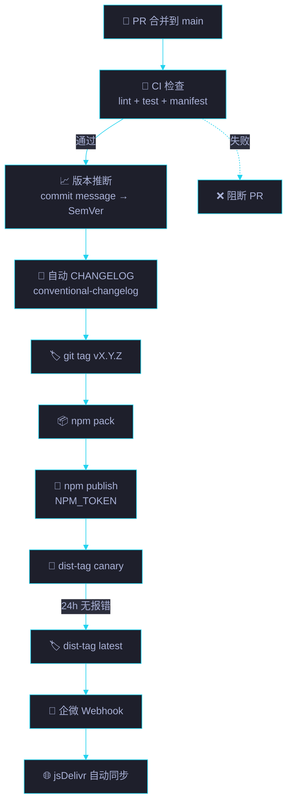

# 场景 5: npm 包发布与版本管理

> | v5.4.0 | 2026-06-22 | 初始 | 故事: CDN 共享前端资源库 |
> **导航**: [← 场景 4](../场景-4-存量页面迁移/index.md) · [← 故事任务](../故事任务.md)
> **交付物**: [📋 清单](清单.html) · [📐 架构](架构图.html) · [🔗 图谱](知识图谱.html) · [📄 源码](源码.html) · [🧪 测试](测试面板.html) · [💡 演示](演示.html) · [📝 审查](审查.html)

[§0 概述](#sec0) · [§1 关键内容](#sec1) · [§2 实施](#sec2) · [§3 验证](#sec3) · [§4 自改进](#sec4)

<a id="sec0"></a>
## §0 概述

本场景是 **CDN 共享前端资源库** 故事的第 5 个，聚焦于 **npm 包发布与版本管理**。

`package.json` 的字段配置、`files` 白名单策略、jsDelivr CDN 的自动同步机制、语义化版本号策略，以及发布流程的自动化。

### 需求背景

| 需求 | 优先级 | 来源 |
|------|:---:|------|
| jsDelivr CDN 全球分发 | P0 | 分发架构 |
| files 白名单控制包体积 | P0 | 包大小 |
| 语义化版本号 (SemVer) | P0 | 兼容性保证 |
| 发布后自动同步 jsDelivr | P1 | 时效性 |
| CHANGELOG.md 版本记录 | P1 | 可追溯性 |

<a id="sec1"></a>
## §1 关键内容


**package.json 关键字段**:

| 字段 | 值 | 说明 |
|------|-----|------|
| `name` | `yry-cdn` | npm 包名 (scoped-less) |
| `version` | `1.2.0` | 语义化版本 |
| `description` | YrY 共享前端资源库 | 包描述 |
| `main` | `shared/index.js` | CJS 入口 |
| `style` | `shared/index.css` | CSS 入口 (npm 约定) |
| `unpkg` | `shared/index.js` | unpkg CDN 入口 |
| `jsdelivr` | `shared/index.css` | jsDelivr CDN 入口 |
| `files` | `["shared/","theme/","theme-mono/","fonts/","yry-*/","*.md"]` | 发布白名单 |

**语义化版本策略**:

| 版本段 | 含义 | 触发条件 | 示例 |
|--------|------|---------|------|
| MAJOR | 不兼容的 API 变更 | 移除组件 · 重命名令牌 · 变更 API 签名 | 1.0.0 → 2.0.0 |
| MINOR | 向后兼容的新功能 | 新增组件 · 新增 API · 新增主题 | 1.1.0 → 1.2.0 |
| PATCH | 向后兼容的修复 | 样式修复 · 性能优化 · 文档更新 | 1.2.0 → 1.2.1 |

**版本演进历史**:

| 版本 | 日期 | 类型 | 评分 | 关键变更 |
|------|------|:---:|:---:|------|
| v1.0.0 | 2026-04-08 | MAJOR | 78/C | 初始发布: shared + theme + 9 API |
| v1.1.0 | 2026-05-20 | MINOR | 86/B | theme-mono + 字体 (4 woff2) + 14 令牌 |
| v1.2.0 | 2026-06-16 | MINOR | 92/A | 107 组件 · 双主题 · 文档完善 |
| v1.3.0 | 计划中 | MINOR | 目标 95/A | 组件完善 · 测试覆盖 · 文档增强 |

**jsDelivr 同步机制**:

```
npm publish → npm registry (registry.npmjs.org)
  → jsDelivr 自动检测新版本 (CDN 轮询 npm registry)
    → 全球 CDN 节点同步 (通常 < 5min)
      → https://cdn.jsdelivr.net/npm/yry-cdn@1.2.0/
```

<a id="sec2"></a>
## §2 实施

### 2.1 发布前检查清单

```bash
# 1. 确认版本号正确递增
node -e "console.log(require('./package.json').version)"
# 期望: 1.2.0 (当前)，下一版本 1.3.0 或 1.2.1

# 2. 确认 files 白名单无遗漏
npm pack --dry-run
# 检查输出文件列表，确保 107 组件全部包含

# 3. 检查包体积
npm pack --dry-run 2>&1 | tail -1
# 期望: < 5MB (当前 ~3MB)

# 4. 更新 CHANGELOG.md
# 将 [Unreleased] 段改为新版本号

# 5. 确认所有文件已提交
git status
# 期望: clean working tree

# 6. 运行测试
npm test
# 期望: 全部通过
```

### 2.2 发布命令

```bash
# 创建 git tag
git tag v1.3.0

# 推送到 GitHub
git push origin main --tags

# 发布到 npm
npm publish
```

### 2.3 发布后验证

```bash
# 验证 npm 包可安装
npm install yry-cdn@1.2.0

# 验证 jsDelivr 可用 (5 步关键路径)
curl -I https://cdn.jsdelivr.net/npm/yry-cdn@1.2.0/shared/index.css
curl -I https://cdn.jsdelivr.net/npm/yry-cdn@1.2.0/theme/index.css
curl -I https://cdn.jsdelivr.net/npm/yry-cdn@1.2.0/shared/index.js

# 验证 unpkg 可用
curl -I https://unpkg.com/yry-cdn@1.2.0/shared/index.css

# 浏览器验证
open https://cdn.jsdelivr.net/npm/yry-cdn@1.2.0/shared/index.css
```

### 2.4 files 白名单策略

**发布到 npm** (files 字段):
```
shared/          # 必备基线 (CSS + JS)
theme/           # Cat B 主题
theme-mono/      # Cat A 主题
fonts/           # 自托管字体 (4 woff2)
yry-*/           # 107 组件 (通配)
*.md             # 文档 (README · CHANGELOG · COMPONENTS · TUTORIAL)
```

**排除项** (不发布到 npm):
- `.editorconfig` / `.prettierrc.json` / `.stylelintrc.json` — 开发工具配置
- `eslint.config.js` — Lint 配置
- `package-lock.json` — npm 自动忽略
- `scripts/` — 构建脚本 (仅开发用)
- `cdn-summary/` / `health-report/` / `changelog/` — 数据快照 (运行时生成)
- `components-manifest/` — 组件清单数据 (运行时生成)
- `shared-reports/` — 报告工具 (消费者自行引用)

### 2.5 发布流水线 (CI/CD)



| 阶段 | 工具 | 触发 | 阻断条件 |
|------|------|------|------|
| Lint | eslint + stylelint | PR + push | 任何 error |
| 单元测试 | vitest | PR + push | 覆盖率 < 70% |
| 架构合规 | arch-check.mjs | PR + push | 非 A 级 |
| 包体积 | size-limit | PR | 超基线 +10% |
| 安全扫描 | npm audit + Socket | PR | high/critical 漏洞 |
| 发布 | npm publish | tag push | 前序阶段全过 |

### 2.6 版本策略决策树

```
本次变更包含破坏性 API 变更？
├── 是 → MAJOR (x+1.0.0)
└── 否 → 本次变更包含新组件 / 新 API / 新主题？
        ├── 是 → MINOR (x.y+1.0)
        └── 否 → 本次变更是 Bug 修复 / 性能 / 文档？
                ├── 是 → PATCH (x.y.z+1)
                └── 否 → 不需要发布
```

| 变更类型 | 升级段 | 发布通道 | 回滚窗口 |
|---------|------|------|------|
| 破坏性 | MAJOR | latest (72h 后) | 30 天 |
| 新功能 | MINOR | latest | 14 天 |
| Bug 修复 | PATCH | latest | 7 天 |
| 预发验证 | 任意 | canary (dist-tag) | 48h 后转 latest |

<a id="sec3"></a>
## §3 验证

| 验证项 | 方法 | 阈值 |
|--------|------|:---:|
| npm 安装成功 | `npm install yry-cdn` | 0 错误 |
| jsDelivr 可访问 | curl CDN URL | HTTP 200 |
| unpkg 可访问 | curl unpkg URL | HTTP 200 |
| 包体积合理 | `npm pack --dry-run` | < 5MB |
| 版本号递增 | 对比上一版本 package.json | 正确递增 |
| CHANGELOG 更新 | 检查 CHANGELOG.md | 含当前版本 |
| Git tag 存在 | `git tag -l "v*"` | 含当前版本 tag |
| 5 步加载链可用 | 浏览器 Network 面板 | 全部 200 且 ≤ 625ms |
| SRI 哈希可生成 | `openssl dgst -sha384` | 与 CDN 一致 |
| canary 标签存在 | `npm dist-tag ls yry-cdn` | canary 存在 |
| 签名验证 | `npm verify` | valid signature |
| 下载量监控 | npm-stat | 周下载趋势 |
| 供应链审计 | `npm audit signatures` | 0 未签名 |

<a id="sec4"></a>
## §4 自改进

| 维度 | 当前 | 目标 | 行动 |
|------|:---:|:---:|------|
| 发布自动化 | 手动 | CI/CD 自动 | GitHub Actions: tag push → npm publish |
| 版本通知 | 手动 | 自动推送 | npm notifications + 企微 Webhook |
| 包体积 | ~3MB | < 2MB | 压缩 CSS · 精简 woff2 子集 · 移除冗余 |
| 发布频率 | 月级 | 周级 | 补丁自动化 + 小版本周发布 |
| 预发布验证 | 无 | canary | npm dist-tag canary 预发布通道 |
| 回滚能力 | 手动 | npm unpublish | 保留最近 3 个版本便于回滚 |