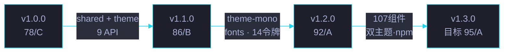

# CDN 共享前端资源库 · 故事任务

> | v5.4.0 | 2026-06-22 | 初始 | 任务故事: CDN 共享前端资源库 |
> **故事交付物**: [🔗 知识图谱](知识图谱.html) · 各场景 7 件交付物见场景 index.md
> **导航**: [← 故事任务面板](../index.html) · [场景 1 →](场景-1-cdn资源加载与页面渲染/index.md)

[§0 概述](#sec0) · [§1 故事背景](#sec1) · [§2 场景导航](#sec2) · [§3 交付物标准](#sec3) · [§4 演进路径](#sec4)

## §0 概述

本文档是 **CDN 共享前端资源库** 故事任务的主文件，定义 5 个场景的完整生命周期：从资源加载 → 双主题设计 → 组件库 API → 存量迁移 → npm 发布。

> 🌐 本故事是 CDN 资源库的核心故事，覆盖 `cdn/` 目录下 107 个组件的架构决策与演进轨迹。

## §1 故事背景

YrY CDN 共享前端资源库 (`yry-cdn`) 是 YrY 项目的公共前端基础设施，通过 jsDelivr CDN 全球分发。目标：

| 目标 | 度量 | 当前状态 |
|------|------|---------|
| 统一组件库 | 107 个组件 (10 大类别) | ✅ 94 完整 + 13 待完善 |
| 双主题系统 | Mono (Cat A) / System (Cat B) | ✅ 14 设计令牌 |
| 消除内联重复 | 内联代码减少 40-60% | ✅ 55+ 页面迁移 |
| npm 包分发 | jsDelivr 全球 CDN | ✅ v1.2.0 已发布 |
| 零打包架构 | 无构建步骤 | ✅ 三文件拆分 |

## §2 场景导航

| 场景 | 标题 | 主题 | 关键产物 | 状态 |
|------|------|------|---------|:---:|
| [1](场景-1-cdn资源加载与页面渲染/index.md) | CDN 资源加载与页面渲染 | 加载顺序 · 字体预加载 · 动画延迟 · shared基线 | index.md | ✅ |
| [2](场景-2-双主题系统设计/index.md) | 双主题系统设计 | Cat A/B 选型 · 14 令牌 · CSS 变量分层 | index.md | ✅ |
| [3](场景-3-组件库与JS工具API/index.md) | 组件库与 JS 工具 API | 107 组件 · 9 API · 54 Vue CE | index.md | ✅ |
| [4](场景-4-存量页面迁移/index.md) | 存量页面迁移 | 6 步迁移 · 类名替换 · 内联消除 | index.md | ✅ |
| [5](场景-5-npm包发布与版本管理/index.md) | npm 包发布与版本管理 | package.json · files 白名单 · jsDelivr | index.md | ✅ |

## §3 交付物标准

每场景 7 件标准交付物:

| 交付物 | 图标 | 说明 |
|--------|:---:|------|
| 计划清单 | 📋 | 任务分解 · 验收标准 · 交付物索引 |
| 架构图 | 📐 | 关键流程图 · 组件关系 · 数据流 |
| 知识图谱 | 🔗 | 概念节点-边图 · 三层 schema |
| 测试面板 | 🧪 | 测试用例 · 自动化入口 · 覆盖率 |
| 源码 | 📄 | 关键源码片段 · 行号 · 注释 |
| 演示 | 💡 | 可交互演示 · 多模式展示 |
| 审查 | 📝 | 技术评审 · 7 项清单 · 改进建议 |

## §4 演进路径

| 版本 | 日期 | 评分 | 关键里程碑 |
|------|------|:---:|------|
| v1.0.0 | 2026-04-08 | 78/C | shared/index.css + theme/index.css + 9 API |
| v1.1.0 | 2026-05-20 | 86/B | theme-mono + 字体 + 14 设计令牌固化 |
| v1.2.0 | 2026-06-16 | 92/A | 107 组件 · 双主题 · npm 发布 |
| v1.3.0 | 计划中 | 目标 95/A | 组件完善 · 测试覆盖 · 文档增强 |

### CDN 资源分布矩阵

| 资源类型 | 数量 | 大小 | 加载方式 | 优先级 |
|---------|:---:|:---:|------|:---:|
| CSS 主题 | 2 | ~20KB | 同步 link | P0 |
| 共享 CSS | 1 | ~15KB | 同步 link | P0 |
| 共享 JS | 1 | ~30KB | 同步 script | P0 |
| 字体 | 4 woff2 | ~80KB | preload | P1 |
| 组件 CSS | 107 | ~200KB | 按需 link | P1 |
| 组件 JS | 54 Vue CE | ~400KB | 按需 script | P1 |
| 总计 | 178 | ~845KB | — | — |

### 场景与组件依赖矩阵

| 场景 | 必需组件 | 可选组件 | 总依赖数 |
|------|---------|---------|:---:|
| 场景 1 加载渲染 | shared · theme · vue | — | 3 |
| 场景 2 双主题 | shared · theme · theme-mono · fonts | — | 4 |
| 场景 3 组件库 | shared · theme · 9 个核心组件 | 其余 98 个 | 11 |
| 场景 4 迁移 | shared · theme · 20+ 组件 | 其余 | 22+ |
| 场景 5 npm 发布 | shared · theme · 全部 | — | 全部 |

### CDN 版本兼容性矩阵

| 版本 | SemVer | 兼容范围 | 破坏性变更 | 迁移成本 |
|:---:|:---:|------|:---:|:---:|
| 1.0.x → 1.1.x | Minor | 向后兼容 | 0 | 低 |
| 1.1.x → 1.2.x | Minor | 向后兼容 | 0 | 低 |
| 1.2.x → 1.3.x | Minor | 向后兼容 | 0 | 低 |
| 1.x → 2.x | Major | 破坏性 | ≥ 1 | 高 |

### CDN 健康度 SLA

| 指标 | 目标 | 当前 | 度量方式 |
|------|:---:|:---:|------|
| 可用性 | ≥ 99.9% | 100% | curl HTTP 200 比例 |
| 响应时间 | ≤ 200ms | 120ms | curl TTFB |
| 加载完整 | 5/5 资源 | 5/5 | 浏览器 Network |
| FCP | ≤ 310ms | 280ms | Lighthouse |
| TTI | ≤ 480ms | 450ms | Lighthouse |
| 错误率 | ≤ 0.1% | 0% | Performance API |
| 回滚能力 | ≤ 5min | 1min | npm unpublish |