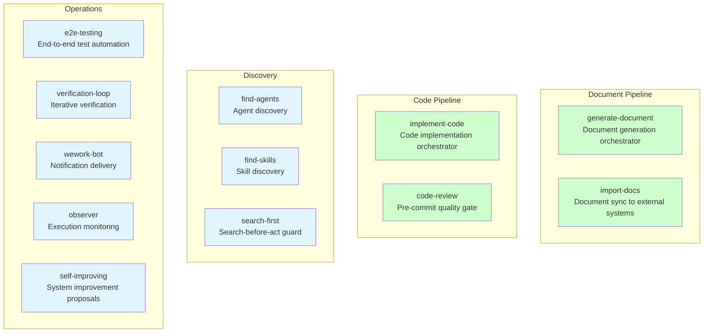
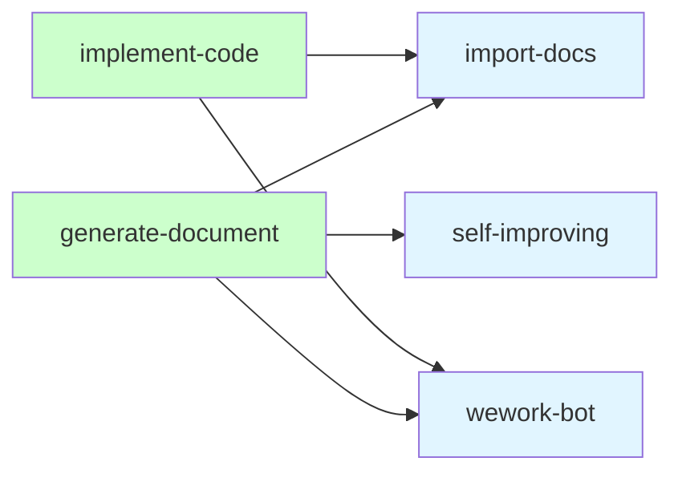
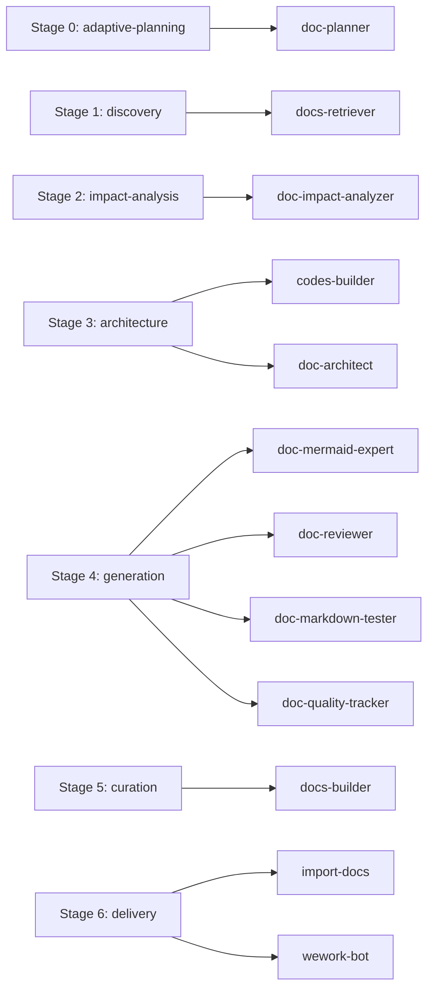
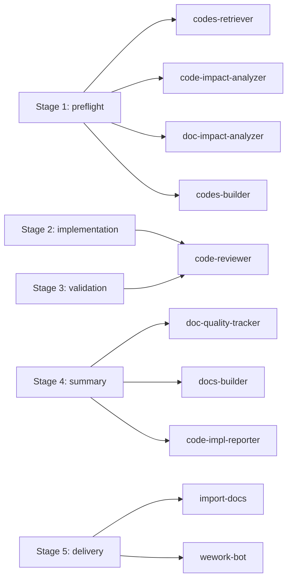
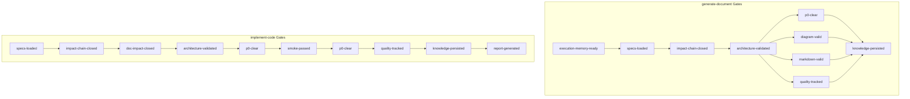

# YrY Project Architecture

> **Document Version**: v1.0 | **Last Updated**: 2026-05-03 | **Maintainer**: Claude Opus 4.7 | **Tool**: Claude Code
>
> **Related Documents**: [README.md](../README.md) | [INDEX.md](../INDEX.md) | [CLAUDE.md](../CLAUDE.md)
>
> **Git Branch**: main
>
> **Doc Start Time**: unknown (not recorded) | **Doc Last Update Time**: 12:00:00

[Module Principles](#module-principles) | [Module Structure](#module-structure) | [Module Dependency Relationships](#module-dependency-relationships) | [Pipeline Architecture](#pipeline-architecture) | [Cross-Cutting Contracts](#cross-cutting-contracts) | [Design Decisions](#design-decisions)

---

## Module Principles

### Principle 1: Separation of Manifest, Rules, and Behavior

Each module carries its own metadata (manifest frontmatter), behavioral specification (SKILL.md), and supporting files (rules/, checklists/, scripts/) within a self-contained directory. No module's behavior depends on another module's internal implementation — only on shared contracts.

### Principle 2: Source-of-Truth Ownership

Every module owns a specific domain and is the single source of truth for that domain. For skills, `SKILL.md` is canonical; for agents, the `agents/<name>.md` file is canonical; for shared contracts, the file in `shared/` is canonical. Cross-references are allowed but must point to the authoritative source.

### Principle 3: Pipeline Composability

Skills expose lifecycle stages and gates. Agents attach to stages to satisfy gates. Pipelines compose agents and skills without either needing to know about the full graph — the orchestration is declarative in manifest frontmatter, and the harness resolves it at runtime.

### Principle 4: Contract-Driven Integration

Modules interact through explicit contracts (document-contracts, impact-analysis-contract, evidence-and-uncertainty, etc.) defined in `shared/`. These contracts specify input expectations, output formats, gating criteria, and boundary conditions. No module may bypass a contract to communicate with another module.

### Principle 5: Minimum Viable Scope

Skills and agents have narrow, explicit triggers and stop conditions. A skill that starts without meeting its P0 prerequisites must abort and write a block log. An agent that cannot close its gate must report the open gate rather than fabricating a result.

---

## Module Structure

The project is organized into six top-level module groups.

### Module Division Table

| Module | Responsibility | Location |
|--------|---------------|----------|
| **Skills** | User-invocable capability definitions; each skill is an orchestrator for a specific lifecycle (document generation, code implementation, import sync, etc.) | `skills/<skill-name>/` |
| **Agents** | Expert agent definitions with defined roles, tool access, and gating responsibilities; stateless workers invoked by skills during pipeline stages | `agents/<agent-name>.md` |
| **Commands** | Slash-command entry points; thin wrappers that delegate to skills | `commands/<command-name>.md` |
| **Shared Contracts** | Cross-cutting contracts, conventions, boundary definitions, and framework specifications; the legal layer that skills and agents must comply with | `shared/` |
| **Scripts** | Automation utilities for manifest compilation, weekly KPI collection, orchestration logging, execution memory, and self-improvement | `scripts/` |
| **Framework** | Manifest schema definition and lifecycle templates; the schema that all skill and agent manifests must validate against | `shared/framework/` |

### Skills Inventory

The skill ecosystem divides into two orchestrator skills (`generate-document`, `implement-code`) that drive multi-stage pipelines, and ten support skills that provide discovery, quality gates, notification, and self-improvement capabilities.

### Agent Inventory

| Agent | Role | Pipeline Stage |
|-------|------|---------------|
| `doc-planner` | Adaptive planning; analyzes execution memory to plan document generation | generate-document::0 |
| `docs-retriever` | Retrieves existing documents and specifications | generate-document::1 |
| `doc-impact-analyzer` | Full-project impact chain analysis across documents and code | generate-document::2, implement-code::1/3/4 |
| `doc-architect` | Architecture design for documents; defines chapter structure and content contracts | generate-document::3 |
| `codes-builder` | Code architecture design and build planning | generate-document::3, implement-code::1 |
| `doc-mermaid-expert` | Mermaid diagram syntax review and repair | generate-document::4 |
| `doc-reviewer` | Document P0 quality review | generate-document::4 |
| `doc-markdown-tester` | Markdown structure and format validation | generate-document::4 |
| `doc-quality-tracker` | Quality metrics, trend analysis, and diagnostic reporting | generate-document::4, implement-code::4 |
| `docs-builder` | Knowledge curation and asset persistence | generate-document::5, implement-code::4 |
| `codes-retriever` | Codebase retrieval and context assembly | implement-code::1 |
| `code-impact-analyzer` | Code-level change impact analysis | implement-code::1/3/4 |
| `code-reviewer` | Code review and P0 gate enforcement | implement-code::2/3 |
| `code-impl-reporter` | Implementation process reporting and quality metrics | implement-code::4 |
| `code-e2e-tester` | E2E test scheme design and automation | implement-code::* |
| `doc-generate-reporter` | Document generation process reporting | generate-document::* |
| `test-markdown-builder` | Document test prototype builder | generate-document::2 |
| `test-page-builder` | E2E test prototype page builder | implement-code::2 |

### Shared Contracts Inventory

| Contract | Scope |
|----------|-------|
| `document-contracts.md` | Document type matrix, source-of-truth priority, terminology |
| `agent-skill-boundaries.md` | Agent/skill pairings, gate coverage, trigger conditions |
| `impact-analysis-contract.md` | Full-project impact chain closure specification |
| `evidence-and-uncertainty.md` | Admissible evidence types, uncertainty marking, anti-hallucination rules |
| `agent-output-contract.md` | Standardized agent output format |
| `path-conventions.md` | Unified path notation, obsolete path prohibitions, link governance |
| `component-contract.md` | Shared vs. application layer component standards |
| `mcp-fallback-contract.md` | MCP server fallback behavior |
| `message-pusher.md` | Notification push strategy and anti-hallucination rules |
| `mermaid-expert.md` | Mermaid diagram conventions |
| `spec-retriever.md` | Specification retrieval conventions |
| `weekly-analyzer.md` | Weekly report analysis conventions |

---

## Module Dependency Relationships

### Skill-to-Skill Dependency

Both orchestrator skills depend on `import-docs` and `wework-bot` for the delivery stage. `generate-document` additionally triggers `self-improving` for weekly reflection aggregation.

### Skill-to-Agent Dependency (generate-document Pipeline)

### Skill-to-Agent Dependency (implement-code Pipeline)

### Gate Dependency Flow

Gates are the binding mechanism between agents and pipeline stages. Each gate is provided by one or more agents and consumed by a pipeline stage. An agent that fails to close its gate blocks subsequent stages from executing.

### Cross-Cutting Framework Dependencies

Every skill manifest and agent definition depends on `shared/framework/manifest-schema.md` for its frontmatter structure. Every document produced by any skill depends on `shared/evidence-and-uncertainty.md` for admissible content standards. Every document type depends on its corresponding rule file in `skills/generate-document/rules/` for chapter structure and required fields.

---

## Pipeline Architecture

### Document Pipeline (generate-document)

| Stage | Name | Trigger | Gate |
|-------|------|---------|------|
| 0 | Adaptive Planning | Feature name or command received | execution-memory-ready |
| 1 | Discovery | Stage 0 complete (or skipped) | specs-loaded |
| 2 | Impact Analysis | Stage 1 complete | impact-chain-closed |
| 3 | Architecture | Stage 2 complete | architecture-validated |
| 4 | Generation | Stage 3 complete | p0-clear, diagram-valid, markdown-valid, quality-tracked |
| 5 | Curation | Stage 4 complete | knowledge-persisted |
| 6 | Delivery | Stage 5 complete | — |

### Code Pipeline (implement-code)

| Stage | Name | Trigger | Gate |
|-------|------|---------|------|
| 1 | Preflight | Feature spec received | specs-loaded, impact-chain-closed, doc-impact-closed, architecture-validated |
| 2 | Implementation | Stage 1 complete | p0-clear |
| 3 | Validation | Stage 2 complete | smoke-passed, p0-clear |
| 4 | Summary | Stage 3 complete | quality-tracked, knowledge-persisted, report-generated |
| 5 | Delivery | Stage 4 complete | — |

### Parallel Execution

Stage 3 of the document pipeline runs `codes-builder` and `doc-architect` in parallel — both contribute to the `architecture-validated` gate. Stage 4 runs four agents (`doc-mermaid-expert`, `doc-reviewer`, `doc-markdown-tester`, `doc-quality-tracker`) sequentially because each agent's output informs the next.

---

## Design Decisions

### Why Skills Own Lifecycles

Skills define the pipeline; agents fill stages. This means the same agent (`docs-builder`, `doc-quality-tracker`) can serve both the document and code pipelines without coupling to either. The skill defines *when* and *why*; the agent defines *how*.

### Why Shared Contracts Are Separate from Skills

Placing contracts in `shared/` rather than inside a specific skill allows multiple skills and agents to consume the same contract without creating skill-to-skill dependency cycles. If the contract were inside a skill, every consumer would depend on that skill.

### Why Templates Are Disabled for Design Documents

`03_design-document.md` is generated rules-only (no template). This prevents structure drift between the specification and the generated output. Templates invite shortcuts; specs force completeness.

### Why Agents Have No Memory Between Invocations

Agents are stateless by design. Each invocation receives its full context from the orchestrating skill. This prevents stale state from contaminating later pipeline stages and makes each agent individually testable.

---

## Postscript: Future Planning & Improvements

The current architecture has a strong contract layer and clear pipeline separation. Future work could explore: agent warm-up / preloading to reduce cold-start latency; dynamic agent selection based on feature complexity; pipeline stage parallelization beyond the current Stage 3 exception; and a formal agent testing harness that mocks upstream gates.

## Workflow Standardization Review

1. **Repetitive labor identification**: Manifest compilation (`compile-manifests.js`) is currently manual — it could be triggered by a git hook on SKILL.md or agent definition changes. Orchestration logging is scattered across multiple scripts — a unified event bus would reduce duplication.
2. **Decision criteria missing**: The threshold for downgrading a P0 prerequisite to "pending" (H2 scenario) is not mechanized — it relies on agent judgment. A quantified decision matrix would reduce inconsistency.
3. **Information silos**: Execution memory is written by `skills/self-improving/scripts/execution-memory.js` but consumed only by `doc-planner` during Stage 0. Other agents could benefit from execution history to calibrate their estimates and decisions.
4. **Feedback loop**: Weekly self-improvement aggregates feedback from feature documents, but there is no mechanism to close the loop by updating skill rules based on aggregate findings. A quarterly "rule refresh" cadence would address this.

## System Architecture Evolution Thinking

- **A1. Current architecture bottleneck**: The sequential gate chain in Stage 4 (document generation) is the longest pole — four agents run in series, and any one agent's failure restarts the full chain. Parallelizing `doc-mermaid-expert` with `doc-markdown-tester` (they operate on different document aspects) would cut Stage 4 latency.
- **A2. Next natural evolution node**: Formalizing agent contracts as machine-readable schemas (rather than prose in `shared/`) would enable automated contract validation before agent invocation, catching mismatches without running the full pipeline.
- **A3. Risks and rollback plans for evolution**: Agent parallelization risks nondeterministic output if two agents edit the same file concurrently — this requires file-level locking or merge-safe document operations. Rollback: revert to sequential execution by removing the `parallel: true` flag from the pipeline stage definition.
