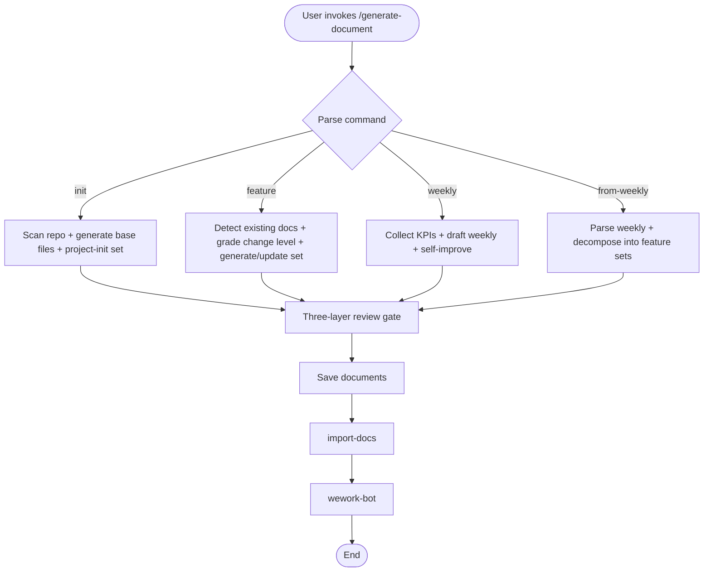
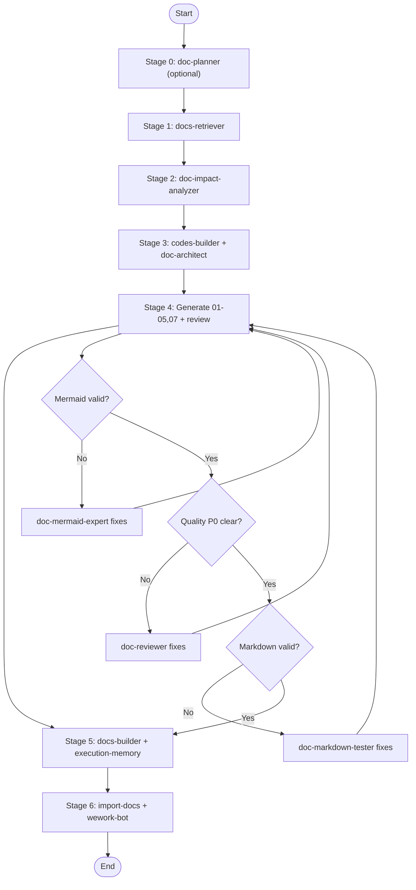
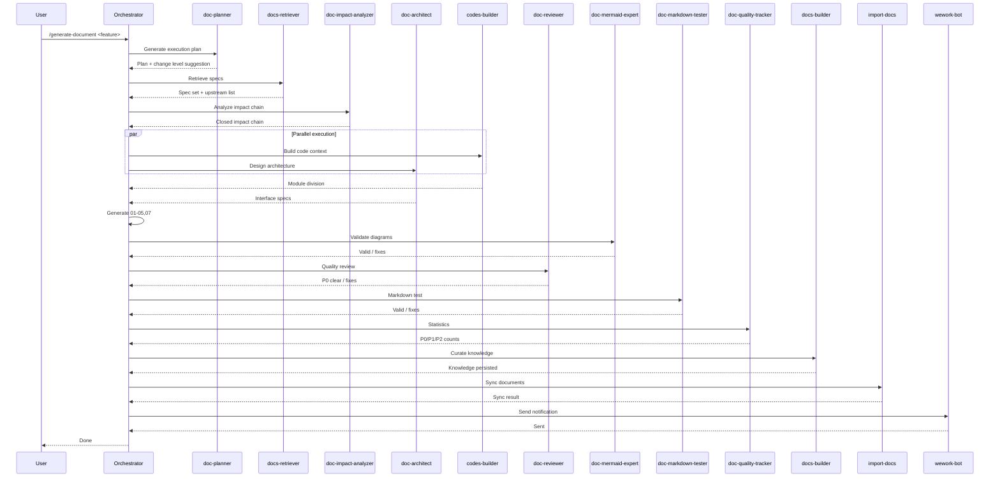

# generate-document

> **Document Version**: v1.0 | **Last Updated**: 2026-05-02 | **Maintainer**: Claude | **Tool**: Claude Code
>
> **Related Documents**: [Requirement Document](./01_requirement-document.md) | [Design Document](./03_design-document.md) | [Usage Document](./04_usage-document.md)
>
> **Git Branch**: main
>
> **Doc Start Time**: 00:00:00 | **Doc Last Update Time**: 00:00:00
>

[Feature Overview](#feature-overview) | [Feature Analysis](#feature-analysis) | [Main Operation Scenarios](#main-operation-scenarios) | [Feature Details](#feature-details) | [Acceptance Criteria](#acceptance-criteria) | [Impact Analysis](#impact-analysis) | [Usage Scenario Examples](#usage-scenario-examples)

---

## Feature Overview

`generate-document` is a documentation-generation orchestrator that produces the full numbered document set (01-05, 07) under `docs/<feature-name>/`. It operates through a 7-stage pipeline with mandatory review gates, supports four command modes (`init`, feature, `weekly`, `from-weekly`), and enforces incremental updates via T1/T2/T3 change detection. The skill does not modify source code; its sole output is structured Markdown documentation grounded in repository facts.

**Core Values**
- 🎯 One command yields a complete, traceable document set
- ⚡ Incremental updates avoid unnecessary regeneration
- 📖 Self-improving weekly reports feed back into the system

---

## Feature Analysis

### Feature Decomposition Diagram

```mermaid
graph TB
    GD["generate-document"] --> CMD["Command Parser"]
    GD --> PLN["Stage 0: Adaptive Planning"]
    GD --> DIS["Stage 1: Discovery & Spec Retrieval"]
    GD --> IMP["Stage 2: Impact Analysis"]
    GD --> ARC["Stage 3: Architecture Design"]
    GD --> GEN["Stage 4: Generation & Self-Review"]
    GD --> CUR["Stage 5: Save & Knowledge Curation"]
    GD --> DEL["Stage 6: Document Sync & Notification"]

    CMD --> INIT["init"]
    CMD --> FEA["feature-name-description"]
    CMD --> WEK["weekly"]
    CMD --> FWK["from-weekly"]

    GEN --> MER["doc-mermaid-expert"]
    GEN --> REV["doc-reviewer"]
    GEN --> TST["doc-markdown-tester"]
    GEN --> QTR["doc-quality-tracker"]

    DEL --> IDS["import-docs"]
    DEL --> WWB["wework-bot"]

    style GD fill:#ccffcc,stroke:#333,stroke-width:2px
    style CMD fill:#e1f5ff,stroke:#007acc
    style PLN fill:#e1f5ff,stroke:#007acc
    style DIS fill:#e1f5ff,stroke:#007acc
    style IMP fill:#e1f5ff,stroke:#007acc
    style ARC fill:#e1f5ff,stroke:#007acc
    style GEN fill:#e1f5ff,stroke:#007acc
    style CUR fill:#e1f5ff,stroke:#007acc
    style DEL fill:#e1f5ff,stroke:#007acc
```

**Feature Decomposition Explanation**: The skill is decomposed into a command parser (selecting among four modes), six pipeline stages (0-5), three-layer review agents under Stage 4, and two mandatory termination skills (Stage 6).

### User Flow Diagram

**User Flow Explanation**: The user invokes one of four commands. Each command flows through generation, review, save, sync, and notification. No command may skip sync or notification.

### Feature Flow Diagram

**Feature Flow Explanation**: The pipeline proceeds sequentially through 7 stages. Stage 4 contains a three-layer review gate (Mermaid, quality, markdown) that loops back for fixes until all gates pass.

### Full Sequence Diagram

**Sequence Diagram Explanation**: The orchestrator drives each agent in sequence. Stages 3 (Builder + Architect) run in parallel. Stage 4 loops through three review agents before quality statistics are recorded.

---

## Main Operation Scenarios

#### 🎯 Scenario: Initialize a New Project

**Related User Story**: 🔴 As a developer, I want automated documentation generation for each feature, so that requirement documents, design documents, and checklists remain consistent and traceable.

**Scenario Description**: A developer runs `/generate-document init` to scaffold documentation for a new repository.

**Preconditions**:
- Repository root is accessible
- `package.json` or build configuration exists (optional but preferred)

**Operation Steps**:
1. Parse `init` command
2. Scan repository structure (`package.json`, build config, source directories, git history)
3. Invoke `docs-retriever` for applicable specifications
4. Invoke `codes-builder` + `doc-architect` to infer architecture patterns
5. Generate 10 base files + `docs/project-init/01-07`
6. Run three-layer review gate + `doc-quality-tracker`
7. Save documents, invoke `docs-builder`
8. Execute `import-docs` then `wework-bot`

**Expected Results**: `CLAUDE.md`, `README.md`, 8 `docs/` base files, and `docs/project-init/01-07` exist and are readable.

**Verification Focus Points**:
- All 17 output files are created
- `06_process-summary.md` is written by init itself (exception to the implement-code-only rule)
- `import-docs` and `wework-bot` execute without exception

**Related Design Document Chapter**: [Architecture Design](./03_design-document.md#architecture-design)

---

#### 🎯 Scenario: Generate a Feature Document Set

**Related User Story**: 🔴 As a developer, I want automated documentation generation for each feature, so that requirement documents, design documents, and checklists remain consistent and traceable.

**Scenario Description**: A developer runs `/generate-document user-login-phone-otp` to create documentation for a new feature.

**Preconditions**:
- Feature name is parseable
- No existing `docs/user-login-phone-otp/` directory (new mode)

**Operation Steps**:
1. Parse feature name: `user-login-phone-otp`
2. Invoke `docs-retriever` to retrieve specifications
3. Detect no existing documents → enter new mode
4. Invoke `doc-impact-analyzer` for full-project impact chain closure
5. Invoke `codes-builder` + `doc-architect` for architecture design
6. Generate 01-05, 07 according to `rules/*.md`
7. Run three-layer review gate + `doc-quality-tracker`
8. Save to `docs/user-login-phone-otp/`, version `v1.0`
9. Execute `import-docs` then `wework-bot`

**Expected Results**: `docs/user-login-phone-otp/01-05,07` exist, grounded in repository facts, with closed impact chains.

**Verification Focus Points**:
- Impact analysis contains four sub-tables with real search results
- Design document (`03`) contains no template content
- All documents append "Postscript: Future Planning & Improvements"

**Related Design Document Chapter**: [Implementation Details](./03_design-document.md#implementation-details)

---

#### 🟡 Scenario: Update an Existing Feature Document

**Related User Story**: 🔴 As a developer, I want automated documentation generation for each feature, so that requirement documents, design documents, and checklists remain consistent and traceable.

**Scenario Description**: A developer modifies a requirement and re-runs `/generate-document payment-gateway-refund-flow`.

**Preconditions**:
- `docs/payment-gateway/` exists with valid Markdown
- User input contains a change relative to existing 01-03

**Operation Steps**:
1. Detect existing `docs/payment-gateway/`
2. Load 01-03, compare with user input, produce change impact table
3. Grade change level: T1 (minor wording), T2 (partial feature), or T3 (scope change)
4. Skip or trim stages 2-3 based on change level
5. Rewrite changed chapters only (T1), or target + sync downstream (T2), or full cascade (T3)
6. Increment version (minor `+1`, major `+1` for breaking changes)
7. Save, curate incrementally, sync, notify

**Expected Results**: Only affected chapters are rewritten; unchanged content is preserved verbatim.

**Verification Focus Points**:
- Change level is not downgraded
- T1/T2 do not trigger full-project impact rescans
- Downstream sync annotations exist for T2 changes

**Related Design Document Chapter**: [Changes](./03_design-document.md#changes)

---

## Feature Details

#### Command Parser and Dispatch

**Description**: Parses `/generate-document` arguments into one of four modes: `init`, `<feature-name>-<description>`, `weekly [date]`, or `from-weekly <path>`.

**Value**: Enables a single entry point for all documentation operations.

**Pain Point Solved**: Prevents fragmented documentation commands and inconsistent output locations.

---

#### Three-Layer Review Gate

**Description**: Stage 4 enforces Mermaid syntax validation (`doc-mermaid-expert`), design quality review (`doc-reviewer`), and Markdown link/code/terminology testing (`doc-markdown-tester`).

**Value**: Catches syntax errors, design inconsistencies, and broken links before documents are saved.

**Pain Point Solved**: Manual review is slow and inconsistent; automated gates enforce uniform quality.

---

#### Incremental Update Strategy

**Description**: T1/T2/T3 change detection determines which pipeline stages execute, which documents rewrite, and whether downstream documents sync.

**Value**: Minor edits complete in seconds instead of minutes.

**Pain Point Solved**: Full regeneration for every small change wastes tokens and overwrites manual additions.

---

## Acceptance Criteria

### P0 - Must Pass
- [ ] **Item 1**: One command produces a complete numbered set (01-05, 07) in `docs/<feature-name>/`
- [ ] **Item 2**: `init` produces 10 base files + `docs/project-init/01-07`
- [ ] **Item 3**: Stage 6 executes `import-docs` then `wework-bot` without exception
- [ ] **Item 4**: Impact analysis closes all dependency chains before design conclusions

### P1 - Should Pass
- [ ] **Item 5**: Three-layer review gate passes before save
- [ ] **Item 6**: T1/T2/T3 change level correctly detected and handled per `rules/workflow.md`
- [ ] **Item 7**: Weekly command triggers `self-improve.js` automatically

### P2 - Nice to Have
- [ ] **Item 8**: Re-init preserves manual additions outside auto-generated blocks
- [ ] **Item 9**: `from-weekly` decomposes a weekly report into 2+ feature document sets

---

## Impact Analysis

> **Mandatory enforcement**: must per `../../../shared/impact-analysis-contract.md` execute complete impact analysis on the whole project.

### Search Terms and Change Point List

| Change Point | Type | Search Term | Source | Notes |
|--------------|------|-------------|--------|-------|
| generate-document skill | skill | `generate-document` | `skills/generate-document/SKILL.md` | Referenced by README, INDEX, implement-code, code-review, shared contracts |
| import-docs skill | skill | `import-docs` | `skills/import-docs/README.md` | Mandatory predecessor to wework-bot in Stage 6 |
| wework-bot skill | skill | `wework-bot` | `skills/wework-bot/SKILL.md` | Mandatory notification at pipeline end |
| implement-code skill | skill | `implement-code` | `skills/implement-code/SKILL.md` | References generate-document rules; when P0 docs missing, prompts to run generate-document |
| code-review skill | skill | `code-review` | `skills/code-review/SKILL.md` | Reads generate-document coding-standard and code-structure rules |
| shared contracts | contract | `evidence-and-uncertainty` | `shared/evidence-and-uncertainty.md` | Shared by generate-document and implement-code |
| shared contracts | contract | `impact-analysis-contract` | `shared/impact-analysis-contract.md` | Shared by generate-document and implement-code |
| shared contracts | contract | `document-contracts` | `shared/document-contracts.md` | Defines document type matrix for generate-document |
| shared contracts | contract | `agent-output-contract` | `shared/agent-output-contract.md` | Machine-validatable output for generate-document agents |
| doc-planner agent | agent | `doc-planner` | `agents/doc-planner.md` | Stage 0 optional planning agent |
| docs-retriever agent | agent | `docs-retriever` | `agents/docs-retriever.md` | Stage 1 specification retrieval |
| doc-impact-analyzer agent | agent | `doc-impact-analyzer` | `agents/doc-impact-analyzer.md` | Stage 2 impact chain analysis |
| codes-builder agent | agent | `codes-builder` | `agents/codes-builder.md` | Stage 3 parallel architecture agent |
| doc-architect agent | agent | `doc-architect` | `agents/doc-architect.md` | Stage 3 parallel architecture agent |
| doc-mermaid-expert agent | agent | `doc-mermaid-expert` | `agents/doc-mermaid-expert.md` | Stage 4 Mermaid review |
| doc-reviewer agent | agent | `doc-reviewer` | `agents/doc-reviewer.md` | Stage 4 quality review |
| doc-markdown-tester agent | agent | `doc-markdown-tester` | `agents/doc-markdown-tester.md` | Stage 4 markdown test |
| doc-quality-tracker agent | agent | `doc-quality-tracker` | `agents/doc-quality-tracker.md` | Stage 4 statistics |
| docs-builder agent | agent | `docs-builder` | `agents/docs-builder.md` | Stage 5 knowledge curation |
| execution-memory script | script | `execution-memory.js` | `skills/generate-document/scripts/execution-memory.js` | Stage 5 mandatory session recording |
| self-improve script | script | `self-improve.js` | `skills/generate-document/scripts/self-improve.js` | Triggered after weekly command |
| log-orchestration script | script | `log-orchestration.js` | `skills/generate-document/scripts/log-orchestration.js` | Used by implement-code and generate-document |

### Change Point Impact Chain

| Change Point | Search Term | Hit Files | Reference Mode | Impact Level | Dependency Direction | Disposal Method | Closure Status | Notes |
|--------------|-------------|-----------|----------------|--------------|----------------------|-----------------|----------------|-------|
| generate-document skill | `generate-document` | README.md, INDEX.md, implement-code/SKILL.md, implement-code/rules/orchestration.md, implement-code/rules/code-implementation.md, code-review/SKILL.md, code-review/README.md, shared/*.md, agents/*.md | Import / reference / invocation | High | Reverse dependency (consumers depend on this skill) | Keep compatible | Closed | All consumers reference skill rules and contracts; changes must maintain backward compatibility |
| import-docs skill | `import-docs` | generate-document/SKILL.md, generate-document/rules/workflow.md, implement-code/rules/orchestration.md, wework-bot/SKILL.md, import-docs/README.md | Mandatory predecessor | High | Upstream dependency (generate-document depends on import-docs) | Sync modify | Closed | Stage 6 cannot complete without import-docs; token or config changes here affect pipeline termination |
| wework-bot skill | `wework-bot` | generate-document/SKILL.md, generate-document/rules/workflow.md, implement-code/rules/orchestration.md, wework-bot/SKILL.md | Mandatory successor | High | Upstream dependency (generate-document depends on wework-bot) | Sync modify | Closed | Notification format changes affect all pipeline consumers |
| implement-code skill | `implement-code` | shared/evidence-and-uncertainty.md, shared/impact-analysis-contract.md, shared/agent-output-contract.md, INDEX.md | Co-dependent consumer | Medium | Bidirectional | Keep compatible | Closed | implement-code consumes generate-document output (docs/) and references its rules; generate-document does not consume implement-code output |
| shared contracts | `shared/evidence-and-uncertainty.md` | generate-document/SKILL.md, implement-code/SKILL.md, implement-code/rules/orchestration.md, document-contracts.md | Shared interpretation layer | High | Upstream dependency | Sync modify | Closed | Changes to anti-hallucination rules affect both skills simultaneously |
| doc-planner agent | `doc-planner` | agents/doc-planner.md, generate-document/rules/workflow.md, generate-document/rules/orchestration.md | Optional Stage 0 | Low | Internal dependency | Keep compatible | Closed | Only affects planning stage; pipeline can skip if no history |
| execution-memory script | `execution-memory.js` | generate-document/scripts/execution-memory.js, generate-document/rules/orchestration.md | Stage 5 mandatory | Medium | Internal dependency | Sync modify | Closed | Records session fingerprint, agents, quality issues; changes affect historical case matching |
| self-improve script | `self-improve.js` | generate-document/scripts/self-improve.js, generate-document/rules/weekly.md, generate-document/rules/orchestration.md | Weekly trigger | Low | Internal dependency | Keep compatible | Closed | Only triggered by weekly command; changes affect self-improvement proposal content |

### Dependency Closure Summary

| Change Point | Upstream Dep Checked | Reverse Dep Checked | Transitive Dep Closed | Test/Docs/Config Covered | Conclusion |
|--------------|----------------------|---------------------|-----------------------|--------------------------|------------|
| generate-document skill | Yes (import-docs, wework-bot, shared contracts) | Yes (implement-code, code-review, INDEX, README) | Yes (agents reference skill stage bindings) | Yes (docs/ itself is the test surface; no unit tests for skill orchestration) | Closed |
| import-docs skill | Yes (wework-bot depends on it) | Yes (generate-document depends on it) | Yes (no further upstream from import-docs) | Yes (README documents sync behavior) | Closed |
| wework-bot skill | Yes (generate-document depends on it) | Yes (no downstream consumers beyond notification) | Yes | Yes (SKILL.md documents notification format) | Closed |
| shared contracts | Yes (both generate-document and implement-code depend on them) | Yes (document-contracts references them) | Yes (path-conventions, agent-output-contract, mcp-fallback-contract all reference) | Yes (all contracts are documented) | Closed |
| execution-memory script | Yes (orchestration.md mandates it) | Yes (no external consumers) | Yes | Yes (script header documents behavior) | Closed |

### Uncovered Risks

| Risk Source | Reason | Impact | Mitigation |
|-------------|--------|--------|------------|
| Agent contract drift | `agents/*.md` and `generate-document/rules/agent-contract.md` may diverge from actual agent behavior | Gate validation false positives/negatives | Run `scripts/validate-agent-contracts.js` periodically |
| Shared contract versioning | `shared/*.md` changes are not versioned independently from skills | Breaking changes in shared contracts silently affect multiple skills | Add contract version headers and changelog |
| No automated tests for pipeline | Skill orchestration relies on manual execution and agent validation scripts only | Regressions in stage transitions only caught in production | Consider adding orchestration smoke tests in CI |

### Change Scope Summary

- **Files needing direct modification**: 0 (this is documentation of an existing skill)
- **Files needing compatibility verification**: 19 (all files in `skills/generate-document/rules/` and `skills/generate-document/scripts/`)
- **Files needing transitive impact tracking**: 8 (`shared/*.md`, `agents/*.md`, `skills/implement-code/rules/orchestration.md`, `skills/code-review/SKILL.md`)
- **Risks needing manual review or blocking**: Agent contract drift risk (mitigation: run validation script)

---

## Usage Scenario Examples

#### 📋 Scenario 1: New Feature Documentation

> **Background**: A team is starting a payment refund feature and needs a complete document set.
>
> **Operation**: Run `/generate-document payment-gateway-refund-flow`.
>
> **Result**: `docs/payment-gateway-refund-flow/01-05,07` are created, grounded in actual repository files, with closed impact chains.

#### 📋 Scenario 2: Weekly Report Generation

> **Background**: The team wants to summarize the week's progress and plan next week's work.
>
> **Operation**: Run `/generate-document weekly`.
>
> **Result**: `docs/weekly/<natural-week>/weekly.md` is created, and `self-improve.js` appends a system self-improvement proposal.

#### 📋 Scenario 3: Re-initialization After Tech Stack Change

> **Background**: The project switched from Vite to Next.js and base files need factual updates.
>
> **Operation**: Run `/generate-document init` again.
>
> **Result**: Base files are updated with new tech stack facts; manual conventions outside auto-generated blocks are retained.

---

## Postscript: Future Planning & Improvements
