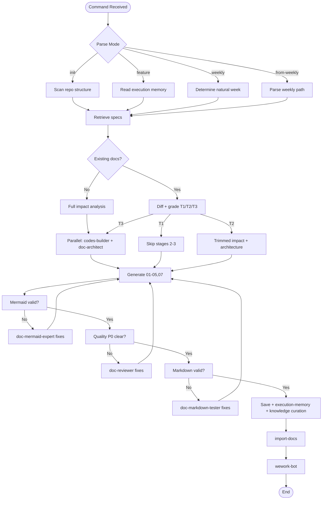
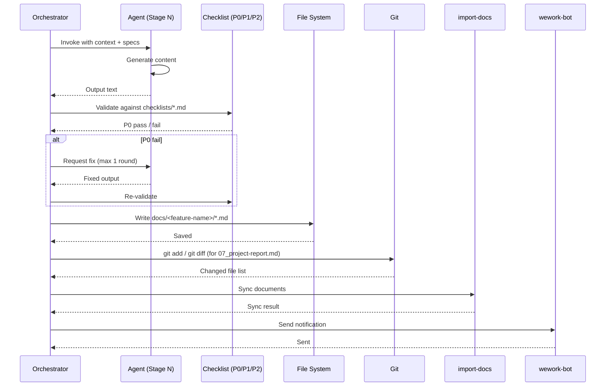

# generate-document

> **Document Version**: v1.0 | **Last Updated**: 2026-05-02 | **Maintainer**: Claude | **Tool**: Claude Code
>
> **Related Documents**: [Requirement Document](./01_requirement-document.md) | [Requirement Tasks](./02_requirement-tasks.md) | [Usage Document](./04_usage-document.md) | [CLAUDE.md](../../CLAUDE.md)
>

[Design Overview](#design-overview) | [Architecture Design](#architecture-design) | [Changes](#changes) | [Impact Analysis](#impact-analysis) | [Implementation Details](#implementation-details) | [Main Operation Scenario Implementation](#main-operation-scenario-implementation) | [Data Structure Design](#data-structure-design)

---

## Design Overview

`generate-document` is a documentation-generation orchestrator structured as a 7-stage pipeline. It translates user commands into structured Markdown document sets under `docs/<feature-name>/`, enforcing spec-driven generation, three-layer review gates, and mandatory termination steps (`import-docs` followed by `wework-bot`). The design prioritizes traceability (every fact links to an upstream source), incremental efficiency (T1/T2/T3 change detection), and quality assurance (agent-based review gates).

**Design Principles**
- 🎯 Spec-driven: every document type has a strict spec in `rules/*.md`; templates are optional and may not override specs
- ⚡ Incremental by default: detect change level first, then skip/trim stages to avoid unnecessary work
- 🔧 Agent specialization: each pipeline stage delegates to a dedicated agent with a narrow, verifiable contract

---

## Architecture Design

### Overall Architecture

```mermaid
graph TB
    User["User / CLI"] --> Command["Command Parser"]
    Command --> Orchestrator["Orchestrator (SKILL.md + rules/orchestration.md)"]
    Orchestrator --> Stage0["Stage 0: doc-planner"]
    Orchestrator --> Stage1["Stage 1: docs-retriever"]
    Orchestrator --> Stage2["Stage 2: doc-impact-analyzer"]
    Orchestrator --> Stage3A["Stage 3: codes-builder"]
    Orchestrator --> Stage3B["Stage 3: doc-architect"]
    Orchestrator --> Stage4["Stage 4: Generation + Review"]
    Orchestrator --> Stage5["Stage 5: docs-builder + execution-memory"]
    Orchestrator --> Stage6["Stage 6: import-docs + wework-bot"]

    Stage4 --> MER["doc-mermaid-expert"]
    Stage4 --> REV["doc-reviewer"]
    Stage4 --> TST["doc-markdown-tester"]
    Stage4 --> QTR["doc-quality-tracker"]

    Stage5 --> Memory["execution-memory.js"]
    Stage5 --> Knowledge["docs-builder knowledge curation"]

    Stage6 --> IDS["import-docs skill"]
    Stage6 --> WWB["wework-bot skill"]

    Orchestrator --> Contracts["Shared Contracts"]
    Contracts --> EVID["evidence-and-uncertainty.md"]
    Contracts --> IMPACT["impact-analysis-contract.md"]
    Contracts --> DOCCON["document-contracts.md"]
    Contracts --> OUTCON["agent-output-contract.md"]

    style Orchestrator fill:#ccffcc,stroke:#333,stroke-width:2px
    style Stage4 fill:#e1f5ff,stroke:#007acc
    style Stage6 fill:#e1f5ff,stroke:#007acc
    style Contracts fill:#e1f5ff,stroke:#007acc
```



**Architecture Explanation**: The orchestrator coordinates seven sequential stages. Stage 3 splits into two parallel agents (`codes-builder` and `doc-architect`). Stage 4 contains four specialized review agents. Stage 5 persists execution memory and curates knowledge. Stage 6 invokes two mandatory skills. Shared contracts govern all stages.

### Module Division

| Module | Responsibility | Location |
|--------|----------------|----------|
| Command Parser | Parse `/generate-document` arguments into one of four modes | `commands/generate-document.md` |
| Orchestrator | Stage state machine, agent dispatch, gate validation | `skills/generate-document/SKILL.md`, `skills/generate-document/rules/orchestration.md` |
| doc-planner | Optional adaptive planning based on execution memory | `agents/doc-planner.md` |
| docs-retriever | Specification retrieval for the target feature | `agents/docs-retriever.md` |
| doc-impact-analyzer | Full-project impact chain closure | `agents/doc-impact-analyzer.md` |
| codes-builder | Code context building and module division | `agents/codes-builder.md` |
| doc-architect | Architecture design and interface specification | `agents/doc-architect.md` |
| doc-mermaid-expert | Mermaid diagram syntax validation | `agents/doc-mermaid-expert.md` |
| doc-reviewer | Design document quality review (P0 gate) | `agents/doc-reviewer.md` |
| doc-markdown-tester | Markdown link/code/terminology testing | `agents/doc-markdown-tester.md` |
| doc-quality-tracker | P0/P1/P2 statistics and bad-case recording | `agents/doc-quality-tracker.md` |
| docs-builder | Knowledge curation and pitfall extraction | `agents/docs-builder.md` |
| import-docs | Document sync to external system | `skills/import-docs/` |
| wework-bot | Notification dispatch | `skills/wework-bot/` |
| Shared Contracts | Anti-hallucination, impact analysis, document structure, output validation | `shared/*.md` |

### Core Flow



**Core Flow Explanation**: The pipeline starts with mode-specific preprocessing, then retrieves specs. For existing documents, a diff grades the change level (T1/T2/T3), which determines whether stages 2-3 are skipped, trimmed, or fully executed. Stage 4 generates documents and loops through three review gates. Stage 5 persists state. Stage 6 syncs and notifies.

---

## Changes

### Problem Analysis

The repository previously lacked a unified documentation generation system. Documentation was created manually, leading to inconsistent structure, missing impact analysis, and no traceability between requirements, design, and verification. Each team member used their own template, making cross-feature navigation difficult.

### Solution

Introduce `generate-document` as a centralized documentation orchestrator with:
1. **Strict spec-driven generation**: every document type follows a rule file in `skills/generate-document/rules/*.md`
2. **Mandatory impact analysis**: no design conclusions without closing upstream, reverse, and transitive dependency chains
3. **Three-layer review gates**: Mermaid syntax, design quality, and Markdown validity are verified before save
4. **Incremental updates**: T1/T2/T3 change detection minimizes regeneration while preserving manual additions

### Before/After Comparison

| Dimension | Before | After |
|-----------|--------|-------|
| Document creation | Manual, ad-hoc templates | Spec-driven, one command per feature |
| Impact analysis | Often omitted or estimated | Mandatory, full-project search, four-sub-table output |
| Review | Peer review only | Peer review + automated three-layer gate |
| Updates | Full rewrite, manual additions lost | Incremental (T1/T2/T3), sentinel-block safe |
| Sync/notification | Manual copy-paste | Mandatory `import-docs` then `wework-bot` |
| Weekly reporting | Manual summary | Automated KPI collection + self-improvement proposal |

---

## Impact Analysis

> **Mandatory**: per `../../../shared/impact-analysis-contract.md` full-project impact chain closure.

### Search Terms and Change Point List

| Change Point | Type | Search Term | Source | Notes |
|--------------|------|-------------|--------|-------|
| SKILL.md | Spec | `skills/generate-document/SKILL.md` | Behavioral source of truth | Any change affects all downstream rules and agent contracts |
| rules/orchestration.md | Spec | `skills/generate-document/rules/orchestration.md` | Stage state machine | Changes affect stage transitions and gate validation |
| rules/workflow.md | Spec | `skills/generate-document/rules/workflow.md` | 5+1 step workflow | Changes affect command parsing and document generation strategy |
| rules/*.md (17 files) | Spec | `skills/generate-document/rules/*.md` | Per-document-type specs | Changes affect document structure and content constraints |
| templates/*.md | Template | `skills/generate-document/templates/*.md` | Skeleton templates | Only 01 and 02 use templates; 03 and 05 are template-disabled |
| scripts/*.js (11 files) | Script | `skills/generate-document/scripts/*.js` | Automation utilities | Changes affect KPI collection, weekly drafting, memory persistence |
| agents/*.md | Agent | `agents/*.md` | Agent contracts | 10 agents bound to specific stages; contract changes affect gate behavior |
| shared/*.md | Contract | `shared/*.md` | Shared interpretation layer | Changes affect both generate-document and implement-code |
| import-docs skill | Skill | `skills/import-docs/` | Stage 6 sync | Changes affect document sync behavior |
| wework-bot skill | Skill | `skills/wework-bot/` | Stage 6 notification | Changes affect notification format and delivery |

### Change Point Impact Chain

| Change Point | Search Term | Hit Files | Reference Mode | Impact Level | Dependency Direction | Disposal Method | Closure Status | Notes |
|--------------|-------------|-----------|----------------|--------------|----------------------|-----------------|----------------|-------|
| SKILL.md | `skills/generate-document/SKILL.md` | README.md, INDEX.md, rules/*.md, agents/*.md, shared/*.md | Import / reference / behavioral source | High | Reverse dependency | Keep compatible | Closed | All rule files and agent contracts reference SKILL.md principles |
| rules/orchestration.md | `orchestration.md` | SKILL.md, rules/workflow.md, agents/doc-planner.md, agents/docs-builder.md | Stage binding reference | High | Reverse dependency | Keep compatible | Closed | Defines stage state machine; changes affect agent invocation order |
| rules/workflow.md | `workflow.md` | SKILL.md, rules/orchestration.md | Workflow step reference | Medium | Reverse dependency | Keep compatible | Closed | Defines 5+1 step workflow; changes affect change-level handling |
| rules/*.md (17 files) | `skills/generate-document/rules/` | SKILL.md, templates/*.md, checklists/*.md | Spec reference | Medium | Reverse dependency | Keep compatible | Closed | Each rule file is referenced by its corresponding checklist and template |
| scripts/*.js (11 files) | `skills/generate-document/scripts/` | rules/orchestration.md, rules/weekly.md, rules/init.md | Script invocation | Medium | Internal dependency | Sync modify | Closed | `execution-memory.js`, `self-improve.js`, `log-orchestration.js` are invoked by rules |
| agents/*.md (10 files) | `agents/*.md` | SKILL.md, rules/orchestration.md, shared/agent-output-contract.md | Agent contract | High | Bidirectional | Keep compatible | Closed | Agent files reference skill stages; skill files reference agent names |
| shared/*.md (8 files) | `shared/*.md` | generate-document/SKILL.md, implement-code/SKILL.md, implement-code/rules/*.md, document-contracts.md | Contract import | High | Upstream dependency | Sync modify | Closed | Changes to evidence, impact, or output contracts affect both skills |
| import-docs skill | `import-docs` | generate-document/rules/workflow.md, implement-code/rules/orchestration.md, import-docs/README.md | Mandatory skill invocation | High | Upstream dependency | Sync modify | Closed | Stage 6 cannot complete without import-docs |
| wework-bot skill | `wework-bot` | generate-document/rules/workflow.md, implement-code/rules/orchestration.md, wework-bot/SKILL.md | Mandatory skill invocation | High | Upstream dependency | Sync modify | Closed | Notification format changes affect all pipeline consumers |

### Dependency Closure Summary

| Change Point | Upstream Dep Checked | Reverse Dep Checked | Transitive Dep Closed | Test/Docs/Config Covered | Conclusion |
|--------------|----------------------|---------------------|-----------------------|--------------------------|------------|
| SKILL.md | Yes (shared contracts, import-docs, wework-bot) | Yes (rules/*.md, agents/*.md, README, INDEX) | Yes (commands/generate-document.md references SKILL.md) | Yes (README.md and SKILL.md document behavior) | Closed |
| rules/orchestration.md | Yes (SKILL.md defines principles) | Yes (workflow.md references stage definitions) | Yes (agent contracts reference stage IDs) | Yes (orchestration.md self-documents) | Closed |
| rules/workflow.md | Yes (SKILL.md, orchestration.md) | Yes (no external consumers beyond orchestrator) | Yes | Yes (workflow.md self-documents) | Closed |
| scripts/*.js | Yes (orchestration.md, weekly.md, init.md invoke them) | Yes (no external consumers) | Yes | Yes (script headers document behavior) | Closed |
| agents/*.md | Yes (orchestration.md binds stages) | Yes (SKILL.md lists required agents) | Yes (shared/agent-output-contract.md validates output) | Yes (agent files self-document) | Closed |
| shared/*.md | Yes (no upstream beyond repo conventions) | Yes (generate-document, implement-code, document-contracts reference them) | Yes (path-conventions.md, weekly-analyzer.md reference) | Yes (all shared files self-document) | Closed |
| import-docs skill | Yes (wework-bot depends on it) | Yes (generate-document and implement-code depend on it) | Yes | Yes (import-docs/README.md documents) | Closed |
| wework-bot skill | Yes (generate-document and implement-code depend on it) | Yes (no downstream beyond notification) | Yes | Yes (wework-bot/SKILL.md documents) | Closed |

### Uncovered Risks

| Risk Source | Reason | Impact | Mitigation |
|-------------|--------|--------|------------|
| Agent contract drift | Agent files and `validate-agent-contracts.js` may not stay synchronized | Gate validation becomes unreliable | Schedule `node skills/generate-document/scripts/validate-agent-contracts.js` in CI |
| Script dependency on Node.js version | Scripts use modern JS features without explicit version lock | Runtime errors on older Node versions | Add `engines` field to `package.json` or document minimum Node version |
| Circular dependency between skills | `implement-code` references `generate-document` rules; `generate-document` does not reference `implement-code`, but shared contracts bind them | Shared contract changes may have unintended side effects | Version shared contracts independently and publish changelogs |

### Change Scope Summary

- **Files needing direct modification**: 0 (this is documentation of an existing skill)
- **Files needing compatibility verification**: 29 (`skills/generate-document/rules/*.md`, `skills/generate-document/scripts/*.js`, `skills/generate-document/templates/*.md`, `skills/generate-document/checklists/*.md`)
- **Files needing transitive impact tracking**: 18 (`agents/*.md`, `shared/*.md`, `skills/implement-code/**/*.md`, `skills/import-docs/**/*.md`, `skills/wework-bot/**/*.md`, `skills/code-review/**/*.md`)
- **Risks needing manual review or blocking**: Agent contract drift (run validation script), Node.js version compatibility (document minimum version)

---

## Implementation Details

### Technical Points

**What**: A documentation orchestrator that generates Markdown files via a 7-stage pipeline.

**How**: Each stage is implemented as a rule file (`rules/orchestration.md`) that defines the stage state machine, agent bindings, and gate conditions. The orchestrator reads `SKILL.md` for high-level principles, then delegates to agents defined in `agents/*.md`. Agents produce content that is validated against `checklists/*.md` before save.

**Why**: Centralized orchestration ensures consistency across all documentation outputs. Agent specialization allows narrow, testable contracts. Shared contracts (`shared/*.md`) prevent duplication between `generate-document` and `implement-code`.

### Key Code Paths

The pipeline is rule-driven rather than code-driven. Key configuration paths:

```markdown
# Behavioral source of truth
skills/generate-document/SKILL.md

# Stage state machine and agent dispatch
skills/generate-document/rules/orchestration.md

# Per-command workflow details
skills/generate-document/rules/workflow.md       # Feature documents
skills/generate-document/rules/init.md            # Project initialization
skills/generate-document/rules/weekly.md          # Weekly reports
skills/generate-document/rules/from-weekly.md     # Weekly decomposition

# Per-document-type generation rules
skills/generate-document/rules/requirement-document.md
skills/generate-document/rules/requirement-tasks.md
skills/generate-document/rules/design-document.md
skills/generate-document/rules/usage-document.md
skills/generate-document/rules/dynamic-checklist.md
skills/generate-document/rules/project-report.md

# Automation scripts invoked by rules
skills/generate-document/scripts/execution-memory.js   # Stage 5 session recording
skills/generate-document/scripts/self-improve.js       # Weekly post-processing
skills/generate-document/scripts/log-orchestration.js  # Orchestration logging
skills/generate-document/scripts/validate-agent-contracts.js  # Contract validation
```

### Dependencies

- `import-docs` skill: mandatory document sync at Stage 6
- `wework-bot` skill: mandatory notification at Stage 6
- `shared/*.md` contracts: anti-hallucination, impact analysis, document structure, output validation
- `agents/*.md`: 10 required agents for pipeline stages

### Testing Considerations

> TBD (reason: no automated test suite exists for skill orchestration; validation relies on `scripts/validate-agent-contracts.js` and manual execution)

- **Unit tests**: Individual script behavior (e.g., `execution-memory.js`, `natural-week.js`) can be tested in isolation
- **Integration tests**: Full pipeline execution requires mock agents and a temporary repository
- **Regression tests**: Re-running `/generate-document init` on a known repo should produce deterministic output (modulo dates)

---

## Main Operation Scenario Implementation

### Scenario 1: Initialize a New Project

**Related Requirement Tasks Scenario**: [Initialize a New Project](./02_requirement-tasks.md#main-operation-scenarios)

**Implementation Overview**: The `init` command bypasses `doc-impact-analyzer` (no impact analysis required for init) and directly invokes `codes-builder` + `doc-architect` to infer architecture from repository structure.

**Modules and Responsibilities**:
- `Command Parser`: identifies `init` mode
- `docs-retriever`: retrieves project-basics spec (`rules/project-basics.md`)
- `codes-builder` + `doc-architect`: infer tech stack, directory structure, build tools
- Generation layer: produces 10 base files + `docs/project-init/01-07`
- `docs-builder`: curates project-level knowledge

**Key Code Paths**:
- `skills/generate-document/rules/init.md` §Workflow
- `skills/generate-document/rules/project-basics.md` §Output List
- `skills/generate-document/scripts/execution-memory.js` §Session recording

**Verification Points**:
- 17 output files exist (10 base + 7 in `docs/project-init/`)
- `06_process-summary.md` is written by init (exception to implement-code-only rule)
- `import-docs` and `wework-bot` execute without exception

---

### Scenario 2: Generate a Feature Document Set

**Related Requirement Tasks Scenario**: [Generate a Feature Document Set](./02_requirement-tasks.md#main-operation-scenarios)

**Implementation Overview**: The feature command runs the full 7-stage pipeline. Stage 1 detects no existing documents and enters new mode. Stage 2 runs full-project impact analysis. Stage 3 runs parallel architecture design. Stage 4 generates all documents and runs three-layer review.

**Modules and Responsibilities**:
- `Command Parser`: extracts `feature-name` from `<feature-name>-<description>`
- `docs-retriever`: retrieves all applicable specs for the feature domain
- `doc-impact-analyzer`: searches entire repo for change points and closes dependency chains
- `codes-builder`: builds module division and interface specs
- `doc-architect`: validates architecture against 5 mandatory questions
- `doc-mermaid-expert`, `doc-reviewer`, `doc-markdown-tester`: review gate
- `doc-quality-tracker`: statistics

**Key Code Paths**:
- `skills/generate-document/rules/workflow.md` §Step 1-4
- `skills/generate-document/rules/orchestration.md` §2.1 New Mode
- `shared/impact-analysis-contract.md` §Analysis Steps

**Verification Points**:
- Impact analysis contains four sub-tables
- `03_design-document.md` contains no template content (template disabled)
- All documents append "Postscript: Future Planning & Improvements"
- Version is `v1.0` for new mode

---

### Scenario 3: Update an Existing Feature Document

**Related Requirement Tasks Scenario**: [Update an Existing Feature Document](./02_requirement-tasks.md#main-operation-scenarios)

**Implementation Overview**: The feature command detects existing `docs/<feature-name>/`, loads 01-03, diffs against user input, and determines change level. T1 skips stages 2-3 and rewrites only changed chapters. T2 trims stages 2-3 and syncs downstream entries. T3 runs the full pipeline.

**Modules and Responsibilities**:
- `Command Parser`: extracts `feature-name`
- `doc-planner` (optional): reads execution memory for historical similar cases
- Diff engine: compares existing 01-03 with user input
- Change grader: assigns T1/T2/T3 based on diff scope
- Orchestrator: skips/trim stages per `rules/workflow.md` §Step 4 Update Strategy

**Key Code Paths**:
- `skills/generate-document/rules/workflow.md` §Step 1 (Parsing + Change Grading)
- `skills/generate-document/rules/orchestration.md` §2.2 Update Mode
- `skills/generate-document/scripts/execution-memory.js` §Historical case reading

**Verification Points**:
- Change level is not downgraded
- T1: only changed chapters rewritten; unchanged text preserved verbatim
- T2: downstream sync annotations exist (e.g., "Synced due to chapter X change in 01")
- Version incremented (minor `+1` or major `+1`)

---

## Data Structure Design

### Document Output Data Flow



**Data Flow Explanation**: The orchestrator invokes an agent, receives output, validates it against a checklist, writes it to the file system, and then proceeds to sync and notification. For `07_project-report.md`, git diff provides the changed file list. All stages log to `scripts/log-orchestration.js`.

---

## Postscript: Future Planning & Improvements
