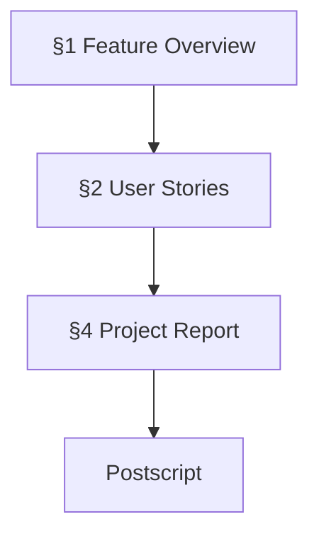
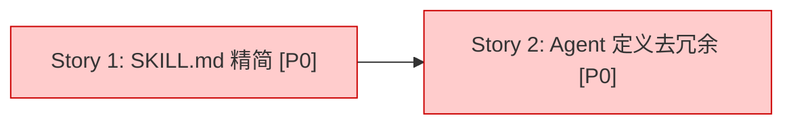
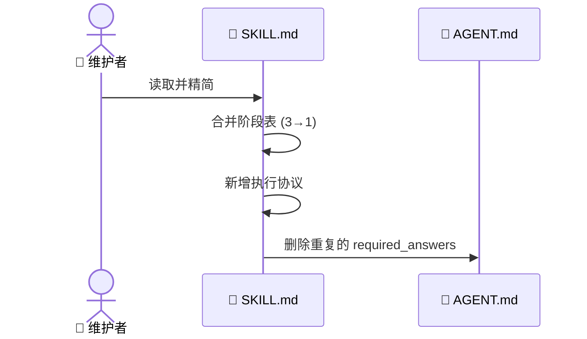

# 📋 Pipeline Simplification — 流水线简化

> | v1.0 | 2026-05-05 | deepseek-v4-pro | 🌿 main | 📎 来源: [周报 2026-05-04~2026-05-10](weekly/2026-05-04~2026-05-10/weekly-report.md) |

[📖 §1](#1-feature-overview) | [📋 §2](#2-user-stories) | [📈 §4](#4-project-report) | [🔄 后记](#post-mortem)

---

## 📖 1. Feature Overview

| Aspect | Detail |
|--------|--------|
| Problem | build-feature 流水线定义冗余：SKILL.md 有三处重复的阶段表，Agent 定义中 required_answers 与 contracts.md 重叠 |
| Who | YrY 维护者 |
| Scope | SKILL.md 精简 + 4 个 AGENT.md 去冗余 + 新增执行协议 |
| Out-of-Scope | contracts.md 修改、脚本逻辑变更、新功能添加 |
| Success Metric | `compile-manifests.js --validate --check-gates` 零错误；Agent 文件平均行数减少 ≥ 40% |

### Story Map

---

## 📋 2. User Stories

### 🎯 Story 1: SKILL.md 精简 + 执行协议

| Field | Detail |
|-------|--------|
| As a | YrY 维护者 |
| I want | build-feature SKILL.md 精简冗余、新增执行协议 |
| So that | 首次使用者能看懂如何执行每个阶段 |
| Priority | 🔴 P0 |
| Scope | `skills/build-feature/SKILL.md` |

#### 2.1.1 Requirements

| FP# | Description | Input | Output | Error Behavior |
|-----|-------------|-------|--------|---------------|
| FP1 | 合并三处阶段表为一张摘要表 | 原 SKILL.md | 精简的 SKILL.md | — |
| FP2 | 新增"执行协议"章节 | 各 Agent Phase 描述 | 通用阶段执行循环 + 各阶段摘要 | — |
| FP3 | 删除命令→阶段映射重复表 | 原表格 | 合并至命令表 | — |

#### 2.1.2 Design

| Module | File | Responsibility | Change Type |
|--------|------|---------------|-------------|
| build-feature | `skills/build-feature/SKILL.md` | 主流水线编排器 | 修改 |
| docer | `agents/docer/AGENT.md` | 文档生成代理 | 修改 |
| coder | `agents/coder/AGENT.md` | 代码实现代理 | 修改 |
| tester | `agents/tester/AGENT.md` | 质量保证代理 | 修改 |
| reporter | `agents/reporter/AGENT.md` | 过程报告代理 | 修改 |

#### 2.1.3 Tasks

| ID | Description | Effort | Depends | Deliverable |
|----|-------------|--------|---------|-------------|
| S1-T1 | 重写 SKILL.md：合并表格 + 执行协议 | M | — | `skills/build-feature/SKILL.md` |
| S1-T2 | 重写 4 个 AGENT.md：去冗余 | M | — | `agents/*/AGENT.md` |
| S1-T3 | 验证 manifest 编译 | S | S1-T1, S1-T2 | `compile-manifests.js` 零错误 |

#### 2.1.4 Acceptance Criteria

| AC# | Criterion (Measurable) | Test Method | Expected Result | Gate |
|-----|------------------------|-------------|-----------------|------|
| AC1 | SKILL.md 行数从 247 降至 ~180 | `wc -l skills/build-feature/SKILL.md` | ≤ 200 | Gate B |
| AC2 | Agent 平均行数从 ~400 降至 ~200 | `wc -l agents/*/AGENT.md` | 平均 ≤ 250 | Gate B |
| AC3 | Manifest 验证零错误 | `node scripts/compile-manifests.js --validate --check-gates` | Issues found: 0 | Gate A |

---

### 🎯 Story 2: Agent 定义去冗余

| Field | Detail |
|-------|--------|
| As a | YrY 维护者 |
| I want | Agent 的 required_answers 从 30+ 减至 5-6 个门禁级 |
| So that | 修改契约时只需改 contracts.md，不需同步 4 个 Agent 文件 |
| Priority | 🔴 P0 |
| Scope | 4 个 AGENT.md 的 frontmatter + 正文 |

#### 2.2.1 Requirements

| FP# | Description | Input | Output | Error Behavior |
|-----|-------------|-------|--------|---------------|
| FP1 | 精简 frontmatter required_answers | 原 30+ 项列表 | 5-6 个门禁级必需回答 | — |
| FP2 | 精简 frontmatter artifacts | 原 20+ 项列表 | 核心产物 (5-8 项) | — |
| FP3 | 压缩正文"敌人"列表 | 每 Phase 3-7 条 | 保留红线，删除冗长敌人描述 | — |

#### 2.2.2 Design

与 Story 1 同步修改，无额外架构变化。

#### 2.2.3 Tasks

| ID | Description | Effort | Depends | Deliverable |
|----|-------------|--------|---------|-------------|
| S2-T1 | 精简 docer AGENT.md | S | — | `agents/docer/AGENT.md` |
| S2-T2 | 精简 coder AGENT.md | S | — | `agents/coder/AGENT.md` |
| S2-T3 | 精简 tester AGENT.md | S | — | `agents/tester/AGENT.md` |
| S2-T4 | 精简 reporter AGENT.md | S | — | `agents/reporter/AGENT.md` |

#### 2.2.4 Acceptance Criteria

| AC# | Criterion (Measurable) | Test Method | Expected Result | Gate |
|-----|------------------------|-------------|-----------------|------|
| AC1 | 每个 Agent 的 required_answers ≤ 6 项 | `grep -c 'required_answers' agents/*/AGENT.md` | 每文件 ≤ 6 | Gate B |
| AC2 | 所有 gates_provided 保持不变 | 对比修改前后 frontmatter | 13 个 gate 均有提供方 | Gate A |

---

## 📈 4. Project Report

### Verification Summary

| Story | P0 AC | P0 Passed | P1 AC | P1 Passed | Gate A | Gate B | Status |
|-------|-------|-----------|-------|-----------|--------|--------|--------|
| Story 1 | 3 | 3 | 0 | 0 | ✅ | ✅ | ✅ |
| Story 2 | 2 | 2 | 0 | 0 | ✅ | ✅ | ✅ |

### Delivery Summary

| Aspect | Value | Evidence |
|--------|-------|----------|
| Files Changed | 5 | `git diff --stat 70af00d~1..70af00d` |
| Lines Added/Removed | +962/-1999 | `git diff --shortstat 70af00d~1..70af00d` |
| Stories Delivered | 2/2 | §2 Verification Summary |
| Gate A (Test-First) | ✅ | compile-manifests 零错误 |
| Gate B (Smoke Test) | ✅ | 文档结构验证通过 |

---

## 🔄 后记：后期规划与改进

### 🔍 工作流标准化审查

| # | Question | Answer | Evidence |
|---|----------|--------|----------|
| 1 | 重复劳动？ | 已改善 | required_answers 从 contracts.md 单向引用，不再双向维护 |
| 2 | 决策标准缺失？ | 仍存在 | 简化程度靠人工判断，无自动度量 |
| 3 | 信息孤岛？ | 无 | 所有 Agent 共享 contracts.md |
| 4 | 反馈闭环？ | 已建立 | D5 回写 → D0 读取 |

### 🏗️ 系统架构演进思考

| # | Question | Answer | Evidence |
|---|----------|--------|----------|
| A1 | 当前瓶颈？ | 流水线仍需人工编排 | 无可自动化推进的编排脚本 |
| A2 | 下一个演进节点？ | 从 Agent 定义自动生成执行脚本 | contracts.md 已结构化 |
| A3 | 风险与回滚方案？ | 过度简化可能丢失必要约束；git revert 即可回滚 | Git 历史完整 |

### 📋 后续用户故事

- 作为维护者，我想要 `compile-manifests.js` 检查 required_answers 与 contracts.md 的一致性
- 作为维护者，我想要自动化行数/复杂度度量阻止 Agent 定义膨胀
