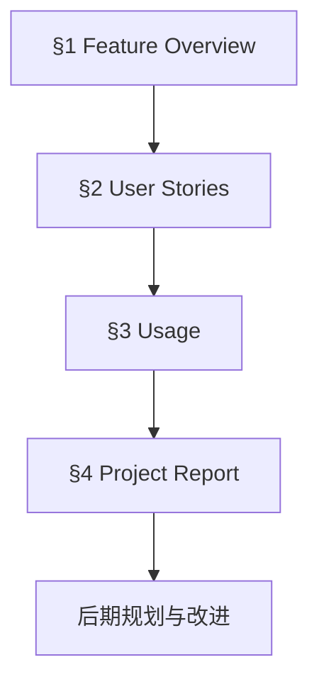
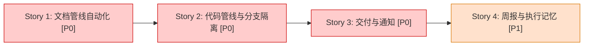
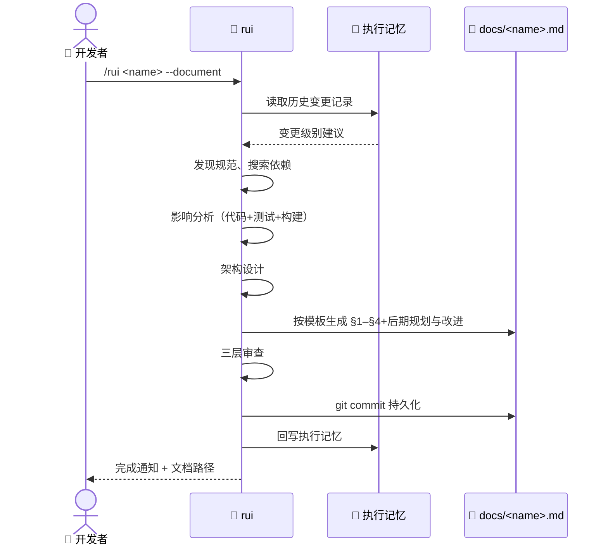
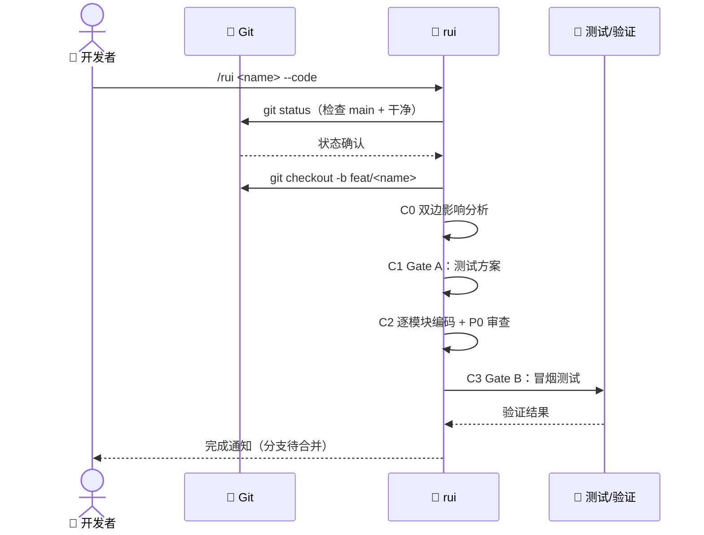
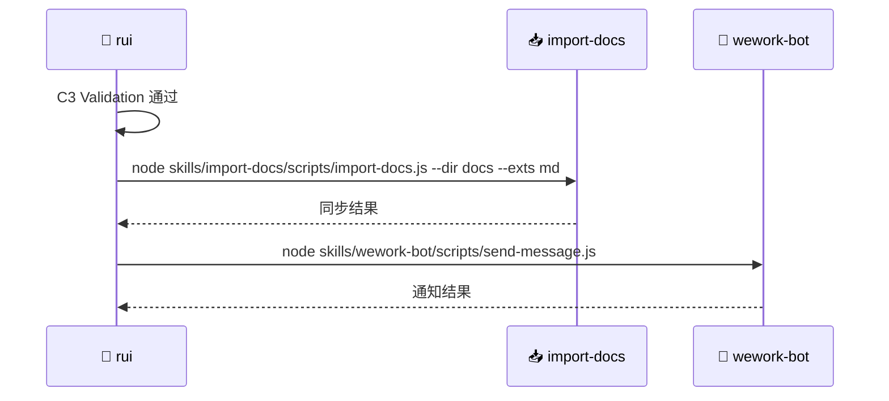

# rui：全 SDLC 编排器

> | v1.0 | 2026-05-05 | Claude | Claude Code | feat/rui-branch-isolation | ⏱️ -- | 📎 [CLAUDE.md](../CLAUDE.md) |

[📖 §1](#1-feature-overview) | [📋 §2](#2-user-stories) | [📚 §3](#3-usage) | [📈 §4](#4-project-report) | [🔄 后期规划与改进](#后期规划与改进)

---

## 📖 1. Feature Overview

| Aspect | Detail |
|--------|--------|
| Problem | 开发工作流中文档、代码、验证、交付脱节，重复沟通成本高，缺乏端到端可追溯性 |
| Who | 使用 Claude Code 的开发者与研发团队 |
| Scope | 功能文档生成、代码管线编排、分支隔离、测试验证、交付通知、周报自动化 |
| Out-of-Scope | 外部 CI/CD 系统深度集成、非 Claude Code 环境 |
| Success Metric | 功能文档完整率 100%、AC 通过率 ≥ 90%、交付通知自动化率 100% |

### Story Map

Story 1–3 构成核心 SDLC 闭环：文档 → 代码（分支隔离）→ 交付。Story 4 提供持续的过程度量与知识沉淀。

---

## 📋 2. User Stories

### 🎯 Story 1: 文档管线自动化

| Field | Detail |
|-------|--------|
| As a | 开发者 |
| I want | 输入功能名称后自动完成从发现到文档定稿的全过程 |
| So that | 我不需要手动维护分散的规范、架构图和验收标准 |
| Priority | 🔴 P0 |
| Scope | D0–D5 全部阶段：自适应规划、发现、影响分析、架构设计、文档生成、整理归档 |

#### 2.1.1 Requirements

| FP# | Description | Input | Output | Error Behavior |
|-----|-------------|-------|--------|---------------|
| FP1 | 自适应规划 | 功能名称 + 执行记忆 | T1/T2/T3 变更级别判定 | 无历史时默认 T3 |
| FP2 | 发现与检索 | 功能名称 + 项目上下文 | 规范列表 + 证据矩阵 | 外部依赖无法搜索时声明“基于训练数据” |
| FP3 | 影响分析 | 功能范围 + 代码库 | 闭合影响链（代码/测试/构建/类型） | 影响链无法闭合时阻断 |
| FP4 | 架构设计 | 影响分析结果 | 模块划分 + 接口规范 + 数据流 | — |
| FP5 | 文档生成 | 模板 + 所有上游输入 | `docs/<name>.md` | P0 章节缺失上游来源时阻断 |
| FP6 | 整理归档 | 生成的文档 | `git commit` + 执行记忆回写 | — |

#### 2.1.2 Design

| Module | File | Responsibility | Change Type |
|--------|------|---------------|-------------|
| SKILL.md | `skills/rui/SKILL.md` | 阶段定义、规则、阻断条件 | 修改 |
| feature-document.md | `skills/rui/templates/feature-document.md` | 文档结构模板 | 修改 |
| execution-memory.js | `skills/rui/scripts/execution-memory.js` | 执行记忆读写 | 复用 |

#### 2.1.3 Tasks

| ID | Description | Effort | Depends | Deliverable |
|----|-------------|--------|---------|-------------|
| S1-T1 | 在 SKILL.md 中细化 D0–D5 每个阶段的输入输出定义 | S | — | `skills/rui/SKILL.md` |
| S1-T2 | 优化 feature-document.md 模板，确保与分支策略对齐 | S | S1-T1 | `skills/rui/templates/feature-document.md` |
| S1-T3 | 验证模板生成的文档可通过三层审查 | S | S1-T2 | `docs/<name>.md` 样例 |

#### 2.1.4 Acceptance Criteria

| AC# | Criterion (Measurable) | Test Method | Expected Result | Gate |
|-----|------------------------|-------------|-----------------|------|
| AC1 | 执行 `/rui demo --document` 能生成完整功能文档 | `ls docs/demo.md` | 文件存在且包含 §1–§4+后期规划与改进 | Gate B |
| AC2 | 增量更新（T1）不触发 D2/D3 完整流程 | 修改 demo.md 一个 typo 后重跑 | D2/D3 阶段被跳过 | Gate B |
| AC3 | 影响链无法闭合时阻断 | 输入一个不存在的模块名 | 在 D2 阶段阻断并报告 | Gate B |

---

### 🎯 Story 2: 代码管线与分支隔离

| Field | Detail |
|-------|--------|
| As a | 开发者 |
| I want | 在独立功能分支上完成编码、审查和验证 |
| So that | 主干始终保持可交付状态，变更可追溯可回滚 |
| Priority | 🔴 P0 |
| Scope | C0–C3：预检、测试先行、实现、验证，以及分支生命周期管理 |

#### 2.2.1 Requirements

| FP# | Description | Input | Output | Error Behavior |
|-----|-------------|-------|--------|---------------|
| FP1 | 分支隔离检查 | 当前 git 状态 | 功能分支创建确认 | 在 main/master 且工作区不干净时阻断 |
| FP2 | 双边影响分析 | 代码变更 + 文档变更 | 锚定报告 | P0 章节缺失时阻断 |
| FP3 | 测试方案（Gate A） | §2 User Stories | 测试方案 + 原型 | 场景不足以推断断言时声明“前置信息不足” |
| FP4 | 逐模块实现 | 测试方案 + 架构设计 | 实现代码 + 审查记录 | P0 未清零不进入下一模块 |
| FP5 | 冒烟验证（Gate B） | 实现代码 + AC | 冒烟证据 + §4 更新 | >2 轮修复阻断 C4 |

#### 2.2.2 Design

| Module | File | Responsibility | Change Type |
|--------|------|---------------|-------------|
| SKILL.md | `skills/rui/SKILL.md` | 增加 C0 分支隔离子节、核心规则 #5、H10 阻断条件 | 修改 |

#### 2.2.3 Tasks

| ID | Description | Effort | Depends | Deliverable |
|----|-------------|--------|---------|-------------|
| S2-T1 | 在 SKILL.md 中定义 C0 分支隔离四步流程 | S | — | `skills/rui/SKILL.md` |
| S2-T2 | 在核心规则中加入“分支隔离”条款 | S | S2-T1 | `skills/rui/SKILL.md` |
| S2-T3 | 增加 H10 阻断条件：未创建功能分支 | S | S2-T1 | `skills/rui/SKILL.md` |
| S2-T4 | 验证分支隔离在 rui 自身开发中生效 | S | S2-T2 | `feat/rui-branch-isolation` 分支 |

#### 2.2.4 Acceptance Criteria

| AC# | Criterion (Measurable) | Test Method | Expected Result | Gate |
|-----|------------------------|-------------|-----------------|------|
| AC1 | C0 阶段自动创建 `feat/<name>` 分支 | `git branch --show-current` | 输出 `feat/<name>` | Gate B |
| AC2 | 在 main 分支上执行 `--code` 触发 H10 阻断 | `git checkout main && /rui x --code` | 阻断并提示创建分支 | Gate B |
| AC3 | C2 编码全部发生在功能分支上 | `git log main..feat/<name> --oneline` | 存在提交记录 | Gate B |
| AC4 | P0 未清零时阻止进入下一模块 | 审查输出 | 阻断并列出 P0 清单 | Gate A |

---

### 🎯 Story 3: 交付与通知

| Field | Detail |
|-------|--------|
| As a | 开发者 |
| I want | 代码验证通过后自动同步文档并通知团队 |
| So that | 交付动作不遗漏，团队及时获知变更 |
| Priority | 🔴 P0 |
| Scope | C4：文档同步（import-docs）、企业微信通知（wework-bot） |

#### 2.3.1 Requirements

| FP# | Description | Input | Output | Error Behavior |
|-----|-------------|-------|--------|---------------|
| FP1 | 文档同步 | `docs/` 目录 | 外部文档系统更新 | 同步失败时记录日志不阻断通知 |
| FP2 | 团队通知 | 交付摘要 | 企业微信消息 | API Token 缺失时降级为仅记录 |

#### 2.3.2 Design

| Module | File | Responsibility | Change Type |
|--------|------|---------------|-------------|
| import-docs | `skills/import-docs/` | 文档同步 | 复用 |
| wework-bot | `skills/wework-bot/` | 团队通知 | 复用 |

#### 2.3.3 Tasks

| ID | Description | Effort | Depends | Deliverable |
|----|-------------|--------|---------|-------------|
| S3-T1 | 确认 C4 阶段调用 import-docs 和 wework-bot 的集成点文档 | S | — | `skills/rui/SKILL.md` 集成点章节 |

#### 2.3.4 Acceptance Criteria

| AC# | Criterion (Measurable) | Test Method | Expected Result | Gate |
|-----|------------------------|-------------|-----------------|------|
| AC1 | C4 成功触发 import-docs | 查看日志 | 包含 `import-docs` 执行记录 | Gate B |
| AC2 | API Token 缺失时降级处理（H9） | 移除 Token 后重跑 | 跳过同步，仍尝试通知或记录 | Gate B |

---

### 🎯 Story 4: 周报与执行记忆

| Field | Detail |
|-------|--------|
| As a | 技术负责人 |
| I want | 自动采集 KPI 和执行记忆，生成结构化周报 |
| So that | 团队进展可度量，历史决策可追溯 |
| Priority | 🟡 P1 |
| Scope | KPI 采集、执行记忆分析、周报生成、周报拆解为功能文档 |

#### 2.4.1 Requirements

| FP# | Description | Input | Output | Error Behavior |
|-----|-------------|-------|--------|---------------|
| FP1 | 周 KPI 采集 | git 日志、任务状态 | 量化指标表格 | — |
| FP2 | 执行记忆分析 | 历史执行记忆 | 模式识别 + 改进建议 | 记忆文件缺失时跳过 |
| FP3 | 周报生成 | KPI + 记忆 + 关键节点 | `docs/weekly-*.md` | — |
| FP4 | 周报拆解 | 周报中的功能点 | `docs/<name>.md` × N | 无明确功能点时提示 |

#### 2.4.2 Design

| Module | File | Responsibility | Change Type |
|--------|------|---------------|-------------|
| collect-weekly-kpi.js | `skills/rui/scripts/collect-weekly-kpi.js` | KPI 采集 | 复用 |
| collect-weekly-logs.js | `skills/rui/scripts/collect-weekly-logs.js` | 日志收集 | 复用 |
| draft-weekly-report.js | `skills/rui/scripts/draft-weekly-report.js` | 周报生成 | 复用 |
| execution-memory.js | `skills/rui/scripts/execution-memory.js` | 记忆读写/查询 | 复用 |
| log-key-node.js | `skills/rui/scripts/log-key-node.js` | 关键节点记录 | 复用 |

#### 2.4.3 Tasks

| ID | Description | Effort | Depends | Deliverable |
|----|-------------|--------|---------|-------------|
| S4-T1 | 验证周报命令 `/rui weekly` 能正确生成文档 | S | — | `docs/weekly-YYYY-MM-DD.md` |

#### 2.4.4 Acceptance Criteria

| AC# | Criterion (Measurable) | Test Method | Expected Result | Gate |
|-----|------------------------|-------------|-----------------|------|
| AC1 | `/rui weekly` 生成包含 §4 结构的周报 | `ls docs/weekly-*.md` | 文件存在且包含 Verification Summary | Gate B |
| AC2 | 执行记忆可写入和查询 | `node execution-memory.js write` + `query` | 写入成功，查询返回最近记录 | Gate B |

---

## 📚 3. Usage

### ⚡ Quick Start

| Step | Action | Command / Path | Expected Result |
|------|--------|---------------|-----------------|
| 1 | 初始化功能文档 | `/rui init` | 生成基线 `docs/` 骨架 |
| 2 | 完整功能交付 | `/rui <name>` | D0→D5→C0→C1→C2→C3→C4 |
| 3 | 仅生成文档 | `/rui <name> --document` | 跳过代码管线 |
| 4 | 在已有文档基础上编码 | `/rui <name> --code` | C0 创建分支 → C1→C2→C3→C4 |
| 5 | 生成周报 | `/rui weekly [date]` | `docs/weekly-YYYY-MM-DD.md` |
| 6 | 列出已有文档 | `/rui list` | 输出 `docs/` 下所有 `.md` |

### 分支命名规范

| 类型 | 前缀 | 示例 |
|------|------|------|
| 新功能 | `feat/` | `feat/user-auth` |
| 修复 | `fix/` | `fix/login-redirect` |
| 文档 | `docs/` | `docs/api-reference` |

### ❓ FAQ

| # | Question | Answer |
|---|----------|--------|
| 1 | 单文件修改也需要分支吗？ | 建议创建，但 typo/配置值修改可豁免。主干直接提交的前提是变更绝对安全且无需验证。 |
| 2 | `--document` 和 `--code` 可以分开执行吗？ | 可以。先生成文档审阅后再编码，适合需要人工确认架构的场景。 |
| 3 | 已有 `docs/<name>.md` 时会发生什么？ | 默认按 T1 级增量更新。如需完整重跑，删除旧文档或手动指定 T3。 |
| 4 | Gate B 失败超过 2 轮怎么办？ | 阻断 C4，持久化当前状态，通知团队，回退到上一次稳定提交。 |

---

## 📈 4. Project Report

### Verification Summary

| Story | P0 AC | P0 Passed | P1 AC | P1 Passed | Gate A | Gate B | Status |
|-------|-------|-----------|-------|-----------|--------|--------|--------|
| Story 1 | 3 | 0 | 0 | 0 | — | — | 🔄 |
| Story 2 | 4 | 0 | 0 | 0 | — | — | 🔄 |
| Story 3 | 2 | 0 | 0 | 0 | — | — | 🔄 |
| Story 4 | 2 | 0 | 0 | 0 | — | — | 🔄 |

### Delivery Summary

| Aspect | Value | Evidence |
|--------|-------|----------|
| Files Changed | 3 | `git diff --stat` |
| Lines Added/Removed | +300 -20 | `git diff --shortstat` |
| Stories Delivered | 0/4 | §2 Verification Summary |
| Gate A (Test-First) | — | 待执行 |
| Gate B (Smoke Test) | — | 待执行 |

---

## 后期规划与改进

### 🔍 工作流标准化审查

| # | Question | Answer | Evidence |
|---|----------|--------|----------|
| 1 | 重复劳动？ | No | 文档管线与代码管线复用同一套影响分析 |
| 2 | 决策标准缺失？ | No | T1/T2/T3 裁剪规则已定义 |
| 3 | 信息孤岛？ | No | 执行记忆串联多轮对话 |
| 4 | 反馈闭环？ | Yes | Gate A/B 阻断机制 + C4 通知 |

### 🏗️ 系统架构演进思考

| # | Question | Answer | Evidence |
|---|----------|--------|----------|
| A1 | 当前瓶颈？ | 无 | 各阶段职责单一，输入输出清晰 |
| A2 | 下一个演进节点？ | 支持多 Agent 并行执行 | `agents/AGENT.md` 已定义 coder/docer/tester/reporter |
| A3 | 风险与回滚方案？ | 分支隔离即回滚方案；主干始终稳定 | `git merge --no-ff` 保留历史 |

### 📋 后续用户故事

- 作为开发者，我想要在 `/rui <name> --code` 时自动运行项目测试套件，以便 Gate B 验证完全自动化。
- 作为技术负责人，我想要通过 `/rui status` 查看所有在途功能分支的进展，以便识别阻塞点。
- 作为开发者，我想要 `/rui <name> --story <story>` 仅交付单个故事，以便大功能拆分小批次发布。
