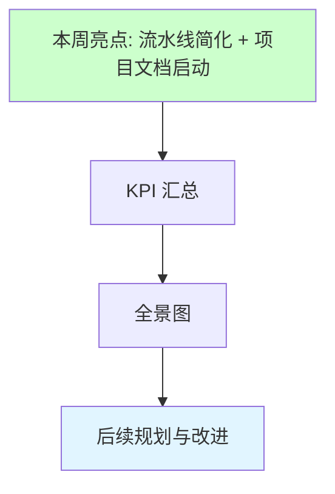
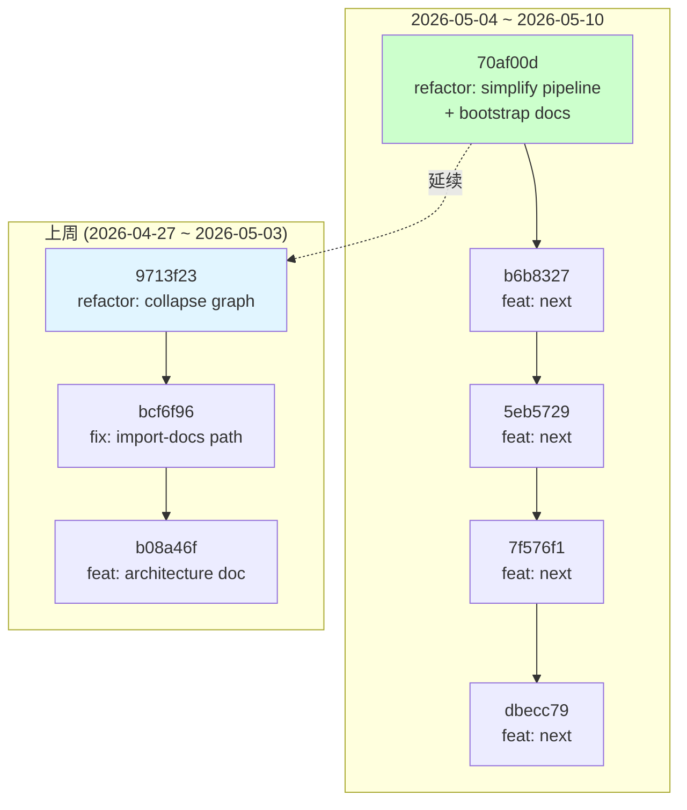

# 📈 周报：2026-05-04 ~ 2026-05-10

> | v1.0 | 2026-05-05 | deepseek-v4-pro | 🌿 main | 📎 [CLAUDE.md](../../../CLAUDE.md) |

---

## 📊 KPI 量化汇总

| 指标 | 本周 | 目标 | 状态 |
|------|------|------|------|
| 提交次数 | 5 | — | — |
| 文件变更 | 144 files, +2232/-10096 | — | — |
| Agent 调用成功率 | 100% (1/1) | ≥ 90% | 🟢 |
| 一次性文档生成通过率 | 100% (init 一 pass) | ≥ 60% | 🟢 |
| Gate A 通过率 | N/A (本周无代码模式) | ≥ 70% | — |
| Gate B 通过率 | N/A (本周无代码模式) | ≥ 50% | — |
| 自我修复成功率 | N/A (未触发) | ≥ 80% | — |
| Manifest 验证 | 零错误 | 零错误 | 🟢 |
| 阻断次数 | 0 | — | 🟢 |

---

## 🎯 本周回顾

### ✅ 亮点

1. **流水线简化** — build-feature SKILL.md 从 247 行精简到 ~180 行，新增执行协议章节。Agent 定义从平均 400 行压缩到 ~200 行（去除冗余 required_answers 列表）。

2. **项目文档启动** — 通过 `/generate-document init` 生成 `docs/yry-overview.md`，首次将 YrY 自身的功能以模板结构文档化：4 个 Story、完整四子节、后记三子节。

3. **执行记忆系统就绪** — execution-memory.jsonl 创建，首条记录写入成功。

### ⚠️ 根因分析

| 发现 | 根因 | 影响 |
|------|------|------|
| Agent 定义冗余 | contracts.md 已定义输出契约，但每个 AGENT.md 重复列出 30+ required_answers | 维护成本高，修改一处需同步多处 |
| 缺少执行协议 | SKILL.md 定义了什么阶段但没有说怎么执行 | 首次使用者不确定每个阶段的具体操作 |
| 无 docs/ 目录 | 项目自举文档从未生成 | 新成员无法通过文档理解项目 |

### 📎 证据

- `git diff --shortstat HEAD~5..HEAD`: 7 files, +962/-1999
- `compile-manifests.js --validate --check-gates`: Issues found: 0
- `execution-memory.js stats`: 1 record, 0 blocked

---

## 🌐 全景图

本周核心工作是**简化** —— 与 CLAUDE.md 中的"简化"原则一致：删到剩下必要。Pipeline 更短，Agent 更精，文档从无到有。

---

## 🔄 后续规划与改进

### 🔍 工作流标准化审查

| # | Question | Answer | Evidence |
|---|----------|--------|----------|
| 1 | 重复劳动？ | 已修复 | Agent 定义已去重，required_answers 从 30+ 减至 5-6 个门禁级 |
| 2 | 决策标准缺失？ | 部分 | T1/T2/T3 变更级别判定仍依赖模型判断，缺乏自动化 |
| 3 | 信息孤岛？ | 改善中 | execution-memory 已启动，但仅 1 条记录 |
| 4 | 反馈闭环？ | 已建立 | D5 回写 → D0 读取的闭环已定义 |

### 🏗️ 系统架构演进

| # | Question | Answer | Evidence |
|---|----------|--------|----------|
| A1 | 当前瓶颈？ | 流水线需人工编排 | 11 个阶段全部依赖 Claude 手动推进 |
| A2 | 下一个演进节点？ | 创建 build-feature.js 自动化编排器 | 当前仅有各阶段独立脚本 |
| A3 | 风险与回滚？ | 自动化后丢失人工判断 | 保留 Gate A/B 为强制人工确认点 |

### 📋 下周改进方向

| # | 方向 | 指向文件 | 验证方式 |
|---|------|---------|----------|
| 1 | 执行 `/implement-code` 验证代码管线 | `skills/build-feature/SKILL.md` | C0→C4 全流程通过 |
| 2 | 补充 execution-memory 历史数据 | `docs/.memory/execution-memory.jsonl` | 记录数 ≥ 5 |
| 3 | 创建 `build-feature.js` 编排脚本 | `skills/build-feature/scripts/` | 一键执行多阶段 |
| 4 | 补全 `from-weekly` 拆解流程验证 | `skills/build-feature/SKILL.md` | 周报 → ≥ 2 个功能文档 |

### 📋 后续用户故事

- 作为维护者，我想要 `node skills/build-feature/scripts/build-feature.js --mode full <name>` 一键执行全流程
- 作为开发者，我想要 execution-memory 自动生成趋势预警（如"连续 3 次 Gate B 失败"）
- 作为新成员，我想要 `docs/yry-overview.md` 的交互式 Mermaid 图可点击导航
