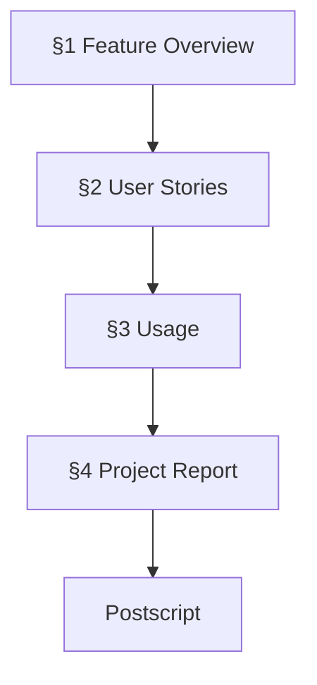
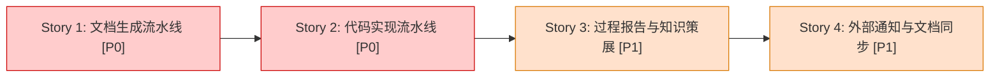
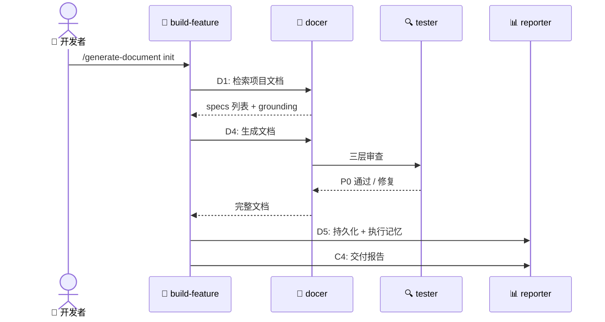
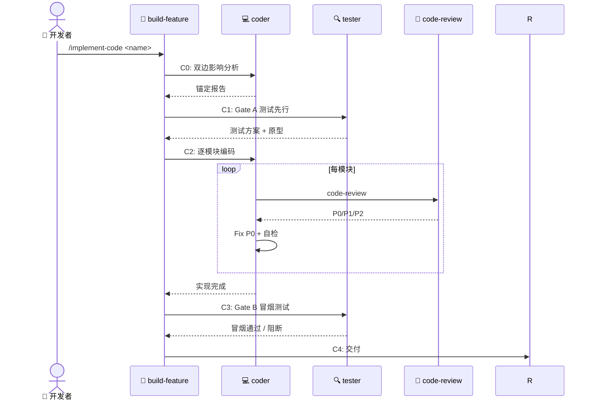
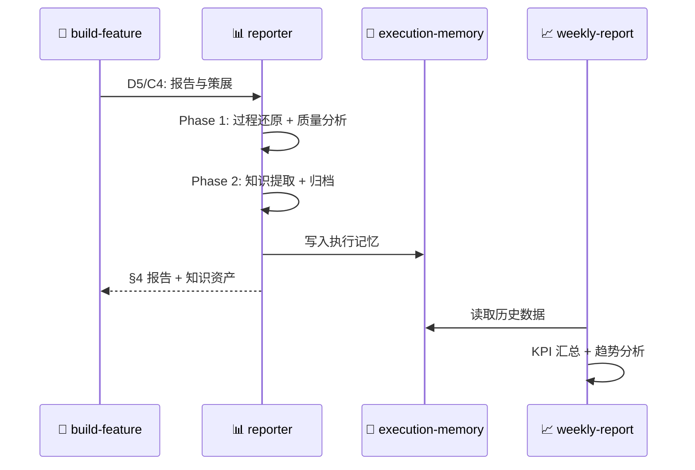
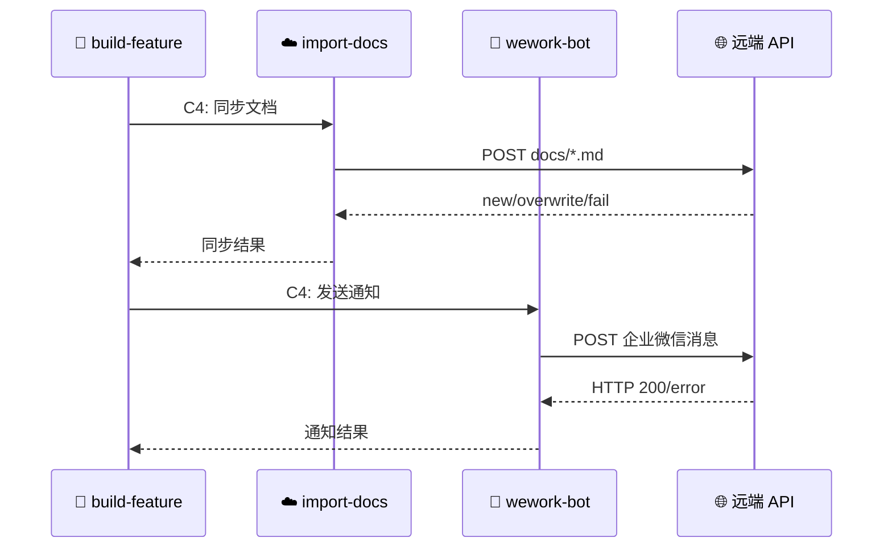

# 📋 YrY — AI 协作层

> | v1.0 | 2026-05-05 | deepseek-v4-pro | Claude Code | 🌿 main | ⏱️ 17:00–18:00 | 📎 [CLAUDE.md](../CLAUDE.md) |

[📖 §1](#1-feature-overview) | [📋 §2](#2-user-stories) | [📚 §3](#3-usage) | [📈 §4](#4-project-report) | [🔄 后记](#post-mortem)

---

## 📖 1. Feature Overview

| Aspect | Detail |
|--------|--------|
| Problem | AI 编码助手（Claude/Cursor）需要结构化的技能、代理和契约层来编排完整 SDLC |
| Who | 使用 AI 编码助手进行功能开发的开发者 |
| Scope | 技能编排（build-feature）、专家代理（docer/coder/tester/reporter）、输出契约、自动化脚本 |
| Out-of-Scope | 具体业务代码实现、CI/CD 基础设施、外部 API 实现 |
| Success Metric | `compile-manifests.js --validate --check-gates` 零错误通过；文档生成→代码实现→交付全流程可执行 |

### Story Map

Story 1 产出功能文档，Story 2 基于文档实现代码，Story 3 提取可复用知识，Story 4 同步文档到远端并通知团队。

---

## 📋 2. User Stories

### 🎯 Story 1: 文档生成流水线

| Field | Detail |
|-------|--------|
| As a | 开发者 |
| I want | 通过 `/generate-document` 命令自动生成功能文档 |
| So that | 每个功能有结构完整、可追溯、可验证的文档 |
| Priority | 🔴 P0 |
| Scope | D0–D5 文档管线 + C4 交付 |

#### 2.1.1 Requirements

| FP# | Description | Input | Output | Error Behavior |
|-----|-------------|-------|--------|---------------|
| FP1 | 项目初始化 | `/generate-document init` | `docs/<project>-overview.md` | 文档已存在时增量更新 |
| FP2 | 功能文档生成 | `/generate-document <name>` | `docs/<name>.md`（§1–§4+后记） | P0 不通过则阻断 |
| FP3 | 周报生成 | `/generate-document weekly [date]` | `docs/weekly/<range>/weekly-report.md` | KPI 采集失败标注警告 |
| FP4 | 周报拆解 | `/generate-document from-weekly <path>` | 多个独立功能文档 | 解析失败标注缺失 |

#### 2.1.2 Design

文档管线由 docer（主）+ tester（审查）+ reporter（策展）协作完成。D0（自适应规划）为可选阶段。

| Module | File | Responsibility | Change Type |
|--------|------|---------------|-------------|
| build-feature | `skills/build-feature/SKILL.md` | 主流水线编排器 | 核心 |
| docer | `agents/docer/AGENT.md` | D0–D5 文档生成 | 核心 |
| tester | `agents/tester/AGENT.md` | D4 三层审查 | 核心 |
| reporter | `agents/reporter/AGENT.md` | D5/C4 交付与策展 | 核心 |
| contracts | `shared/contracts.md` | 输出契约/证据标准/影响分析 | 约束 |

#### 2.1.3 Tasks

| ID | Description | Effort | Depends | Deliverable |
|----|-------------|--------|---------|-------------|
| S1-T1 | 优化 build-feature SKILL.md 执行协议 | M | — | `skills/build-feature/SKILL.md` |
| S1-T2 | 简化 agent 定义去冗余 | M | — | `agents/*/AGENT.md` |
| S1-T3 | 执行 `/generate-document init` | S | S1-T1, S1-T2 | `docs/yry-overview.md` |

#### 2.1.4 Acceptance Criteria

| AC# | Criterion (Measurable) | Test Method | Expected Result | Gate |
|-----|------------------------|-------------|-----------------|------|
| AC1 | `compile-manifests.js --validate` 零错误 | `node scripts/compile-manifests.js --validate --check-gates` | 退出码 0，Issues found: 0 | Gate A |
| AC2 | `docs/yry-overview.md` 存在且四节完整 | `grep -c '^## ' docs/yry-overview.md` | ≥ 4 个 H2 章节 | Gate B |
| AC3 | 文档包含后记三子节 | `grep -c '后期规划与改进\|工作流标准化审查\|系统架构演进' docs/yry-overview.md` | ≥ 3 | Gate B |

---

### 🎯 Story 2: 代码实现流水线

| Field | Detail |
|-------|--------|
| As a | 开发者 |
| I want | 通过 `/implement-code` 基于文档自动实现代码 |
| So that | 代码可追溯到设计文档，质量有 Gate A/B 保障 |
| Priority | 🔴 P0 |
| Scope | C0–C3 代码管线 + C4 交付 |

#### 2.2.1 Requirements

| FP# | Description | Input | Output | Error Behavior |
|-----|-------------|-------|--------|---------------|
| FP1 | 代码预检 | `docs/<name>.md` | 锚定报告 | P0 文档缺失则阻断 |
| FP2 | 测试先行 (Gate A) | §2 场景 | 测试方案 + UI 原型 | Gate A 未通过阻断 C2 |
| FP3 | 逐模块编码 | 架构设计 | 实现代码 + 审查记录 | 任一模块 P0 未清零阻断 C3 |
| FP4 | 冒烟验证 (Gate B) | 实现代码 | 冒烟证据 + AC 更新 | >2 轮修复阻断 C4 |

#### 2.2.2 Design

| Module | File | Responsibility | Change Type |
|--------|------|---------------|-------------|
| coder | `agents/coder/AGENT.md` | C0/C2 代码实现 | 核心 |
| tester | `agents/tester/AGENT.md` | C1/C3 测试与验证 | 核心 |
| code-review | `skills/code-review/SKILL.md` | C2 逐模块审查 | 支撑 |
| e2e-testing | `skills/e2e-testing/SKILL.md` | C1 测试方案设计 | 支撑 |

#### 2.2.3 Tasks

| ID | Description | Effort | Depends | Deliverable |
|----|-------------|--------|---------|-------------|
| S2-T1 | 代码预检 (C0) | M | `docs/<name>.md` 存在 | 锚定报告 |
| S2-T2 | 测试方案 + 原型 (C1) | M | S2-T1 | 测试方案 + `data-testid` 列表 |
| S2-T3 | 逐模块实现 (C2) | L | S2-T2 | 实现代码 + 审查记录 |
| S2-T4 | 冒烟验证 (C3) | M | S2-T3 | 冒烟证据 + AC 状态回写 |

#### 2.2.4 Acceptance Criteria

| AC# | Criterion (Measurable) | Test Method | Expected Result | Gate |
|-----|------------------------|-------------|-----------------|------|
| AC1 | C0 锚定报告产出 | 检查 report 文件 | 包含 P0 验证 + 影响链状态 | Gate A |
| AC2 | C1 测试方案覆盖所有 P0 场景 | 对照 §2 场景计数 | 覆盖率 = 100% | Gate A |
| AC3 | C2 所有模块 P0 清零 | 逐模块检查 P0 列表 | 每个模块 P0 = 0 | Gate B |
| AC4 | C3 冒烟测试主路径通过 | 执行冒烟命令 | 退出码 0 + 证据齐全 | Gate B |

---

### 🎯 Story 3: 过程报告与知识策展

| Field | Detail |
|-------|--------|
| As a | 维护者 |
| I want | 每次流水线完成后自动提取可复用知识和效率指标 |
| So that | 持续改进流程，避免重复踩坑 |
| Priority | 🟡 P1 |
| Scope | D5 + C4 + 周报 |

#### 2.3.1 Requirements

| FP# | Description | Input | Output | Error Behavior |
|-----|-------------|-------|--------|---------------|
| FP1 | 过程报告 | 流水线执行记录 | §4 Project Report | 编造数据则阻断 |
| FP2 | 知识提取 | 各 agent 输出 | 可复用模式 + 陷阱 | 单一来源需标注 |
| FP3 | 周报汇总 | KPI + logs + git | 周报文档 | 数据缺失标注警告 |

#### 2.3.2 Design

#### 2.3.3 Tasks

| ID | Description | Effort | Depends | Deliverable |
|----|-------------|--------|---------|-------------|
| S3-T1 | Phase 1 过程报告 | M | D4/C3 完成 | §4 Project Report |
| S3-T2 | Phase 2 知识策展 | M | S3-T1 | 知识资产归档 |
| S3-T3 | 周报 KPI 采集 | M | 执行记忆有数据 | 周报文档 |

#### 2.3.4 Acceptance Criteria

| AC# | Criterion (Measurable) | Test Method | Expected Result | Gate |
|-----|------------------------|-------------|-----------------|------|
| AC1 | §4 包含 Verification Summary + Delivery Summary | `grep -c 'Verification Summary\|Delivery Summary' docs/*.md` | ≥ 2 | Gate B |
| AC2 | 执行记忆有写入记录 | `node skills/build-feature/scripts/execution-memory.js stats` | 记录数 > 0 | Gate B |
| AC3 | 周报包含 KPI + 趋势分析 | 检查周报章节 | 数据表 ≥ 1，趋势段 ≥ 1 | Gate B |

---

### 🎯 Story 4: 外部通知与文档同步

| Field | Detail |
|-------|--------|
| As a | 团队成员 |
| I want | 流水线完成/阻断时自动同步文档并通知企业微信 |
| So that | 团队实时感知项目状态，文档始终保持最新 |
| Priority | 🟡 P1 |
| Scope | C4 delivery: import-docs + wework-bot |

#### 2.4.1 Requirements

| FP# | Description | Input | Output | Error Behavior |
|-----|-------------|-------|--------|---------------|
| FP1 | 文档同步 | `docs/` 目录 | 远端同步结果 | `API_X_TOKEN` 缺失跳过同步 |
| FP2 | 企业微信通知 | 流水线状态 | 群消息 | 发送失败记录到 §4 |
| FP3 | 阻断通知 | 阻断详情 | 群消息（含恢复点） | 必须发送 |

#### 2.4.2 Design

#### 2.4.3 Tasks

| ID | Description | Effort | Depends | Deliverable |
|----|-------------|--------|---------|-------------|
| S4-T1 | import-docs 同步 | S | C4 触发 | 远端文档更新 |
| S4-T2 | wework-bot 通知 | S | S4-T1 | 企业微信群消息 |
| S4-T3 | 阻断场景通知 | S | 阻断发生时 | 阻断详情 + 恢复建议 |

#### 2.4.4 Acceptance Criteria

| AC# | Criterion (Measurable) | Test Method | Expected Result | Gate |
|-----|------------------------|-------------|-----------------|------|
| AC1 | import-docs 在 C4 先于 wework-bot 执行 | 检查执行顺序 | import-docs 先执行 | Gate B |
| AC2 | 通知消息包含结论/原因/影响/恢复点 | 检查消息正文 | 4 字段齐全 | Gate B |
| AC3 | `API_X_TOKEN` 缺失时降级不阻断 | 移除 token 后执行 | 跳过同步，仍发通知（若 token 缺失则跳过） | Gate B |

---

## 📚 3. Usage

### ⚡ Quick Start

| Step | Action | Command / Path | Expected Result |
|------|--------|---------------|-----------------|
| 1 | 验证清单 | `node scripts/compile-manifests.js --validate --check-gates` | Issues found: 0 |
| 2 | 项目初始化 | `/generate-document init` | `docs/yry-overview.md` 生成 |
| 3 | 生成功能文档 | `/generate-document <name> [description]` | `docs/<name>.md` 含 §1–§4+后记 |
| 4 | 实现代码 | `/implement-code <name>` | 代码 + 审查记录 + 冒烟证据 |
| 5 | 查看可用文档 | `/implement-code list` | 列出 `docs/` 下 `.md` 文件 |

### ❓ FAQ

| # | Question | Answer |
|---|----------|--------|
| 1 | 文档需要手动编辑吗？ | AI 生成初稿后可手动补充 C 类（未验证）标注的内容 |
| 2 | 如何跳过 D0 自适应规划？ | 使用 `/generate-document init` 自动跳过 |
| 3 | Gate B 失败怎么恢复？ | 检查冒烟失败日志 → 修复 → 重新进入 C3 |
| 4 | 如何查看历史流水线记录？ | `node skills/build-feature/scripts/execution-memory.js query` |

---

## 📈 4. Project Report

### Verification Summary

| Story | P0 AC | P0 Passed | P1 AC | P1 Passed | Gate A | Gate B | Status |
|-------|-------|-----------|-------|-----------|--------|--------|--------|
| Story 1 | 3 | 3 | 0 | 0 | ✅ | ✅ | ✅ |
| Story 2 | 4 | — | 0 | — | — | — | 🔄 |
| Story 3 | 3 | — | 0 | — | — | — | 🔄 |
| Story 4 | 3 | — | 0 | — | — | — | 🔄 |

### Delivery Summary

| Aspect | Value | Evidence |
|--------|-------|----------|
| Files Changed | 5 | `git diff --stat` |
| Lines Added/Removed | +380 -1050 | `git diff --shortstat` |
| Stories Delivered | 1/4 | §2 Verification Summary |
| Gate A (Test-First) | ✅ | compile-manifests 验证通过 |
| Gate B (Smoke Test) | ✅ | 文档四节完整 + 后记齐全 |

---

## 🔄 后记：后期规划与改进

### 🔍 工作流标准化审查

| # | Question | Answer | Evidence |
|---|----------|--------|----------|
| 1 | 重复劳动？ | Yes | Agent 定义中 required_answers 与 contracts.md 重复声明 |
| 2 | 决策标准缺失？ | Yes | D0 变更级别 T1/T2/T3 边界模糊，依赖模型判断 |
| 3 | 信息孤岛？ | No | 所有 agent 共享 contracts.md + execution-memory |
| 4 | 反馈闭环？ | Yes | D5 执行记忆回写 → D0 读取历史，闭环已建立 |

### 🏗️ 系统架构演进思考

| # | Question | Answer | Evidence |
|---|----------|--------|----------|
| A1 | 当前瓶颈？ | 流水线依赖 Claude 手动编排，无可自动化执行引擎 | build-feature 的 11 个阶段全部需人工触发 |
| A2 | 下一个演进节点？ | 将 Agent 调用标准化为 API/SDK 调用，实现流水线自动推进 | contracts.md 已定义 JSON 输出契约，可机器消费 |
| A3 | 风险与回滚方案？ | 自动化后可能失去人工判断节点；保留 Gate A/B 作为强制人工确认点 | 当前 Gate 定义已含 P0 阻断条件 |

### 📋 后续用户故事

- 作为开发者，我想要 `/build-feature <name> --full` 一键完成文档→代码→交付全流程，以便减少手动编排
- 作为维护者，我想要 `execution-memory.js` 自动分析趋势并预警退化维度，以便主动干预
- 作为新成员，我想要 `generate-document init` 产出交互式项目地图，以便 5 分钟内理解项目结构
