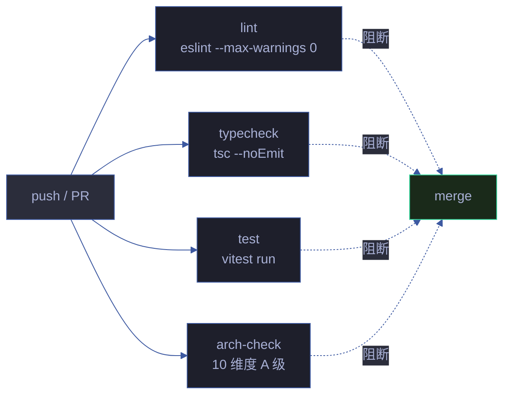

# CI/CD

> YrY 项目持续集成流水线设计。GitHub Actions 4-job 并行 + Dependabot 依赖更新。
> 对应 CLAUDE.md [铁律 · 验先于称](../../CLAUDE.md#铁律) — CI 是「运行即证」的自动化代理。

## 流水线全景



| Job | 命令 | 阻断 | 起始轮次 |
|-----|------|------|---------|
| lint | `npx eslint lib/ skills/ --max-warnings 0` | ✅ | 第十一轮（2026-06-25 清零） |
| typecheck | `npx tsc --noEmit` | ✅ | 第十八轮（移除 continue-on-error） |
| test | `npx vitest run` | ✅ | 第十一轮 |
| arch-check | `node lib/arch-check.mjs` | ✅ | 第十一轮 |

## 关键配置

### concurrency — 取消旧 run

```yaml
concurrency:
  group: ${{ github.workflow }}-${{ github.ref }}
  cancel-in-progress: true
```

**Why**：同一分支连续 push 时取消正在跑的旧 run，省 CI 分钟。`group` 用 `workflow-ref` 保证分支隔离。

### npm cache — 加速 install

```yaml
- uses: actions/setup-node@v4
  with:
    node-version: 18
    cache: npm
```

**Why**：`cache: npm` 自动缓存 `~/.npm`，二次运行 `npm ci` 从 30s 降到 5s。

### npm ci — 锁定安装

```yaml
- run: npm ci
```

**Why**：`npm ci` 基于 `package-lock.json` 安装，不修改锁文件，CI 可重现。比 `npm install` 快且严格。

## 演进时间线

| 轮次 | 日期 | 变更 | 原因 |
|------|------|------|------|
| 1 | 2026-06-25 | CI 初版（lint + test + arch-check） | 建立基线 |
| 11 | 2026-06-25 | lint warnings 全量清零 | 消除警告噪音 |
| 14 | 2026-06-25 | 加 concurrency + npm cache + Dependabot | 省 CI 资源 |
| 15 | 2026-06-25 | 加 typecheck job（continue-on-error） | 614 errors 噪音太大 |
| 16-17 | 2026-06-25 | tsc errors 108→65→0 | 真实类型问题清理 |
| 18 | 2026-06-25 | typecheck 移除 continue-on-error | tsc 0 errors，改为阻断 |

## Dependabot

`.github/dependabot.yml` 配置每周一 09:00（Asia/Shanghai）检查 npm 依赖更新。

```yaml
schedule:
  interval: "weekly"
  day: "monday"
  time: "09:00"
  timezone: "Asia/Shanghai"
open-pull-requests-limit: 5
groups:
  vitest:
    patterns: ["vitest", "@vitest/*"]
  lint-toolchain:
    patterns: ["eslint", "typescript", "@types/*", "prettier"]
```

**分组策略**：vitest 相关包一起升级（API 兼容），lint 工具链一起升级（eslint/tsc/prettier 协同）。

**人工审查**：Dependabot 只提交 PR，不自动合并。审查关注：
- breaking change（major 版本）
- 锁文件是否一致
- CI 是否绿

## 本地等价命令

CI 跑什么，本地就跑什么：

```bash
make ci-local  # = lint + typecheck + test + arch-check
```

或分步：

```bash
make lint-all         # eslint 0 errors + 0 warnings
make typecheck        # tsc 0 errors
make test             # vitest run
make arch-check       # 10 维度 A 级
```

**Why 本地等价**：开发者本地能复现 CI 失败，避免「本地通过 CI 红」的漂移。

## 退化对策

| 退化因 | 对策 |
|--------|------|
| CI 被悄悄加回 continue-on-error | PR 审查重点关注 typecheck job 配置 |
| 新增 `.mjs` 文件未跑 lint/tsc | CI 全量扫描 `lib/` + `skills/`，无白名单 |
| 依赖升级导致 CI 红 | Dependabot PR 必须本地 `make ci-local` 通过才合并 |
| 并发 run 浪费分钟 | concurrency cancel-in-progress 已就位 |
| npm install 改回 npm ci | CI 锁定 `npm ci`，PR 审查拦截 |

## 退出策略

| 临时方案 | 退出条件 | 退出动作 |
|---------|---------|---------|
| `typecheck continue-on-error` | tsc 0 errors 稳定 | 第十八轮已退出 |
| `node-version: 18` 锁定 | Node 20 LTS 普及后 | 升级到 20 + 本地 engines 同步 |
| 单一 `ci.yml` 工作流 | job 数 > 8 需分文件 | 拆 `ci-lint.yml` / `ci-test.yml` |
