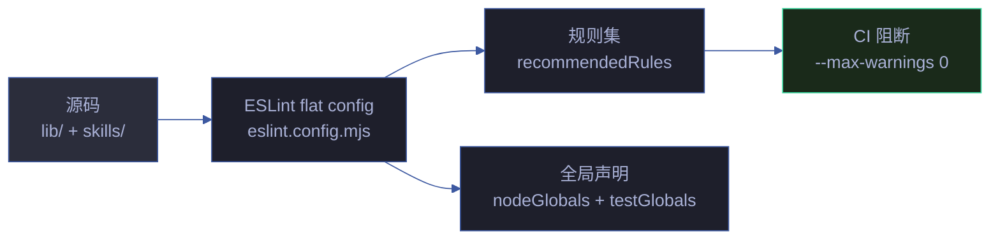

# Lint 链

> YrY 项目 ESLint flat config 设计与清理路径。规则集 + 双区（lib/skills）清理。
> 对应 CLAUDE.md [项目约束](../../CLAUDE.md#项目约束) 中的范式合规（无 class/extends · 无 export default · 无空 catch）。

## Lint 全景



| 区 | 扫描路径 | 状态 |
|----|---------|------|
| lib | `lib/**/*.mjs` | ✅ 0 errors + 0 warnings |
| skills | `skills/**/*.mjs` | ✅ 0 errors + 0 warnings |
| tests | `lib/tests/**` + `skills/*/tests/**` | ✅ 加 testGlobals |

## flat config 结构

`eslint.config.mjs` 三段式：

```javascript
export default [
  // 1. 全局忽略
  { ignores: ['node_modules/', 'dist/', '.claude/', 'cdn/', 'coverage/', 'docs/', ...] },

  // 2. 主规则集（lib + skills 源码）
  {
    languageOptions: { ecmaVersion: 2022, sourceType: 'module', globals: { ...nodeGlobals } },
    rules: recommendedRules,
  },

  // 3. 测试文件覆盖（加 testGlobals）
  {
    files: ['**/tests/**/*.test.mjs', 'lib/tests/**/*.mjs', ...],
    languageOptions: { globals: { ...nodeGlobals, ...testGlobals } },
  },
];
```

**Why flat config**：ESLint v9+ 不再读 `.eslintrc.json`，flat config 是官方未来。单文件易审查、易版本控制。

## 规则集分层

### 1. eslint:recommended 等价子集

| 规则 | 级别 | 含义 |
|------|------|------|
| `no-cond-assign` | error | 条件表达式禁止赋值 |
| `no-debugger` | error | 禁止 debugger 语句 |
| `no-dupe-keys` | error | 对象字面量禁止重复键 |
| `no-dupe-args` | error | 函数参数禁止重名 |
| `no-duplicate-case` | error | switch 禁止重复 case |
| `no-extra-semi` | error | 禁止多余分号 |
| `no-irregular-whitespace` | error | 禁止非常规空白 |
| `no-redeclare` | error | 禁止重复声明 |
| `no-sparse-arrays` | error | 禁止稀疏数组 |
| `no-undef` | error | 禁止未定义变量 |
| `no-unreachable` | error | 禁止不可达代码 |
| `no-unused-vars` | warn | 未用变量（带 `^_` 忽略） |
| `use-isnan` | error | 用 isNaN 而非 `== NaN` |
| `valid-typeof` | error | typeof 结果合法比较 |

### 2. 项目范式约束

| 规则 | 级别 | 对应 CLAUDE.md 范式 |
|------|------|---------------------|
| `prefer-const` | error | 函数范式 — 不重新赋值 |
| `no-var` | error | 函数范式 — 用 let/const |
| `eqeqeq` | error | 严格相等（null 除外） |
| `no-console` | off | CLI 工具允许 console |

### 3. `^_` 前缀忽略模式

```javascript
'no-unused-vars': ['warn', {
  argsIgnorePattern: '^_',
  varsIgnorePattern: '^_',
  caughtErrorsIgnorePattern: '^_',
}]
```

**Why**：未用参数 / 捕获错误用 `_` 前缀显式标记「故意未用」。如 `function parse(_opts) { ... }`、`catch (_e) { ... }`。

## 全局声明

### nodeGlobals

```javascript
const nodeGlobals = {
  console: 'readonly', process: 'readonly', Buffer: 'readonly',
  __dirname: 'readonly', __filename: 'readonly',
  module: 'readonly', require: 'readonly', URL: 'readonly',
  setTimeout: 'readonly', clearTimeout: 'readonly',
  // ... fetch, AbortController, structuredClone 等 Node 18+ 全局
};
```

**Why `readonly`**：禁止覆盖全局，但允许读取。ESM 项目实际不用 `__dirname`/`require`，但保留声明防止误报。

### testGlobals

```javascript
const testGlobals = {
  describe: 'readonly', it: 'readonly', test: 'readonly', expect: 'readonly',
  beforeAll: 'readonly', afterAll: 'readonly', beforeEach: 'readonly', afterEach: 'readonly',
  vi: 'readonly',
};
```

**Why 独立段**：`globals: false` 时测试文件需显式声明 vitest 原语。只对 `**/tests/**` 生效，不污染源码。

## 演进时间线

| 轮次 | 日期 | 变更 | warnings |
|------|------|------|---------|
| 1 | 2026-06-25 | flat config 迁移自 .eslintrc.json | ~50 |
| 11 | 2026-06-25 | lib + skills 全量清零 | 0 |
| 11 | 2026-06-25 | CI `--max-warnings 0` 阻断 | 0 |

## 清理模式

### 模式 1：未用参数 → 加 `_` 前缀

```javascript
// before
function parse(opts) { return Object.keys(META); }

// after
function parse(_opts) { return Object.keys(META); }
```

### 模式 2：`var` → `const`/`let`

```javascript
// before
var arr = [];

// after
const arr = [];
```

### 模式 3：`==` → `===`

```javascript
// before
if (a == null) { ... }

// after（null 例外保留）
if (a === null || a === undefined) { ... }
// 或
if (a == null) { ... }  // eqeqeq 'always' + null: 'ignore' 允许
```

### 模式 4：`const` 可推断 → 删 `let`

```javascript
// before
let x = compute();
return x;

// after
const x = compute();
return x;
```

## 退化对策

| 退化因 | 对策 |
|--------|------|
| 新增 `.mjs` 带 lint 警告 | CI `--max-warnings 0` 阻断 |
| 规则被悄悄降级（error→warn） | PR 审查重点关注 `eslint.config.mjs` |
| 测试文件误报 `describe/it` 未定义 | testGlobals 段独立维护 |
| `^_` 滥用（业务参数也加 `_`） | 代码审查标记，只允许未用参数加 |

## 退出策略

| 临时方案 | 退出条件 | 退出动作 |
|---------|---------|---------|
| 内联 `recommendedRules` | `@eslint/js` 包加入 devDeps | 改为 `import js from '@eslint/js'; ... js.configs.recommended` |
| `eslint.config.mjs` 单文件 | 规则数 > 50 | 拆 `eslint/` 子目录按区分文件 |
| `--max-warnings 0` CLI 参数 | 想配置化 | 在 config 中 `defaultOptions: { reportUnusedDisableDirectives: 'error' }` |
