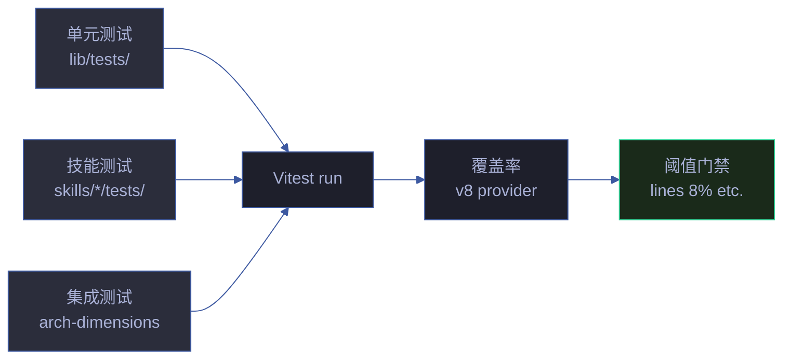

# 测试体系

> YrY 项目测试分层与覆盖率策略。Vitest 原生 + arch-dimensions 集成测试 + 覆盖率阈值防退化。
> 对应 CLAUDE.md [铁律 · 验先于称](../../CLAUDE.md#铁律) — 测试是「运行即证」的最小可重复单元。

## 测试全景



| 层 | 位置 | 职责 | 文件数 |
|----|------|------|--------|
| 单元 | `lib/tests/*.test.mjs` | 纯函数 / 工具库 | 20+ |
| 技能 | `skills/*/tests/*.test.mjs` | 各 skill 端到端 | 9 |
| 集成 | `lib/tests/arch-dimensions.test.mjs` | 10 维度架构合规 | 1 |

## Vitest 配置

`vitest.config.mjs` 关键配置：

```javascript
{
  include: [
    'skills/rui/tests/infrastructure/**/*.test.mjs',
    'lib/tests/**/*.test.mjs',
    'skills/*/tests/**/*.test.mjs',
  ],
  globals: false,       // 不污染全局，显式 import
  isolate: true,        // 每文件独立沙箱
  testTimeout: 60_000,  // 防止网络请求超时
  coverage: {
    provider: 'v8',
    include: ['lib/**/*.mjs', 'skills/**/*.mjs'],
    exclude: ['lib/tests/**', 'skills/*/tests/**', ...],
    thresholds: {
      lines: 8, statements: 8, functions: 10, branches: 10,
    },
  },
}
```

**Why `globals: false`**：显式 `import { describe, it, expect } from 'vitest'`，避免与 Node 全局污染，方便迁移到其他测试框架。

**Why `isolate: true`**：每个测试文件独立模块状态，防止 `lib/constants.mjs` 等单例跨文件污染。

## 覆盖率阈值策略

### 起步阈值（当前）

| 维度 | 阈值 | 实测（2026-06-25） |
|------|------|-------------------|
| lines | 8% | 8.97% |
| statements | 8% | 8.97% |
| functions | 10% | 11.5% |
| branches | 10% | 10.2% |

**Why 起步低**：项目是 meta 插件，大量 skill 代码是「规约 + 模板生成」，难以被单元测试覆盖。起步阈值基于实测，防止未来退化。

### 提升路线图

```
当前 8% → 15% → 30% → 50%（长期目标）
```

**优先覆盖**：
- 纯工具函数（tty, help-layout, constants, test-helpers, scoring）：目标 85%+
- `lib/engine/`（24% 实测）：目标 50%
- `lib/arch-dimensions/`：目标 70%（架构合规核心）

**Why 按模块分目标**：纯函数易测，应高覆盖；编排器/生成器涉及 IO 与外部依赖，覆盖率提升成本高、价值低。

## arch-dimensions 集成测试

`lib/tests/arch-dimensions.test.mjs` 是架构合规的核心验证：

```javascript
/**
 * @type {Array<[string, (projectRoot: string) => { dim, label, pass, checks }]>}
 */
const CHECKS = [
  ['kernel-paradigm', checkKernelParadigm],
  ['module-count', checkModuleCount],
  // ... 10 维度
];
```

**测试策略**：
1. 用本仓库自身作为 `projectRoot` 跑每个维度
2. 断言 `pass === true`（10 维度全 A 级）
3. 断言 `checks` 数组非空（每个维度至少 1 条检查项）

**Why 自检**：YrY 是自托管项目，用自身管线管理自身演进。arch-dimensions 测试自己 = 自己验证自己合规。

## 命令入口

```bash
npm test                 # vitest run（CI 等价）
npm run test:watch       # 监听模式
npm run test:ui          # 浏览器 UI
npm run test:coverage    # 覆盖率报告
npm run test:coverage:check  # 覆盖率阈值门禁（CI 用）
npm run test:all         # vitest + legacy
npm run test:legacy      # 旧 Node.js 原生测试
```

或 Makefile：

```bash
make test
make test-coverage
make test-coverage-check
```

## 演进时间线

| 轮次 | 日期 | 变更 | 测试数 |
|------|------|------|--------|
| 1 | 2026-06-25 | Vitest 初版 + 10 单元测试 | 10 |
| 11 | 2026-06-25 | 测试数扩到 337+ | 337 |
| 14 | 2026-06-25 | 加 coverage v8 provider | 337 |
| 15 | 2026-06-25 | 加阈值门禁（lines 8%） | 337 |

## 退化对策

| 退化因 | 对策 |
|--------|------|
| 新增 `.mjs` 不写测试 | 覆盖率阈值阻断 CI（阈值低但不可降） |
| 测试依赖网络/外部状态 | `testTimeout: 60s` + mock 隔离 |
| 测试互相污染 | `isolate: true` 每文件独立沙箱 |
| Legacy 测试漂移 | `test:legacy` 保留独立入口，`test:all` 一并跑 |
| 覆盖率阈值被悄悄下调 | PR 审查重点关注 `vitest.config.mjs` thresholds 段 |

## 退出策略

| 临时方案 | 退出条件 | 退出动作 |
|---------|---------|---------|
| 起步阈值 lines 8% | lib/ 覆盖率到 30% | 提升到 15%，再 30% |
| `test:legacy` 双入口 | legacy 测试全部迁移到 vitest | 删除 `skills/rui/tests/run.mjs` + `test:legacy` script |
| `test-harness.mjs` | 适配器迁移完成 | 删除 `lib/test-harness.mjs` + `lib/vitest-adapter.mjs` |
