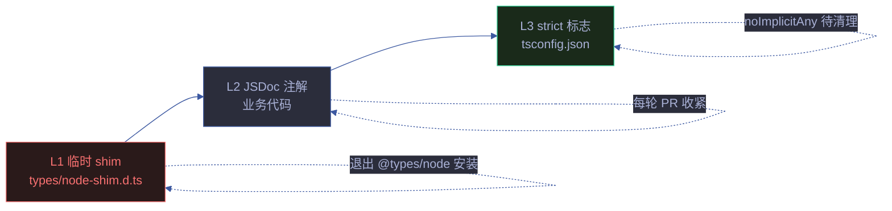

# 类型系统

> YrY 项目渐进式 TypeScript 类型策略。在 `strict: false` 基线上分轮次收紧，每轮可验证、可回滚。
> 对应 CLAUDE.md [铁律 · 验先于称](../../CLAUDE.md#铁律) — 每次收紧必须 `npx tsc --noEmit` 验证。

## 三层策略



| 层 | 职责 | 状态 | 退出条件 |
|----|------|------|---------|
| L1 | 消除 TS2591 `Cannot find name 'process'` 等噪音 | ✅ 就位 | `@types/node` 加入 devDeps |
| L2 | 业务代码 JSDoc `@param`/`@returns`/`@type` | ✅ 持续收紧 | — |
| L3 | tsconfig strict 子标志 | `strictNullChecks: true` 已启用；`noImplicitAny` 待 3048 errors 清理 | 分轮次清理后逐个开启 |

## L1 — node-shim.d.ts

**Why**：项目暂未将 `@types/node` 加入 devDependencies（会改 `package-lock.json`，需用户决策）。没有 `@types/node` 时，tsc 报 507 个 TS2591 错误（`Cannot find name 'process'/'node:fs'` 等），淹没真正的类型问题。

**How**：`types/node-shim.d.ts` 用最小声明消除这些噪音：

```typescript
declare const process: {
  env: Record<string, string | undefined>;
  argv: string[];
  exit: (code?: number) => void;
  cwd: () => string;
  // ... 其他字段
  exitCode: number;
};

declare module "node:path";
declare module "node:fs";
// ... 20 个 node:* 模块

interface ImportMeta {
  dirname?: string;
  filename?: string;
  url: string;
}
```

**注意**：shim 将 node:* 模块的所有导出声明为 `any`（不提供真实类型），与项目 `strict: false` 的宽松基线一致。真实类型由 `@types/node` 提供。

**退出**：`@types/node` 加入 devDeps 后，删除本文件 + tsconfig `types: ["node"]`，无业务代码改动。

## L2 — JSDoc 注解

**Why**：JS 项目通过 JSDoc 让 tsc 推断类型，无需改写 `.mjs` → `.ts`。

### 常见模式

| 模式 | 错误示例 | 修复 |
|------|---------|------|
| `{}` destructure 默认值 | `Property 'lang' does not exist on type '{}'` | `@param {{ lang?: string, since?: string }} opts` |
| `let status = "ok"` 重新赋值 | `Type 'string' is not assignable to '"ok"\|"warn"\|"critical"'` | `/** @type {'ok'\|'warn'\|'critical'} */ let status` |
| `const arr = []` 推断 `never[]` | `Argument of type 'string' is not assignable to parameter of type 'never'` | `/** @type {string[]} */ const arr = []` |
| `find()` 返回 `T \| undefined` | `'a' is possibly 'undefined'` | `a?.field` 可选链 |
| `.toFixed()` 返回 `string` | `Operator '>' cannot be applied to 'string' and 'number'` | `Number(x.toFixed(1))` cast |
| Date 算术 | `The left-hand side of an arithmetic operation must be of type 'number'` | `now.getTime() - createdAt.getTime()` |
| `@returns {Promise<object>}` 实际无返回 | `Function lacks ending return statement` | `@returns {void}` |

### `@type {any}` cast 的使用边界

当无法立即修完整类型时，`/** @type {any} */` cast 是合法的临时手段：

- ✅ 异构对象字面量（如 `evidence: { count, creep, newest }` vs `evidence: { libCreep, rulesCreep, orchCreep, newestLib }`）
- ✅ 第三方返回的对象上 mutation（如 `result.msgLength = x`）
- ❌ 业务逻辑参数（应给出真实类型）

每个 `@type {any}` 必须配注释说明为何不修真实类型。

## L3 — strict 标志

### 当前状态

```json
{
  "strict": false,
  "strictNullChecks": true
}
```

### strictNullChecks 启用路径（已完成）

| 阶段 | errors | 关键修复 |
|------|--------|---------|
| 第十九轮探查 | 121 | 临时开启实测，修 27 处分布 8 文件 |
| 第十九轮回滚 | 94 | 94 errors 太多，回滚 `strict: false` |
| 第二十轮清理 | 94→0 | 12 文件 JSDoc 注解 + `Number()` cast + `\|\| []` 兜底 |
| 第二十轮启用 | 0 | tsconfig 永久 `strictNullChecks: true` |

### noImplicitAny 路线图（未启动）

**实测**：开启 `noImplicitAny` 产生 3048 errors，第二十二-八十八轮清理六十七批后剩 77。集中分布：

| 错误模式 | 数量 | 修复策略 |
|---------|------|---------|
| `Element implicitly has 'any' type because expression of type 'any' can't be used to index type '{}'` | 323 | 给被索引对象加 `Record<string, X>` 注解 |
| `Element implicitly has 'any' type because expression of type 'string' can't be used to index type '{}'` | 137 | 同上 |
| `Parameter 'f' implicitly has an 'any' type` | 136 | 给回调参数加 `@param` JSDoc |
| `Parameter 'd'/'s'/'projectRoot'/'a'/'b'/'ctx'` 隐式 any | ~340 | 同上 |

**策略**：分多轮按文件清理，每轮聚焦一个子目录（`lib/` → `lib/engine/` → `lib/arch-dimensions/` → `skills/rui-bot/lib/` → `skills/rui-trends/lib/` → `skills/rui-bundle-analyze/`）。每轮结束验证 `npx tsc --noEmit` 0 errors + `npx vitest run` 通过。

**进度**：
- 第二十二轮（2026-06-25）：首批清理 7 个小 lib 文件（tty/fs/io/recommend-cli/recommend-detect/test-helpers/constants），30 errors 清零，3048→3018
- 第二十三轮（2026-06-25）：第二批清理 4 个中等 lib 文件（arch-check/cdn-score-updater/branch-check/audit），55 errors 清零，3018→2963
- 第二十四轮（2026-06-25）：第三批清理 2 个 lib 文件（vitest-adapter/record），48 errors 清零，2963→2915
- 第二十五轮（2026-06-25）：第四批清理 2 个 lib 文件（proposals/test-harness），91 errors 清零，2915→2824
- 第二十六轮（2026-06-25）：第五批清理 4 个 lib 文件（含 fs.mjs 类型签名变更级联），216 errors 清零，2824→2608
- 第二十七轮（2026-06-25）：第六批清理 `lib/scoring.mjs` + `skills/rui-bot/lib/bot-health-cmd.mjs`（meanVar/contributionAnalysis/volatilityAdjustedComposite JSDoc + 本地 `@type` 兜底），14 errors 清零，2608→2594
- 第二十八轮（2026-06-25）：第七批清理 `lib/selfimprove-generator.mjs` + `lib/tests/selfimprove-generator.test.mjs`（helpers JSDoc + 本地 `Record<string, X>` + `summary` `@type {any}` cast + 字面量对象索引提取局部变量），134 errors 清零，2594→2460
- 第二十九轮（2026-06-25）：第八批清理 `lib/scoring.mjs` 剩余部分 + `skills/rui-bot/lib/bot-health-cmd.mjs`（`volatilityAdjustedComposite`/`crossDimensionCorrelation`/`improvementPotentialRanking`/`computeComposite`/`categoryScores`/`rankDimensionInfluence`/`spiderChartData`/`dimensionBreakdown`/`generateScoreReport` JSDoc 收紧 + `generateExecutiveSummary` 本地 `@type {any}` cast + `report` `@type {any}` cast + `catCounts`/`catMap`/`allAxes`/`breakdown` 加 `@type`），96 errors 清零，2460→2364
- 第三十轮（2026-06-25）：第九批清理 `skills/rui-bundle-analyze/analyze.mjs` 前 ~700 行（`parseArgs`/`isExcludedDir`/`isSkipExt`/`walkDir`/`parseImports`/`saveBaseline`/`loadBaseline`/`computeDiff`/`detectOrphanFiles`/`detectBarrelFiles`/`computeHistogram`/`computeDepths`/`hashContent`/`detectDuplicates`/`computePackageMetrics`/`resolveImport`/`buildDepGraph`/`computeTransitiveDeps` 18 个函数 JSDoc + 本地 `@type`），127 errors 清零，2364→2237（analyze.mjs 还剩 ~706 errors 留后续轮次）
- 第三十一轮（2026-06-25）：第十批清理 `skills/rui-bundle-analyze/analyze.mjs` ~700-2400 行（`findDisconnectedSubgraphs`/`computeGitChurn`/`detectLayers`/`computeCoChange`/`findCoChangeClusters`/`computeRiskScores`/`generateRecommendations`/`computeSCC`/`computeBetweenness`/`loadTrend`/`persistAndAnalyzeTrend`/`suggestModuleBoundaries`/`computePageRank`/`analyzeTestGaps`/`computeChangePropagation`/`computeKnowledgeDistribution` 16 个函数 JSDoc + 本地 `@type` + 回调 inline `@type` + `stack.pop()`/`queue.shift()` `undefined` 守卫 + `Record<string, Set<string>>`/`Record<string, Set<number>>`），228 errors 清零，2237→2012（analyze.mjs 还剩 478 errors 留后续轮次）
- 第三十二轮（2026-06-26）：第十一批清理 `skills/rui-bundle-analyze/analyze.mjs` ~2400-7700 行剩余全部 478 errors（`computeComplexity`/`computeContentSimilarity`/`findSimilarityGroups`/`computeHotspotMatrix`/`checkFitnessRules`/`computeImportCost`/`quantifyTechDebt`/`computeRefactoringROI`/`analyzeApiSurface`/`computeHealthIndex`/`checkSDP`/`forecastTrends`/`computeReviewRisk`/`generateExecutiveSummary`/`predictBreakingChangeImpact`/`computeReleaseCoupling`/`computeKnowledgeConcentration`/`prioritizeTests`/`generateOnboardingPath`/`generateADRs`/`recommendSemver`/`generateReviewChecklists`/`generateSprintPackages`/`computeOwnershipTransferRisk`/`computeFileAge`/`detectAnomalies`/`computeRefactoringPriority`/`checkArchitectureConformance`/`checkQualityGates`/`computeDependencyConcentration`/`estimateReviewTime`/`computePercentileRankings`/`computeCorrelationMatrix`/`analyzeDocCoverage`/`assessMaturity`/`synthesizeInsights`/`loadConfig`/`formatMarkdownExport`/`formatCSVExport`/`generateIssues`/`getChangedFiles`/`computeConfidence`/`generateStandupSummary`/`explainMetrics`/`trackImprovements`/`computeStats`/`detectCircularDeps`/`escapeHtml`/`formatBytes`/`buildTreemapData`/`generateHtml`/`renderSidebar` 52 个函数 JSDoc + 本地 `@type` + 回调 inline `@type` + `Record<string, number>`/`Record<string, any>` 兜底 + `stats` 标注为 `any` 以允许动态属性扩展），478 errors 清零，2012→1534（analyze.mjs 全文件清零，下一步转向 `skills/rui-bot/lib/report-sections.mjs` 152 errors）
- 第三十三轮（2026-06-26）：第十二批清理 `skills/rui-bot/lib/report-sections.mjs` 全部 152 errors（`buildExecutiveBriefing`/`buildScoreTrend`/`buildSummaryCard`/`buildScoreBreakdown`/`buildRecommendationsSection`/`buildComponentSections`/`buildStructureSection`/`buildGitSecuritySection`/`buildFileSizeSection`/`buildDependencySection`/`buildContributionGapSection`/`buildScoreDistributionSection`/`buildCrossReportSection`/`buildRadarChart`/`buildHeatMap`/`buildDimensionDetailPanel`/`buildScoreDiffSection`/`buildRiskMatrix`/`buildImprovementRoadmap`/`buildKeyMetricsDashboard`/`buildCorrelationMatrixHTML`/`buildInfluenceRankingSection`/`buildExecutiveSummaryHTML`/`buildScoreTraceabilityPanel`/`buildForecastPanel`/`buildTechnicalDebtAnalysis` 26 个 export 函数 JSDoc + 4 个本地 helper `formatBytes`/`heatColor`/`heatBg`/`kpiCard`/`riskLevel`/`corrColor`/`textColor`/`getUG`/`buildPhase` + 模块级常量 `DIM_FIX_GUIDANCE`/`SCORE_METHODOLOGY` 加 `@type {Record<string, X>}` 注解（避免字面量窄 key 类型被 string 索引触发 TS7053）+ 本地 `catOrder`/`catIcons`/`catLabels`/`groups`/`immediate`/`shortTerm`/`midTerm`/`longTerm`/`priorityOrder`/`CAT_ICONS`/`CAT_LABELS` 加 `@type` + 大量 `.map((f, i) =>`/`.filter((f) =>`/`.sort((a, b) =>` 回调批量 inline `@type`（sed 批量替换 26 种参数名）+ `buildRadarChart` 的 `catScores` 改 `Record<string, any>` + `catLabels` 改 `Record<string, string>` 而非 `string[]`/`any[]`（实际是对象不是数组）+ `buildDimensionDetailPanel` 的 `dimHistory` 改 `Record<string, any[]>` 而非 `any[]`（实际是对象映射）+ `report-trend.mjs::getDimensionHistory` 的 `history` 加 `@type {Record<string, any[]>}` 兜底 + `kpiCard` 的 `color`/`subtitle` 改 `string | null` 支持 `null` 入参），152 errors 清零，1534→1371（report-sections.mjs 全文件清零，下一步转向 `skills/rui-bot/lib/report-trend.mjs` 112 errors）
- 第三十四-六十五轮（2026-06-26）：第十三至四十四批按文件逐一清理 `skills/rui-bot/lib/report-trend.mjs`、`lib/arch-dimensions/quality.mjs`、`lib/arch-dimensions/solid.mjs`、`skills/rui-story/lib/extract-scenario.mjs`、`skills/rui-html/lib/templates.mjs`、`skills/rui-bot/lib/bot-transport.mjs`、`skills/rui-html/lib/generator.mjs`、`skills/rui-npm/lib/npm-utils.mjs`、`skills/rui-story/rui-story.mjs`、`skills/rui-bot/lib/bot-health-diagnostics.mjs`、`skills/rui-bot/lib/bot-health-deps.mjs`、`lib/engine/evaluate.mjs`、`skills/rui-npm/lib/account.mjs`、`skills/rui-import/lib/api.mjs`、`skills/rui-html/rui-html.mjs` 等文件，每轮聚焦 1 个文件全量清理，建立可复用模式：模块级字面量对象加 `Record<string, X>` 注解（face fix）、动态扩展返回对象的调用点加 `@type {any}` cast、JSDoc `@param {object}`/`{Object}` 改 `any` 或具体 shape、JSDoc `@returns {{ ... Array }}` 改 `Array<any>`（不可用 `any[]`）、函数解构参数默认值 `= /** @type {any} */ ({})`、`let x = {}` 后赋 any 时显式 `@type {any}` 避免 `{} | any` union、库函数返回 union 时在调用点 cast、递归函数加 `@type {(args) => RetType}` JSDoc、`Map<string, Set<string>>` 精确类型保留 `for of` 推断、嵌套递归参数独立 inline `@type`、`Dirent` 用 `any` 规避 `@types/node` 依赖、CLI `opts.name` 为 `string | null | undefined` union 时下游函数需放宽参数、`|| ""` fallback 比 cast 更安全，1371→280
- 第六十六轮（2026-06-26）：第四十五批清理 `skills/rui-trends/rui-trends.mjs` 7 errors（`parseArgs` 的 `argv` 参数 inline `@type {string[]}` 修 TS7006 + `const options = {}` 改 `/** @type {Record<string, any>} */ const options = {}` 一次性修 TS7053 字面量索引 + 5 处 `options.html` 访问 TS2339 —— 根因是 `options` 推断为 `{}` 空 shape 无 `.html` 属性，face fix 在声明处注解 `Record<string, any>` 即可全部消除），7 errors 清零，280→273
- 第六十七轮（2026-06-26）：第四十六批清理 `skills/rui-story/lib/extract.mjs` 16 errors（6 个函数签名 inline `@type`：`extractStoryName(filePath: string)`/`groupSessionsByStory(sessions: any[])`/`readBlockedState(projectRoot: string, storyName: string)`/`hasProjectFile(fileBasenames: Set<string>, projectPrefix: string, docType: string)`/`countCompleteScenes(filePaths: string[])`/`determineStatus(fileBasenames: Set<string>, projectPrefix: string, blockedState: any, filePaths: string[] = [])` + 4 处 `paths.some(fp =>` 回调 inline `@type {string}` + `basename = fp.split("/").pop() || ""` 修 TS2339 TS2345 strict 回归 + 调用方 `rui-story.mjs` 5 处 `groupSessionsByStory(sessions || [])` 兜底 + `readBlockedState(projectRoot, name || "")` cast 修 `name: string | null | undefined` union 调用回归 + `determineStatus` 第 4 参 `filePaths = []` 默认值修 `printShow` 调用方传 3 参的 TS2554），16 errors 清零，273→257
- 第六十八轮（2026-06-26）：第四十七批清理 `skills/rui-import/lib/upload.mjs` 16 errors（2 个 export 函数签名 inline `@type`：`uploadSingleFile(filePath: string, apiUrl: string, existingPaths: Map<string, any>, root: string, workspaceName: string, prefix: string[])`/`uploadAll(files: string[], apiUrl: string, existingPaths: Map<string, any>, root: string, workspaceName: string, prefix: string[])` + `const errors = []` 加 `@type {any[]}` 修 TS7034/TS7005 + `worker(file: string)` 内部函数签名 + `result.error` cast at access `(/** @type {any} */ (result).error)` 修 TS2339（`uploadSingleFile` 返回 `{ status, file, remotePath }` 无 `error` 字段，else 分支为死代码但 TS 仍检查）+ 关键洞察：`prefix` 应为 `string[]` 而非 `string`——`resolveRemotePath` 中 `segments.push(...prefix)` 使用 spread 操作符，string 会被展开为字符数组，语义错误。原 implicit any 掩盖了此类型语义不匹配，typed 后立即暴露），16 errors 清零，257→241
- 第六十九轮（2026-06-26）：第四十八批清理 `skills/rui/tests/unit/engine.test.mjs` 14 errors（`let evaluateProposal, computeMetrics;` 拆分为两个独立 `/** @type {any} */ let` 声明修 TS7034/TS7005——动态 import 模式下变量先声明后赋值，单 JSDoc 仅注解第一个变量，拆分后各自有独立注解覆盖所有访问点，同 Round 45 `lib/tests/fs.test.mjs` 模式），14 errors 清零，241→227
- 第七十轮（2026-06-26）：第四十九批清理 `skills/rui-import/lib/pull.mjs` 14 errors（3 个 export 函数签名 inline `@type`：`resolvePullFilter(localDir: string, projectRoot: string, projectPrefix: string)`/`pullFromRemote(apiUrl: string, localDir: string, projectRoot: string, projectPrefix: string)`/`recommendPullMode(apiUrl: string)` + 4 处对象字面量方法回调 inline `@type`：`filter: (s: any) =>`×2/`toLocal: (remotePath: string) =>`×2 + `data?.data?.content ?? data?.content` 双 cast at access `(/** @type {any} */ (data))?.data?.content ?? (/** @type {any} */ (data))?.content` 修 TS2339（`readRemoteFile` 返回 `object|string` 联合，同 Round 64 `api.mjs` 模式）+ 调用方 `sync.mjs` `opts.projectPrefix || ""` 兜底修 TS2345 strict 回归），14 errors 清零，227→213
- 第七十一轮（2026-06-26）：第五十批清理 `skills/rui-import/lib/scan.mjs` 12 errors（3 个 export 函数签名 inline `@type`：`scanFiles(root: string, userExcludes: string[])`/`resolveRemotePath(localPath: string, root: string, projectRootName: string, prefix: string[])`/`getTags(remotePath: string, _localPath: string, _projectRootName: string)` + `const result = []` 加 `@type {string[]}` 修 TS7034/TS7005 + `walk(dir: string)` 内部递归函数签名 + 关键洞察：`prefix` 应为 `string[]` 而非 `string`——`segments.push(...prefix)` 使用 spread 操作符，同 Round 68 `upload.mjs` 模式复用），12 errors 清零，213→201
- 第七十二轮（2026-06-26）：第五十一批清理 `skills/rui-story/lib/infer.mjs` 11 errors（2 个 export 函数签名 inline `@type`：`inferType(apiUrl: string, storySessions: any[], projectPrefix: string, apiToken: string)`/`inferTypesBatch(apiUrl: string, storyMap: Map<string, any>, projectPrefix: string, apiToken: string)` + `storySessions.find(s =>` 回调 inline `@type {any}` + `data?.data?.content ?? data?.content` 双 cast at access 修 TS2339（`readRemoteFile` 返回 `object|string` 联合，同 Round 64/70 模式复用）+ `runConcurrent(entries, async ([name, sessions]) =>` 解构参数 inline `@type {[string, any]}` 注解整个元组），11 errors 清零，201→190
- 第七十三轮（2026-06-26）：第五十二批清理 `lib/tests/arch-check.test.mjs` 11 errors（3 个 helper 函数签名 inline `@type`：`computeGrade(failedDimCount: number)`/`computeScore(passed: number, total: number)`/`computeSummary(dimensions: any[])` + 6 处 reduce/filter/map 回调 inline `@type`：`(s: number, d: any)`×2/`(c: any)`/`(d: any)`×3 —— reduce 累加器 `s` 必须为 `number` 否则 `s + d.checks.length` 触发 TS7006 链式推断），11 errors 清零，190→179
- 第七十四轮（2026-06-26）：第五十三批清理 `skills/rui-npm/lib/tools.mjs` 10 errors（3 个 export 函数签名 inline `@type`：`cmdNpx(pkg: string, args: any)`/`cmdAudit(args: any)`/`cmdCdn(pkg: string, args: any)` + 2 处字面量对象 `summary`/`sevOrder` 加 `@type {Record<string, number>}` face fix 修 TS7053（字面量窄 key 类型被 `any` 索引触发，`v.severity: any` 来自 `Object.entries(vulns)` 中 `vulns: any`） + `v.via.map(x =>` 回调 inline `@type {any}`（`x` 为 `string | object` 联合）），10 errors 清零，179→169
- 第七十五轮（2026-06-26）：第五十四批清理 `skills/rui-npm/lib/read.mjs` 10 errors（3 个 export 函数签名 inline `@type`：`cmdSearch(keyword: string, args: any)`/`cmdList(args: any)`/`cmdInfo(pkg: string, args: any)` + `const flat = []` 加 `@type {any[]}` 修 TS7034/TS7005（递归 `walk` 内 `flat.push` 触发） + `walk(deps: any, prefix: string)` 内部递归函数签名 + `p.maintainers.map(m =>` 回调 inline `@type {any}`（`m` 为 `{name?, email?}` 对象但来自 `JSON.parse` 无 shape）），10 errors 清零，169→159
- 第七十六轮（2026-06-26）：第五十五批清理 `lib/tests/cdn-score-updater.test.mjs` 9 errors（5 个 helper 函数签名 inline `@type`：`classifyScore(score: number)`/`buildRecommendations(breakdown: any[])`/`computeDiagRate(triggered: number, total: number)`/`getComponentLabel(cat: string)`/`mapCategory(dimLabel: string)` + 2 处 `filter/map` 回调 inline `@type {any}`（`b` 对象含 `.status`/`.trendDirection`/`.label` 等多属性） + `const labels = { css: ..., themes: ..., apis: ..., scripts: ... }` 加 `@type {Record<string, string>}` face fix 修 TS7053（字面量窄 key 被 `cat: string` 索引，同 Round 52/53/74 模式复用）），9 errors 清零，159→150
- 第七十七轮（2026-06-26）：第五十六批清理 `lib/loop/registry.mjs` 8 errors（3 个 lookup helper 函数签名 inline `@type`：`getSkillMeta(skill: string)`/`getCheckItems(skill: string)`/`getCrossRef(skill: string)` + `LOOP_SKILLS.find(s =>` 回调 inline `@type {any}` + 2 处模块级字面量对象索引 cast at access：`(/** @type {any} */ (LOOP_CHECK_ITEMS))[skill]`/`(/** @type {any} */ (LOOP_CROSS_REFS))[skill]` 修 TS7053（模块级 const 字面量窄 key 被 `string` 索引，选 point fix 而非 face fix——避免修改大型 const 声明） + `groupSkillsByCheckMode` 内 `const groups = { cli: [], slash: [], manual: [] }` 加 `@type {Record<string, string[]>}` face fix 修 3 处 `groups[mode]` TS7053（本地小对象 face fix 优于 point fix）），8 errors 清零，150→142
- 第七十八轮（2026-06-26）：第五十七批清理 `skills/rui/tests/run.mjs` 7 errors（3 个函数签名 inline `@type`：`scanDir(dir: string)`/`discoverTests(category: string)`/`runTestFile(filePath: string, jsonMode: boolean)` + 2 处 `filter/map` 回调 inline `@type {string}`（`f` 为文件名字符串） + `const TEST_SOURCES = { skills: null, agents: [...], ... }` 加 `@type {Record<string, string[] | null>}` face fix 修 TS7053（混合类型值 `null` 与 `string[]`，face fix 需用联合类型 `string[] | null`），7 errors 清零，142→135
- 第七十九轮（2026-06-26）：第五十八批清理 `skills/rui-trends/lib/trend-fetch.mjs` 7 errors（5 个函数签名 inline `@type`：`sleep = (ms: number) =>` 箭头闭包/`fetchWithTimeout(url: string, opts: any = {})`/`fetchWithRetry(url: string, opts: any = {})`/`extractRepoLines(html: string)`/`isAgentSkillRepo(repo: any)`/`findAgentSkillRepos(data: any)` + 关键洞察：`opts = {}` 默认值触发 TS2339 `opts.timeout`——TS 推断 `{}` 空 shape 无 `.timeout` 属性，需 `opts: any = {}` 注解参数类型而非依赖默认值推断），7 errors 清零，135→128
- 第八十轮（2026-06-26）：第五十九批清理 `skills/rui-npm/lib/publish.mjs` 7 errors（2 个 export 函数签名 inline `@type`：`verifyOwnership(username: string, pkgName: string)`/`cmdPublish(path: string, args: any)` + `maintainers.some(m =>` 回调 inline `@type {any}`（`m` 为 `string | object` 联合，同 Round 74 `tools.mjs` `v.via.map` 模式） + `const pkgJson = { name: ..., version: ..., ... }` 加 `@type {Record<string, any>}` face fix 修 3 处 `pkgJson[k]` TS7053（`Object.keys(pkgJson)` 返回 `string[]`，索引字面量对象触发——同 Round 52/53/74/76/77/78 模式复用），7 errors 清零，128→121
- 第八十一轮（2026-06-26）：第六十批清理 `lib/tests/scoring.test.mjs` 7 errors（`normalizeScore(value: number, sourceMin: number, sourceMax: number, targetMin: number, targetMax: number)` 5 参数 inline `@type` + `report.comparison.compositeDelta` cast at access `(/** @type {any} */ (report.comparison)).compositeDelta` 修 TS18047（possibly null）+ TS2339（`object` 无属性）双重错误——`assert.ok(report.comparison !== null)` 不能窄化类型因 TS 不跟踪 assert.ok，需 cast at access），7 errors 清零，121→114
- 第八十二轮（2026-06-26）：第六十一批清理 `skills/rui/tests/agents.test.mjs` 2 errors（`getAgentPath(agentName: string)` 函数签名 inline `@type` + `const AGENT_TO_SKILL = { AGENT: 'rui', pm: 'rui', ... }` 加 `@type {Record<string, string>}` face fix 修 TS7053（10 keys 小对象，face fix 优于 point fix，同 Round 52/53/74/76/77/78/80 模式复用）），2 errors 清零，114→112
- 第八十三轮（2026-06-26）：第六十二批清理 `lib/tests/io.test.mjs` 7 errors（5 处 `const results = []`/`const order = []` 加 `@type {number[]}` 修 TS7034/TS7005——`results.sort((a, b) => a - b)` 与 `assert.deepEqual(results, [2, 4, 6, 8, 10])` 需元素类型推断，空数组 `[]` 推断为 `any[]` 触发链式隐式 any 传播，同 Round 73 `arch-check.test.mjs` reduce 累加器模式），7 errors 清零，112→105
- 第八十四轮（2026-06-26）：第六十三批清理 `skills/rui-npm/lib/write.mjs` 6 errors（3 个 export 函数签名 inline `@type`：`cmdInstall(pkg: string, args: any)`/`cmdUpdate(pkg: string, _args: any)`/`cmdUninstall(pkg: string, _args: any)`——`pkg: string` 因 `.split('@')`/`npm view` 调用，`args: any` 因 `.save-dev`/`.global` 等动态属性访问，未使用参数前缀 `_` 仍需注解），6 errors 清零，105→99
- 后续：继续清理 `skills/rui-bot/lib/bot-health-trend.mjs`（6）/`skills/rui-bot/lib/bot-health-structure.mjs`（6）/`lib/engine/upgrade.mjs`（6）等

**何时启动**：当 strictNullChecks 稳定运行 1-2 周（CI 多次绿）后，启动 noImplicitAny 清理。

### 其他 strict 子标志

| 标志 | 含义 | 启用优先级 |
|------|------|-----------|
| `strictNullChecks` | null/undefined 不与具体类型互通 | ✅ 已启用 |
| `noImplicitAny` | 禁止隐式 any | 待清理 3048 errors |
| `strictFunctionTypes` | 函数参数双变 → 逆变 | 低（对函数式代码影响小） |
| `strictBindCallApply` | bind/call/apply 参数类型检查 | 低（项目很少用） |
| `strictPropertyInitialization` | 类属性必须初始化 | N/A（无 class） |
| `alwaysStrict` | 总以 strict 模式 emit | N/A（noEmit） |
| `noImplicitThis` | 禁止隐式 this | N/A（无 class） |

## 验证门禁

每次类型相关变更，必须通过：

```bash
npx tsc --noEmit          # 必须 0 errors
npx eslint lib/ skills/ --max-warnings 0  # 必须 exit 0
npx vitest run lib/tests/  # 必须 337+ passed
```

或一键命令：

```bash
make ci-local  # 跑 CI 等价四件套
```

## 退化对策

| 退化因 | 对策 |
|--------|------|
| 业务代码加新 `.mjs` 文件未写 JSDoc | tsc 报 TS2339/TS2554，CI 阻断 |
| 临时 `@type {any}` 长期留存 | 代码审查标记，技术债清单跟踪 |
| strict 标志被悄悄回滚 | tsconfig.json 加注释说明为何开启，PR 审查重点关注 |
| `node-shim.d.ts` 被误删 | tsc 报 507 TS2591，CI 阻断 |
