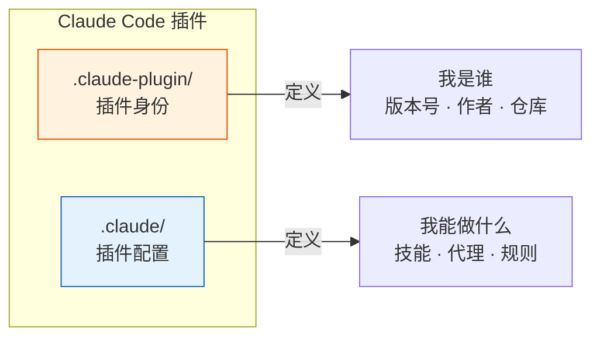
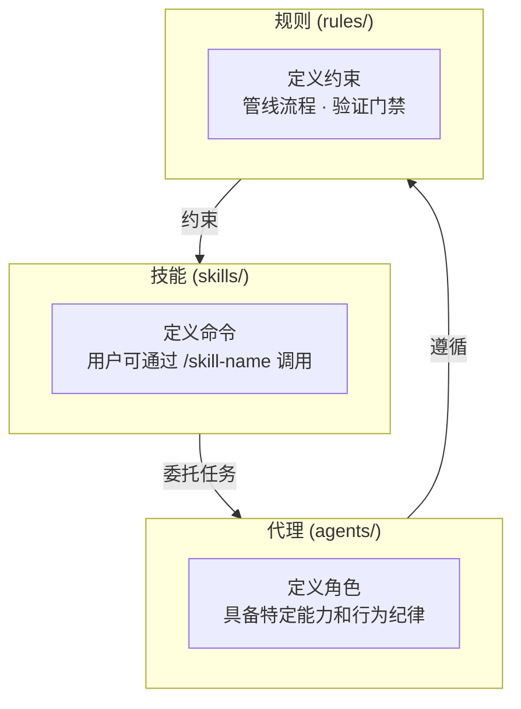

# 插件管理入门指南

> Claude Code 插件体系的基础概念。读完本文你将理解：插件是什么、如何定义插件身份、插件与技能/代理/规则的关系。

## 1. 什么是 Claude Code 插件

Claude Code 插件是一个可复用的功能包。它用**规约文件**（markdown + JSON）定义一组技能、代理和规则，安装后 Claude Code 就能获得新的命令和能力。

插件由两个目录构成：



| 目录 | 作用 | 管理命令 |
|------|------|---------|
| `.claude-plugin/` | 插件身份定义（名称、版本、市场信息） | `/rui-plugin` |
| `.claude/` | 插件配置（技能、代理、规则） | `/rui-claude` |

## 2. plugin.json — 插件的身份证

`plugin.json` 告诉 Claude Code "这个插件是谁"：

| 字段 | 含义 | 必填 | 示例 |
|------|------|:---:|------|
| `name` | 插件唯一标识名 | ✅ | `"yry"` |
| `description` | 一句话描述插件功能 | ✅ | `"故事驱动的 SDLC 编排系统"` |
| `version` | 语义化版本号 `x.y.z` | ✅ | `"1.4.0"` |
| `author` | 作者信息（含 name） | ✅ | `{ "name": "YrY" }` |
| `repository` | 源码仓库 URL | ✅ | `"https://github.com/effiy/YrY"` |
| `keywords` | 分类标签数组 | ✅ | `["sdlc", "agent", "pipeline"]` |
| `license` | 开源许可证 | ✅ | `"MIT"` |

### 版本号规范

**三段式 semver**：`主版本.次版本.修订版本`

- 主版本：不兼容的 API 变更（如 `2.0.0`）
- 次版本：向后兼容的新功能（如 `1.4.0`）
- 修订版本：向后兼容的 bug 修复（如 `1.3.9`）

版本号在项目中出现在 4 个位置：
1. `CLAUDE.md` 项目画像表
2. `.claude-plugin/plugin.json`
3. `.claude-plugin/marketplace.json` 的 `metadata.version`
4. `.claude-plugin/marketplace.json` 的 `plugins[0].version`

**四者必须一致**。可以用 `/rui-plugin validate` 一键校验。

## 3. 插件的能力三件套

一个插件的实际功能由 `.claude/` 下的三种文件定义：



| 类型 | 所在目录 | 作用 | 例子 |
|------|---------|------|------|
| 技能 (Skill) | `skills/<name>/SKILL.md` | 定义用户可调用的命令 | `/rui` — 故事驱动的开发管线 |
| 代理 (Agent) | `agents/<name>.md` | 定义 AI 角色及其行为 | `pm` — 产品经理，拆分需求 |
| 规则 (Rule) | `rules/<name>.md` | 定义流程和约束 | `code-pipeline` — 分支隔离 + Gate A/B |

## 4. 插件管理三命令

| 命令 | 管理范围 | 做什么 |
|------|---------|--------|
| `/rui-plugin` | `.claude-plugin/` | 版本校验 · 升级 · 健康分析 · 发布准备 |
| `/rui-claude` | `.claude/` | 配置同步 · 健康分析 · 操作历史 · 需求管线 |
| `/rui` | 整个项目 | 故事驱动的 SDLC 编排 |

## 5. 快速上手

```bash
# 1. 检查插件健康状态
node skills/rui-plugin/health.mjs

# 2. 校验版本一致性
node skills/rui-plugin/validate.mjs

# 3. 查看 .claude/ 配置健康度
# /rui-claude retro

# 4. 同步远端团队配置
# /rui-claude sync
```

## 下一步

- [进阶指南](./插件管理-进阶指南.md) — 版本管理与发布流程
- [领域语言](../README.md#领域语言) — 项目的术语定义
