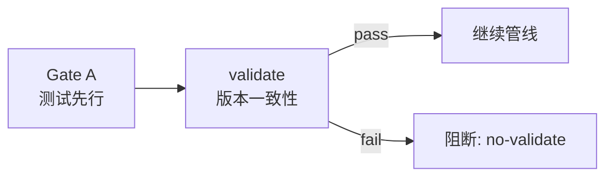

# 插件管理精通指南

> 插件 CI/CD 集成、版本漂移自动检测、自定义 hook 扩展。读完本文你将能：将插件校验集成到 CI 流水线、配置 pre-commit hook 防版本漂移、扩展健康检查维度。

## 1. CI/CD 集成

### 1.1 GitHub Actions

```yaml
# .github/workflows/plugin-check.yml
name: Plugin Health Check

on:
  pull_request:
    branches: [main]
  push:
    branches: [main]

jobs:
  plugin-health:
    runs-on: ubuntu-latest
    steps:
      - uses: actions/checkout@v4
      - uses: actions/setup-node@v4
        with:
          node-version: 18
      - name: Version consistency
        run: node skills/rui-plugin/validate.mjs
      - name: Plugin health
        run: node skills/rui-plugin/health.mjs
      - name: Publish readiness
        run: node skills/rui-plugin/publish-prep.mjs
```

### 1.2 Pre-commit Hook

```bash
# .git/hooks/pre-commit (或使用 husky)
#!/bin/sh
# 阻止版本不一致的提交
node skills/rui-plugin/validate.mjs
if [ $? -ne 0 ]; then
  echo "❌ 版本不一致，提交被阻止。请运行 node skills/rui-plugin/validate.mjs 查看详情。"
  exit 1
fi
```

### 1.3 集成到 rui 管线

rui 管线可在 Gate A 阶段自动调用 validate：



## 2. 版本漂移检测与修复

### 2.1 漂移场景

| 场景 | 原因 | 检测方式 |
|------|------|---------|
| 手动修改 plugin.json 但忘记同步 CLAUDE.md | 人工操作遗漏 | `validate` 即时发现 |
| 合并冲突后版本号不一致 | 合并时只解决了一处冲突 | `validate` 即时发现 |
| marketplace.json 中两处版本不同步 | bump 未覆盖 marketplace | `health` 的 marketplace 维度 |
| 新文件加入但 version-sources.json 未更新 | 新增版本声明位置 | 需手动更新 sources 配置 |

### 2.2 版本声明位置可扩展

`version-sources.json` 是声明式配置，新增版本声明位置只需追加一条：

```json
{
  "sources": [
    // ...现有 4 条...
    {
      "file": "CHANGELOG.md",
      "field": "regex:## \\[(\\d+\\.\\d+\\.\\d+)\\]",
      "label": "CHANGELOG.md (latest)"
    }
  ]
}
```

支持两种提取方式：
- **JSON 字段路径**：`"field": "version"` 或 `"field": "metadata.version"` 或 `"field": "plugins[0].version"`
- **正则匹配**：`"field": "regex:<pattern>"`，第一个捕获组为版本号

## 3. 自定义健康检查维度

health.mjs 采用 checker 模式，每个维度是独立函数。新增检查维度只需：

```javascript
// 在 health.mjs 中添加新的 checker 函数
function checkChangelogHasVersion() {
  const p = path.join(ROOT, 'CHANGELOG.md');
  if (!fs.existsSync(p)) {
    return [status('WARN', 'changelog: CHANGELOG.md not found')];
  }
  const raw = fs.readFileSync(p, 'utf-8');
  const match = raw.match(/## \[(\d+\.\d+\.\d+)\]/);
  if (!match) {
    return [status('WARN', 'changelog: no version header found')];
  }
  return [status('PASS', `changelog: latest version ${match[1]}`)];
}

// 在 main() 的 allResults 数组中追加
{ dimension: 'changelog version', checks: checkChangelogHasVersion() },
```

## 4. 自定义 Hook 集成

### 4.1 在 CLAUDE.md 中配置 Stop Hook

利用 Claude Code 的 hook 机制，在特定事件触发时自动执行插件校验：

```json
// .claude/settings.json
{
  "hooks": {
    "PostToolUse": [
      {
        "matcher": "Edit|Write",
        "hooks": [{
          "type": "command",
          "command": "node skills/rui-plugin/validate.mjs"
        }]
      }
    ]
  }
}
```

### 4.2 在 rui 管线中作为门禁

在 `rules/code-pipeline.md` 中追加 Gate 检查项：

| Gate | 检查项 | 命令 | 阻断标识 |
|------|--------|------|---------|
| Gate A | 版本一致性 | `node skills/rui-plugin/validate.mjs` | `no-validate` |
| Gate B | 插件健康 | `node skills/rui-plugin/health.mjs` | `unhealthy-plugin` |
| Gate B | 发布就绪 | `node skills/rui-plugin/publish-prep.mjs` | `not-ready-to-publish` |

## 5. 故障排查

### 常见问题

| 症状 | 可能原因 | 解决 |
|------|---------|------|
| validate 报 "file not found" | 文件被删除或路径变更 | 检查 version-sources.json 中的 file 路径 |
| validate 报 "regex no match" | CLAUDE.md 格式变更 | 更新 version-sources.json 中的 regex 模式 |
| bump 报 "dirty state" | 工作区有未提交变更 | `git stash` → bump → `git stash pop` |
| health 报 marketplace.json 错误 | marketplace 结构不符合预期 | 对照 [进阶指南](./插件管理-进阶指南.md#2-marketplacejson--市场发现配置) 中的 schema |
| bump 中途失败后文件不一致 | 临时文件残留 | 删除 `*.bump-tmp` 文件，手动检查 |

### 验证命令速查

```bash
# 版本一致性
node skills/rui-plugin/validate.mjs

# 统一升级到新版本
node skills/rui-plugin/bump.mjs <x.y.z>

# 插件健康分析
node skills/rui-plugin/health.mjs

# 发布准备检查
node skills/rui-plugin/publish-prep.mjs
```

## 参考

- [入门指南](./插件管理-入门指南.md)
- [进阶指南](./插件管理-进阶指南.md)
- [rui-plugin SKILL.md](../skills/rui-plugin/SKILL.md)
- [version-sources.json](../skills/rui-plugin/version-sources.json)
