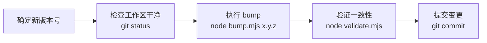
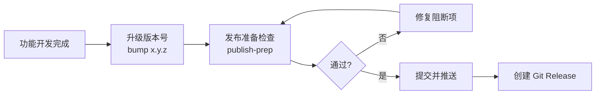

# 插件管理进阶指南

> 掌握版本管理、市场配置和发布流程。读完本文你将能：统一升级版本号、维护 marketplace.json、完成发布前检查。

## 1. 版本管理全流程

### 1.1 版本号在哪里

项目中版本号出现在 4 个位置，由 `version-sources.json` 配置管理：

| # | 位置 | 路径 | 字段 |
|---|------|------|------|
| 1 | 项目画像 | `CLAUDE.md` | `\| 版本 \| x.y.z \|` |
| 2 | 插件身份 | `.claude-plugin/plugin.json` | `version` |
| 3 | 市场元数据 | `.claude-plugin/marketplace.json` | `metadata.version` |
| 4 | 市场插件列表 | `.claude-plugin/marketplace.json` | `plugins[0].version` |

### 1.2 版本升级步骤



```bash
# 升级到 1.4.0
node skills/rui-plugin/bump.mjs 1.4.0

# 验证
node skills/rui-plugin/validate.mjs
# → PASS — all 4 sources agree on version 1.4.0

# 提交
git add -A
git commit -m "bump version to 1.4.0"
```

### 1.3 升级的安全保障

bump 命令有三重保护：

| 保护层 | 检查内容 | 失败退出码 |
|--------|---------|-----------|
| 格式校验 | 目标版本号必须匹配 `/^\d+\.\d+\.\d+$/` | 1 |
| 前置检查 | 工作区必须干净（无未提交变更） | 2 |
| 原子写入 | 四处全部更新，任一失败则回滚 | 3 |

## 2. marketplace.json — 市场发现配置

`marketplace.json` 定义插件在市场中如何被发现和展示：

```json
{
  "name": "插件名",
  "owner": { "name": "作者" },
  "metadata": {
    "description": "简短描述",
    "version": "1.0.0"
  },
  "plugins": [{
    "name": "插件名",
    "source": {
      "source": "github",
      "repo": "owner/repo"
    },
    "description": "详细描述",
    "version": "1.0.0",
    "author": { "name": "作者" },
    "category": "ai",
    "keywords": ["tag1", "tag2"],
    "license": "MIT",
    "repository": "https://github.com/owner/repo"
  }]
}
```

### 关键约束

| 约束 | 规则 |
|------|------|
| 版本一致性 | `metadata.version` 必须等于 `plugins[0].version` |
| 与 plugin.json 对齐 | marketplace 中的 version 必须与 plugin.json 的 version 一致 |
| keywords | 用于市场分类和搜索，建议 3-6 个 |

## 3. 发布 Checklist

### 3.1 发布前自动检查

```bash
# 一键检查所有发布前置条件
node skills/rui-plugin/publish-prep.mjs
```

检查维度：
- 版本一致性（四处声明一致）
- plugin.json 必填字段完整
- marketplace.json 存在且有效
- README.md 和 CLAUDE.md 存在

### 3.2 发布前手动确认清单

| # | 检查项 | 验证方式 |
|---|--------|---------|
| 1 | 所有变更已提交 | `git status` |
| 2 | 文档已更新（README/CHANGELOG） | 人工确认 |
| 3 | 版本号已升级 | `node skills/rui-plugin/validate.mjs` |
| 4 | 健康分析通过 | `node skills/rui-plugin/health.mjs` |
| 5 | 发布准备检查通过 | `node skills/rui-plugin/publish-prep.mjs` |
| 6 | 已推送到远端 | `git push` |

### 3.3 发布流程



## 4. 健康分析解读

```bash
node skills/rui-plugin/health.mjs
```

输出三类结果：

| 级别 | 图标 | 含义 | 处理 |
|------|------|------|------|
| PASS | ✅ | 检查通过 | 无需处理 |
| WARN | ⚠️ | 建议改进，不阻断 | 尽快修复 |
| ERROR | ❌ | 必须修复 | 发布前必须清零 |

### 检查维度

1. **plugin.json 完整性** — 7 个必填字段是否齐全
2. **marketplace.json 有效性** — 结构完整、版本一致
3. **版本一致性** — 四处声明是否一致
4. **必需目录** — skills/ agents/ rules/ 目录是否存在

## 下一步

- [精通指南](./插件管理-精通指南.md) — CI/CD 集成与自动化
- [rui-plugin SKILL](../skills/rui-plugin/SKILL.md) — 技能规约完整参考
