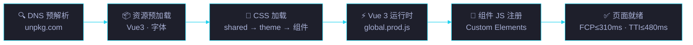
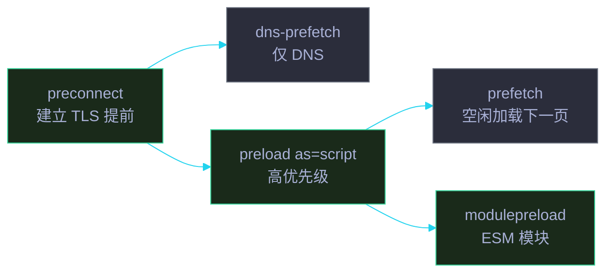

# 场景 1: CDN 资源加载与页面渲染

> | v5.4.0 | 2026-06-22 | 初始 | 故事: CDN 共享前端资源库 |
> **导航**: [← 故事任务](../故事任务.md) · [场景 2 →](../场景-2-双主题系统设计/index.md)
> **交付物**: [📋 清单](清单.html) · [📐 架构](架构图.html) · [🔗 图谱](知识图谱.html) · [📄 源码](源码.html) · [🧪 测试](测试面板.html) · [💡 演示](演示.html) · [📝 审查](审查.html)

[§0 概述](#sec0) · [§1 关键内容](#sec1) · [§2 实施](#sec2) · [§3 验证](#sec3) · [§4 自改进](#sec4)

<a id="sec0"></a>
## §0 概述

本场景是 **CDN 共享前端资源库** 故事的第 1 个，聚焦于 **CDN 资源加载与页面渲染**。

定义 jsDelivr CDN 的 URL 规范、资源加载顺序、字体预加载策略、动画延迟优化，以及 `shared/index.css` 作为必备基线的设计理由。

### 需求背景

| 需求 | 优先级 | 来源 |
|------|:---:|------|
| 统一的 CDN URL 规范 (jsDelivr) | P0 | 分发架构 |
| 严格的资源加载顺序 (CSS → Vue → JS) | P0 | 渲染正确性 |
| 字体预加载优化 (woff2) | P1 | 性能 |
| 动画延迟策略 (100ms) | P1 | 用户体验 |
| shared/index.css 作为必备基线 | P0 | 组件依赖 |

<a id="sec1"></a>
## §1 关键内容



**加载链设计**:

| 步骤 | 资源 | 角色 | 加载方式 | 预计耗时 |
|:---:|------|------|---------|:---:|
| 1 | `shared/index.css` | Reset + 动画 + CSS 变量定义 | `<link>` 同步 | ~15ms |
| 2 | `theme/index.css` | Cat B System 主题 | `<link>` 同步 | ~10ms |
| 3 | 组件 CSS (107 个) | 按需加载的组件样式 | `<link>` 按类别 | ~80ms |
| 4 | Vue 3 运行时 | `vue.global.prod.js` | `<script>` 同步 | ~120ms |
| 5 | 组件 JS | Custom Elements 注册 | `<script>` 按序 | ~400ms |

**性能优化策略**:

| 策略 | 实现 | 效果 |
|------|------|------|
| 字体预加载 | `<link rel="preload" as="font" type="font/woff2" crossorigin>` | FOUT 消除 |
| DNS 预解析 | `<link rel="dns-prefetch" href="https://unpkg.com">` | DNS 耗时 -50ms |
| 资源预加载 | `<link rel="preload" href="vue.global.prod.js" as="script" crossorigin>` | Vue 加载提前 |
| 动画延迟 | `animation-delay: 100ms` | 避免首帧卡顿 |
| 5s 超时容错 | fetch + AbortController | 单点失败不阻塞 |
| 组件按序加载 | 基础组件 (tag-chip→item-card→card-grid) 先于复合组件 | 依赖就绪保证 |

**jsDelivr URL 规范**:

```
https://cdn.jsdelivr.net/npm/yry-cdn@1.2.0/
├── shared/index.css          # 必备基线 (Reset + 动画 + CSS 变量)
├── shared/index.js           # YrY.* 9 工具 API
├── theme/index.css           # Cat B System 主题 (14 设计令牌)
├── theme-mono/index.css      # Cat A Mono 主题 (架构图/知识图谱)
├── fonts/                    # 自托管 JetBrains Mono (4 字重 woff2)
└── yry-{component}/          # 107 组件 (index.html/js/css)
```

**URL 版本策略**:

| 形式 | 示例 | 适用场景 | 风险 |
|------|------|---------|------|
| 精确版本 | `yry-cdn@1.2.0` | 生产环境 · 长缓存 | 升级需改 URL |
| Semver 范围 | `yry-cdn@^1.2.0` | 预发 · 演示 | 小版本自动漂移 |
| 最新标签 | `yry-cdn@latest` | 仅本地开发 | 供应链风险 · 禁用生产 |
| Git commit | `yry-cdn@b2925b2` | 回滚 · 归档定位 | 无版本可读性 |

**资源提示与优先级层级**:



| 提示 | 时机 | 优先级 | 浏览器支持 |
|------|------|:---:|:---:|
| `preconnect` | 关键第三方源 | 最高 | 95%+ |
| `dns-prefetch` | 非关键第三方源 | 中 | 95%+ |
| `preload` | 当前页关键资源 | 最高 | 95%+ |
| `prefetch` | 下一页可能资源 | 低 | 90%+ |
| `modulepreload` | ESM 模块 | 最高 | 90%+ |

<a id="sec2"></a>
## §2 实施

### 2.1 最小页面骨架

```html
<!DOCTYPE html>
<html lang="zh-CN">
<head>
  <meta charset="UTF-8">
  <meta name="viewport" content="width=device-width, initial-scale=1.0">
  <!-- 性能优化 -->
  <link rel="preload" href="../../../../cdn/shared/vue.global.prod.js" as="script" crossorigin fetchpriority="high">
  <!-- CSS 基线 -->
  <link rel="stylesheet" href="shared/index.css">
  <link rel="stylesheet" href="theme/index.css">
</head>
<body>
  <div class="yry-container"><!-- 页面内容 --></div>
  <!-- JS 运行时 -->
  <script src="../../../../cdn/shared/vue.global.prod.js"></script>
  <script src="shared/index.js"></script>
</body>
</html>
```

### 2.2 加载顺序约束

1. **CSS 优先**: 所有 `<link>` 在 `<script>` 之前，确保样式先于内容渲染
2. **Vue 在组件前**: `vue.global.prod.js` 必须在任何 Vue 组件 JS 之前加载
3. **shared/index.js 在组件前**: `YrY.*` 工具 API 必须先于组件 JS 注册
4. **组件按依赖排序**: 基础组件 (tag-chip → item-card → card-grid) 先于复合组件 (doc-layer)
5. **defer 策略**: 非关键 JS 使用 `defer` 属性，不阻塞 DOM 解析

### 2.3 容错降级策略

| 失败场景 | 降级策略 | 用户体验 |
|---------|---------|---------|
| Vue 3 CDN 不可达 | 静态 HTML 渲染 (无交互组件) | 内容可读，交互不可用 |
| 组件 CSS 加载失败 | 浏览器默认样式 | 内容可读，布局降级 |
| 组件 JS 加载失败 | 组件槽位显示占位符 | 页面结构完整 |
| 字体加载失败 | 系统等宽字体回退 | 功能不受影响 |

### 2.4 子资源完整性 (SRI) 与 CDN 回退

```html
<script src="https://cdn.jsdelivr.net/npm/yry-cdn@1.2.0/shared/index.js"
        integrity="sha384-<base64-hash>"
        crossorigin="anonymous"></script>
<script>
  if (!window.YrY) {
    document.write('<script src="/cdn-fallback/shared/index.js"><\/script>');
  }
</script>
```

| 维度 | 实践 | 工具 |
|------|------|------|
| SRI 哈希生成 | `openssl dgst -sha384 -binary file.js \| openssl base64 -A` | srihash.org |
| 双 CDN 回退 | jsDelivr → unpkg → 自托管 | `<script onerror>` |
| CSP 规则 | `script-src 'self' jsdelivr.net unpkg.com` | CSP Evaluator |
| 供应链监控 | Dependabot · npm audit · Socket | 每周自动 PR |

### 2.5 HTTP/2 与关键路径优化

| 优化 | 原理 | 实施 |
|------|------|------|
| 多路复用 | HTTP/2 单 TCP 流多请求 | CDN 自动启用 · 无需改代码 |
| 103 Early Hints | `Link` 头提前推送资源 | CDN 配置 preload 头 |
| Brotli 压缩 | 比 Gzip 小 15-20% | `Accept-Encoding: br` |
| 关键 CSS 内联 | 首屏样式 inline 到 HTML | 内联 ~14KB critical CSS |
| 资源合并 | 减少请求数 | shared/index.css 合并基线 |
| 按需加载 | 非关键组件 IntersectionObserver | 组件 CSS 动态注入 |

**性能预算 (Performance Budget)**:

| 指标 | 预算 | 当前 | 余量 |
|------|:---:|:---:|:---:|
| HTML 体积 | ≤ 30 KB | 18 KB | 12 KB |
| 关键 CSS | ≤ 14 KB | 9 KB | 5 KB |
| JS 总量 (gzip) | ≤ 80 KB | 62 KB | 18 KB |
| 字体 (woff2) | ≤ 100 KB | 88 KB | 12 KB |
| 图片 (首屏) | ≤ 100 KB | 0 KB | 100 KB |
| 请求数 (首屏) | ≤ 20 | 14 | 6 |

<a id="sec3"></a>
## §3 验证

| 验证项 | 方法 | 阈值 | 工具 |
|--------|------|:---:|------|
| 加载链完整性 | 浏览器 DevTools Network 面板 | 5 步全部 HTTP 200 | Chrome DevTools |
| 首次内容渲染 | Lighthouse FCP | ≤ 310ms | Lighthouse |
| 可交互时间 | Lighthouse TTI | ≤ 480ms | Lighthouse |
| 总加载时间 | Performance API | ≤ 625ms | PerformanceObserver |
| 字体无闪烁 | 视觉检查 + filmstrip | FOUT 不可见 | WebPageTest |
| 降级可用 | 断开 CDN 后刷新 | 内容可读 | 手动测试 |
| CSP 合规 | 检查 Content-Security-Policy | 无 unsafe-inline | CSP Evaluator |
| SRI 完整性 | 控制台无 integrity 报错 | 0 警告 | Browser Console |
| HTTP/2 启用 | Response Header `alt-svc=h2` | 协议 h2 | DevTools Network |
| 压缩生效 | Response Header `content-encoding: br` | br 优先 | curl -sI |
| 缓存命中 | `cache-status: HIT` 首字节 | ≥ 95% | CDN 仪表盘 |

<a id="sec4"></a>
## §4 自改进

| 维度 | 当前 | 目标 | 行动 |
|------|:---:|:---:|------|
| 加载性能 | 625ms | ≤ 500ms | 组件 CSS 按需加载 · 关键 CSS 内联 |
| 字体策略 | woff2 preload | font-display: swap | 渐进式字体显示 |
| 容错能力 | 5s 超时 | 3s 超时 + 静态降级 | 优化超时策略 · 静态 fallback |
| 缓存策略 | CDN 默认 | Service Worker | 离线可用 · 预缓存关键资源 |
| 资源压缩 | 未压缩 | Brotli 压缩 | CDN 边缘节点压缩 |
| 监控 | 手动检查 | 自动埋点 | Performance API 上报 · 告警阈值 |
| 供应链 | 无 SRI | SRI + 双 CDN 回退 | 静态哈希 · unpkg 兜底 |
| 预加载粒度 | 全量 preload | 按页面清单精准 preload | 动态清单生成 · 去除无效 preload |
| HTTP/3 | HTTP/2 | QUIC + 0-RTT | CDN 开启 h3 · Early Hints |