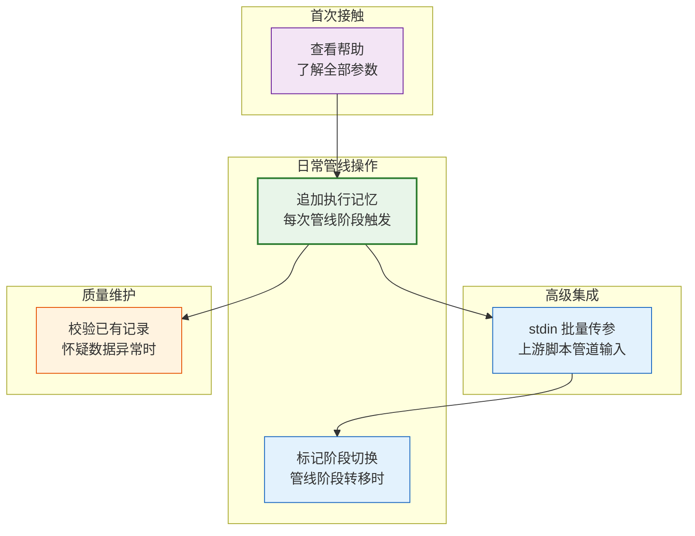
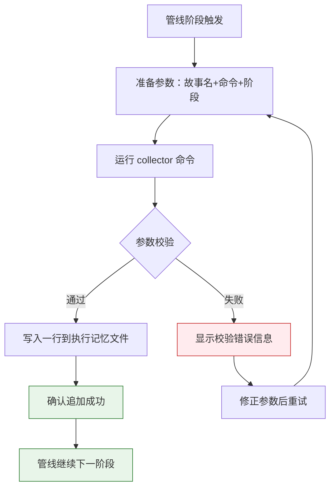
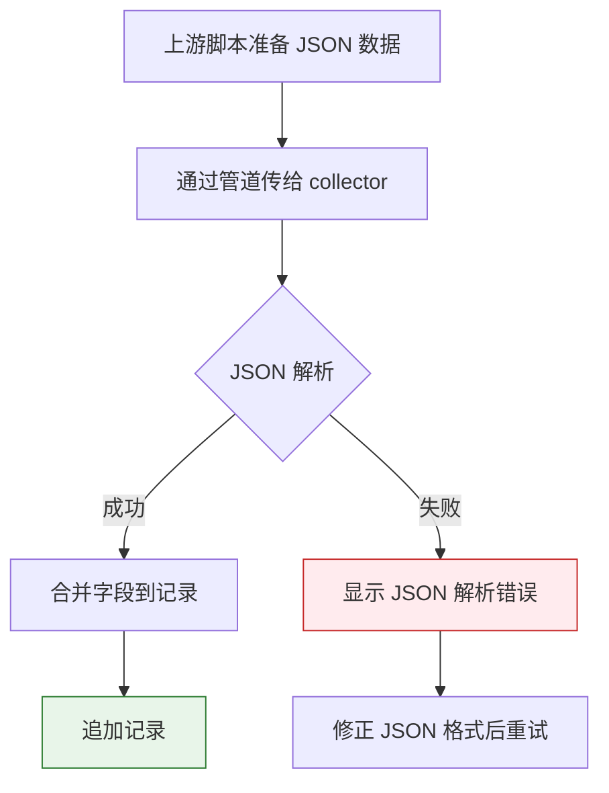
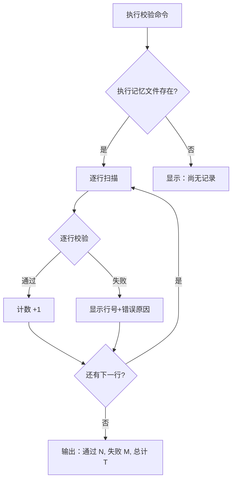
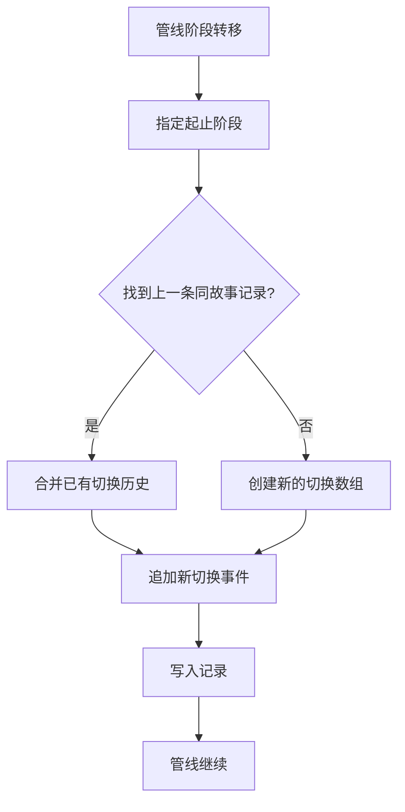

> | v1.0.0 | 2026-05-22 | deepseek-v4-pro | node .memory/collector.mjs | 🌿 feat/memory-collector-doc | 📎 [CLAUDE.md](../../../CLAUDE.md) |

> **导航**: [← YrY-故事任务](./YrY-故事任务.md) · [YrY-技术评审 →](./YrY-技术评审.md)

> **来源引用**: `/rui doc --from-code .memory-collector-doc`，基于 `YrY-故事任务.md` §1 Story 1 的用户操作

## §0 基线声明

> **用户空间基线 (User Space Baseline)**: 本文档定义"谁使用(WHO)"和"如何体验(HOW EXPERIENCE)"。所有交互设计(技术评审)、测试用例(测试设计)、验收标准(故事任务 §5)均必须覆盖本文档定义的每个场景。

### 主要价值

- 🎯 管线集成者一次学会全部命令，无需反复查源码
- 🔒 校验失败提供清晰错误提示，不会静默写入脏数据
- ⚡ stdin 管道集成让复杂参数传递变简单
- 📊 校验命令让数据质量可视化，从"猜测"到"确认"
- 🔄 阶段切换标记让执行时间线可追踪

---

## §1 场景全景

---

## §2 场景详述

### 场景 1: 追加执行记忆记录

| 角色 | 触发条件 | 核心目标 |
|------|---------|---------|
| 管线脚本编写者 | 管线阶段开始/结束/阻断时需要记录执行上下文 | 一次命令调用写入一条结构化记录，包含故事名、命令、阶段和变更等级 |

| # | 步骤 | 输入 | 系统响应 | 异常分支 |
|---|------|------|---------|---------|
| 1 | 使用者输入命令 | 故事名、触发命令、当前阶段 | 校验必填字段 | 缺少必填字段 → 显示缺失项列表，不写入 |
| 2 | 传入可选参数 | 变更等级、参与角色、上下文描述 | 合并到记录对象 | 变更等级值不在 T1/T2/T3 → 校验拒绝 |
| 3 | 写入记录 | 组装好的记录对象 | 文件末尾追加一行 JSON | 目录不存在 → 自动创建目录 |
| 4 | 确认结果 | — | 显示 "已追加: story=... stage=... session=..." | 文件写入失败 → 显示系统错误 |

**空状态**: 首次使用时 `.memory/` 目录和 `execution-memory.jsonl` 均不存在 → 自动创建目录和新文件。

**错误恢复**: 参数校验失败时显示具体缺失/无效字段 → 使用者修正参数后重试。

---

### 场景 2: 通过管道批量传入参数

| 角色 | 触发条件 | 核心目标 |
|------|---------|---------|
| 上游管线脚本 | 需要传入复杂结构化数据（质量问题列表、异常案例、额外字段） | 通过管道将 JSON 传给 collector，合并到记录中 |

| # | 步骤 | 输入 | 系统响应 | 异常分支 |
|---|------|------|---------|---------|
| 1 | 上游脚本输出 JSON | 含 feature/description/quality_issues 等字段的 JSON | 等待 stdin 输入 | — |
| 2 | 管道传入 collector | stdin JSON 字符串 | 解析并合并到记录对象 | JSON 格式错误 → 显示解析失败原因 |
| 3 | 确认写入 | 合并后的完整记录 | 追加到执行记忆文件 | — |

**空状态**: stdin 为空字符串 → 不报错，其他字段保持默认值。

**错误恢复**: JSON 解析失败时显示具体错误位置 → 上游脚本修正 JSON 格式后重新管道传入。

---

### 场景 3: 校验已有执行记忆

| 角色 | 触发条件 | 核心目标 |
|------|---------|---------|
| 数据质量管理者 | 怀疑执行记忆文件数据不完整或格式异常 | 一键扫描全部记录，输出通过/失败统计 |

| # | 步骤 | 输入 | 系统响应 | 异常分支 |
|---|------|------|---------|---------|
| 1 | 使用者执行校验命令 | `--validate` 标志 | 检查文件是否存在 | 文件不存在 → "尚无记录" |
| 2 | 读取并解析每行 | execution-memory.jsonl 全部内容 | 逐行 JSON 解析 + schema 校验 | 某行 JSON 无效 → 报告行号和解析错误 |
| 3 | 统计输出 | — | 显示 "校验完成: N 通过, M 失败, T 总计" | — |

**空状态**: 文件不存在或为空 → 显示提示信息，不报错。

**错误恢复**: 校验发现失败行 → 使用者根据行号和错误原因手动修复或删除问题行。

---

### 场景 4: 标记阶段切换

| 角色 | 触发条件 | 核心目标 |
|------|---------|---------|
| 管线编排者 | 管线从一个阶段转移到下一个阶段 | 在执行记忆中记录阶段切换事件，含时间戳 |

| # | 步骤 | 输入 | 系统响应 | 异常分支 |
|---|------|------|---------|---------|
| 1 | 指定切换起止阶段 | `--markPhase --phaseFrom=当前阶段 --phaseTo=目标阶段` | 查找该故事的上一笔执行记忆 | — |
| 2 | 合并阶段历史 | 上一笔记录的 phase_transitions | 追加新的切换事件（含时间戳） | 找不到上一笔 → 创建新数组 |
| 3 | 确认记录 | — | 追加到执行记忆文件 | — |

**空状态**: 首次记录阶段切换时没有历史 → 创建新的 `phase_transitions` 数组。

**错误恢复**: 找不到上一笔同故事记录 → 仍然正常写入，从空数组开始。

---

## §3 场景覆盖矩阵

| 场景 | FP# | AC# | 实现文档(技术评审) | 测试文档(测试设计) | 覆盖状态 | 备注 |
|------|-----|------|------------------|------------------|:--:|------|
| 场景 1: 追加记录 | FP1, FP6 | AC1, AC2 | §2 CLI 架构 | TC-N1, TC-E1 | 待生成 | 核心场景 |
| 场景 2: stdin 传参 | FP2 | AC4, AC5 | §2 CLI 架构 | TC-N2, TC-E2 | 待生成 | 高级集成 |
| 场景 3: 校验记录 | FP4 | AC6 | §2 CLI 架构 | TC-N3, TC-B1 | 待生成 | 质量维护 |
| 场景 4: 阶段切换 | FP3, FP5 | AC3 | §2 数据流 | TC-N4 | 待生成 | 时间线追踪 |

---

## §4 评审清单

| # | 检查项 | 状态 |
|---|--------|:--:|
| 1 | 场景数 ≥ 2 | ✅ 4 个 |
| 2 | 每场景有 mermaid 流程图 | ✅ |
| 3 | 覆盖全部 FP#（FP1–FP6） | ✅ |
| 4 | 每场景含异常分支 | ✅ |
| 5 | 无技术术语（API/组件/文件路径） | ✅ |
| 6 | 每场景含空状态描述 | ✅ |
| 7 | 每场景含错误恢复路径 | ✅ |
| 8 | 覆盖矩阵下游文档齐全 | ✅ |

---

## §5 体验基线

| 角色 | 核心旅程 | 情感目标 | 痛点解决 | 成功感知 | 关联场景 |
|------|---------|---------|---------|---------|---------|
| 管线脚本编写者 | 在管线每个阶段插入一行采集命令 | 感到基础设施可靠，不怕数据丢失 | 每次手工写日志格式不一致 → 一条命令统一格式 | 看到 "已追加" 确认信息 | 场景 1, 4 |
| 上游脚本开发者 | 将结构化数据通过管道传给 collector | 感到集成简单，不需要学习新协议 | 需要手动拼接长命令行参数 → 管道传 JSON | 校验通过，字段正确写入 | 场景 2 |
| 数据质量管理者 | 定期检查执行记忆数据完整性 | 感到数据可控，能快速定位问题 | 不知道数据是否有效 → 一键校验全量扫描 | 看到 "N 通过, M 失败" 统计 | 场景 3 |

---

> | 日期 | 变更 | 触发 | 证据 |
> |------|------|------|------|
> | 2026-05-22 | 初始生成 | `/rui doc --from-code .memory-collector-doc` | `YrY-故事任务.md` §1 |
