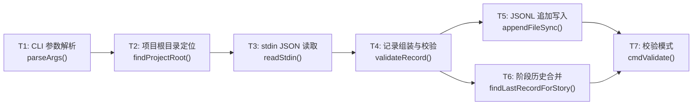
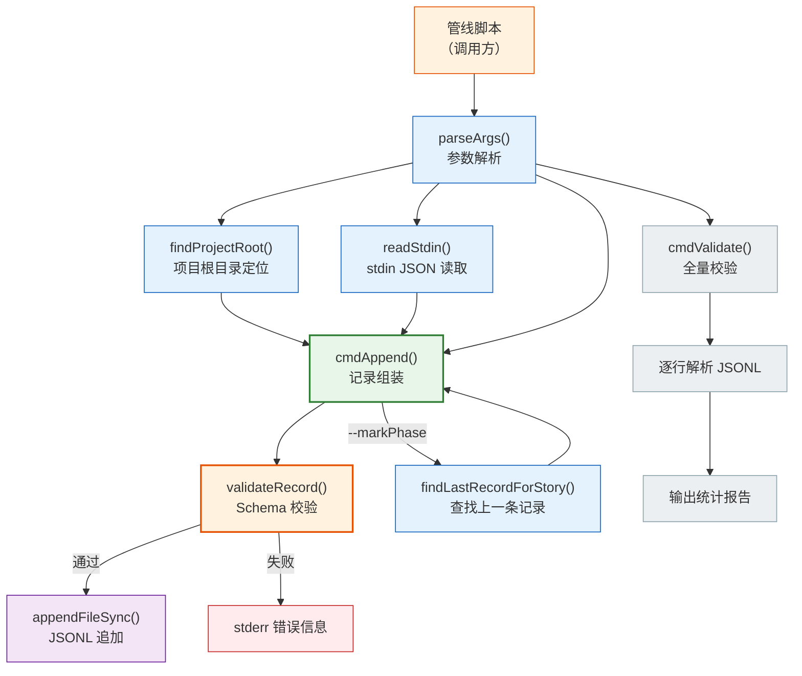
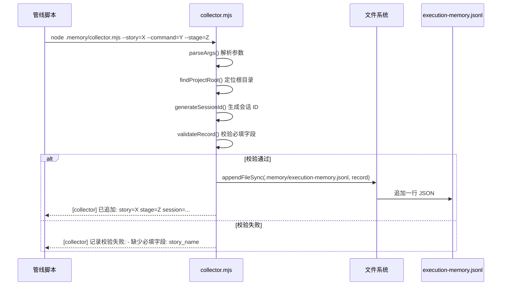

> | v1.0.0 | 2026-05-22 | deepseek-v4-pro | node .memory/collector.mjs | 🌿 feat/memory-collector-doc | 📎 [CLAUDE.md](../../../CLAUDE.md) |

> **导航**: [← YrY-使用场景](./YrY-使用场景.md) · [YrY-测试设计 →](./YrY-测试设计.md) · [YrY-安全审计 →](./YrY-安全审计.md)

> **来源引用**: `/rui doc --from-code .memory-collector-doc`，源码 `.memory/collector.mjs:1-306`

### 主要价值

- 🎯 零外部依赖：纯 Node.js 标准库，永远可独立运行
- 🔒 Schema 校验护栏：16 字段必填+枚举校验，脏数据不入库
- ⚡ 管道即集成：stdin JSON 让复杂结构化数据传参变一行命令
- 📊 确定性追加：相同输入确定相同输出（timestamp/session_id 除外），数据可审计
- 🔄 阶段可追踪：阶段切换事件自动合并历史，执行时间线完整

## §0 设计决策与任务规划

### §0.0 基线溯源

| 本设计章节 | 实现 故事任务 | 服务 使用场景 | 覆盖状态 |
|-----------|-------------|-------------|:--:|
| §1 系统架构 | FP1–FP6 全部功能点 | 场景 1–4 全部用户操作 | ✅ |
| §2 数据流与处理模型 | FP1 追加记录, FP2 stdin 合并 | 场景 1, 2 | ✅ |
| §7 安全约束 | R1–R5 校验规则 | 场景 1 异常分支, 场景 2 错误恢复 | ✅ |
| §8 性能与限制 | FP3 阶段切换, R4 确定性追加 | 场景 4 | ✅ |

### §0.1 设计决策

| 决策领域 | 选定方案 | 选择理由 | 详见 | 实现 FP# |
|---------|---------|---------|------|---------|
| 数据格式 | JSONL（每行一个 JSON 对象） | 追加友好，无需重写整个文件；支持逐行流式读取 | §2 | FP1 |
| Schema 校验 | 运行时枚举+必填字段检查（非 JSON Schema） | 简单直接，零外部依赖，16 字段完全枚举 | §2 | FP1, R1–R3 |
| stdin 集成 | 管道传入 JSON → `_extra` 展开合并 | 避免命令行参数长度限制；支持任意嵌套结构 | §2 | FP2 |
| 阶段切换查找 | 倒序扫描 JSONL 找同 story 最近记录 | 简单可靠；当前数据规模下性能可接受 | §2 | FP3 |
| 项目根目录发现 | 向上遍历查找 `.git` 或 `.claude` 标记 | 与 rui 管线约定一致；无需额外配置 | §1 | FP6 |
| 进程退出码 | 所有路径 `process.exit(0)` | 不中断管线流程；错误通过 stderr 信息传递 | §2 | R5 |

### §0.2 任务规划

| ID | 描述 | 工作量 | 依赖 | 交付物 | Agent | 门禁 | 交接下游 | 实现 FP# |
|----|------|:--:|------|--------|-------|------|---------|---------|
| T1 | CLI 参数解析（11 个选项 + `--stdin`/`--validate` 标志） | S | — | `parseArgs()` 函数 | coder | 单元测试 | T2 | FP1, FP4 |
| T2 | 项目根目录定位 | S | — | `findProjectRoot()` 函数 | coder | 集成测试 | T4 | FP6 |
| T3 | stdin JSON 异步读取 | S | — | `readStdin()` 函数 | coder | 单元测试 | T4 | FP2 |
| T4 | 16 字段记录组装 + 必填校验 | M | T1, T2, T3 | `cmdAppend()` 函数 | coder | Gate A | T5, T7 | FP1 |
| T5 | JSONL 确定性追加 | S | T4 | `appendFileSync()` 调用 | coder | 集成测试 | 下游消费者 | FP1 |
| T6 | 阶段切换历史合并 | S | T5 | `findLastRecordForStory()` 函数 | coder | 集成测试 | T4 | FP3 |
| T7 | 全量校验模式 | S | — | `cmdValidate()` 函数 | coder | 单元测试 | 数据质量管理 | FP4 |

---

## §1 系统架构

### 效果示意

### 1.1 模块/文件

| 变更类型 | 模块/文件 | 职责 |
|:--:|------|------|
| 现有 | `.memory/collector.mjs` | CLI 入口，6 个函数，306 行 |
| 现有 | `.memory/execution-memory.jsonl` | 执行记忆数据文件（JSONL 格式，逐行追加） |

**函数职责**：

| 函数 | 类型 | 职责 |
|------|------|------|
| `parseArgs()` | 参数解析 | 解析 11 个选项 + 3 个布尔标志，返回配置对象 |
| `findProjectRoot()` | 环境感知 | 向上遍历目录树查找项目根目录 |
| `validateRecord()` | 校验 | 必填字段 + 枚举值校验，返回错误列表 |
| `generateSessionId()` | 工具 | 生成 `YYYYMMDDHHmmss` 格式会话 ID |
| `readStdin()` | I/O | 异步读取 stdin，解析 JSON |
| `cmdAppend()` | 核心 | 组装记录 → 校验 → 追加写入（默认命令） |
| `findLastRecordForStory()` | 查询 | 倒序扫描 JSONL 找指定 story 的最近记录 |
| `cmdValidate()` | 维护 | 逐行校验 JSONL 全部记录，输出统计 |
| `main()` | 入口 | 分发到 `cmdAppend()` 或 `cmdValidate()` |

### 1.2 通信通道

| 通道 | 方向 | 协议 | Payload | 错误处理 |
|------|------|------|---------|---------|
| CLI → collector | 入站 | `process.argv` 字符串数组 | 参数键值对（`--key=value`） | 未识别参数静默忽略 |
| stdin → collector | 入站 | 管道文本流 | JSON 字符串 | JSON 解析失败 → stderr + exit(0) |
| collector → JSONL | 出站 | `appendFileSync()` | JSON 一行 + `\n` | 文件系统错误 → 异常抛出到 main() catch |
| collector → 调用方 | 出站 | stdout/stderr 文本 | 成功确认 或 校验错误列表 | — |

---

## §7 安全约束

| # | 威胁 | 信任边界 | 缓解措施 | 优先级 |
|---|------|---------|---------|:--:|
| 1 | 恶意 JSON 注入 stdin | stdin → JSON.parse() → 记录字段 | `JSON.parse()` 仅接受合法 JSON；`_extra` 展开不执行代码 | P0 |
| 2 | 命令行参数注入 | process.argv → 记录字段 | 字符串直接赋值，不执行 eval | P0 |
| 3 | 敏感环境变量泄露到记录 | `process.env.SESSION_ID` / `process.env.CLAUDE_MODEL` → 记录字段 | 仅读取指定环境变量；不写入密钥/Token | P0 |
| 4 | JSONL 文件被外部进程篡改 | 文件系统 → 校验 | `--validate` 逐行解析，异常行被识别 | P1 |
| 5 | 大 stdin 输入导致内存耗尽 | stdin → `readStdin()` → 内存字符串 | Node.js 默认流背压；可加大小上限（当前未实施） | P2 |

---

## §8 性能与限制

| 维度 | 约束 | 应对 |
|------|------|------|
| 写入延迟 | `appendFileSync()` 同步阻塞，单次写入 < 1ms（典型 JSONL 行约 500B） | 管线为串行模型，阻塞写入可接受 |
| JSONL 文件增长 | 每次追加一行，无内置轮转 | 当前项目规模（< 1000 次管线执行）下无风险；长期需外部日志轮转 |
| 倒序扫描 | `findLastRecordForStory()` 全文件倒序线性扫描 | 记录数 < 1万时性能可接受（< 10ms）；后续可加内存索引 |
| 并发 | 单进程模型，无并发控制 | 当前管线架构保证串行执行 |
| 依赖 | 仅 `node:path` + `node:fs`，零外部依赖 | 永远可独立运行 |

---

## §9 评审清单

| # | 检查项 | 状态 |
|---|--------|:--:|
| 1 | 效果示意 mermaid 图完整 | ✅ |
| 2 | 基线溯源覆盖全部 FP# 和场景 | ✅ |
| 3 | 设计决策有明确理由 | ✅ |
| 4 | 任务规划依赖关系清晰 | ✅ |
| 5 | 安全约束覆盖信任边界 | ✅ |
| 6 | 性能限制有量化说明 | ✅ |
| 7 | 项目类型裁剪正确（meta：跳过 API/数据/组件/状态/交互/样式/DOM） | ✅ |
| 8 | 模块职责单一，函数边界清晰 | ✅ |

---

> | 日期 | 变更 | 触发 | 证据 |
> |------|------|------|------|
> | 2026-05-22 | 初始生成 | `/rui doc --from-code .memory-collector-doc` | `.memory/collector.mjs:1-306` |
