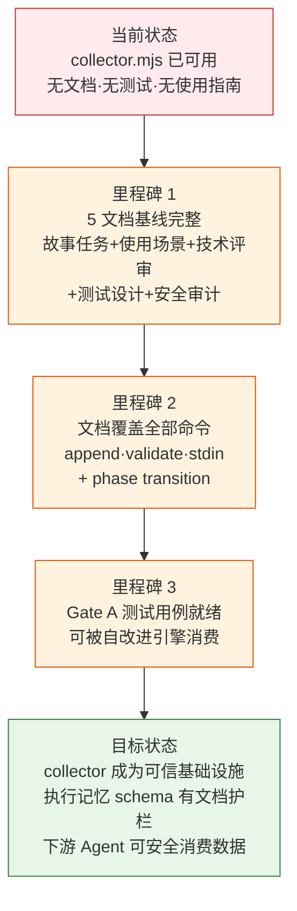
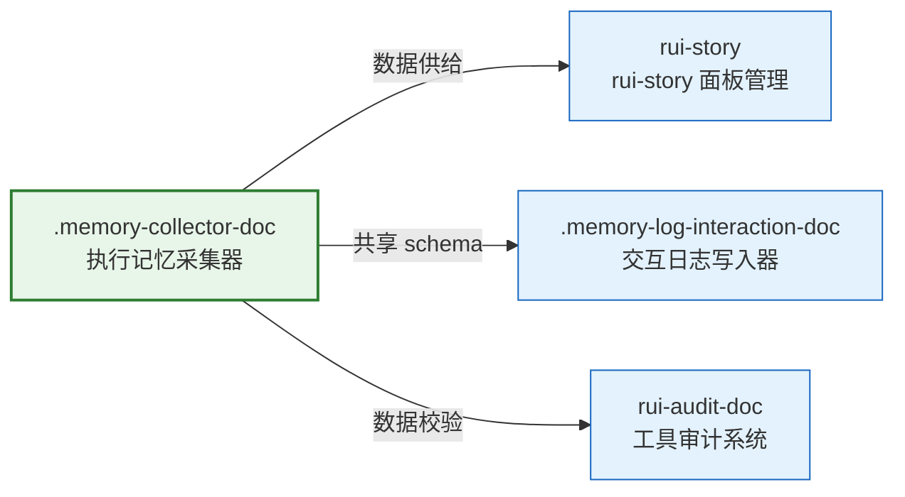

> | v1.0.0 | 2026-05-22 | deepseek-v4-pro | node .memory/collector.mjs | 🌿 feat/memory-collector-doc | 📎 [CLAUDE.md](../../../CLAUDE.md) |

> **导航**: [YrY-使用场景 →](./YrY-使用场景.md)

> **来源引用**: `/rui doc --from-code .memory-collector-doc`，源码 `.memory/collector.mjs` (306 行)

## §0 基线声明

> **问题空间基线 (Problem Space Baseline)**: 本文档定义"做什么(WHAT)"和"为什么(WHY)"。所有后续文档(03-09)的设计、实现、验证、改进决策均必须可追溯至本文档的具体章节。

### 需求概述

集中式执行记忆写入器 (`collector.mjs`) 是 rui 管线的持久化基础设施。每次管线执行时确定性地追加一条结构化记录到 `execution-memory.jsonl`，为自改进引擎 (D0-D7 诊断)、效果评估 (E1-E4)、工具审计 (`audit.mjs`) 和交互日志提供统一数据源。当前状态：脚本已可用但无文档基线，使用者只能读源码理解参数和数据契约。

### 效果示意

### 主要价值

- 📋 执行记忆持久化：每次管线执行可追溯，形成自改进数据闭环
- 🔒 Schema 校验护栏：16 字段强制校验，禁止脏数据进入 JSONL
- 🔗 自改进数据源：D0-D7 诊断引擎的唯一结构化数据输入端
- ⚡ 管线即插即用：`--stdin` 支持管道集成，无需修改现有管线脚本
- 📊 确定性追加：每次执行确定性地追加一条记录，同一会话内不重复

---

## §1 Story

### Story 1: 执行记忆采集器文档基线

| 字段 | 内容 |
|------|------|
| 作为 | rui 管线使用者和自改进引擎 |
| 我想要 | collector.mjs 有完整的文档基线（故事任务+使用场景+技术评审+测试设计+安全审计） |
| 以便 | 管线集成者有清晰的接口规约，自改进引擎有可靠的数据契约，新加入者无需读源码 |
| 优先级 | P0 |
| 范围边界 | 只读源码，生成文档到 `docs/故事任务面板/.memory-collector-doc/` |
| 依赖 | 源码 `.memory/collector.mjs` 可访问 |

#### 范围外

- 不修改 `collector.mjs` 源码
- 不新增功能或重构
- 不生成实施报告/测试报告/自改进复盘（属于 code 阶段产出）

##### §1.1 User Operations

| # | 操作 | 触发条件 | 操作步骤 | 预期结果 |
|---|------|---------|---------|---------|
| 1 | 追加执行记忆记录 | 管线阶段开始/结束/阻断时 | `node .memory/collector.mjs --story=<name> --command=<cmd> --stage=<stage>` | 一条 JSONL 记录追加到 `.memory/execution-memory.jsonl` |
| 2 | 批量设置字段 | 上游脚本输出 JSON 到 stdout 时 | `echo '{"feature":"..."}' \| node .memory/collector.mjs --stdin --story=<name>` | stdin JSON 字段合并到记录 |
| 3 | 校验已有记录 | 怀疑数据完整性时 | `node .memory/collector.mjs --validate` | 逐行校验，输出通过/失败/总计 |
| 4 | 记录阶段切换 | 管线阶段转移时 | `node .memory/collector.mjs --story=<name> --markPhase --phaseFrom=init --phaseTo=plan` | phase_transitions 数组追加切换事件 |

---

## §2 Requirements

### 功能点

| FP# | 描述 | 输入 | 输出 | 错误行为 | 优先级 |
|-----|------|------|------|---------|--------|
| FP1 | 追加记录（默认命令） | `--story` + `--command` + `--stage`（必填），可选 `--planned/--actual/--agents/--context/--blocked/--block-reason/--sessionId` | 一条 JSONL 行写入 `.memory/execution-memory.jsonl` | 必填字段缺失或值无效时校验失败，输出错误信息，不写入 | P0 |
| FP2 | stdin 批量输入 | stdin JSON 字符串 | 解析后字段合并到记录（`feature`/`description`/`update_context`/`quality_issues`/`bad_cases`/`_extra`） | JSON 解析失败时输出错误，不写入 | P0 |
| FP3 | 阶段切换标记 | `--markPhase` + `--phaseFrom` + `--phaseTo` | `phase_transitions` 数组追加 `{from, to, timestamp, duration_ms}` | 找不到上一条同 story 记录时创建新数组 | P1 |
| FP4 | 完整性校验 | `--validate` | 逐行解析 + schema 校验，输出通过/失败/总计 | 文件不存在或为空时输出提示信息 | P1 |
| FP5 | 会话 ID 生成 | `--sessionId` 未提供时 | 自动生成 `YYYYMMDDHHmmss` 格式的 session_id | 无 | P2 |
| FP6 | 项目根目录发现 | 当前目录或其祖先目录 | 查找含 `.git` 或 `.claude` 的最近目录 | 找不到时回退到当前目录 | P2 |

### 业务规则

| R# | 描述 | 校验方式 | 证据级别 |
|----|------|---------|---------|
| R1 | 必填字段（session_id/timestamp/story_name/command/stage）缺失时拒绝写入 | `validateRecord()` 函数检查 | A |
| R2 | planned_change_level 和 actual_change_level 值必须为 T1/T2/T3 | 枚举校验 `VALID_LEVELS` | A |
| R3 | stage 值必须在预定义列表中 | 枚举校验 `VALID_STAGES` | A |
| R4 | 每次追加是确定性的——相同输入产生相同记录（除 timestamp/session_id） | 记录结构固定 16 字段 | A |
| R5 | stdin JSON 解析失败时记录不写入 | try-catch 后 process.exit(0) | A |
| R6 | `--markPhase` 时读取上一条同 story 记录来追加 phase_transitions | `findLastRecordForStory()` 倒序遍历 JSONL | A |

### 数据约束

| 约束 | 类型 | 范围/格式 | 来源 |
|------|------|----------|------|
| story_name | string | 任意非空字符串（默认 "unknown"） | `--story` |
| command | string | rui 命令字符串（如 `/rui code user-login`） | `--command` |
| stage | enum | init/plan/impact_analysis/arch_design/doc_generation/pre_check/gate_a/implementation/verification/self_improve/delivery/update | `--stage` |
| session_id | string | `YYYYMMDDHHmmss` (14 位数字) | 自动生成或 `--sessionId` |
| planned_change_level | enum | T1/T2/T3 | `--planned` |
| actual_change_level | enum | T1/T2/T3 | `--actual` |
| quality_issues | object | `{ P0: string[], P1: string[], P2: string[] }` | stdin |
| phase_transitions | array | `[{ from, to, timestamp, duration_ms }]` | `--markPhase` |

---

## §3 成功标准

| SC# | 描述 | 度量方式 | 目标值 | 优先级 | 关联 FP# |
|-----|------|---------|--------|--------|---------|
| SC1 | 使用者在无文档情况下可通过帮助输出了解全部参数 | `node .memory/collector.mjs --help` 输出覆盖全部参数 | 100% 参数有说明 | P0 | FP1–FP4 |
| SC2 | 追加记录后 JSONL 文件末尾新增恰好一行有效 JSON | `tail -1 .memory/execution-memory.jsonl \| jq .` 通过 | 100% | P0 | FP1 |
| SC3 | 无效输入被拒绝，不产生脏数据 | 缺少 `--story` 时校验报错，JSONL 行数不变 | 100% 拦截 | P0 | FP1, R1 |
| SC4 | 使用者可通过 stdin 批量传参 | `echo '{"feature":"test"}' \| node .memory/collector.mjs --stdin --story=test` | feature 字段正确写入 | P0 | FP2 |
| SC5 | 校验命令能发现格式错误 | 手动插入一条缺字段的 JSONL 行后运行 `--validate` | 错误行被识别 | P1 | FP4 |

---

## §4 范围边界

### 范围内

| # | 条目 | 关联 FP# | 边界说明 |
|---|------|---------|---------|
| 1 | 追加执行记忆记录 | FP1, FP2 | 核心功能，每次管线执行调用 |
| 2 | stdin JSON 合并 | FP2 | 上游脚本可管道传入额外字段 |
| 3 | 阶段切换记录 | FP3 | 标记管线阶段转移事件 |
| 4 | 完整性校验 | FP4 | 验证已有 JSONL 数据质量 |

### 范围外

| # | 条目 | 排除原因 | 替代方案 |
|---|------|---------|---------|
| 1 | JSONL 查询/聚合/分析 | collector 只负责写入和校验，查询是消费方的职责 | 使用 `jq` 或 `audit.mjs` |
| 2 | 执行记忆自动清理/归档 | 存储策略属于运维层面 | 手动管理或独立脚本 |
| 3 | 多进程并发写入 | 当前管线为串行模型，无并发场景 | 需要时引入文件锁 |

### 灰色区域

| # | 条目 | 触发条件 | 决策人 |
|---|------|---------|--------|
| 1 | 是否需要支持 `--dry-run` | 用户反馈需要预览时 | pm |
| 2 | 是否迁移到集中式日志服务 | 项目规模增长到多仓库时 | pm |

---

## §5 AC

| AC# | Given | When | Then | 门禁 |
|-----|-------|------|------|------|
| AC1 | collector.mjs 已安装，`.memory/` 目录存在 | 执行 `node .memory/collector.mjs --story=test --command="/rui init" --stage=init` | `.memory/execution-memory.jsonl` 文件末尾新增一行有效 JSON，含对应字段 | Gate A |
| AC2 | 缺少 `--story` 参数 | 执行 `node .memory/collector.mjs --command="/rui init" --stage=init` | 输出校验失败信息，不写入任何数据 | Gate A |
| AC3 | 已有上一条同 story 记录 | 执行 `--markPhase --phaseFrom=init --phaseTo=plan` | phase_transitions 数组合并上一条记录并追加新切换事件 | Gate A |
| AC4 | stdin 提供 JSON | `echo '{"feature":"登录重构"}' \| node .memory/collector.mjs --stdin --story=test` | feature 字段为 "登录重构" | Gate A |
| AC5 | stdin 提供无效 JSON | `echo 'not json' \| node .memory/collector.mjs --stdin --story=test` | 输出 JSON 解析错误，不写入记录 | Gate A |
| AC6 | execution-memory.jsonl 包含格式错误行 | 执行 `--validate` | 识别并报告错误行号 | Gate A |

---

## §6 风险与假设

| # | 风险/假设 | 类型 | 可能性 | 影响 | 缓解/验证策略 | 关联 FP# |
|---|----------|------|--------|------|-------------|---------|
| 1 | JSONL 文件被手动编辑破坏格式导致校验失败 | 风险 | M | M | `--validate` 提供检测能力；文档说明禁止手动编辑 | FP4 |
| 2 | 必填字段默认值（"unknown"）掩盖调用方遗漏参数 | 风险 | M | L | 调用方约定：生产环境必须显式传入所有参数 | FP1 |
| 3 | 执行记忆数据量随时间线性增长 | 风险 | L | L | JSONL 格式支持日志轮转；当前项目规模下可忽略 | FP1 |
| 4 | `findLastRecordForStory()` 倒序扫描大文件时的性能 | 风险 | L | M | 记录数 < 1万时性能可接受；后续可加索引 | FP3 |
| 5 | collector 的使用者遵循调用约定传入正确参数 | 假设 | — | — | `--help` 和文档提供完整参数说明 | FP1 |
| 6 | 管线执行是串行的，无并发写入冲突 | 假设 | — | — | 当前架构保证串行；并发需求出现时加文件锁 | FP1 |

---

## §7 跨文档索引

| 本文档章节 | 基线内容 | 下游文档编号 | 预期覆盖 | 状态 |
|-----------|---------|-------------|---------|:--:|
| §1 Story 1 | 执行记忆采集器文档基线 | 02 使用场景 | 4 个用户操作场景 | 待生成 |
| §2 FP1–FP6 | 追加/校验/stdin/阶段切换功能 | 03 技术评审 | CLI 架构+数据流+安全约束 | 待生成 |
| §2 R1–R6 | Schema 校验规则 | 04 测试设计 | 正常/边界/异常测试用例 | 待生成 |
| §2 R1–R6 | 校验护栏规则 | 05 安全审计 | 输入校验+文件安全+注入风险 | 待生成 |
| §5 AC1–AC6 | 验收标准 | 04 测试设计 | Gate A 交接信号 | 待生成 |

---

## §R 关联故事

| 关联故事 | 关系类型 | 说明 |
|---------|---------|------|
| `.memory-log-interaction-doc` | 共享 schema | 同为 `.memory/` 下的持久化脚本，共用 16 字段数据契约 |
| `rui-audit-doc` | 数据校验 | audit.mjs 消费 execution-memory.jsonl 做工具调用审计 |
| `rui-story` | 数据供给 | self-improve 引擎通过 execution-memory.jsonl 采集诊断数据 |

---

> | 日期 | 变更 | 触发 | 证据 |
> |------|------|------|------|
> | 2026-05-22 | 初始生成 5 文档基线 | `/rui doc --from-code .memory-collector-doc` | `.memory/collector.mjs:1-306` |
