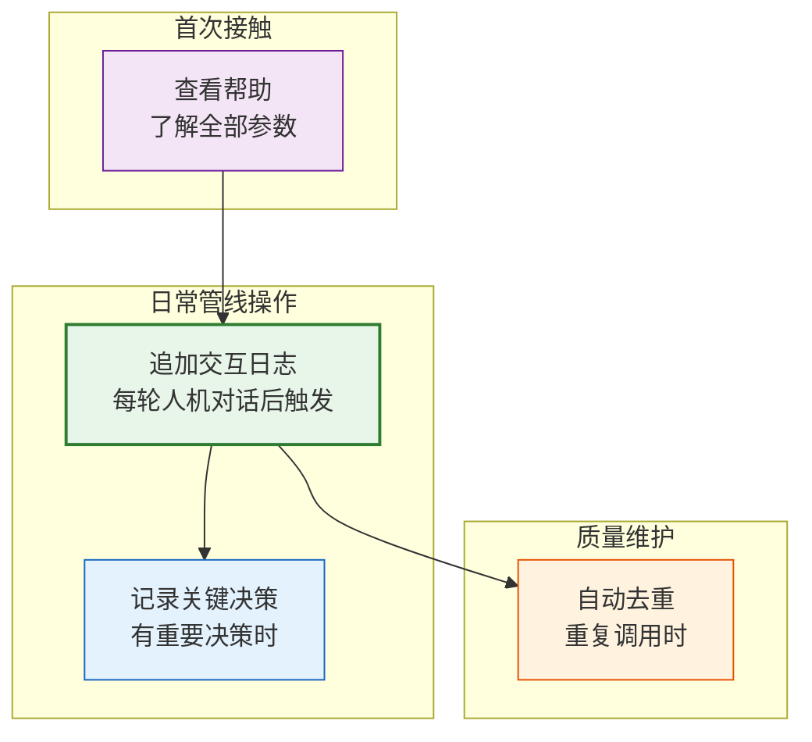
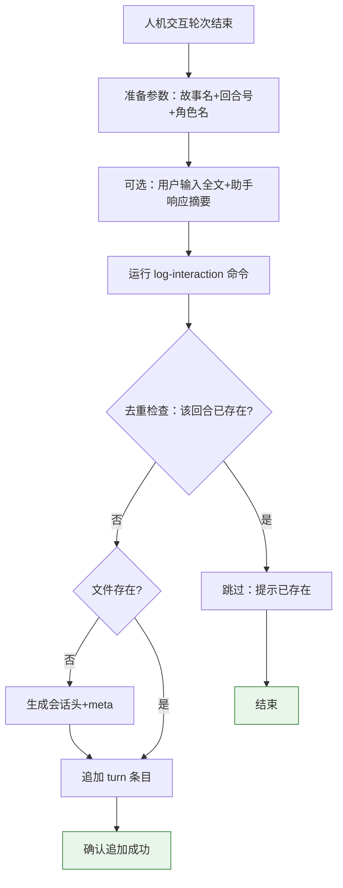
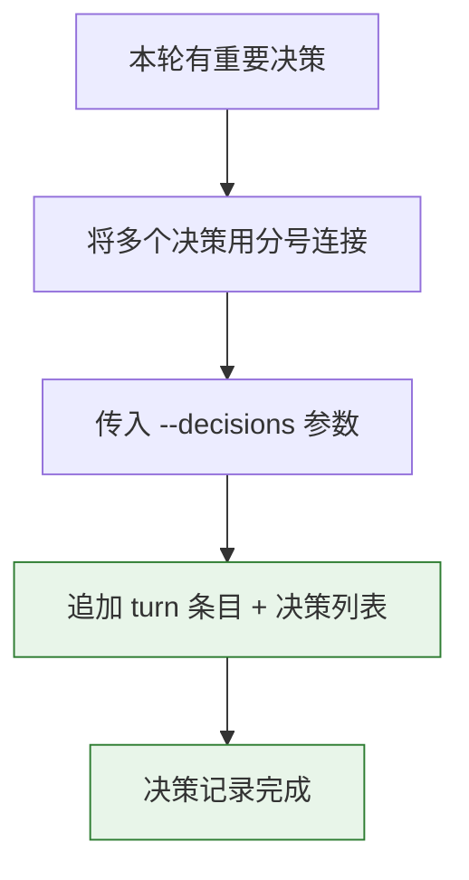
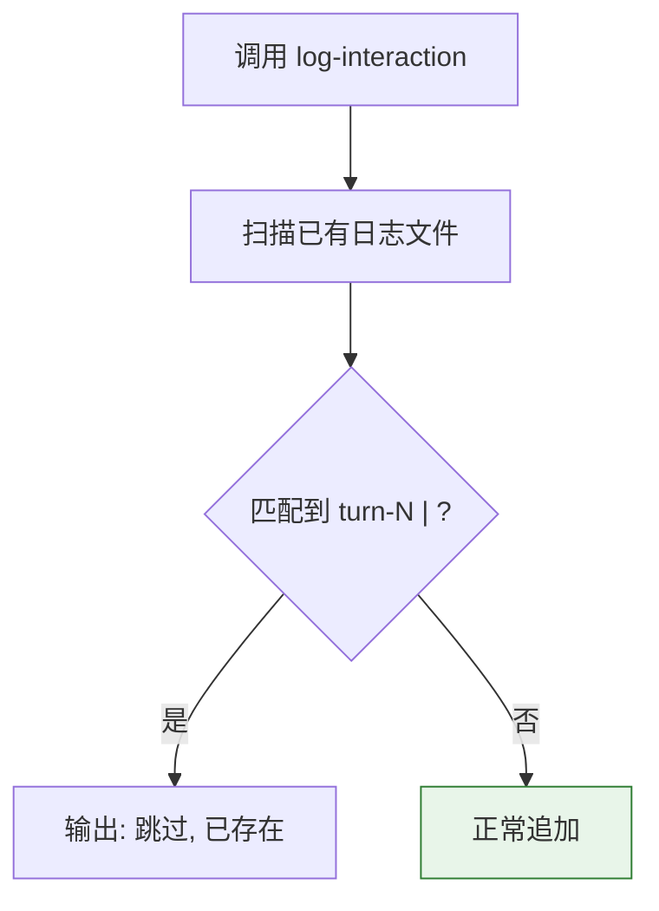

> | v1.0.0 | 2026-05-22 | deepseek-v4-pro | node .memory/log-interaction.mjs | 🌿 feat/memory-log-interaction-doc | 📎 [CLAUDE.md](../../../CLAUDE.md) |

> **导航**: [← YrY-故事任务](./YrY-故事任务.md) · [YrY-技术评审 →](./YrY-技术评审.md)

> **来源引用**: `/rui doc --from-code .memory-log-interaction-doc`，基于 `YrY-故事任务.md` §1 Story 1

## §0 基线声明

> **用户空间基线 (User Space Baseline)**: 本文档定义"谁使用(WHO)"和"如何体验(HOW EXPERIENCE)"。所有交互设计(技术评审)、测试用例(测试设计)、验收标准(故事任务 §5)均必须覆盖本文档定义的每个场景。

### 主要价值

- 🎯 一次学会全部参数，无需反复查源码
- 🔒 自动去重让重复调用无害，管线集成者不用自己实现幂等
- ⚡ 项目名自动发现让跨项目复用零配置
- 📊 格式标准化让所有故事的交互日志可统一检索
- 🔄 会话头自动管理让跨会话对比一目了然

---

## §1 场景全景

---

## §2 场景详述

### 场景 1: 追加交互日志

| 角色 | 触发条件 | 核心目标 |
|------|---------|---------|
| 管线脚本编写者 | 每次人机交互轮次结束后 | 将本轮对话摘要追加到故事交互日志 |

| # | 步骤 | 输入 | 系统响应 | 异常分支 |
|---|------|------|---------|---------|
| 1 | 使用者输入命令 | 故事名、回合号、角色名 | 验证必填参数 | 缺少必填参数 → 显示错误提示 |
| 2 | 去重检查 | 回合号 | 扫描已有日志 | 同回合已存在 → 跳过不写入 |
| 3 | 首次写入检测 | 文件路径 | 文件不存在时自动创建会话头和 meta 注释 | 目录不存在 → 自动递归创建 |
| 4 | 追加条目 | 格式化的 turn 内容 | 追加到交互日志文件 | — |

**空状态**: 目标故事尚无交互日志文件 → 创建新文件，自动写入会话头（`## 会话 <id> — <date>`）。

**错误恢复**: 必填参数缺失 → 显示具体缺少项 → 补充参数后重试。

---

### 场景 2: 记录关键决策

| 角色 | 触发条件 | 核心目标 |
|------|---------|---------|
| 管线脚本编写者 | 本轮交互产生了重要决策（如阻断判定、分支选择、架构决策） | 将决策列表追加到 turn 条目中 |

| # | 步骤 | 输入 | 系统响应 | 异常分支 |
|---|------|------|---------|---------|
| 1 | 编码决策列表 | 多个决策文本 | 分号连接为单个字符串 | 决策含分号时可能误拆分 → 建议用句号分隔 |
| 2 | 传入参数 | `--decisions="决策1;决策2"` | 解析为列表逐条写入 `- 决策1` | — |
| 3 | 确认写入 | turn 条目末尾 | 显示 `**📋 关键决策**:` 列表 | — |

**空状态**: 不传入 `--decisions` → 条目不含决策块。

---

### 场景 3: 自动去重

| 角色 | 触发条件 | 核心目标 |
|------|---------|---------|
| 管线脚本编写者 | 管线脚本可能因重试、断点续跑等情况重复调用同一回合 | 同回合号自动跳过，不产生重复记录 |

| # | 步骤 | 输入 | 系统响应 | 异常分支 |
|---|------|------|---------|---------|
| 1 | 调用时传入 turn 号 | `--turn=3` | 读取已有日志全文 | 文件不存在 → 直接写入（无去重需要） |
| 2 | 正则匹配 | `turn-3` 模式 | 匹配到 → 跳过 | 文件读取失败 → 视为不存在 |
| 3 | 确认结果 | — | 输出 "跳过: turn-3 已存在" | — |

---

## §3 场景覆盖矩阵

| 场景 | FP# | AC# | 实现文档(技术评审) | 测试文档(测试设计) | 覆盖状态 |
|------|-----|------|------------------|------------------|:--:|
| 场景 1: 追加日志 | FP1, FP2 | AC1, AC4 | §2 CLI 架构 | TC-N1, TC-N2 | 待生成 |
| 场景 2: 关键决策 | FP1 | AC3 | §2 CLI 架构 | TC-N3 | 待生成 |
| 场景 3: 自动去重 | FP3 | AC2 | §2 CLI 架构 | TC-N4, TC-B1 | 待生成 |

---

## §4 评审清单

| # | 检查项 | 状态 |
|---|--------|:--:|
| 1 | 场景数 ≥ 2 | ✅ 3 个 |
| 2 | 每场景有 mermaid 流程图 | ✅ |
| 3 | 覆盖全部 FP#（FP1–FP5） | ✅ |
| 4 | 每场景含异常分支 | ✅ |
| 5 | 无技术术语（API/组件/文件路径） | ✅ |
| 6 | 每场景含空状态描述 | ✅ |
| 7 | 每场景含错误恢复路径 | ✅ |
| 8 | 覆盖矩阵下游文档齐全 | ✅ |

---

## §5 体验基线

| 角色 | 核心旅程 | 情感目标 | 痛点解决 | 成功感知 | 关联场景 |
|------|---------|---------|---------|---------|---------|
| 管线脚本编写者 | 在每轮交互结束后插入一行日志命令 | 感到日志系统可靠，不会遗漏或重复 | 每次手工写日志格式不一致 → 一条命令统一格式 | 看到 "已追加" 确认信息 | 场景 1 |
| 决策记录者 | 将本轮重要决策批量写入日志 | 感到决策可追溯，复盘有据可依 | 决策散落在聊天记录中 → 结构化写入交互日志 | 文件中出现 `📋 关键决策` 列表 | 场景 2 |
| 管线调试者 | 重跑失败命令时无需担心日志重复 | 感到系统健壮，重试安全 | 手动清理重复日志 → 自动去重零操作 | 看到 "跳过: 已存在" 提示 | 场景 3 |

---

> | 日期 | 变更 | 触发 | 证据 |
> |------|------|------|------|
> | 2026-05-22 | 初始生成 | `/rui doc --from-code .memory-log-interaction-doc` | `YrY-故事任务.md` §1 |
