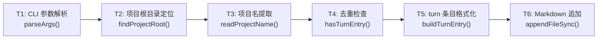
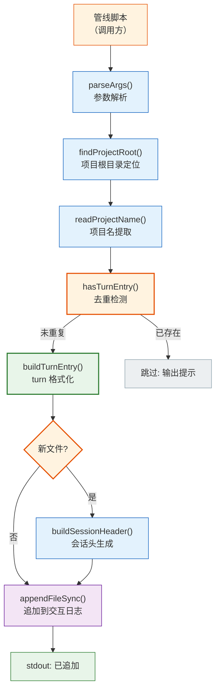
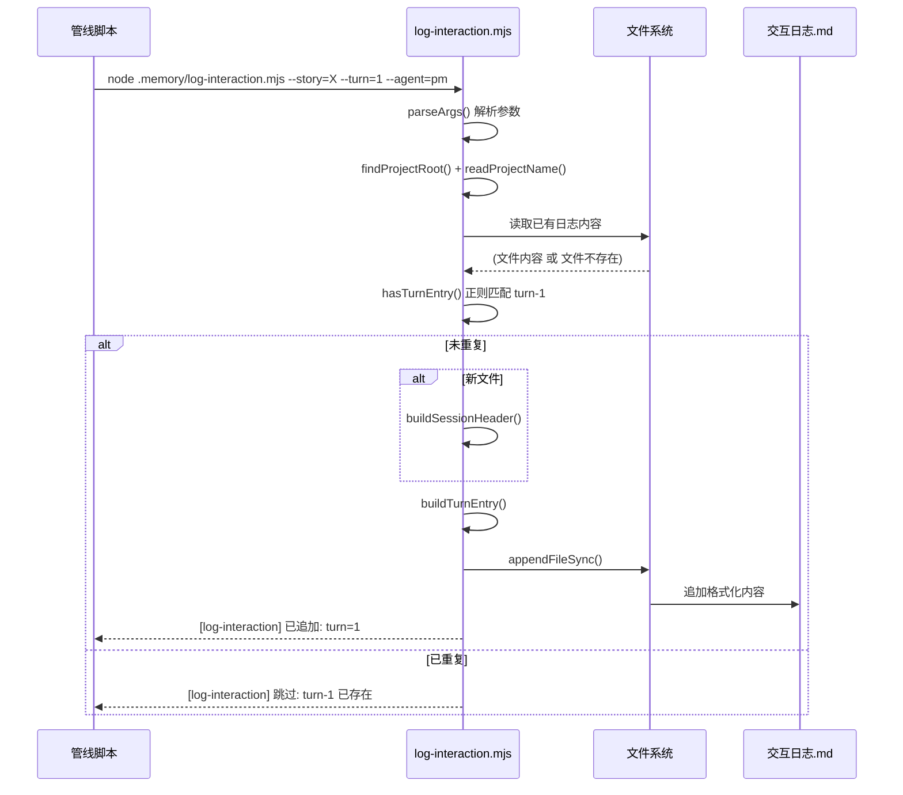

> | v1.0.0 | 2026-05-22 | deepseek-v4-pro | node .memory/log-interaction.mjs | 🌿 feat/memory-log-interaction-doc | 📎 [CLAUDE.md](../../../CLAUDE.md) |

> **导航**: [← YrY-使用场景](./YrY-使用场景.md) · [YrY-测试设计 →](./YrY-测试设计.md) · [YrY-安全审计 →](./YrY-安全审计.md)

> **来源引用**: `/rui doc --from-code .memory-log-interaction-doc`，源码 `.memory/log-interaction.mjs:1-233`

### 主要价值

- 🎯 零外部依赖：纯 Node.js 标准库，永远可独立运行
- 🔒 自动去重：正则匹配回合号，重复调用无副作用
- ⚡ 零配置：项目名自动从 CLAUDE.md 读取，会话 ID 自动生成
- 📊 格式标准化：严格遵循 coder.md 交互日志规约，全项目统一
- 🔄 会话头自动管理：新文件自动创建 session header，跨会话清晰分隔

## §0 设计决策与任务规划

### §0.0 基线溯源

| 本设计章节 | 实现 故事任务 | 服务 使用场景 | 覆盖状态 |
|-----------|-------------|-------------|:--:|
| §1 系统架构 | FP1–FP5 全部功能点 | 场景 1–3 全部用户操作 | ✅ |
| §2 数据流与处理模型 | FP1 追加, FP3 去重, FP4 项目名提取 | 场景 1, 3 | ✅ |
| §7 安全约束 | R1–R4 业务规则 | 场景 1 异常分支 | ✅ |
| §8 性能与限制 | FP2 会话头, FP5 ID 生成 | 场景 1 空状态 | ✅ |

### §0.1 设计决策

| 决策领域 | 选定方案 | 选择理由 | 详见 | 实现 FP# |
|---------|---------|---------|------|---------|
| 数据格式 | Markdown 结构化文本（非 JSON/JSONL） | 人可读；管线执行者可随时查阅 | §2 | FP1 |
| 去重策略 | 正则匹配 `turn-{N}\s*\|` 在全文上搜索 | 简单可靠；turn 号由管线统一管理，无并发冲突 | §2 | FP3 |
| 项目名提取 | 正则匹配 CLAUDE.md 的 `\| 项目名 \| X \|` 或 `**项目名**：X` | 与 CLAUDE.md 格式约定一致；三层回退保证鲁棒性 | §2 | FP4 |
| 会话 ID 格式 | `YYMMDD-HHmmss`（13 字符） | 可读性优先；精确到秒满足区分需求 | §2 | FP5 |
| 进程退出码 | 所有路径 `process.exit(0)` | 不中断管线流程；错误通过 stderr 传递 | §2 | R1 |

### §0.2 任务规划

| ID | 描述 | 工作量 | 交付物 | Agent | 门禁 | 实现 FP# |
|----|------|:--:|------|-------|------|---------|
| T1 | CLI 参数解析（8 个选项） | S | `parseArgs()` | coder | 单元测试 | FP1, FP3 |
| T2 | 项目根目录定位 | S | `findProjectRoot()` | coder | 集成测试 | — |
| T3 | 项目名自动提取 | S | `readProjectName()` | coder | 单元测试 | FP4 |
| T4 | 回合去重检测 | S | `hasTurnEntry()` | coder | 单元测试 | FP3 |
| T5 | turn 条目格式化 | S | `buildTurnEntry()` | coder | 单元测试 | FP1 |
| T6 | Markdown 追加 + 会话头 | M | `cmdAppend()` | coder | Gate A | FP1, FP2 |

---

## §1 系统架构

### 效果示意

### 1.1 模块/文件

| 变更类型 | 模块/文件 | 职责 |
|:--:|------|------|
| 现有 | `.memory/log-interaction.mjs` | CLI 入口，7 个函数，233 行 |
| 运行时 | `docs/故事任务面板/<story>/{project}-交互日志.md` | 交互日志目标文件（Markdown，追加写入） |

**函数职责**：

| 函数 | 类型 | 职责 |
|------|------|------|
| `parseArgs()` | 参数解析 | 解析 8 个选项 |
| `findProjectRoot()` | 环境感知 | 向上遍历目录树查找项目根目录 |
| `readProjectName()` | 配置读取 | 从 CLAUDE.md 提取项目名，三层回退 |
| `generateSessionId()` | 工具 | 生成 `YYMMDD-HHmmss` 格式会话 ID |
| `buildTurnEntry()` | 格式化 | 按 coder.md 规约构建 turn 条目 |
| `buildSessionHeader()` | 格式化 | 构建会话头和 meta 注释 |
| `hasTurnEntry()` | 去重 | 正则匹配已有日志中的 turn 号 |
| `getLogPath()` | 路径 | 构建目标日志文件路径 |
| `cmdAppend()` | 核心 | 编排：去重 → 格式化 → 追加 |
| `main()` | 入口 | 参数校验 + 分发 |

### 1.2 通信通道

| 通道 | 方向 | 协议 | Payload | 错误处理 |
|------|------|------|---------|---------|
| CLI → log-interaction | 入站 | `process.argv` 字符串数组 | 参数键值对 | 必填参数缺失 → stderr + exit(0) |
| log-interaction → 已有日志 | 入站 | `readFileSync()` | 全文文本 | 文件不存在 → 视为新文件 |
| log-interaction → 交互日志 | 出站 | `appendFileSync()` | Markdown 格式化文本 | 文件系统错误 → 异常抛出 |

---

## §7 安全约束

| # | 威胁 | 信任边界 | 缓解措施 | 优先级 |
|---|------|---------|---------|:--:|
| 1 | 恶意 Markdown 注入用户输入 | `--user-input` → 日志文件 | Markdown 文本直接写入，由阅读者渲染环境负责 XSS 防护 | P0 |
| 2 | 决策分隔符注入 | `--decisions` 分号分隔 → 决策列表 | 分号是约定分隔符；含分号的决策会被误拆分（影响小） | P2 |
| 3 | 敏感信息泄露到交互日志 | `--user-input` / `--assistant-response` → 日志文件 | 调用方负责脱敏；本文档约束不传递密钥 | P1 |
| 4 | 日志文件被非授权读取 | 文件系统 → 任意进程 | 文件权限依赖操作系统 umask | P2 |

---

## §8 性能与限制

| 维度 | 约束 | 应对 |
|------|------|------|
| 写入延迟 | `appendFileSync()` 同步阻塞，单次写入 < 1ms | 管线为串行模型，阻塞可接受 |
| 去重扫描 | `hasTurnEntry()` 正则全文匹配 | 日志文件 < 1MB 时性能可接受（< 5ms） |
| 日志文件增长 | 每次轮次追加约 0.5–2KB | 每故事每会话一个文件，自动会话隔离 |
| 并发 | 单进程模型，无并发控制 | 管线架构保证串行执行 |
| 依赖 | 仅 `node:path` + `node:fs`，零外部依赖 | 永远可独立运行 |

---

## §9 评审清单

| # | 检查项 | 状态 |
|---|--------|:--:|
| 1 | 效果示意 mermaid 图完整 | ✅ |
| 2 | 基线溯源覆盖全部 FP# 和场景 | ✅ |
| 3 | 设计决策有明确理由 | ✅ |
| 4 | 任务规划依赖关系清晰 | ✅ |
| 5 | 安全约束覆盖信任边界 | ✅ |
| 6 | 性能限制有量化说明 | ✅ |
| 7 | 项目类型裁剪正确（meta：跳过 API/数据/组件/状态/交互/样式/DOM） | ✅ |
| 8 | 模块职责单一，函数边界清晰 | ✅ |

---

> | 日期 | 变更 | 触发 | 证据 |
> |------|------|------|------|
> | 2026-05-22 | 初始生成 | `/rui doc --from-code .memory-log-interaction-doc` | `.memory/log-interaction.mjs:1-233` |
