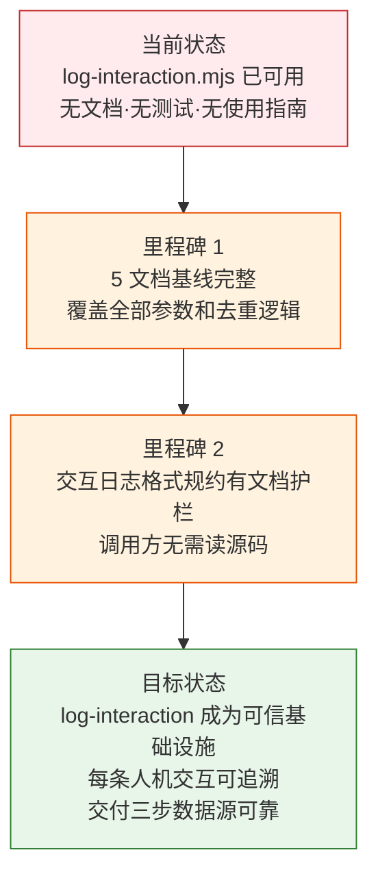

> | v1.0.0 | 2026-05-22 | deepseek-v4-pro | node .memory/log-interaction.mjs | 🌿 feat/memory-log-interaction-doc | 📎 [CLAUDE.md](../../../CLAUDE.md) |

> **导航**: [YrY-使用场景 →](./YrY-使用场景.md)

> **来源引用**: `/rui doc --from-code .memory-log-interaction-doc`，源码 `.memory/log-interaction.mjs` (233 行)

## §0 基线声明

> **问题空间基线 (Problem Space Baseline)**: 本文档定义"做什么(WHAT)"和"为什么(WHY)"。所有后续文档(03-09)的设计、实现、验证、改进决策均必须可追溯至本文档的具体章节。

### 需求概述

确定性交互日志追加器 (`log-interaction.mjs`) 是 rui 管线的可追溯性基础设施。每次人机交互轮次结束后确定性地追加一条格式化记录到故事目录的 `{project}-交互日志.md`，自动创建新会话头、按回合编号去重、从 CLAUDE.md 提取项目名。当前状态：脚本已可用但无文档基线。

### 效果示意

### 主要价值

- 📋 交互可追溯：每轮人机对话确定性地记录，形成完整会话审计线索
- 🔒 自动去重：同回合号已存在时自动跳过，多次运行不产生重复记录
- 🔗 格式标准化：按 coder.md 规约统一格式，自动插入会话头和分隔符
- ⚡ 零配置：项目名自动从 CLAUDE.md 读取，会话 ID 自动生成
- 📊 全阶段覆盖：从需求解析到交付，12 个管线阶段交互全覆盖

---

## §1 Story

### Story 1: 交互日志追加器文档基线

| 字段 | 内容 |
|------|------|
| 作为 | rui 管线使用者和交付三步中的 hook-log 调用方 |
| 我想要 | log-interaction.mjs 有完整的文档基线 |
| 以便 | 管线集成者有清晰的接口规约，交互日志格式有文档护栏 |
| 优先级 | P0 |
| 范围边界 | 只读源码，生成文档到 `docs/故事任务面板/.memory-log-interaction-doc/` |
| 依赖 | 源码 `.memory/log-interaction.mjs` 可访问 |

#### 范围外

- 不修改 `log-interaction.mjs` 源码
- 不新增功能或重构
- 不生成实施报告/测试报告/自改进复盘（属于 code 阶段产出）

##### §1.1 User Operations

| # | 操作 | 触发条件 | 操作步骤 | 预期结果 |
|---|------|---------|---------|---------|
| 1 | 追加交互日志 | 每次人机交互轮次结束后 | `node .memory/log-interaction.mjs --story=<name> --turn=<N> --agent=<name> --user-input="..." --assistant-response="..."` | 一条格式化的 turn 条目追加到故事交互日志文件 |
| 2 | 记录关键决策 | 本轮有重要决策时 | 添加 `--decisions="决策1;决策2"` | 关键决策列表追加到 turn 条目末尾 |
| 3 | 自动去重 | 同回合重复调用时 | 自动检测 turn 号已存在 | 跳过写入，输出 "跳过" 提示 |

---

## §2 Requirements

### 功能点

| FP# | 描述 | 输入 | 输出 | 错误行为 | 优先级 |
|-----|------|------|------|---------|--------|
| FP1 | 追加交互日志 turn 条目 | `--story` + `--turn` + `--agent`（必填），可选 `--user-input/--assistant-response/--decisions/--session-id/--project` | 格式化的 turn 条目追加到 `{project}-交互日志.md` | 必填参数缺失时输出错误提示，不写入 | P0 |
| FP2 | 会话头自动生成 | 新文件首次写入时 | `## 会话 <id> — <date>` 头 + meta 注释行 | 无 | P1 |
| FP3 | 回合去重检测 | 同 turn 号再次调用时 | 扫描已有日志内容中 `turn-{N} |` 模式 | 检测到重复 → 跳过，输出提示 | P1 |
| FP4 | 项目名自动提取 | 未指定 `--project` 时 | 从 CLAUDE.md 读取项目名（匹配 `| 项目名 | X |` 或 `**项目名**：X`） | 读取失败时回退到目录名 | P2 |
| FP5 | 会话 ID 自动生成 | 未指定 `--session-id` 时 | 生成 `YYMMDD-HHmmss` 格式的 session_id | 无 | P2 |

### 业务规则

| R# | 描述 | 校验方式 | 证据级别 |
|----|------|---------|---------|
| R1 | 必填参数 story/turn/agent 缺失时拒绝写入 | 手动 `if (!opts.story)` 检查 | A |
| R2 | 同 turn 号不重复追加（去重） | `hasTurnEntry()` 正则匹配 `turn-{N}\s*\|` | A |
| R3 | 交互日志格式严格遵循 coder.md § 交互日志规约 | `buildTurnEntry()` 固定模板 | A |
| R4 | 项目名优先使用 `--project` 参数，其次 CLAUDE.md 自动提取，最后回退目录名 | `readProjectName()` | A |

### 数据约束

| 约束 | 类型 | 范围/格式 | 来源 |
|------|------|----------|------|
| story | string | 故事名（kebab-case） | `--story` |
| turn | integer | ≥ 1，单会话内递增 | `--turn` |
| agent | string | Agent 名称（如 pm/coder/tester） | `--agent` |
| user_input | string | 任意文本（用户输入全文） | `--user-input` |
| assistant_response | string | 任意文本（助手响应摘要） | `--assistant-response` |
| decisions | string | 分号分隔的关键决策列表 | `--decisions` |
| session_id | string | `YYMMDD-HHmmss` (13 字符) | 自动生成或 `--session-id` |

---

## §3 成功标准

| SC# | 描述 | 度量方式 | 目标值 | 优先级 | 关联 FP# |
|-----|------|---------|--------|--------|---------|
| SC1 | 使用者在无文档情况下可通过帮助了解全部参数 | `node .memory/log-interaction.mjs --help` 覆盖全部 7 个参数 | 100% | P0 | FP1–FP5 |
| SC2 | 首次追加创建新文件含完整会话头 | 新故事目录下首次执行 → 文件存在且含 `## 会话` 头 | 会话头+meta 完整 | P0 | FP1, FP2 |
| SC3 | 重复调用同 turn 号自动去重 | 执行 2 次相同 turn 号 → 第二次输出 "跳过" | 100% 去重 | P0 | FP3 |
| SC4 | 项目中 CLAUDE.md 含项目名时自动提取 | 不指定 `--project` → 生成的文件名前缀与 CLAUDE.md 一致 | 匹配 | P1 | FP4 |

---

## §4 范围边界

### 范围内

| # | 条目 | 关联 FP# | 边界说明 |
|---|------|---------|---------|
| 1 | 追加格式化交互日志 | FP1, FP2 | 核心功能，每次管线执行 |
| 2 | turn 去重检测 | FP3 | 防止重复调用产生冗余记录 |
| 3 | 项目名自动发现 | FP4 | 零配置体验 |

### 范围外

| # | 条目 | 排除原因 | 替代方案 |
|---|------|---------|---------|
| 1 | 日志查询/搜索/聚合 | 追加器只负责写入 | 使用 grep 或全文搜索 |
| 2 | 已有日志修改或删除 | 交互日志为 append-only | 手动编辑 |
| 3 | 跨会话日志归并 | 日志按会话分头，归并属于分析层面 | 独立分析脚本 |

---

## §5 AC

| AC# | Given | When | Then | 门禁 |
|-----|-------|------|------|------|
| AC1 | 目标故事目录存在，无交互日志文件 | 执行 `node .memory/log-interaction.mjs --story=test --turn=1 --agent=pm` | 文件创建，含 `## 会话` 头和 `### HH:mm:ss \| turn-1 \| pm` 条目 | Gate A |
| AC2 | 已有 turn-1 记录 | 再次执行 turn=1 | 输出 "跳过: turn-1 已存在"，文件不变 | Gate A |
| AC3 | 传入 `--decisions="A;B"` | 追加 turn 记录 | 条目末尾含 `**📋 关键决策**:` 和 `- A` `- B` | Gate A |
| AC4 | 未指定 `--project`，CLAUDE.md 含项目名 | 执行追加 | 文件名前缀与 CLAUDE.md 项目名匹配 | Gate A |

---

## §6 风险与假设

| # | 风险/假设 | 类型 | 可能性 | 影响 | 缓解/验证策略 | 关联 FP# |
|---|----------|------|--------|------|-------------|---------|
| 1 | 去重检测基于文本匹配 `turn-{N}`，非结构化校验，可能漏检格式变体 | 风险 | L | L | turn 编号由管线统一管理，格式固定 | FP3 |
| 2 | CLAUDE.md 格式变更导致项目名提取失败 | 风险 | L | L | 三层回退：参数 > CLAUDE.md > 目录名 | FP4 |
| 3 | 交互日志文件随时间增长 | 风险 | L | L | Markdown 格式可压缩归档 | FP1 |
| 4 | 管线调用方按规范传入必填参数 | 假设 | — | — | `--help` 和本文档提供完整参数说明 | FP1 |

---

## §7 跨文档索引

| 本文档章节 | 基线内容 | 下游文档编号 | 预期覆盖 | 状态 |
|-----------|---------|-------------|---------|:--:|
| §1 Story 1 | 交互日志追加器文档基线 | 02 使用场景 | 3 个用户操作场景 | 待生成 |
| §2 FP1–FP5 | 追加/去重/项目名提取 | 03 技术评审 | CLI 架构+数据流+安全约束 | 待生成 |
| §2 R1–R4 | 去重和格式规则 | 04 测试设计 | 正常/边界/异常测试用例 | 待生成 |
| §2 R1–R4 | 格式护栏规则 | 05 安全审计 | 输入校验+文件安全+注入风险 | 待生成 |
| §5 AC1–AC4 | 验收标准 | 04 测试设计 | Gate A 交接信号 | 待生成 |

---

## §R 关联故事

| 关联故事 | 关系类型 | 说明 |
|---------|---------|------|
| `.memory-collector-doc` | 共享约定 | 同为 `.memory/` 下的持久化脚本，共用项目根目录发现逻辑 |
| `rui-bot-send-doc` | 管线上下游 | 交付三步中 hook-log (Step 1) 先于 rui-bot (Step 3) |

---

> | 日期 | 变更 | 触发 | 证据 |
> |------|------|------|------|
> | 2026-05-22 | 初始生成 5 文档基线 | `/rui doc --from-code .memory-log-interaction-doc` | `.memory/log-interaction.mjs:1-233` |
