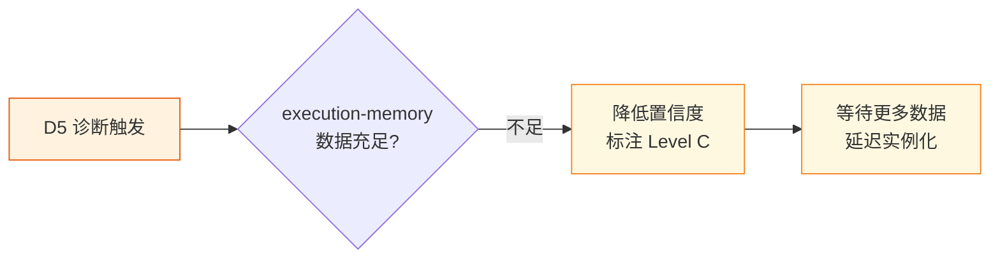
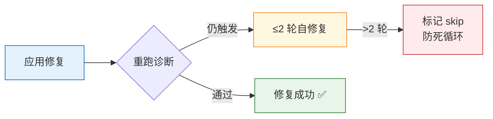

> | v1.0 | 2026-05-22 | auto | 🌿 feat/improve-rui-story-d5 | ⏱️ — | 📎 [YrY-故事任务.md](./YrY-故事任务.md) |

> **来源引用**: 基于 §1 故事任务文档反推，证据 Level A + 文档路径

[§1 正常场景](#sec1-normal) · [§2 边界与异常](#sec2-edge) · [§L 场景覆盖矩阵](#secL-matrix)

---

### §0 基线声明

> **用户空间基线 (User Space Baseline)**: 本文档定义改进任务 `improve-rui-story-d5` 的使用场景。所有技术决策必须可追溯至本文档定义的场景。

---

### 主要价值

- 👤 **用户角色**: 项目维护者 / self-improve agent
- 🎯 **核心目标**: 降低 Agent 工具调用失败率，提升自改进管线可靠性
- 🔄 **触发方式**: yry 自改进闭环 D5 诊断自动触发
- 📊 **成功度量**: 工具调用失败率从 33.3% 降至 < 5%

---

## §1 正常场景

### 场景 1: 诊断发现工具调用异常

**前置条件**: yry 自改进闭环运行中，execution-memory.jsonl 有足够数据。

**操作步骤**:
1. yry §2 诊断阶段执行 D0-D7 模式匹配
2. D5 检测到工具调用失败率超过阈值
3. 生成改进提案写入 proposals.jsonl
4. yry §1.1 检测到可实例化提案，生成故事目录和故事任务文档
5. 维护者审查 agents/ 目录下的 agent 定义和工具路由配置

**预期结果**: 改进提案被实例化为可执行的故事任务，有明确的诊断证据和修复方向。

---

### 场景 2: 维护者审查并修复工具路由

**前置条件**: 故事任务文档已生成，诊断证据可访问。

**操作步骤**:
1. 读取故事任务文档了解 D5 诊断详情
2. 检查 agents/ 目录下的 agent 定义文件
3. 检查工具路由、超时设置、权限配置
4. 应用修复
5. 重跑 yry 诊断验证修复效果

**预期结果**: 工具调用失败率显著降低，D5 诊断不再触发。

---

## §2 边界与异常

### 边界: 诊断数据不足

**处理**: 执行记忆数据不足时，D5 诊断置信度降低，故事标注 Level C 证据等级，等待下次 yry 扫描补充数据。

### 异常: 修复无效

**处理**: 修复后重跑诊断，若仍触发则 ≤2 轮自修复，超过则标记 skip 防止死循环。

---

## §L 场景覆盖矩阵

| 场景 | 类型 | 覆盖 FP# | 前置条件 | 预期结果 |
|------|------|---------|---------|---------|
| 诊断发现工具调用异常 | 正常 | FP1 | yry 运行中，数据充足 | 提案生成，故事实例化 |
| 维护者审查并修复工具路由 | 正常 | FP2 | 故事任务文档存在 | 失败率降低 |
| 诊断数据不足 | 边界 | FP1 | 执行记忆为空或不足 | 降级处理，延迟实例化 |
| 修复无效 | 异常 | FP2 | 修复已应用 | ≤2 轮重试后 skip |

---

### 变更记录

| 日期 | 变更 | 来源 |
|------|------|------|
| 2026-05-22 | 初始生成 | yry §4 自改进实现，基于 YrY-故事任务.md |
