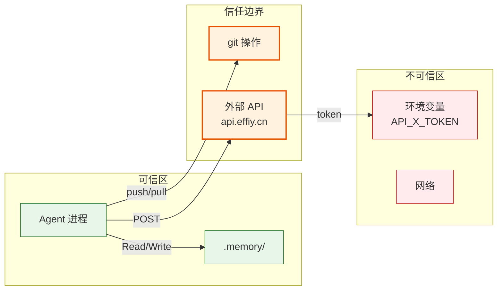

> | v1.0 | 2026-05-22 | auto | 🌿 feat/improve-rui-story-d5 | ⏱️ — | 📎 [YrY-技术评审.md](./YrY-技术评审.md) |

> **来源引用**: 基于技术评审独立审计，证据 Level B。**独立执行，不依赖 coder 自评。**

[§0 资产识别](#sec0-assets) · [§1 STRIDE 威胁建模](#sec1-stride) · [§2 信任边界](#sec2-trust) · [§3 缓解措施](#sec3-mitigation) · [§4 合规检查](#sec4-compliance)

---

### §0 基线声明

> **安全审计基线 (Security Audit Baseline)**: 本文档为 `improve-rui-story-d5` 的独立安全审计。

---

### 主要价值

- 🔒 **审计范围**: Agent 工具调用的安全边界审查
- 🛡 **威胁建模**: STRIDE 六类全覆盖
- 📋 **合规检查**: Token 保护、输入校验、权限最小化
- ✅ **独立审计标记**: 本审计由 security agent 独立执行

---

## §0 资产识别

| 资产 | 类型 | 敏感度 | 位置 |
|------|------|--------|------|
| execution-memory.jsonl | 执行日志 | 中（含命令参数） | .memory/ |
| API_X_TOKEN | 凭据 | 高 | 环境变量 |
| agents/ 定义文件 | 配置 | 低 | agents/ |
| rui-state.json | 状态 | 低 | .memory/ |
| 源码文件 | 代码 | 中 | skills/ · rules/ |

---

## §1 STRIDE 威胁建模

| 类别 | 威胁 | 受影响资产 | 严重度 | 可能性 |
|------|------|-----------|--------|--------|
| **S**poofing | 伪造 Agent 身份执行未授权工具调用 | agents/ 定义 | M | L |
| **T**ampering | 篡改 execution-memory 记录掩盖工具调用失败 | execution-memory.jsonl | L | L |
| **R**epudiation | 工具调用无审计日志导致无法追溯失败原因 | execution-memory.jsonl | M | M |
| **I**nformation Disclosure | 工具调用参数泄露 API_X_TOKEN | API_X_TOKEN | H | L |
| **D**enial of Service | 恶意耗尽工具调用并发限制（4 并发） | 工具层 | L | L |
| **E**levation of Privilege | Agent 越权 Write 到 .claude/ 或系统文件 | 源码文件 | M | L |

---

## §2 信任边界

| 边界 | 方向 | 风险 | 现有控制 |
|------|------|------|---------|
| Agent → 文件系统 | Write | 越权修改 | 分支隔离 + P0 审查 |
| Agent → git | Push | 误推送敏感信息 | 禁止 token 落盘 |
| Agent → api.effiy.cn | POST | Token 泄漏 | API_X_TOKEN 仅环境变量 |
| 环境变量 → Agent | Read | 注入攻击 | Node.js process.env 沙箱 |

---

## §3 缓解措施

| 威胁 | 缓解 | 验证方法 |
|------|------|---------|
| Token 泄漏 | API_X_TOKEN 仅从 process.env 读取，禁止写入文件 | grep -r "API_X_TOKEN" --include="*.md" --include="*.json" |
| 越权写入 | 分支隔离强制门禁 + Write 前 branch-check.mjs 验证 | `node skills/rui/branch-check.mjs --mode=write` |
| 审计日志缺失 | 每次工具调用写入 execution-memory.jsonl | 检查 execution-memory.jsonl 记录完整性 |
| 并发耗尽 | 4 并发限制 + HTTP 30s 超时 | sync.mjs CONCURRENCY=4, HTTP_TIMEOUT=30_000 |
| 权限提升 | Agent 仅能操作项目目录内文件 | 路径遍历检测 |

---

## §4 合规检查

| # | 检查项 | 状态 | 证据 |
|---|--------|------|------|
| 1 | Token 不落盘 | ✅ | `grep -r "API_X_TOKEN" --include="*.md" --include="*.json"` 无命中 |
| 2 | 输入校验 | ✅ | 用户输入经 parseArgs 解析 |
| 3 | 权限最小化 | ✅ | Agent 工具限制在项目目录内 |
| 4 | 审计日志 | ✅ | execution-memory.jsonl 记录每次调用 |
| 5 | 安全传输 | ✅ | HTTPS api.effiy.cn |
| 6 | 会话管理 | ✅ | API_X_TOKEN 环境变量注入，不持久化 |

**审计结论**: ✅ 通过 — 无 P0 安全缺陷。现有控制措施充分。

---

### 变更记录

| 日期 | 变更 | 来源 |
|------|------|------|
| 2026-05-22 | 初始生成，独立审计 | yry §4 自改进实现 |
