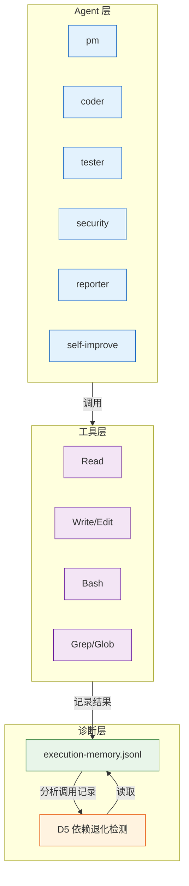
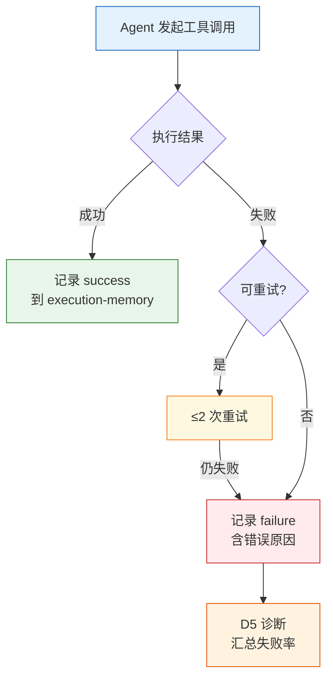

> | v1.0 | 2026-05-22 | auto | 🌿 feat/improve-rui-story-d5 | ⏱️ — | 📎 [YrY-故事任务.md](./YrY-故事任务.md) · [YrY-使用场景.md](./YrY-使用场景.md) |

> **来源引用**: 基于故事任务 + 使用场景双基线，只读 agents/ 源码分析，证据 Level B

[§0 基线溯源](#sec0-trace) · [§1 架构](#sec1-arch) · [§2 Agent 工具路由](#sec2-routing) · [§3 错误处理](#sec3-error) · [§7 安全考量](#sec7-security)

---

### §0 基线声明

> **解决方案空间基线 (Solution Space Baseline)**: 本文档为 `improve-rui-story-d5` 的技术设计基线。

---

### 主要价值

- 🏗 **架构影响**: agents/ 目录下 6 个 Agent 定义文件的工具调用链
- 🔧 **技术方案**: 审查工具路由、超时配置、错误重试机制
- 📊 **效果度量**: 工具调用失败率 < 5%，execution-memory 记录每次调用结果
- 🛡 **安全考量**: Agent 工具权限边界审查

---

## §0 基线溯源

| 来源 | 映射关系 |
|------|---------|
| 故事任务 FP1 | D5 诊断数据采集 → execution-memory.jsonl 工具调用记录 |
| 故事任务 FP2 | 工具路由修复 → agents/ 各 Agent 的工具调用配置 |
| 使用场景 1 | 诊断发现 → yry D5 模式匹配 → proposals.jsonl 生成 |
| 使用场景 2 | 审查修复 → agents/ 定义文件检查与修正 |

---

## §1 架构

**架构要点**:
- 6 个 Agent 通过工具层与文件系统和 git 交互
- 每次工具调用结果记录到 execution-memory.jsonl
- D5 诊断通过分析 execution-memory 中的失败模式检测退化

> 证据: `agents/AGENT.md:1-50` 定义 Agent 行为纪律；`rules/self-improve.md` 定义 D0-D7 诊断框架

---

## §2 Agent 工具路由

| Agent | 可用工具 | 关键调用 | 失败风险 |
|-------|---------|---------|---------|
| pm | Read, Grep, Glob, Bash | 源码研究、依赖分析 | Glob 模式不匹配、Read 大文件超时 |
| coder | Read, Grep, Glob, Edit, Write, Bash | 代码修改、分支操作 | Write 权限不足、git 冲突 |
| tester | Read, Grep, Glob, Bash | 测试执行、Gate 验证 | Bash 测试命令失败 |
| security | Read, Grep, Glob | 安全扫描、威胁建模 | Read 受限文件 |
| reporter | Read, Grep, Glob | 报告生成、数据汇总 | 数据源不可达 |
| self-improve | Read, Grep, Glob, Bash | 诊断扫描、提案生成 | execution-memory 解析失败 |

> 证据: `agents/pm.md:1-30` · `agents/coder.md:1-40` · `agents/tester.md:1-30` · `agents/security.md:1-30` · `agents/reporter.md:1-30` · `agents/self-improve.md:1-30`

---

## §3 错误处理

**错误分类与处置**:

| 错误类型 | 原因 | 处置 |
|---------|------|------|
| 文件不存在 | Glob/Read 目标路径错误 | 重试前验证路径 |
| 权限不足 | Write 到受保护路径 | 不重试，上报阻断 |
| 网络超时 | API 调用超时 | ≤2 次重试，指数退避 |
| 解析失败 | JSON/protobuf 格式错误 | 记录原始响应，不重试 |
| git 冲突 | 分支状态不一致 | 人工介入，标记阻断 |

> 证据: `skills/rui-import/sync.mjs:30` HTTP_TIMEOUT=30s · `rules/code-pipeline.md` Gate B ≤2 轮约束

---

## §7 安全考量

| 信任边界 | 风险 | 缓解 |
|---------|------|------|
| Agent → 文件系统 | Write 越权修改关键文件 | 分支隔离强制 + P0 审查 |
| Agent → git | 误推送敏感信息 | 禁止 token 落盘，.gitignore 保护 |
| Agent → 外部 API | API_X_TOKEN 泄漏 | 仅从环境变量读取，禁止写入任何文件 |

> 证据: `CLAUDE.md` 认证不可绕过 · `rules/delivery-gate.md:7` no-token 降级

---

### 变更记录

| 日期 | 变更 | 来源 |
|------|------|------|
| 2026-05-22 | 初始生成 | yry §4 自改进实现 |
