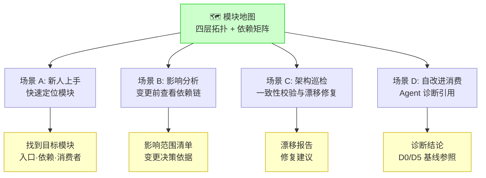
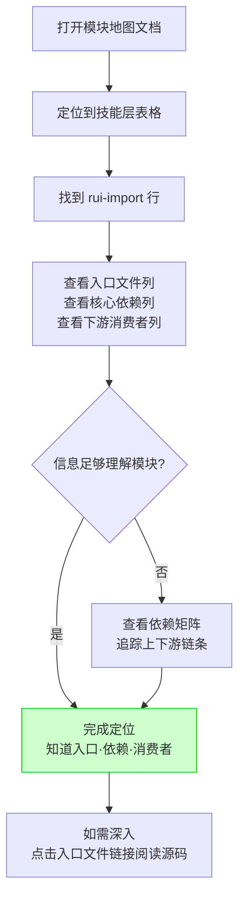
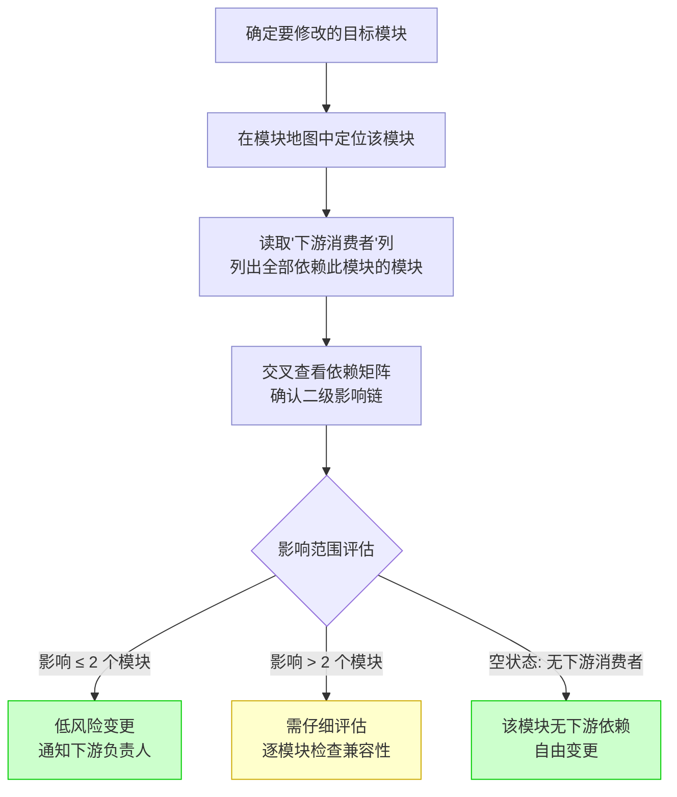
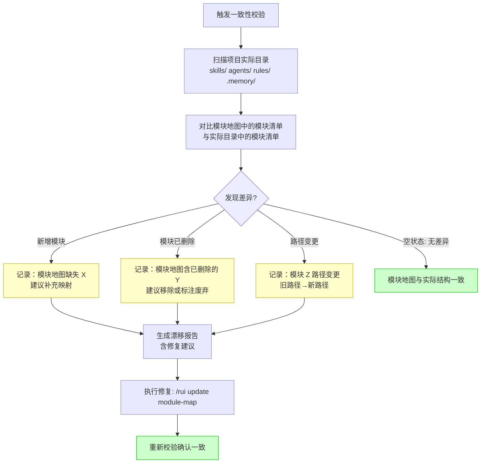
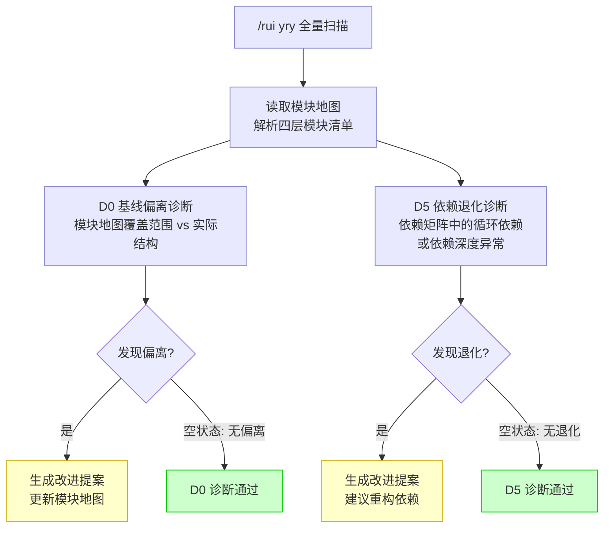

> | v1.0.0 | 2026-05-26 | deepseek-v4-pro | 🌿 feat/module-map | 📎 [CLAUDE.md](../../../CLAUDE.md) |

> **导航**: [← 故事任务](./故事任务.md) · [技术评审 →](./技术评审.md)

> **来源引用**: 由 module-map 故事基线建立触发，从 [故事任务](./故事任务.md) Story 1/2 的用户操作推导。证据 Level B + 故事任务 §1.1 User Operations。

[§1 场景全景](#sec1-overview) · [§2 场景详述](#sec2-detail) · [§3 场景覆盖矩阵](#sec3-matrix) · [§4 评审清单](#sec4-checklist) · [§5 体验基线](#sec5-experience)

---

### 主要价值

- 🔍 模块快速定位 — 通过模块地图在数秒内找到任意模块的入口和上下游关系
- 📊 影响分析可视化 — 变更前通过依赖矩阵一览受影响的全部模块
- 🛡️ 架构漂移感知 — 项目结构变更后可主动检测地图与实际的不一致
- 🤖 诊断基线可消费 — 自改进 Agent 可直接读取模块地图作为 D0/D5 诊断参照

---

## §1 场景全景

---

## §2 场景详述

### 场景 A: 新人快速定位模块

| 字段 | 内容 |
|------|------|
| 角色 | 新加入项目的开发者 |
| 触发条件 | 需要了解某个模块（如 rui-import）的职责、入口和上下游 |
| 核心目标 | 在 5 分钟内找到 rui-import 的入口文件、依赖的模块、以及哪些模块依赖它 |

| # | 步骤 | 输入 | 系统响应 | 异常分支 |
|---|------|------|---------|---------|
| 1 | 打开模块地图 | 文档路径 | 显示四层拓扑总览 | 文档不存在 → 提示"模块地图尚未生成，执行 /rui doc --from-code module-map" |
| 2 | 按模块名查找 | 模块名 "rui-import" | 高亮匹配行，显示入口/依赖/消费者 | 模块名不匹配 → 显示全部模块列表供浏览 |
| 3 | 追踪依赖链 | 目标模块的依赖列表 | 在依赖矩阵中显示该模块的上下游关系 | 依赖矩阵未生成 → 仅显示表格中的依赖关系 |
| 4 | 点击入口文件链接 | 文件路径 | 跳转到对应源码文件 | 链接失效（文件已移动/删除）→ 标红提示"路径可能过时" |

---

### 场景 B: 跨模块变更影响分析

| 字段 | 内容 |
|------|------|
| 角色 | 项目维护者 |
| 触发条件 | 计划修改某个模块（如 rui-import 的 sync.mjs），想了解会影响哪些下游 |
| 核心目标 | 在做出变更前，获取完整的影响范围清单，评估变更风险 |

| # | 步骤 | 输入 | 系统响应 | 异常分支 |
|---|------|------|---------|---------|
| 1 | 指定目标模块 | 模块名 | 显示该模块的入口/依赖/消费者 | 模块名不存在 → 列出相似模块名供选择 |
| 2 | 查看下游消费者 | — | 列出全部直接依赖此模块的模块 | 消费者列表为空 → 显示"该模块无下游依赖，可自由变更" |
| 3 | 追踪二级影响 | 下游模块列表 | 在依赖矩阵中标注受影响的下游模块的消费者（二级影响） | 依赖矩阵数据不完整 → 仅显示一级影响，标注"数据可能不完整" |
| 4 | 记录影响分析结论 | 影响范围 | 将分析结果写入变更记录 | 无下游影响 → 仅记录"无影响" |

---

### 场景 C: 模块地图一致性校验

| 字段 | 内容 |
|------|------|
| 角色 | 项目巡检者（或自改进 Agent） |
| 触发条件 | 检测到项目目录结构可能已变更（新增/删除/重命名模块），或定期巡检 |
| 核心目标 | 发现模块地图与实际项目结构的差异，获取修复建议 |

| # | 步骤 | 输入 | 系统响应 | 异常分支 |
|---|------|------|---------|---------|
| 1 | 触发校验 | 校验命令 | 扫描 skills/ agents/ rules/ 目录 | 目录不可访问 → 报告"无法读取目录"，跳过该层 |
| 2 | 模块清单对比 | 实际目录 vs 地图清单 | 逐项比对，标记新增/缺失/路径变更 | 地图中模块名与实际目录名大小写不一致 → 标记为"疑似匹配" |
| 3 | 输出漂移报告 | 对比结果 | 列出全部差异项，每项附修复建议 | 零差异 → 显示"模块地图与项目结构一致" |
| 4 | 执行修复 | 漂移报告 | 通过 /rui update module-map 更新模块地图 | 修复后仍有差异 → 人工介入确认是否为结构性变更 |

---

### 场景 D: 自改进 Agent 消费模块地图

| 字段 | 内容 |
|------|------|
| 角色 | self-improve Agent（自动化角色） |
| 触发条件 | /rui yry 全量扫描阶段，需要模块结构基线数据 |
| 核心目标 | 从模块地图提取结构化数据，为 D0（基线偏离）和 D5（依赖退化）诊断提供参照 |

| # | 步骤 | 输入 | 系统响应 | 异常分支 |
|---|------|------|---------|---------|
| 1 | 加载模块地图 | 模块地图文档 | 解析四层表格，构建模块清单和依赖关系数据结构 | 文档不存在 → D0/D5 诊断跳过，标注"模块地图缺失" |
| 2 | D0 基线对比 | 模块清单 + 实际目录扫描 | 比对各层模块数量、入口路径，标记偏离 | 某层目录不可读 → 该层跳过，记录 Level C |
| 3 | D5 依赖分析 | 依赖矩阵 | 检查循环依赖、依赖深度、孤儿模块 | 依赖矩阵数据不完整 → 仅对已有数据检查，标注范围 |
| 4 | 生成诊断结论 | 对比结果 | 将有偏离/退化的项转为改进提案 | 无偏离无退化 → 记录"模块地图健康" |

---

## §3 场景覆盖矩阵

| 场景 | FP# | AC# | 实现文档(技术评审) | 测试文档(测试设计) | 覆盖状态 | 备注 |
|------|-----|------|-----------------|-----------------|---------|------|
| A: 新人快速定位 | FP1–FP4 | AC1, AC2, AC3 | §2 模块地图四层表格 | TC-N: 按模块名查找 | 待生成 | 覆盖全部四层 |
| B: 影响分析 | FP5 | AC4 | §6 依赖矩阵 | TC-N: 追踪依赖链 | 待生成 | 含空状态(无下游) |
| C: 一致性校验 | FP6, FP7 | AC7 | §8 漂移检测方案 | TC-E: 模拟模块变更 | 待生成 | 含空状态(无差异) |
| D: 自改进消费 | FP6 | AC7 | §3 数据流图 | TC-R: D0/D5 回归验证 | 待生成 | 含空状态(无偏离) |

---

## §4 评审清单

| # | 检查项 | 状态 |
|---|--------|------|
| 1 | 场景 ≥ 2 | ✅ 4 场景 |
| 2 | 每场景含 mermaid flowchart | ✅ |
| 3 | FP 全覆盖 (FP1–FP7) | ✅ |
| 4 | 每场景含空状态与错误恢复路径 | ✅ |
| 5 | 无技术术语污染（API 端点/组件名/文件路径等） | ✅ |
| 6 | 覆盖矩阵下游文档齐全 | ✅ |

---

## §5 体验基线

| 角色 | 核心旅程 | 情感目标 | 痛点解决 | 成功感知 | 关联场景 |
|------|---------|---------|---------|---------|---------|
| 新加入开发者 | 从零了解项目模块结构 | 感到方向明确、有清晰的探索路径 | 不再盲目翻阅目录猜测模块职责 | 在模块地图中找到目标模块，理解其入口和上下游 | A |
| 项目维护者 | 变更前评估影响范围 | 感到决策有据、风险可控 | 不再遗漏下游模块导致连锁故障 | 获得完整影响范围清单，所有下游模块已确认 | B |
| 项目巡检者 | 定期检查文档与代码一致性 | 感到项目状态透明可掌控 | 不再依赖人工记忆来发现过时文档 | 漂移报告列出全部不一致项并有修复路径 | C |

---

> | 日期 | 变更 | 触发 | 证据 |
> |------|------|------|------|
> | 2026-05-26 | 初始生成 — 4 场景（新人上手/影响分析/一致性校验/自改进消费）| module-map 故事基线建立 | 故事任务.md §1.1 User Operations |
