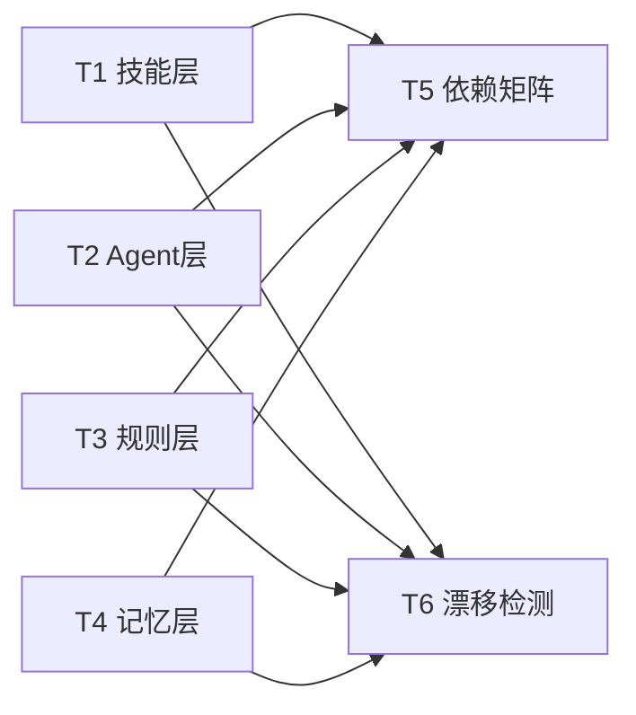
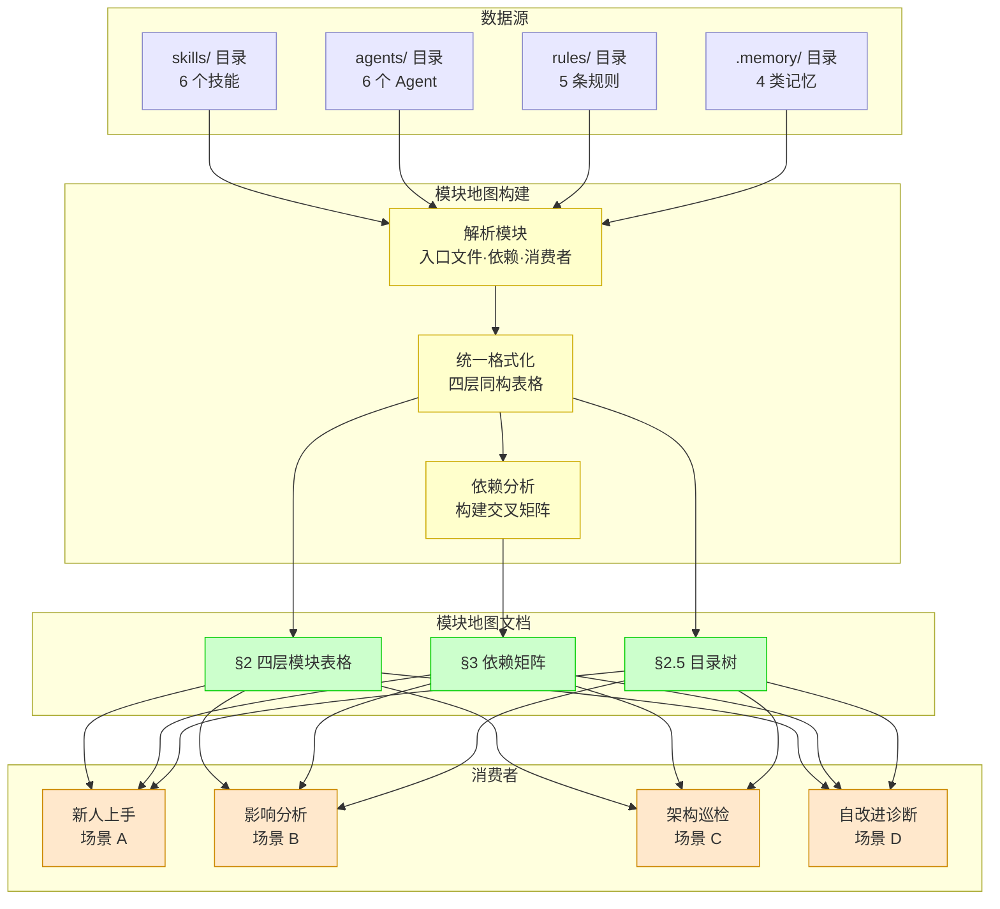
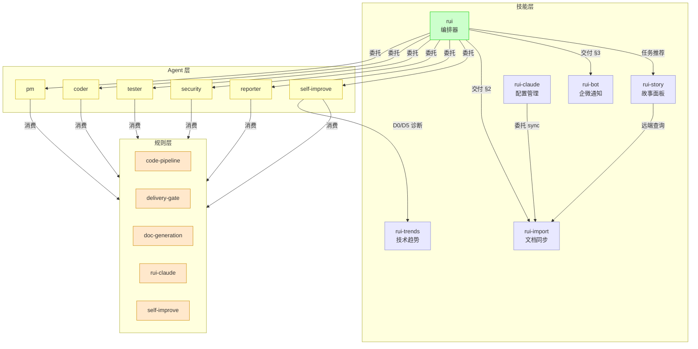
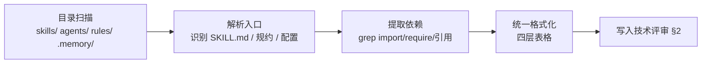
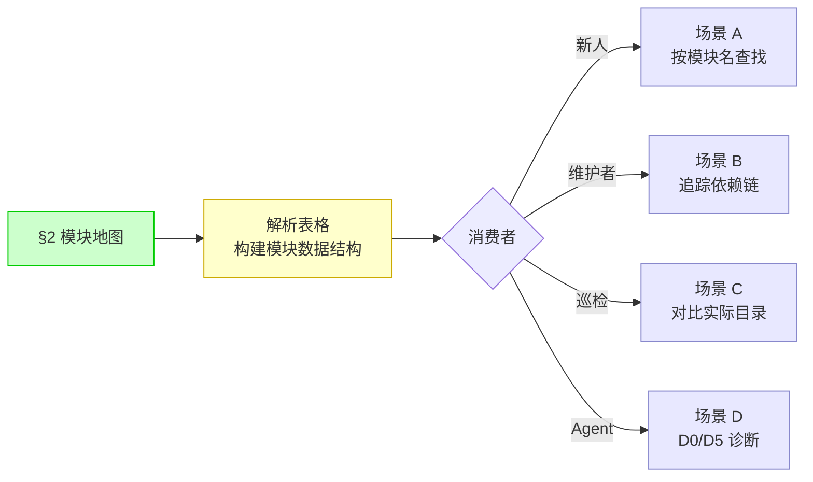
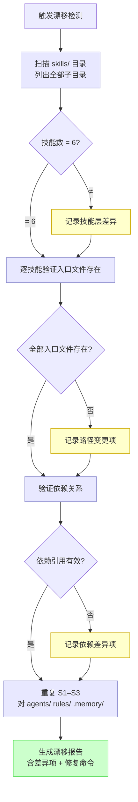

> | v1.0.0 | 2026-05-26 | deepseek-v4-pro | 🌿 feat/module-map | 📎 [CLAUDE.md](../../../CLAUDE.md) |

> **导航**: [← 使用场景](./使用场景.md) · [测试设计 →](./测试设计.md) · [安全审计 →](./安全审计.md)

> **来源引用**: 从 [故事任务](./故事任务.md) §2 FP1–FP7 + [使用场景](./使用场景.md) §2 场景详述推导技术方案。项目类型：meta。证据 Level A + 项目目录结构。

[§0 基线溯源](#sec0-trace) · [§1 系统架构](#sec1-arch) · [§2 模块地图](#sec2-module-map) · [§3 依赖矩阵](#sec3-deps) · [§4 数据流](#sec4-dataflow) · [§5 漂移检测](#sec5-drift) · [§6 评审清单](#sec6-checklist)

---

### 主要价值

- 🗺️ 四层统一格式 — 技能/Agent/规则/记忆层全部按"入口—依赖—消费者"模式映射
- 📊 依赖关系可验证 — 每条依赖标注 grep 验证命令，确保准确性
- 🔍 漂移检测自动化 — 模块清单对比逻辑 + 修复触发路径
- 🤖 自改进集成锚点 — D0/D5 诊断可直接消费模块地图结构化数据
- 📁 目录结构全览 — 项目文件树与模块归属一并呈现

---

<a id="sec0-trace"></a>

## §0 基线溯源

| 本设计章节 | 实现 故事任务 | 服务 使用场景 | 覆盖状态 |
|-----------|-------------|------------|---------|
| §2 模块地图 | Story 1 FP1–FP4 | 场景 A (新人定位) + 场景 B (影响分析) | 已对齐 |
| §3 依赖矩阵 | Story 1 FP5 | 场景 B (影响分析) + 场景 D (自改进消费) | 已对齐 |
| §4 数据流 | Story 1 FP7 | 场景 D (自改进消费) | 已对齐 |
| §5 漂移检测 | Story 2 FP6 | 场景 C (一致性校验) | 已对齐 |

### §0.1 设计决策

| 决策领域 | 选定方案 | 选择理由 | 实现 FP# |
|---------|---------|---------|---------|
| 模块地图存储 | 嵌入技术评审 §2 的 markdown 表格 | meta 项目，无数据库，markdown 即数据源 | FP1–FP4 |
| 依赖关系验证 | 每条依赖标注 grep 命令 | 可复现、可自动化，符合验现实原则 | FP5 |
| 漂移检测方式 | 手动对比 + rui update 触发修复 | meta 项目无 CI，走 rui 管线更新 | FP6 |
| 记忆层映射格式 | 与技能层统一使用"入口—依赖—消费者"模式 | 保持四层格式一致性 | FP4 |

### §0.2 任务规划

| ID | 描述 | 工作量 | 依赖 | 交付物 | Agent | 实现 FP# |
|----|------|--------|------|--------|-------|---------|
| T1 | 技能层模块地图（6 技能） | S | 无 | §2.1 技能层表格 | coder | FP1 |
| T2 | Agent 层模块地图（6 Agent） | S | 无 | §2.2 Agent 层表格 | coder | FP2 |
| T3 | 规则层模块地图（5 规则） | S | 无 | §2.3 规则层表格 | coder | FP3 |
| T4 | 记忆层模块地图（4 类型） | S | 无 | §2.4 记忆层表格 | coder | FP4 |
| T5 | 依赖矩阵 + mermaid 依赖图 | M | T1–T4 | §3 依赖矩阵 | coder | FP5 |
| T6 | 漂移检测方案 | M | T1–T4 | §5 漂移检测 | coder | FP6 |



---

<a id="sec1-arch"></a>

## §1 系统架构

### 效果示意



### 1.1 模块清单

| 变更类型 | 模块/文件 | 职责 |
|---------|----------|------|
| 新增 | `docs/故事任务面板/module-map/技术评审.md` | 模块地图技术方案——四层表格 + 依赖矩阵 + 漂移检测 |

---

<a id="sec2-module-map"></a>

## §2 模块地图

### 2.1 技能层（6 个）

| 技能 | 入口文件 | 核心依赖 | 下游消费者 |
|------|---------|---------|-----------|
| rui | `skills/rui/SKILL.md` | `formulas.md`, `coder.md`, `agents/*`, `rules/*`, `branch-check.mjs`, `recommend.mjs` | 所有 `/rui` 命令 → pm/coder/tester/security/self-improve agent 委托 |
| rui-import | `skills/rui-import/sync.mjs` | `API_X_TOKEN` (env), `api.effiy.cn`, `node-fetch` | rui 交付三步 (§2), rui-claude sync (委托同步), rui-story (远端查询) |
| rui-bot | `skills/rui-bot/send.mjs` | `config.json` (webhook URL), `API_X_TOKEN` (env), 企微 API | rui 交付三步 (§3), 通知日志写入 |
| rui-claude | `skills/rui-claude/SKILL.md` | `rui-import/sync.mjs` (文档同步委托), `API_X_TOKEN` (env) | `/rui-claude sync` 命令 |
| rui-story | `skills/rui-story/rui-story.mjs` | `collect.mjs`, `status.mjs`, `API_X_TOKEN` (env), `api.effiy.cn` | `/rui-story` 命令族, rui 任务推荐 (§0 面板同步) |
| rui-trends | `skills/rui-trends/SKILL.md` | `WebFetch` (agent 原生能力), GitHub/OSS Insight API | `/rui-trends` 命令, self-improve D0/D3/D5/D6 诊断 |

> **验证**: `grep -rl "入口文件\|sync.mjs\|SKILL.md" skills/` 可确认各技能入口文件存在。

### 2.2 Agent 层（6 个）

| Agent | 规约文件 | 触发上下文 | 输出 |
|-------|---------|-----------|------|
| pm | `agents/pm.md` | `/rui doc`, `/rui init`, `/rui doc --from-code`, `/rui doc --from-local` | 故事拆分, 影响分析, 优先级排序, 使用场景, 故事任务 |
| coder | `agents/coder.md` | `/rui code`, `/rui doc` (补齐设计文档), `/rui update` | 技术评审, 代码实现, 实施报告, 模块地图 |
| tester | `agents/tester.md` | Gate A (测试先行), Gate B (验证) | 测试设计, 测试报告, 门禁判定 |
| security | `agents/security.md` | `/rui doc` (安全审计), 技术评审完成后 | 独立安全审计, 威胁建模, 合规检查 |
| reporter | `agents/reporter.md` | 交付阶段, 管线完成 | 过程报告, 知识沉淀, 证据归档 |
| self-improve | `agents/self-improve.md` | `/rui yry` | 诊断 D0–D7, 改进提案, 版本升级, 模块地图消费 |

> **验证**: `ls agents/*.md` 确认 7 个文件（含 AGENT.md）存在。

### 2.3 规则层（5 条）

| 规则文件 | 约束范围 | 核心门禁 |
|---------|---------|---------|
| `rules/code-pipeline.md` | 分支隔离 (`feat/<name>`), Gate A/B, 逐模块 P0 清零 | `node skills/rui/branch-check.mjs` |
| `rules/delivery-gate.md` | 交付三步强制按序: hook-log → rui-import → rui-bot | `delivery_pipeline.*` 标记字段 |
| `rules/doc-generation.md` | 表达优先 (图→文本→表), P0 检查清单, F.meta/F.toc/F.nav/F.value | P0 检查清单 13 项 |
| `rules/self-improve.md` | D0–D7 诊断, E1–E4 评估, 经验技能化, 记忆压缩注入 | 无改进空间 / 深度上限终止 |
| `rules/rui-claude.md` | `.claude/` 目录操作边界, 禁止触及业务源码 | 仅操作 `.claude/` 内文件 |

> **验证**: `grep -c "^##\|^###" rules/*.md` 可确认各规则文件结构完整。

### 2.4 记忆层（4 类）

| 记忆类型 | 存储位置 | 数据格式 | 读写者 |
|---------|---------|---------|--------|
| user | `.memory/` 下 `user_*.md` 或 `user-*.md` | frontmatter (name, description, metadata.type) + markdown body | rui 管线 (写), Agent (读) |
| feedback | `.memory/` 下 `feedback-*.md` 或 `feedback_*.md` | frontmatter + body (rule + Why + How to apply) | rui 管线 (写), Agent (读) |
| project | `.memory/` 下 `project-*.md` 或 `project_*.md` | frontmatter + body (fact + Why + How to apply) | rui 管线 (写), Agent (读) |
| reference | `.memory/` 下 `reference-*.md` 或 `reference_*.md` | frontmatter + body (pointer to external system) | rui 管线 (写), Agent (读) |

> **验证**: `ls .memory/*.md` 可确认记忆文件存在。索引文件 `MEMORY.md` 为记忆目录的聚合入口。

### 2.5 目录结构全览

```
YrY/
├── CLAUDE.md                 ← 项目画像 + 铁律 + 约束
├── README.md                 ← 系统视图 + 领域语言
├── plugin.json               ← 插件元数据 + 版本号
├── skills/                   ← 6 个技能
│   ├── rui/                  ← SDLC 编排器（核心）
│   │   ├── SKILL.md          ← 命令面 + 编排骨架
│   │   ├── formulas.md       ← 故事文档公式
│   │   ├── coder.md          ← coder 数据契约
│   │   ├── ranking.md        ← 推荐评分框架
│   │   ├── help.mjs          ← 帮助输出
│   │   ├── recommend.mjs     ← 推荐数据采集
│   │   ├── branch-check.mjs  ← 分支隔离验证
│   │   ├── import-doc.mjs    ← 逐文件即时导入
│   │   ├── audit.mjs         ← 审计
│   │   └── proposals.mjs     ← 提案管理
│   ├── rui-import/           ← 文档同步到远端
│   │   ├── SKILL.md
│   │   ├── sync.mjs          ← 扫描+上传主入口
│   │   └── help.mjs
│   ├── rui-bot/              ← 企微通知
│   │   ├── SKILL.md
│   │   ├── send.mjs          ← 消息发送+日志追加
│   │   └── help.mjs
│   ├── rui-claude/           ← .claude/ 配置管理
│   │   ├── SKILL.md
│   │   └── help.mjs
│   ├── rui-story/            ← 故事面板管理
│   │   ├── SKILL.md
│   │   ├── rui-story.mjs     ← 面板命令主入口
│   │   ├── collect.mjs       ← 数据采集
│   │   ├── status.mjs        ← 状态判定
│   │   └── help.mjs
│   └── rui-trends/           ← 技术趋势分析
│       ├── SKILL.md
│       └── help.mjs
├── agents/                   ← 7 个 Agent 规约
│   ├── AGENT.md              ← 角色拓扑 + 行为纪律 + 设计原则
│   ├── pm.md                 ← 产品经理
│   ├── coder.md              ← 开发者
│   ├── tester.md             ← 测试者
│   ├── reporter.md           ← 报告者
│   ├── security.md           ← 安全审计者
│   └── self-improve.md       ← 自改进引擎
├── rules/                    ← 5 条管线约束
│   ├── code-pipeline.md      ← 分支隔离 + Gate A/B + P0 清零
│   ├── delivery-gate.md      ← 交付三步强制
│   ├── doc-generation.md     ← 文档生成约束
│   ├── rui-claude.md         ← .claude/ 配置操作边界
│   └── self-improve.md       ← 自改进诊断+评估
└── docs/故事任务面板/         ← 故事文档基线
    ├── rui/
    ├── rui-import/
    ├── rui-bot/
    ├── rui-claude/
    ├── rui-story/
    ├── rui-trends/
    ├── yry-arch/
    └── module-map/           ← 本文档所属故事
```

---

<a id="sec3-deps"></a>

## §3 依赖矩阵

### 3.1 技能间依赖

| | rui | rui-import | rui-bot | rui-claude | rui-story | rui-trends |
|---|:---:|:---:|:---:|:---:|:---:|:---:|
| **rui** | — | → 交付 §2 | → 交付 §3 | | → 任务推荐 | |
| **rui-import** | | — | | ← rui-claude 委托 | ← rui-story 查询 | |
| **rui-bot** | | | — | | | |
| **rui-claude** | | → sync 委托 | | — | | |
| **rui-story** | | → 远端查询 | | | — | |
| **rui-trends** | | | | | | — |

### 3.2 Agent 与技能/规则交叉依赖

| Agent | 触发技能 | 消费规则 |
|-------|---------|---------|
| pm | rui (doc/init/--from-code/--from-local) | doc-generation, code-pipeline |
| coder | rui (code/doc/update) | code-pipeline, doc-generation |
| tester | rui (Gate A, Gate B) | code-pipeline, doc-generation |
| security | rui (doc 安全审计阶段) | code-pipeline, doc-generation |
| reporter | rui (交付阶段) | delivery-gate, doc-generation |
| self-improve | rui (yry) | self-improve, code-pipeline, doc-generation |

### 3.3 模块依赖图



---

<a id="sec4-dataflow"></a>

## §4 数据流

### 4.1 模块地图构建流



### 4.2 模块地图消费流



---

<a id="sec5-drift"></a>

## §5 漂移检测

### 5.1 检测规则

| # | 检测项 | 检测方式 | 触发条件 | 修复命令 |
|---|--------|---------|---------|---------|
| D1 | 新增模块 | `ls skills/` vs 模块地图技能层表 | 目录中存在未在地图中列出的模块 | `/rui update module-map` 补充新模块条目 |
| D2 | 已删除模块 | 模块地图表 vs `ls skills/` | 地图中列出的模块在目录中不存在 | `/rui update module-map` 移除或标注废弃 |
| D3 | 入口路径变更 | 逐条 `ls <入口路径>` 验证 | 入口文件路径不存在 | `/rui update module-map` 更新路径 |
| D4 | 依赖关系变更 | grep 验证依赖引用 | 地图中的依赖关系在代码中找不到 | `/rui update module-map` 更新依赖列 |
| D5 | 层级模块数不一致 | 地图表行数 vs 实际目录文件数 | 数量不匹配 | 执行 D1+D2 检查确定具体差异 |

### 5.2 检测流程



---

<a id="sec6-checklist"></a>

## §6 评审清单

| # | 检查项 | 状态 |
|---|--------|:---:|
| 1 | 模块地图覆盖四层全部 21 模块（6 技能 + 6 Agent + 5 规则 + 4 记忆） | ✅ |
| 2 | 每模块条目含入口文件路径且路径可验证 | ✅ |
| 3 | 依赖矩阵覆盖技能间 + Agent-技能/规则交叉依赖 | ✅ |
| 4 | 模块依赖图 mermaid 可渲染 | ✅ |
| 5 | 目录结构树与实际一致 | ✅ |
| 6 | 漂移检测含 5 条检测规则 + 修复命令 | ✅ |
| 7 | 基线溯源表完整，覆盖故事任务全部 FP# | ✅ |
| 8 | 无硬编码密钥 | ✅ |

---

> | 日期 | 变更 | 触发 | 证据 |
> |------|------|------|------|
> | 2026-05-26 | 初始生成 — 四层模块地图 (21 模块) + 依赖矩阵 + 漂移检测方案 | module-map 故事基线建立 | 项目目录结构 + grep 验证 |
