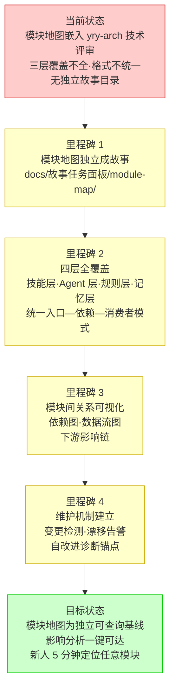
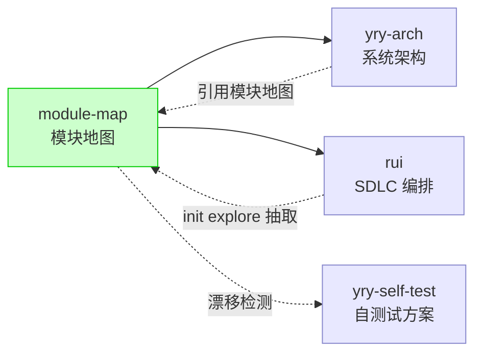

> | v1.0.0 | 2026-05-26 | deepseek-v4-pro | 🌿 feat/module-map | 📎 [CLAUDE.md](../../../CLAUDE.md) |

> **导航**: [使用场景 →](./使用场景.md)

> **来源引用**: 由 `/rui 添加模块地图的故事任务目录及内容` 触发。从 `skills/rui/SKILL.md` init explore 步骤中的模块地图抽取要求、`docs/故事任务面板/yry-arch/` 已有模块地图内容（Story 2）反推独立故事基线。证据 Level A + yry-arch 文档路径。

[§1 Story](#sec1-story) · [§2 Requirements](#sec2-requirements) · [§3 成功标准](#sec3-success) · [§4 范围边界](#sec4-scope) · [§5 AC](#sec5-ac) · [§6 风险与假设](#sec6-risks) · [§7 跨文档索引](#sec7-index) · [§R 关联故事](#secr-related)

---

### 需求概述

YrY 项目包含 6 个技能、6 个 Agent、5 条规则、4 类记忆——共 21+ 个模块。当前模块地图嵌入在 yry-arch 技术评审中，仅覆盖三层（技能/Agent/规则），缺失记忆层，且 Agent 层和规则层未遵循统一的"入口—依赖—消费者"模式。需要将模块地图提升为独立故事，建立四层完整、格式统一的模块拓扑视图，支撑影响分析、新人上手和自改进诊断。

### 效果示意

### 主要价值

- 🗺️ 四层统一拓扑 — 技能层·Agent 层·规则层·记忆层，全部按入口—依赖—消费者模式映射
- 🔗 依赖关系可视化 — 模块间依赖图为影响分析提供一键可达的决策依据
- 🔍 自改进诊断锚点 — 模块地图为 D0（基线偏离）和 D5（依赖退化）提供结构化参照
- 🚀 新人上手加速 — 5 分钟内定位任意模块的入口、职责和上下游关系
- 📋 架构一致性校验 — 模块地图与项目实际结构漂移时可自动检测告警

---

## §1 Story

### Story 1: 四层模块地图生成

作为项目维护者，我想要一张覆盖全部四层（技能/Agent/规则/记忆）的统一模块地图，以便快速定位任意模块的入口文件、核心依赖和下游消费者，支撑影响分析和新人上手。优先级 P0。范围边界：只读项目文件结构，不修改任何源码。依赖：项目目录结构可访问。

#### 范围外

- 不涉及源码修改或模块重构
- 不自动生成模块依赖图的可视化工具（由技术评审通过 mermaid 表达）

#### §1.1 User Operations

| # | 操作 | 触发条件 | 操作步骤 | 预期结果 |
|---|------|---------|---------|---------|
| 1 | 查看技能层地图 | 需要了解某个技能的入口和依赖 | 打开模块地图 → 定位技能层表格 → 按技能名查找 | 看到该技能的入口文件、核心依赖、下游消费者 |
| 2 | 查看 Agent 层地图 | 需要了解某个 Agent 的触发上下文 | 打开模块地图 → 定位 Agent 层表格 | 看到 Agent 规约文件、触发上下文、输出物 |
| 3 | 查看规则层地图 | 需要了解某条规则的约束范围 | 打开模块地图 → 定位规则层表格 | 看到规则文件、约束范围、核心门禁 |
| 4 | 查看记忆层地图 | 需要了解记忆类型和用途 | 打开模块地图 → 定位记忆层表格 | 看到记忆类型、存储位置、读写者 |
| 5 | 查看依赖矩阵 | 需要做影响分析 | 打开模块地图 → 定位依赖矩阵 | 看到模块间依赖关系全景 |

---

### Story 2: 模块地图维护与漂移检测

作为项目维护者，我想要模块地图随项目演进自动保持准确，以便地图始终反映项目实际结构，不致因文档过时产生误导。优先级 P1。范围边界：检测漂移后生成告警和修复建议，实际修复走 `/rui update module-map`。依赖：Story 1 完成，四层模块地图已生成。

#### 范围外

- 不自动修改模块地图内容（由 rui update 管线执行）
- 不自动触发代码重构

#### §1.1 User Operations

| # | 操作 | 触发条件 | 操作步骤 | 预期结果 |
|---|------|---------|---------|---------|
| 1 | 检测模块漂移 | 新增/删除/重命名模块后 | 执行模块地图一致性校验 → 对比地图与实际结构 | 列出漂移项：新增模块 / 已删除模块 / 路径变更 |
| 2 | 更新模块地图 | 漂移检测发现不一致 | 执行 `/rui update module-map` → 刷新模块地图 | 模块地图与实际结构一致 |
| 3 | 自改进诊断引用 | `/rui yry` 全量扫描时 | self-improve 读取模块地图作为 D0/D5 诊断基线 | 诊断结果含模块地图覆盖率指标 |

---

## §2 Requirements

### 功能点

| FP# | 描述 | 输入 | 输出 | 错误行为 | 优先级 |
|-----|------|------|------|---------|--------|
| FP1 | 技能层映射 — 6 个技能的入口文件、核心依赖、下游消费者 | skills/ 目录结构 | 技能层表格（入口\|依赖\|消费者） | 技能目录不可读时标 C 级 | P0 |
| FP2 | Agent 层映射 — 6 个 Agent 的规约文件、触发上下文、输出 | agents/ 目录结构 | Agent 层表格（规约\|触发\|输出） | Agent 规约缺失时标 C 级 | P0 |
| FP3 | 规则层映射 — 5 条规则的规则文件、约束范围、核心门禁 | rules/ 目录结构 | 规则层表格（文件\|范围\|门禁） | 规则文件缺失时标 C 级 | P0 |
| FP4 | 记忆层映射 — 4 类记忆的类型名、存储位置、读写者 | .memory/ 目录 + CLAUDE.md | 记忆层表格（类型\|位置\|读写者） | 记忆目录不存在时标 C 级 | P1 |
| FP5 | 依赖矩阵 — 模块间依赖关系全景（谁依赖谁） | 四层模块清单 | 交叉依赖矩阵表 + mermaid 依赖图 | 模块数 ≤ 3 时不生成矩阵 | P0 |
| FP6 | 模块漂移检测 — 对比地图与实际目录结构 | 模块地图 + 当前目录扫描 | 漂移项列表（新增/删除/变更） | 扫描失败时告警不阻断 | P1 |
| FP7 | 模块总数与覆盖率统计 — 统计各层模块数量与覆盖率 | 四层模块清单 | 覆盖率报告（实际/已映射/覆盖率） | 覆盖率 < 100% 时标注未映射项 | P1 |

### 业务规则

| R# | 描述 | 校验方式 | 证据级别 |
|----|------|---------|---------|
| R1 | 模块地图必须覆盖四层全部模块，无遗漏 | 对比 skills/ agents/ rules/ 目录文件数 | B |
| R2 | 每个模块条目必须包含入口文件（相对路径），不可为目录级描述 | 检查每行路径是否指向具体文件 | B |
| R3 | 依赖关系必须是可验证的（通过 grep import/require 或规约中的交叉引用确认） | grep 验证关键依赖路径 | B |
| R4 | 模块地图格式统一：技能层和记忆层使用"入口\|依赖\|消费者"三列模式 | 检查表头一致性 | B |

### 数据约束

| 约束 | 类型 | 范围/格式 | 来源 |
|------|------|----------|------|
| 模块名称 | string | 技能/Agent/规则使用 kebab-case 英文名，记忆使用中文类型名 | 项目命名规范 |
| 入口文件路径 | string | 相对于项目根的路径，指向具体文件（非目录） | 项目文件系统 |
| 模块层级 | enum | `skill` / `agent` / `rule` / `memory` | 四层拓扑模型 |
| 覆盖率 | number | 0–100，已映射模块数 / 实际模块数 | 逐层统计 |

---

## §3 成功标准

| SC# | 描述 | 度量方式 | 目标值 | 优先级 | 关联 FP# |
|-----|------|---------|--------|--------|---------|
| SC1 | 模块地图覆盖全部四层 21+ 个模块 | 逐层计数：6 技能 + 6 Agent + 5 规则 + 4 记忆 = 21 | 100% 覆盖 | P0 | FP1–FP4 |
| SC2 | 每个模块条目的入口文件可在项目目录中找到 | 逐条验证文件路径存在 | 100% 可验证 | P0 | FP1–FP4 |
| SC3 | 新人可在 5 分钟内通过模块地图定位任意模块 | 给定模块名 → 计时查找入口文件 + 依赖 + 消费者 | ≤ 5 分钟 | P1 | FP1–FP5 |
| SC4 | 模块依赖矩阵中每条依赖关系可 grep 验证 | 逐条 grep 验证依赖路径引用 | 100% 可验证 | P1 | FP5 |
| SC5 | 模块漂移检测在项目结构变更后可发现不一致 | 新增一个测试模块 → 运行检测 → 确认检测到 | 全部漂移项检出 | P1 | FP6 |

---

## §4 范围边界

### 范围内

| # | 条目 | 关联 FP# | 边界说明 |
|---|------|---------|---------|
| 1 | 四层模块地图（技能/Agent/规则/记忆）| FP1–FP4 | 每模块标注入口、依赖、消费者 |
| 2 | 模块依赖矩阵 | FP5 | 交叉引用表 + mermaid 依赖图 |
| 3 | 模块总数与覆盖率统计 | FP7 | 逐层计数，覆盖率自动计算 |
| 4 | 漂移检测方案 | FP6 | 对比规则 + 触发条件 + 修复路径 |
| 5 | 模块地图故事目录下 5 文档基线 | — | 故事任务 + 使用场景 + 技术评审 + 测试设计 + 安全审计 |

### 范围外

| # | 条目 | 排除原因 | 替代方案 |
|---|------|---------|---------|
| 1 | 自动化模块依赖解析工具 | 需要静态分析工具链，超出 meta 项目范围 | 手动维护 + grep 验证 |
| 2 | 模块地图的图形化 UI | 属于前端展示层 | mermaid 依赖图嵌入技术评审 |
| 3 | 其他故事（rui/rui-bot 等）的模块级文档更新 | 属于各自故事的维护范围 | 通过漂移检测报告关联故事 |
| 4 | 模块地图的实时自动更新 | 无文件系统 watch 机制 | rui update + yry 自改进触发 |

---

## §5 AC

| AC# | Given | When | Then | 门禁 |
|-----|-------|------|------|------|
| AC1 | 项目 skills/ agents/ rules/ 目录可访问 | coder 执行模块地图生成 | 产生四层模块地图，每层表格包含全部模块 | Gate A |
| AC2 | 四层模块地图已生成 | 验证覆盖率 | 技能层 6/6、Agent 层 6/6、规则层 5/5、记忆层 4/4 | Gate A |
| AC3 | 模块地图已生成 | 逐条验证入口文件路径 | 每个模块条目指向的文件在项目中存在 | Gate A |
| AC4 | 模块清单已确定 | 生成依赖矩阵 | 交叉引用表中每条依赖关系可通过 grep 确认 | Gate A |
| AC5 | 模块地图已生成 | 生成漂移检测方案 | 包含检测规则、触发条件、修复命令 | Gate A |
| AC6 | 模块地图文档基线完整 | 执行 P0 检查清单 | 5 文档全部通过 P0 检查 | Gate B |
| AC7 | 项目结构发生变更（模块增删/重命名）| 执行漂移检测 | 输出漂移项列表，含修复建议 | Gate B |

---

## §6 风险与假设

| # | 风险/假设 | 类型 | 可能性 | 影响 | 缓解/验证策略 | 关联 FP# |
|---|----------|------|--------|------|-------------|---------|
| 1 | 模块地图随项目演进快速过时 | 风险 | H | H | 建立漂移检测机制（FP6），yry 自改进 D0/D5 诊断触发更新 | FP6 |
| 2 | 依赖关系手动维护不准确 | 风险 | M | M | 每条依赖关系标注 grep 验证命令；技术评审含可验证的依赖路径 | FP5 |
| 3 | 记忆层结构不固定（用户自由扩展记忆类型）| 风险 | L | L | 记忆层按当前 4 类映射，新类型出现时触发漂移检测 | FP4 |
| 4 | 模块地图与 yry-arch 技术评审中的模块地图内容重复 | 风险 | M | L | module-map 为独立故事全景，yry-arch 技术评审引用 module-map 而非重复 | FP1–FP7 |
| 5 | 项目目录结构反映实际架构 | 假设 | — | — | 通过目录遍历 + grep 验证模块边界 | FP1–FP4 |
| 6 | 模块的入口文件在规约中有明确定义 | 假设 | — | — | 每技能有 SKILL.md，每 Agent 有 .md 规约 | FP1–FP3 |

---

## §7 跨文档索引

| 本文档章节 | 基线内容 | 下游文档编号 | 预期覆盖 | 状态 |
|-----------|---------|------------|---------|------|
| §1 Story 1 | 四层模块地图生成 | 使用场景 §2 场景详述 | 模块定位·依赖追踪·新人上手·漂移检测 4 场景 | 待生成 |
| §1 Story 2 | 模块地图维护与漂移检测 | 使用场景 §2 场景详述 | 漂移检测与修复场景 | 待生成 |
| §2 FP1–FP4 | 四层模块映射功能点 | 技术评审 §2 模块地图 | 四层完整表格 + 依赖矩阵 + 目录树 | 待生成 |
| §2 FP5 | 依赖矩阵 | 技术评审 §6 依赖矩阵 | 交叉引用表 + mermaid 依赖图 | 待生成 |
| §2 FP6 | 漂移检测 | 技术评审 §8 性能与限制 | 检测规则 + 触发条件 + 修复路径 | 待生成 |
| §5 AC1–AC5 | 验收标准 | 测试设计 §0 §2 | 测试用例逐一覆盖 | 待生成 |
| §6 风险 | 安全面相关风险 | 安全审计 §2 威胁建模 | 模块地图信息泄露 + 篡改风险评估 | 待生成 |

---

## §R 关联故事

| 关联故事 | 关系类型 | 说明 |
|---------|---------|------|
| yry-arch | 引用/被引用 | yry-arch 技术评审 §2 引用模块地图内容；module-map 独立后 yry-arch 改为引用 module-map |
| rui | 生产者 | rui init explore 步骤抽取模块地图为后续架构故事提供事实基线 |
| yry-self-test | 消费者 | 漂移检测方案为自测试提供模块结构一致性检查用例 |

---

> | 日期 | 变更 | 触发 | 证据 |
> |------|------|------|------|
> | 2026-05-26 | 初始生成 — 2 Story（四层模块地图生成 + 维护与漂移检测），7 FP，5 SC，7 AC | /rui 添加模块地图的故事任务目录及内容 | yry-arch/技术评审.md §2 模块地图 |
