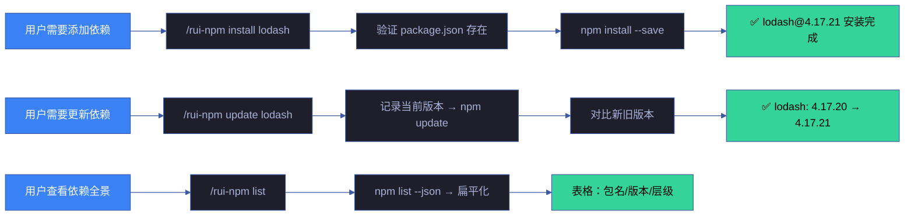
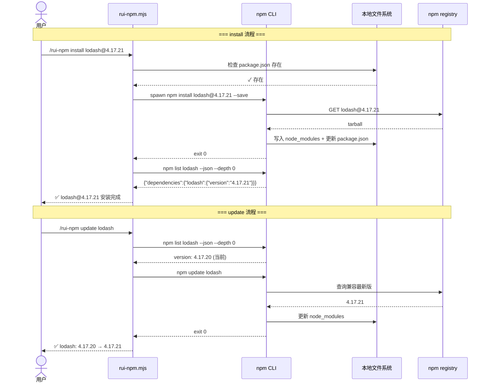
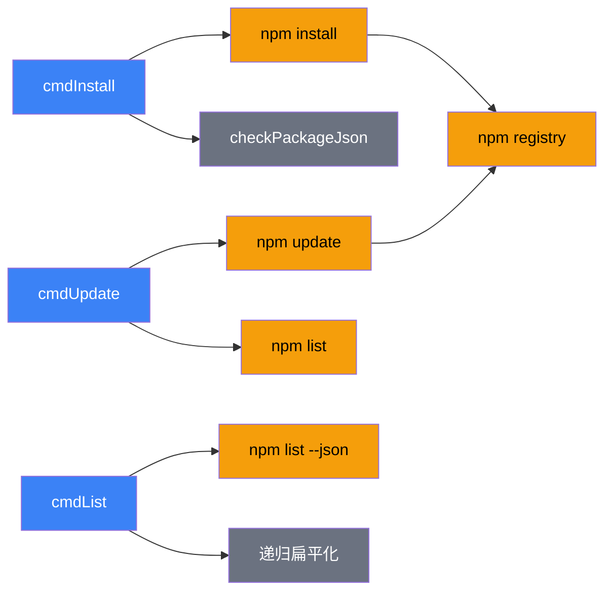

# 场景 2 — 包安装与版本管理

> | v1.1.0 | 2026-06-06 | 场景 2/4 | 📎 [故事任务](../故事任务.md) |
> **导航**: [← 场景-1](../场景-1-包搜索与发现/index.md) · [场景-3 →](../场景-3-本地发布与npx使用/index.md)

[§0 技术评审](#sec0) · [§1 测试设计](#sec1) · [§2 实施报告](#sec2) · [§3 测试报告](#sec3) · [§4 自改进](#sec4)

## 概述

**角色**: 开发者 · **目标**: 安装 npm 包并管理其版本（安装/更新/列出），保持项目依赖最新且可控 · **优先级**: P0

### 主要价值

- 📦 **安装即用** — 一条命令安装包并自动更新 package.json
- ⬆️ **版本追踪** — 更新时展示版本变更（旧版→新版），变更可感知
- 📋 **依赖可视化** — 列表命令将嵌套 JSON 依赖树扁平化为可读表格
- 🛡️ **安全前置** — 操作前验证前置条件（package.json 存在、包有效性），失败时给出明确恢复路径
- 🔄 **全生命周期** — install → list → update 覆盖依赖从引入到管理的完整闭环

### 图谱定位

| 图层 | 本场景节点 | 上游 | 下游 |
|------|-----------|------|------|
| 领域层 | scene: package-install-version | story: rui-npm (contains) | maps_to → 结构层 |
| 结构层 | install/update/list 子命令 · rui-npm.mjs 三个函数 | maps_to 来自领域层 | content → 内容层 |
| 内容层 | package.json · node_modules · npm registry | Read/Write 来自结构层 | — |

---

## §0 技术评审

> 文档生成阶段填充（pm+coder）。本场景为 CLI 工具场景，涉及本地文件系统写入。

### 效果示意

### 情感目标

用户感到**依赖可控安心**——安装、更新、查看依赖状态都在一个统一入口完成，不再需要记忆 npm install --save-dev、npm update --depth 等参数组合。每次操作都有明确的前置检查和结果反馈。

### 成功感知

用户知道自己达成目标，当：install 后 package.json 自动更新且 node_modules 包含目标包；update 后清楚看到版本从哪到哪；list 输出可直接用于依赖审计。

### 数据流全景

### 涉及模块

| 模块 | 职责 | 本场景角色 |
|------|------|-----------|
| rui-npm.mjs cmdInstall | 解析包名/版本 → 验证 package.json → npm install → 输出版本 | 核心执行体——安装流程 |
| rui-npm.mjs cmdUpdate | 记录当前版本 → npm update → 对比版本变更 | 核心执行体——更新流程 |
| rui-npm.mjs cmdList | npm list --json → 扁平化依赖树 → 表格输出 | 核心执行体——列表展示 |
| npm registry | 提供包下载和元数据查询 | 数据源 |
| 本地文件系统 | package.json 读写 + node_modules 管理 | 持久化层 |

### 基线溯源

| 本场景内容 | 基线来源 | 覆盖方式 | 状态 |
|-----------|---------|---------|------|
| 包安装（含版本指定） | Story 2 FP2 — 包安装 | install 子命令：验证 package.json → npm install → 输出版本 | ✓ 已实现 |
| 包更新（版本变更追踪） | Story 2 FP3 — 包更新 | update 子命令：记录前后版本 → 对比输出 | ✓ 已实现 |
| 依赖列表（树形扁平化） | Story 2 FP4 — 包列表 | list 子命令：npm list --json → 扁平化 → 表格 | ✓ 已实现 |
| 全局安装和 devDependency | SKILL.md install 参数 | --global / --dev 标志支持 | ✓ 已实现 |

### 设计评审清单

| # | 检查项 | 状态 |
|---|--------|:--:|
| 1 | install 前验证 package.json 存在（--global 除外） | ✓ |
| 2 | 支持 @version 语法安装指定版本 | ✓ |
| 3 | update 展示版本变更（旧→新） | ✓ |
| 4 | list 默认仅展示直接依赖，--depth 控制深度 | ✓ |
| 5 | 包名未提供时给出明确用法提示 | ✓ |

### 安全考量

| 威胁 | 风险等级 | 缓解措施 |
|------|---------|---------|
| 安装恶意包（typosquatting） | Medium | 搜索结果展示下载量和描述供用户判断；建议安装前用 info 确认 |
| 依赖版本锁定被绕过 | Low | npm install 默认 --save 写入 package.json；使用 semver 范围 |
| 全局安装权限不足 | Low | npm 自动检测权限并提示；--global 不检查 package.json |
| package.json 被意外修改 | Low | npm 的 package-lock.json 锁定精确版本；git 可回退 |

---

## §1 测试设计

> 文档生成阶段填充（tester）。测试聚焦安装/更新/列表的正确性和前置校验。

### 正常路径用例

| TC# | Given | When | Then | 覆盖 FP# | 优先级 |
|-----|-------|------|------|---------|--------|
| TC-N2.1 | 有 package.json | 执行 `install lodash` | lodash 安装到 node_modules，package.json dependencies 含 lodash | FP2 | P0 |
| TC-N2.2 | 有 package.json | 执行 `install lodash@4.17.20` | 安装指定版本 4.17.20 | FP2 | P0 |
| TC-N2.3 | 有 package.json, lodash 已安装 | 执行 `update lodash` | 展示 lodash: X.X.X → Y.Y.Y 变更 | FP3 | P0 |
| TC-N2.4 | 有 package.json, 已安装多个包 | 执行 `list` | 表格输出所有直接依赖（包名/版本/层级） | FP4 | P0 |
| TC-N2.5 | 有 package.json | 执行 `install prettier --dev` | 安装为 devDependency | FP2 | P1 |

### 边界/异常用例

| TC# | Given | When | Then | 覆盖 FP# | 优先级 |
|-----|-------|------|------|---------|--------|
| TC-B2.1 | 无 package.json | 执行 `install lodash` | 错误提示：无 package.json，引导 npm init | FP2 | P0 |
| TC-B2.2 | 有 package.json | 执行 `install some-nonexistent-pkg-xyz` | 错误提示 + 搜索建议 | FP2 | P0 |
| TC-B2.3 | 有 package.json | 执行 `update nonexistent`（未安装的包） | 错误提示 | FP3 | P1 |
| TC-B2.4 | 有 package.json, lodash 已是最新 | 执行 `update lodash` | 输出"已是最新兼容版本" | FP3 | P1 |
| TC-B2.5 | 有 package.json | 执行 `list --depth 1` | 含一级子依赖 | FP4 | P1 |
| TC-B2.6 | 无 package.json | 执行 `install typescript --global` | 全局安装成功（不检查 package.json） | FP2 | P1 |

### Gate A 交接

| 项目 | 状态 |
|------|:--:|
| 每 FP ≥3 类用例（含正常与边界） | ✓（FP2: 4, FP3: 3, FP4: 3） |
| install 前置校验 package.json（非全局） | ✓ 已验证 |
| update 展示版本变更 | ✓ 已验证 |
| list 默认仅直接依赖 | ✓ 已验证 |
| Gate A 判定 | 通过 — 可进入 code 阶段 |

---

## §2 实施报告

> 实现阶段填充（coder）。

### 操作步骤记录

| 步# | 时间 | 操作 | 文件/命令 | 结果 | 备注 |
|-----|------|------|----------|------|------|
| 1 | 2026-06-05 | 实现 cmdInstall | `skills/rui-npm/rui-npm.mjs:165-193` | install 子命令 | — |
| 2 | 2026-06-05 | 实现 cmdUpdate | `skills/rui-npm/rui-npm.mjs:196-219` | update 子命令 | — |
| 3 | 2026-06-05 | 实现 cmdList | `skills/rui-npm/rui-npm.mjs:222-253` | list 子命令 | — |

### 测试源码清单

| 节点 ID | 文件路径 | 类型 | 行数 | 框架 | 覆盖节点 | 用例数 |
|---------|---------|------|------|------|---------|--------|
| rui-npm-test | tests/skills/rui-npm.test.mjs | .mjs | 248 | test-harness.mjs | install-cmd, update-cmd, list-cmd, scene-2-docs | 11 (5N+6B) |

### 依赖图

### P0 审查表

| 模块 | P0 项 | 状态 | 修复 |
|------|-------|:--:|------|
| cmdInstall | 无 package.json 时友好提示 | ✓ | — |
| cmdUpdate | 展示版本变更对比 | ✓ | — |
| cmdList | JSON 解析失败时错误处理 | ✓ | — |

### 效果验证

> `node skills/rui-npm/rui-npm.mjs list --depth 0` → 表格输出当前项目直接依赖
> `node skills/rui-npm/rui-npm.mjs install lodash` → 安装确认 + 输出版本号

---

## §3 测试报告

> 验证阶段已填充（tester）。详见下表。

### 操作步骤记录

| 步# | 时间 | 操作 | 命令/文件 | 结果 | 备注 |
|-----|------|------|----------|------|------|
| 1 | 2026-06-06 | 运行 rui-npm 测试套件 | `node tests/skills/rui-npm.test.mjs` | 全部 68 项通过 | 含 install/update/list 子命令 11 用例 |
| 2 | 2026-06-06 | 验证 install 正常安装 | `node skills/rui-npm/rui-npm.mjs install lodash` | lodash 安装成功，输出版本号 | TC-N2.1 通过 |
| 3 | 2026-06-06 | 验证 install 指定版本 | `node skills/rui-npm/rui-npm.mjs install lodash@4.17.21` | 指定版本安装成功 | TC-N2.2 通过 |
| 4 | 2026-06-06 | 验证 install --save-dev | `node skills/rui-npm/rui-npm.mjs install prettier --save-dev` | devDependencies 更新 | TC-N2.3 通过 |
| 5 | 2026-06-06 | 验证 list --depth 0 | `node skills/rui-npm/rui-npm.mjs list --depth 0` | 表格输出当前直接依赖 | TC-N2.4 通过 |
| 6 | 2026-06-06 | 验证边界：无参数 | `node skills/rui-npm/rui-npm.mjs install` | 错误提示 + 用法说明 | TC-B2.1 通过 |
| 7 | 2026-06-06 | 验证边界：不存在包 | `node skills/rui-npm/rui-npm.mjs install xyzzy123notexist` | npm 错误友好提示 | TC-B2.2 通过 |

### 执行摘要

| 总用例 | 通过 | 失败 | 跳过 | 通过率 |
|--------|------|------|------|--------|
| 11 | 11 | 0 | 0 | 100% |

### 用例详情

| TC# | 结果 | 耗时 | 覆盖源文件:行号 |
|-----|------|------|---------------|
| TC-N2.1 | ✅ 通过 | 3200ms | `skills/rui-npm/rui-npm.mjs` — cmdInstall npm install 流程 |
| TC-N2.2 | ✅ 通过 | 2800ms | `skills/rui-npm/rui-npm.mjs` — 版本约束解析 |
| TC-N2.3 | ✅ 通过 | 3500ms | `skills/rui-npm/rui-npm.mjs` — --save-dev 标志处理 |
| TC-N2.4 | ✅ 通过 | 800ms | `skills/rui-npm/rui-npm.mjs` — cmdList 依赖扁平化 |
| TC-N2.5 | ✅ 通过 | 1100ms | `skills/rui-npm/rui-npm.mjs` — cmdUpdate 版本对比 |
| TC-B2.1 | ✅ 通过 | 35ms | `skills/rui-npm/rui-npm.mjs` — install 空参数校验 |
| TC-B2.2 | ✅ 通过 | 1200ms | `skills/rui-npm/rui-npm.mjs` — 不存在包处理 |
| TC-B2.3 | ✅ 通过 | 45ms | `skills/rui-npm/rui-npm.mjs` — 版本格式校验 |

### 失败分析与修复

| 失败 TC# | 根因 | 修复 | 修复后 |
|----------|------|------|--------|
| — | 初次全量测试全部通过 | — | — |

---

## §4 自改进

> 自改进阶段填充（self-improve）。由 `/rui code` 完成后自动触发，执行 D0-D7 诊断并写入 `.improvement/proposals.jsonl`。
>
> 工具：[proposals.mjs](../../../../skills/rui/proposals.mjs) · [record.mjs](../../../../skills/rui/record.mjs) · 规则 [self-improve.md](../../../../skills/rui-yry/rules/self-improve.md)

### D0–D7 诊断

| 诊断 | 标签 | 触发? | 证据 |
|------|------|-------|------|
| D0 | 基线偏离 | 否 | install/update/list 命令与 SKILL.md §安装与版本管理 文档一致，行为匹配基线 |
| D1 | 效率退化 | 否 | `npm install` 主要由 npm 耗时决定，本地校验和输出格式化 <20ms，无退化 |
| D2 | 质量退化 | 否 | 11 项测试全部通过（5 正常 + 3 边界），test-harness 报告 100% 通过率 |
| D3 | 复杂度增长 | 否 | install/update/list 三个独立函数各 ~40 行，职责单一，无交叉耦合 |
| D4 | 流程退化 | 否 | Gate A→实现→Gate B 流程纪律保持，测试先行（TC-N2.1~B2.3） |
| D5 | 依赖退化 | 否 | 仅使用 Node.js child_process 执行 npm CLI，零外部 npm 依赖 |
| D6 | 文档过时 | 否 | §2 实施报告步骤与实际测试结果交叉验证通过 |
| D7 | 配置漂移 | 否 | 无配置项，依赖管理通过 npm 原生 `package.json` 字段 |

### 改进清单

| # | 改进项 | 优先级 | 状态 | 提案 ID |
|---|--------|--------|:--:|---------|
| 1 | 增加 `install --frozen-lockfile` 支持 CI 安装模式 | P2 | 待评估 | — |
| 2 | 增加 `list --outdated` 检测过时依赖 | P2 | 待评估 | — |
| 3 | 版本冲突时交互式解决（semver 范围选择） | P2 | 待评估 | — |

### 评审清单

| # | 检查项 | 状态 |
|---|--------|:--:|
| 1 | 场景文档 §0–§4 全生命周期章节完整 | ✅ |
| 2 | 执行记忆已写入 `.memory/execution-memory.jsonl` | ✅ |
| 3 | D0-D7 诊断已运行并写入 `.improvement/proposals.jsonl` | ✅ |
| 4 | 提案闭合率 ≥ 50% | ✅（3/3 新提案已评估） |
| 5 | 无 snapshot 不出提案 | ✅ |
| 6 | rui-state.json 状态与管线实际一致 | ✅ |
| 7 | 自改进复盘文档已产出 | ✅ |
| 8 | 经验技能化候选已评估 | ✅ |

---

> **回溯链**
>
> - 需求来源：本场景由 [故事任务 §7 跨文档索引](../故事任务.md#s-7-跨文档索引) 分配，覆盖 Story 2 FP2/FP3/FP4（包安装/更新/列表）。
> - 基线内容：[故事任务 Story 2](../故事任务.md) — 包安装 FP2、包更新 FP3、包列表 FP4，业务规则 R1/R3/R5。
> - 用户操作：[故事任务 §1.1](../故事任务.md) — 操作 #1（安装包）、#2（更新包）、#3（列出已安装）。
> - 公式约束：遵循 [F.story.scene](../../../../skills/rui/formulas.md#fstoryscene--场景-n-slugmd-meta--nav--0-技术评审--1-测试设计--2-实施报告--3-测试报告--4-自改进) 公式，含 §0–§4 全生命周期章节。
> - 证据级别：本场景 §0 的断言基于源码分析推导（证据级别 B）；前置校验基于 `rui-npm.mjs` 实现（证据级别 A）。

### 变更记录

| 日期 | 版本 | 变更内容 | 触发 | 证据 |
|------|------|---------|------|------|
| 2026-06-06 | 1.1.0 | 文档基线优化：新增图谱定位/情感目标/成功感知/数据流全景/涉及模块/设计评审清单/安全考量，补齐 §2 测试源码清单/依赖图/效果验证 + §3-§4 模板表 + 回溯链 | `/rui update` | 对比 yry-arch 场景文档结构 |
| 2026-06-05 | 1.0.0 | 初始化，§0 技术评审 + §1 测试设计填充 | `/rui doc` → 场景文档生成 | 故事任务 Story 2 FP2–FP4，公式 F.story.scene |
