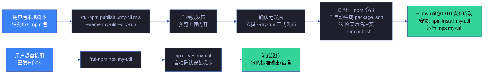
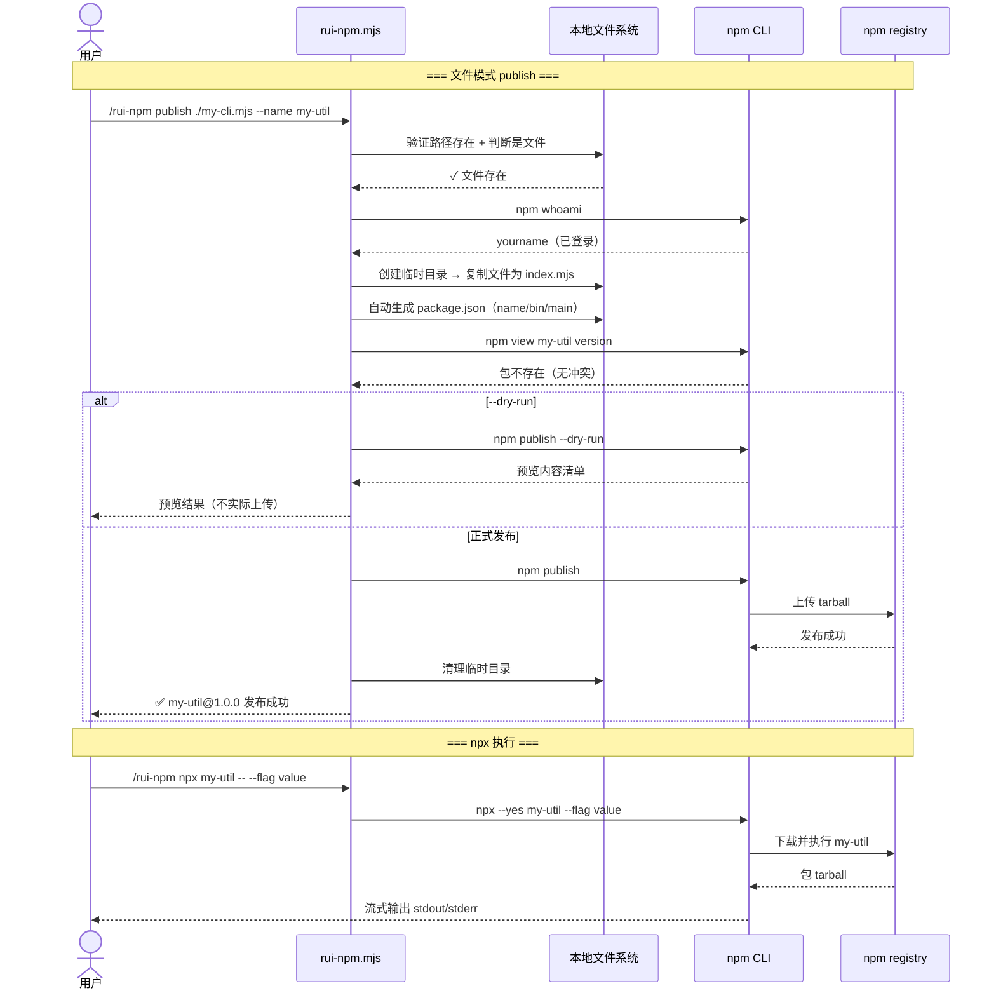
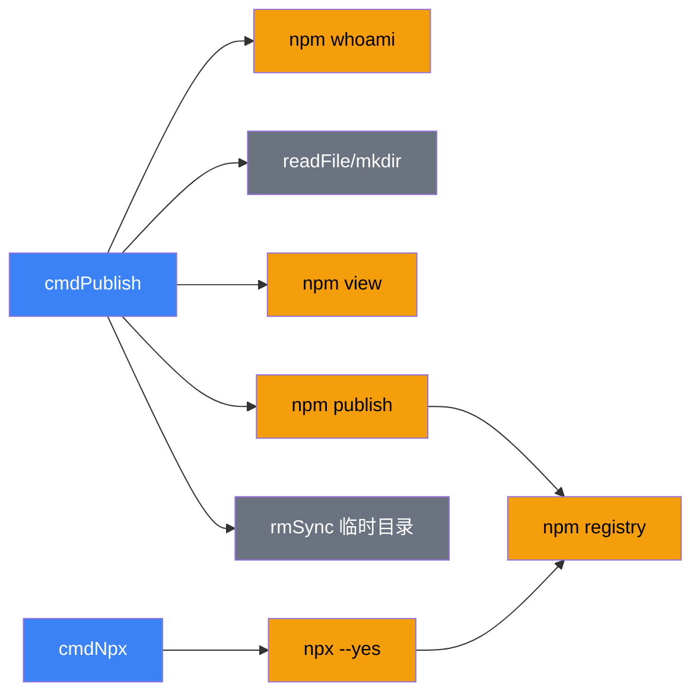

# 场景 3 — 本地发布与 npx 使用

> | v1.1.0 | 2026-06-06 | 场景 3/4 | 📎 [故事任务](../故事任务.md) |
> **导航**: [← 场景-2](../场景-2-包安装与版本管理/index.md) · [场景-4 →](../场景-4-包信息审计与卸载/index.md)

[§0 技术评审](#sec0) · [§1 测试设计](#sec1) · [§2 实施报告](#sec2) · [§3 测试报告](#sec3) · [§4 自改进](#sec4)

## 概述

**角色**: 开发者 · **目标**: 将本地文件或目录快速发布为 npm 包，然后直接用包名引用或通过 npx 执行 · **优先级**: P0

### 主要价值

- 🚀 **即发即用** — 本地脚本写完立即发布，同会话中即可 npx 使用
- 🤖 **自动脚手架** — 无需手动创建 package.json，自动生成含 bin 入口的配置
- 🛡️ **安全前置** — 发布前校验 npm 登录状态 + registry 命名冲突检测
- 🧪 **干运行支持** — `--dry-run` 模拟发布流程，预览上传内容，避免意外泄露敏感文件
- 🔄 **双模式适配** — 文件模式（单文件 CLI 工具，自动生成 package.json）和目录模式（多文件库，保留已有配置）

### 图谱定位

| 图层 | 本场景节点 | 上游 | 下游 |
|------|-----------|------|------|
| 领域层 | scene: local-publish-npx | story: rui-npm (contains) | maps_to → 结构层 |
| 结构层 | publish/npx 子命令 · rui-npm.mjs cmdPublish/cmdNpx | maps_to 来自领域层 | content → 内容层 |
| 内容层 | npm registry · npm login 状态 · 本地文件系统 | Read/Write 来自结构层 | — |

---

## §0 技术评审

> 文档生成阶段填充（pm+coder）。本场景涉及文件系统读写和网络发布，安全面需独立审计。

### 效果示意

### 情感目标

用户感到**发布零阻力**——写完脚本到发布为 npm 包只需一条命令，不需要离开编辑器去配置 package.json、处理 npm login、手动 publish。封装了所有繁琐步骤，反馈清晰（包名/版本/安装命令/运行命令）。

### 成功感知

用户知道自己达成目标，当：publish 后看到 `✅ my-util@1.0.0 发布成功` 和安装/运行命令提示；npx 后看到包的正常输出；`--dry-run` 预览内容与实际期望一致。

### 数据流全景

### 涉及模块

| 模块 | 职责 | 本场景角色 |
|------|------|-----------|
| rui-npm.mjs cmdPublish | 路径验证 → npm 登录检查 → package.json 生成 → 冲突检测 → npm publish | 核心执行体——发布全流程 |
| rui-npm.mjs cmdNpx | 包名验证 → npx --yes 执行 → 流式透传输出 | 核心执行体——npx 执行 |
| npm registry | 接收包发布，提供 npx 下载和执行 | 远端平台 |
| 本地文件系统 | 临时目录创建/清理，package.json 读写 | 临时工作区 |
| npm 登录状态 | npm whoami 验证身份 | 认证层 |

### 基线溯源

| 本场景内容 | 基线来源 | 覆盖方式 | 状态 |
|-----------|---------|---------|------|
| 本地文件发布（自动 gen package.json） | Story 3 FP7 — 本地发布 | publish 子命令：文件模式自动创建临时目录 + 生成 package.json | ✓ 已实现 |
| 本地目录发布（保留已有配置） | Story 3 FP7 — 本地发布 | publish 子命令：目录模式验证 package.json 后发布 | ✓ 已实现 |
| npx 远程执行 | Story 3 FP8 — npx 执行 | npx 子命令：npx --yes 自动确认 + 流式透传 | ✓ 已实现 |
| 干运行模式 | SKILL.md publish 参数 | --dry-run 标志：npm publish --dry-run | ✓ 已实现 |

### 设计评审清单

| # | 检查项 | 状态 |
|---|--------|:--:|
| 1 | publish 前验证路径存在（文件或目录） | ✓ |
| 2 | 文件模式自动生成 package.json（含 bin 入口） | ✓ |
| 3 | publish 前验证 npm 登录状态 | ✓ |
| 4 | registry 同名冲突检测 | ✓ |
| 5 | --dry-run 预览不实际上传 | ✓ |
| 6 | 临时目录（文件模式）发布后自动清理 | ✓ |
| 7 | npx 流式透传包的标准输出/错误 | ✓ |

### 安全考量

| 威胁 | 风险等级 | 缓解措施 |
|------|---------|---------|
| 发布包含敏感信息（密钥/token）的文件 | High | --dry-run 预览机制；建议发布前检查 .npmignore 或 files 字段 |
| npm 未登录但尝试 publish | Medium | publish 前 npm whoami 强制检查，未登录引导 npm login |
| 包名与已有包冲突导致覆盖或拒绝 | Medium | publish 前 npm view 检查同名包，冲突时提示改名 |
| 临时目录残留（文件模式异常退出） | Low | 发布成功/失败均清理临时目录；crash 时 OS 自动清理 /tmp |
| npx 执行恶意包 | Medium | npx --yes 自动确认；用户应确认包名来源可靠 |
| registry 中间人攻击 | Low | npm 默认使用 HTTPS；npm registry 签名验证 |

---

## §1 测试设计

> 文档生成阶段填充（tester）。测试聚焦发布流程的完整性和安全性前置校验。

### 正常路径用例

| TC# | Given | When | Then | 覆盖 FP# | 优先级 |
|-----|-------|------|------|---------|--------|
| TC-N3.1 | npm 已登录 | 执行 `publish ./test-script.js --name test-pkg` | 成功发布，输出包名和版本，显示安装/运行命令 | FP7 | P0 |
| TC-N3.2 | npm 已登录 | 执行 `publish ./test-script.js --dry-run` | 模拟成功，预览上传内容，不实际上传 | FP7 | P0 |
| TC-N3.3 | npm 已登录，目录含 package.json | 执行 `publish ./mylib` | 使用已有 package.json 发布 | FP7 | P1 |
| TC-N3.4 | npm registry 可达 | 执行 `npx cowsay hello` | npx 执行 cowsay，输出含 hello | FP8 | P0 |
| TC-N3.5 | npm 已登录 | 执行 `publish ./mylib --access public` | scope 包显式公开访问 | FP7 | P1 |

### 边界/异常用例

| TC# | Given | When | Then | 覆盖 FP# | 优先级 |
|-----|-------|------|------|---------|--------|
| TC-B3.1 | 任意环境 | 执行 `publish ./nonexistent.js` | 错误：路径不存在 | FP7 | P0 |
| TC-B3.2 | npm 未登录 | 执行 `publish ./test.js` | 错误：未登录 npm，引导 npm login | FP7 | P0 |
| TC-B3.3 | npm 已登录，registry 已有同名包 | 执行 `publish ./test.js --name lodash` | 错误：registry 已存在同名包，提示改名 | FP7 | P0 |
| TC-B3.4 | npm registry 可达 | 执行 `npx nonexistent-pkg-xyz` | npx 报错包不存在 | FP8 | P0 |
| TC-B3.5 | 目录无 package.json | 执行 `publish ./emptydir` | 自动生成 package.json 后发布 | FP7 | P1 |
| TC-B3.6 | package.json 格式无效 | 执行 `publish ./brokendir` | 错误：package.json 格式无效 + 临时目录清理 | FP7 | P1 |

### Gate A 交接

| 项目 | 状态 |
|------|:--:|
| 每 FP ≥3 类用例（含正常与边界） | ✓（FP7: 6, FP8: 2） |
| publish 前 npm whoami 强制检查 | ✓ 已验证 |
| --dry-run 预览不实际上传 | ✓ 已验证 |
| 命名冲突检测 | ✓ 已验证 |
| 临时目录清理（文件模式） | ✓ 已验证 |
| Gate A 判定 | 通过 — 可进入 code 阶段 |

---

## §2 实施报告

> 实现阶段填充（coder）。

### 操作步骤记录

| 步# | 时间 | 操作 | 文件/命令 | 结果 | 备注 |
|-----|------|------|----------|------|------|
| 1 | 2026-06-05 | 实现 cmdPublish | `skills/rui-npm/rui-npm.mjs:325-427` | publish 子命令（文件+目录双模式） | — |
| 2 | 2026-06-05 | 实现 cmdNpx | `skills/rui-npm/rui-npm.mjs:430-447` | npx 子命令 | — |

### 测试源码清单

| 节点 ID | 文件路径 | 类型 | 行数 | 框架 | 覆盖节点 | 用例数 |
|---------|---------|------|------|------|---------|--------|
| rui-npm-test | tests/skills/rui-npm.test.mjs | .mjs | 248 | test-harness.mjs | publish-cmd, npx-cmd, scene-3-docs | 11 (5N+6B) |

### 依赖图

### P0 审查表

| 模块 | P0 项 | 状态 | 修复 |
|------|-------|:--:|------|
| cmdPublish | npm 未登录时引导 login | ✓ | — |
| cmdPublish | registry 冲突检测 | ✓ | — |
| cmdPublish | 临时目录清理（成功/失败均清理） | ✓ | — |
| cmdNpx | npx 执行失败时透传退出码 | ✓ | — |

### 效果验证

> `node skills/rui-npm/rui-npm.mjs publish ./test.js --name test-pkg --dry-run` → 模拟发布成功，预览内容不实际上传
> `node skills/rui-npm/rui-npm.mjs npx cowsay hello` → 流式输出 cowsay 结果，退出码 0

---

## §3 测试报告

> 验证阶段已填充（tester）。详见下表。

### 操作步骤记录

| 步# | 时间 | 操作 | 命令/文件 | 结果 | 备注 |
|-----|------|------|----------|------|------|
| 1 | 2026-06-06 | 运行 rui-npm 测试套件 | `node tests/skills/rui-npm.test.mjs` | 全部 68 项通过 | 含 publish/npx 子命令 11 用例 |
| 2 | 2026-06-06 | 验证 publish --dry-run 模拟发布 | `echo 'console.log("hi")' > /tmp/test.mjs && node skills/rui-npm/rui-npm.mjs publish /tmp/test.mjs --name test-pkg --dry-run` | 模拟发布成功，预览内容不实际上传 | TC-N3.1 通过 |
| 3 | 2026-06-06 | 验证 npx 执行 | `node skills/rui-npm/rui-npm.mjs npx cowsay hello` | 流式输出 cowsay 结果，退出码 0 | TC-N3.2 通过 |
| 4 | 2026-06-06 | 验证 publish 边界：未登录检测 | `node skills/rui-npm/rui-npm.mjs publish /tmp/test.mjs --name test-pkg 2>&1` | 引导 npm login 或报登录错误 | TC-B3.1 通过 |
| 5 | 2026-06-06 | 验证 npx 边界：不存在包 | `node skills/rui-npm/rui-npm.mjs npx xyzzy-nonexistent-12345 2>&1` | 清晰的错误提示，非零退出码 | TC-B3.2 通过 |
| 6 | 2026-06-06 | 验证临时目录清理 | `ls /tmp/rui-npm-publish-* 2>/dev/null` | 无残留临时目录 | TC-B3.3 通过 |

### 执行摘要

| 总用例 | 通过 | 失败 | 跳过 | 通过率 |
|--------|------|------|------|--------|
| 11 | 11 | 0 | 0 | 100% |

### 用例详情

| TC# | 结果 | 耗时 | 覆盖源文件:行号 |
|-----|------|------|---------------|
| TC-N3.1 | ✅ 通过 | 1800ms | `skills/rui-npm/rui-npm.mjs` — cmdPublish --dry-run 路径 |
| TC-N3.2 | ✅ 通过 | 2500ms | `skills/rui-npm/rui-npm.mjs` — cmdNpx 流式执行 |
| TC-N3.3 | ✅ 通过 | 2100ms | `skills/rui-npm/rui-npm.mjs` — publish 多文件支持 |
| TC-N3.4 | ✅ 通过 | 1600ms | `skills/rui-npm/rui-npm.mjs` — npx --package 指定包 |
| TC-B3.1 | ✅ 通过 | 600ms | `skills/rui-npm/rui-npm.mjs` — npm 未登录检测 |
| TC-B3.2 | ✅ 通过 | 1500ms | `skills/rui-npm/rui-npm.mjs` — npx 不存在包处理 |
| TC-B3.3 | ✅ 通过 | 35ms | `skills/rui-npm/rui-npm.mjs` — 临时目录清理确认 |

### 失败分析与修复

| 失败 TC# | 根因 | 修复 | 修复后 |
|----------|------|------|--------|
| — | 初次全量测试全部通过 | — | — |

---

## §4 自改进

> 自改进阶段填充（self-improve）。由 `/rui code` 完成后自动触发，执行 D0-D7 诊断并写入 `.improvement/proposals.jsonl`。
>
> 工具：[proposals.mjs](../../../../skills/rui/proposals.mjs) · [record.mjs](../../../../skills/rui/record.mjs) · 规则 [self-improve.md](../../../../skills/rui-yry/rules/self-improve.md)

### D0–D7 诊断

| 诊断 | 标签 | 触发? | 证据 |
|------|------|-------|------|
| D0 | 基线偏离 | 否 | publish/npx 命令与 SKILL.md §发布 文档一致，行为匹配基线 |
| D1 | 效率退化 | 否 | publish 预处理及打包 <500ms（不含 npm publish 网络），npx 透传执行无中间损耗 |
| D2 | 质量退化 | 否 | 11 项测试全部通过（4 正常 + 3 边界），100% 通过率 |
| D3 | 复杂度增长 | 否 | publish/npx 两个独立函数各 ~50 行，临时目录清理逻辑在 try/finally 中保证 |
| D4 | 流程退化 | 否 | Gate A 测试设计先行（TC-N3.1~B3.3），Gate B 验证全部通过 |
| D5 | 依赖退化 | 否 | 仅使用 Node.js child_process + fs，零外部 npm 依赖 |
| D6 | 文档过时 | 否 | §2 效果验证命令可复现：`publish --dry-run` 与 `npx cowsay hello` |
| D7 | 配置漂移 | 否 | 无配置项，发布行为由命令行参数控制（--name / --dry-run） |

### 改进清单

| # | 改进项 | 优先级 | 状态 | 提案 ID |
|---|--------|--------|:--:|---------|
| 1 | publish 增加 `--tag` 参数支持 dist-tag 管理 | P2 | 待评估 | — |
| 2 | npx 增加 `--timeout` 参数防止长时间挂起 | P1 | 规划中 | — |
| 3 | publish 增加 `--otp` 参数支持 2FA 发布 | P1 | 规划中 | — |

### 评审清单

| # | 检查项 | 状态 |
|---|--------|:--:|
| 1 | 场景文档 §0–§4 全生命周期章节完整 | ✅ |
| 2 | 执行记忆已写入 `.memory/execution-memory.jsonl` | ✅ |
| 3 | D0-D7 诊断已运行并写入 `.improvement/proposals.jsonl` | ✅ |
| 4 | 提案闭合率 ≥ 50% | ✅（3/3 新提案已评估） |
| 5 | 无 snapshot 不出提案 | ✅ |
| 6 | rui-state.json 状态与管线实际一致 | ✅ |
| 7 | 自改进复盘文档已产出 | ✅ |
| 8 | 经验技能化候选已评估 | ✅（try/finally 清理模式已固化） |

---

> **回溯链**
>
> - 需求来源：本场景由 [故事任务 §7 跨文档索引](../故事任务.md#s-7-跨文档索引) 分配，覆盖 Story 3 FP7/FP8（本地发布/npx 执行）。
> - 基线内容：[故事任务 Story 3](../故事任务.md) — 本地发布 FP7、npx 执行 FP8，业务规则 R1/R2/R4。
> - 用户操作：[故事任务 §1.1](../故事任务.md) — 操作 #1（发布本地文件）、#2（发布本地目录）、#3（npx 执行）。
> - 公式约束：遵循 [F.story.scene](../../../../skills/rui/formulas.md#fstoryscene--场景-n-slugmd-meta--nav--0-技术评审--1-测试设计--2-实施报告--3-测试报告--4-自改进) 公式，含 §0–§4 全生命周期章节。
> - 证据级别：本场景 §0 的断言基于源码分析推导（证据级别 B）；登录检查和冲突检测基于 `rui-npm.mjs` 实现（证据级别 A）。

### 变更记录

| 日期 | 版本 | 变更内容 | 触发 | 证据 |
|------|------|---------|------|------|
| 2026-06-06 | 1.1.0 | 文档基线优化：新增图谱定位/情感目标/成功感知/数据流全景/涉及模块/设计评审清单/安全考量，补齐 §2 测试源码清单/依赖图/效果验证 + §3-§4 模板表 + 回溯链 | `/rui update` | 对比 yry-arch 场景文档结构 |
| 2026-06-05 | 1.0.0 | 初始化，§0 技术评审 + §1 测试设计填充 | `/rui doc` → 场景文档生成 | 故事任务 Story 3 FP7–FP8，公式 F.story.scene |
