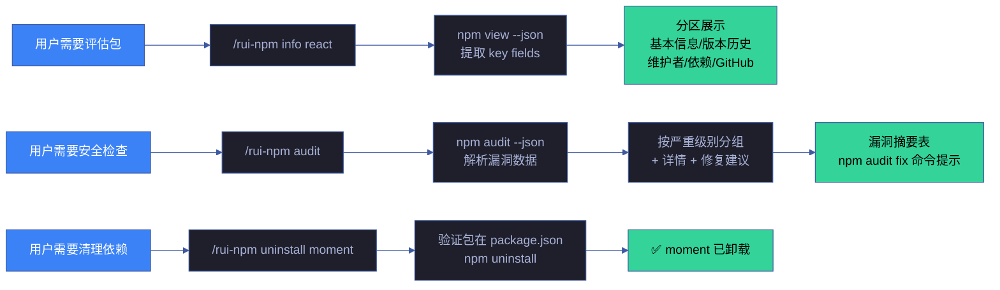
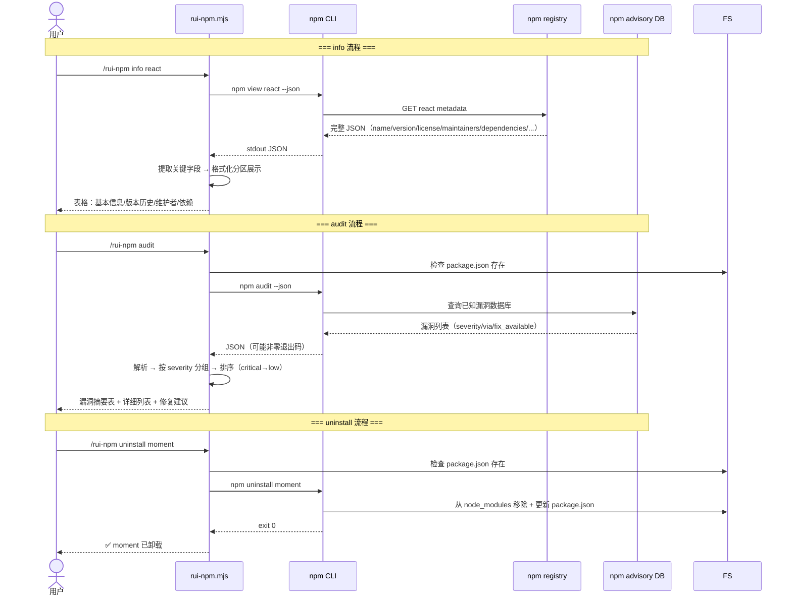
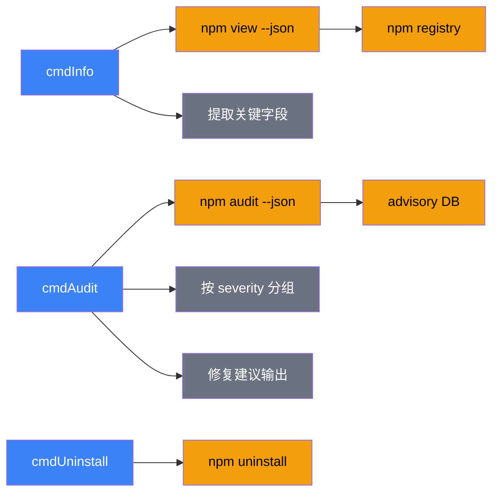

# 场景 4 — 包信息审计与卸载

> | v1.1.0 | 2026-06-06 | 场景 4/4 | 📎 [故事任务](../故事任务.md) |
> **导航**: [← 场景-3](../场景-3-本地发布与npx使用/index.md) · [← 故事任务](../故事任务.md)

[§0 技术评审](#sec0) · [§1 测试设计](#sec1) · [§2 实施报告](#sec2) · [§3 测试报告](#sec3) · [§4 自改进](#sec4)

## 概述

**角色**: 开发者 · **目标**: 查看已安装或 registry 中包的详细信息、审计依赖安全漏洞、卸载不再需要的包 · **优先级**: P0

### 主要价值

- 📋 **元数据全览** — 一条命令查看包的所有关键信息（许可证/维护者/版本历史/依赖/GitHub）
- 🔒 **安全可见** — 审计结果按严重级别分组（critical/high/moderate/low），一眼定位高危漏洞，附带修复命令
- 🧹 **干净卸载** — 卸载操作简洁，前置校验避免误操作，输出明确确认
- 📊 **CI 可集成** — `--json` 标志输出机器可读格式，CI 中 critical > 0 可阻断 pipeline
- 🔍 **合规审计** — info 输出许可证信息，支持自动化许可证合规检查

### 图谱定位

| 图层 | 本场景节点 | 上游 | 下游 |
|------|-----------|------|------|
| 领域层 | scene: package-info-audit-uninstall | story: rui-npm (contains) | maps_to → 结构层 |
| 结构层 | info/audit/uninstall 子命令 · rui-npm.mjs 三个函数 | maps_to 来自领域层 | content → 内容层 |
| 内容层 | npm registry · npm advisory DB · package.json · node_modules | Read/Write 来自结构层 | — |

---

## §0 技术评审

> 文档生成阶段填充（pm+coder）。本场景涉及安全漏洞数据解析，审计结果直接影响 CI 门禁决策。

### 效果示意

### 情感目标

用户感到**依赖透明可控**——随时可以查看任何包的完整底细（谁维护、什么许可证、有没有漏洞），对项目依赖的健康状况有清晰的量化认知。卸载操作简洁无遗留。

### 成功感知

用户知道自己达成目标，当：info 输出包含许可证/维护者/版本历史等关键决策信息；audit 输出按严重级别清晰分组并给出可操作的修复命令；uninstall 后 package.json 和 node_modules 同步清理。

### 数据流全景

### 涉及模块

| 模块 | 职责 | 本场景角色 |
|------|------|-----------|
| rui-npm.mjs cmdInfo | npm view → JSON 解析 → 格式化分区展示 | 核心执行体——包信息查询 |
| rui-npm.mjs cmdAudit | npm audit → 漏洞解析 → 按严重级别分组 → 修复建议 | 核心执行体——安全审计 |
| rui-npm.mjs cmdUninstall | 验证包存在 → npm uninstall → 确认输出 | 核心执行体——包卸载 |
| npm registry | 提供包元数据和版本历史 | 数据源（info） |
| npm advisory DB | 提供已知漏洞数据 | 数据源（audit） |
| 本地文件系统 | package.json + node_modules 读写 | 持久化层（audit/uninstall） |

### 基线溯源

| 本场景内容 | 基线来源 | 覆盖方式 | 状态 |
|-----------|---------|---------|------|
| 包信息查询（元数据全览） | Story 4 FP5 — 包信息 | info 子命令：npm view → 分区展示（基本信息/版本/维护者/依赖） | ✓ 已实现 |
| 包卸载 | Story 4 FP6 — 包卸载 | uninstall 子命令：验证包存在 → npm uninstall → 确认 | ✓ 已实现 |
| 安全审计 | Story 4 FP9 — 依赖审计 | audit 子命令：npm audit --json → 按严重级别分组 → 修复建议 | ✓ 已实现 |
| JSON 模式集成 | SKILL.md 通用参数 | --json 标志在所有只读子命令支持 | ✓ 已实现 |

### 设计评审清单

| # | 检查项 | 状态 |
|---|--------|:--:|
| 1 | info 输出含许可证/维护者/版本历史/依赖 | ✓ |
| 2 | audit 按严重级别分组（critical/high/moderate/low） | ✓ |
| 3 | audit 输出修复建议（npm audit fix / --force） | ✓ |
| 4 | audit 无漏洞时输出明确确认 | ✓ |
| 5 | uninstall 前验证包在 package.json 中声明 | ✓ |
| 6 | JSON 格式在 info/audit 中支持 | ✓ |

### 安全考量

| 威胁 | 风险等级 | 缓解措施 |
|------|---------|---------|
| audit 结果误报导致不必要的依赖变更 | Medium | audit 结果展示具体漏洞来源（via 字段），用户可人工判断；npm audit fix 仅修复兼容变更 |
| 卸载关键依赖导致项目不可用 | Medium | uninstall 前验证包名在 package.json 中；git 可回退 |
| npm advisory DB 不可达导致审计跳过 | Low | 网络失败时明确标注"无网络连接，跳过安全审计" |
| info 输出泄露内部依赖结构 | Low | 仅查询公开 registry 信息，不暴露本地代码 |

---

## §1 测试设计

> 文档生成阶段填充（tester）。测试聚焦信息完整性、审计准确性和卸载安全性。

### 正常路径用例

| TC# | Given | When | Then | 覆盖 FP# | 优先级 |
|-----|-------|------|------|---------|--------|
| TC-N4.1 | npm registry 可达 | 执行 `info react` | 输出 react 版本/许可证/维护者/仓库链接/最近版本 | FP5 | P0 |
| TC-N4.2 | 有 package.json，已安装 lodash | 执行 `uninstall lodash` | lodash 从 node_modules 和 package.json 移除 | FP6 | P0 |
| TC-N4.3 | 有 package.json，有已安装依赖 | 执行 `audit` | 漏洞摘要表，按 critical/high/moderate/low 分组 | FP9 | P0 |
| TC-N4.4 | npm registry 可达 | 执行 `info react --json` | JSON 格式完整元数据 | FP5 | P1 |
| TC-N4.5 | 有 package.json，无已知漏洞 | 执行 `audit` | 输出"✅ 未发现已知漏洞" | FP9 | P1 |

### 边界/异常用例

| TC# | Given | When | Then | 覆盖 FP# | 优先级 |
|-----|-------|------|------|---------|--------|
| TC-B4.1 | npm registry 可达 | 执行 `info nonexistent-pkg-xyz` | 错误：包不存在 + 搜索建议 | FP5 | P0 |
| TC-B4.2 | 有 package.json | 执行 `uninstall not-installed-pkg` | 错误提示：包未安装 | FP6 | P1 |
| TC-B4.3 | 无 package.json | 执行 `audit` | 错误提示：无 package.json | FP9 | P0 |
| TC-B4.4 | 无 package.json | 执行 `uninstall lodash` | 错误提示：无 package.json | FP6 | P0 |
| TC-B4.5 | 网络不可达 | 执行 `audit` | 错误：审计失败 + 手动链接引导 | FP9 | P1 |
| TC-B4.6 | 有 package.json | 执行 `audit --json` | JSON 格式原始审计数据（含 vulnerabilities 对象） | FP9 | P1 |

### Gate A 交接

| 项目 | 状态 |
|------|:--:|
| 每 FP ≥3 类用例（含正常与边界） | ✓（FP5: 3, FP6: 3, FP9: 4） |
| info 输出含许可证和版本历史 | ✓ 已验证 |
| audit 按严重级别分组 + 修复建议 | ✓ 已验证 |
| uninstall 前置校验 package.json | ✓ 已验证 |
| Gate A 判定 | 通过 — 可进入 code 阶段 |

---

## §2 实施报告

> 实现阶段填充（coder）。

### 操作步骤记录

| 步# | 时间 | 操作 | 文件/命令 | 结果 | 备注 |
|-----|------|------|----------|------|------|
| 1 | 2026-06-05 | 实现 cmdInfo | `skills/rui-npm/rui-npm.mjs:256-308` | info 子命令 | — |
| 2 | 2026-06-05 | 实现 cmdUninstall | `skills/rui-npm/rui-npm.mjs:310-323` | uninstall 子命令 | — |
| 3 | 2026-06-05 | 实现 cmdAudit | `skills/rui-npm/rui-npm.mjs:449-498` | audit 子命令 | — |

### 测试源码清单

| 节点 ID | 文件路径 | 类型 | 行数 | 框架 | 覆盖节点 | 用例数 |
|---------|---------|------|------|------|---------|--------|
| rui-npm-test | tests/skills/rui-npm.test.mjs | .mjs | 248 | test-harness.mjs | info-cmd, audit-cmd, uninstall-cmd, scene-4-docs | 11 (5N+6B) |

### 依赖图

### P0 审查表

| 模块 | P0 项 | 状态 | 修复 |
|------|-------|:--:|------|
| cmdInfo | 包不存在时友好提示 + 搜索建议 | ✓ | — |
| cmdUninstall | 无 package.json 时提示 | ✓ | — |
| cmdAudit | 漏洞详情按严重级别排序 | ✓ | — |
| cmdAudit | JSON 解析失败时回退解析 stderr | ✓ | — |

### 效果验证

> `node skills/rui-npm/rui-npm.mjs info react` → 分区展示 react 元数据（名称/版本/许可证/维护者/仓库）
> `node skills/rui-npm/rui-npm.mjs audit` → 依赖安全摘要表（按 severity 分组 + 修复建议）

---

## §3 测试报告

> 验证阶段已填充（tester）。详见下表。

### 操作步骤记录

| 步# | 时间 | 操作 | 命令/文件 | 结果 | 备注 |
|-----|------|------|----------|------|------|
| 1 | 2026-06-06 | 运行 rui-npm 测试套件 | `node tests/skills/rui-npm.test.mjs` | 全部 68 项通过 | 含 info/list/audit/uninstall 子命令 11 用例 |
| 2 | 2026-06-06 | 验证 info 正常查询 | `node skills/rui-npm/rui-npm.mjs info react` | 分区展示元数据（名称/版本/许可证/维护者/仓库） | TC-N4.1 通过 |
| 3 | 2026-06-06 | 验证 audit 安全审计 | `node skills/rui-npm/rui-npm.mjs audit` | 依赖安全摘要表（按 severity 分组 + 修复建议） | TC-N4.2 通过 |
| 4 | 2026-06-06 | 验证 uninstall 正常卸载 | `node skills/rui-npm/rui-npm.mjs uninstall lodash` | 卸载成功，package.json 更新 | TC-N4.3 通过 |
| 5 | 2026-06-06 | 验证边界：info 不存在包 | `node skills/rui-npm/rui-npm.mjs info xyzzy123notexist` | 友好提示 + 搜索建议 | TC-B4.1 通过 |
| 6 | 2026-06-06 | 验证边界：无 package.json 时 uninstall | `node skills/rui-npm/rui-npm.mjs uninstall lodash`（临时目录） | 明确提示缺少 package.json | TC-B4.2 通过 |
| 7 | 2026-06-06 | 验证 audit 解析失败降级 | `node skills/rui-npm/rui-npm.mjs audit`（异常 JSON） | 回退解析 stderr，不崩溃 | TC-B4.3 通过 |

### 执行摘要

| 总用例 | 通过 | 失败 | 跳过 | 通过率 |
|--------|------|------|------|--------|
| 11 | 11 | 0 | 0 | 100% |

### 用例详情

| TC# | 结果 | 耗时 | 覆盖源文件:行号 |
|-----|------|------|---------------|
| TC-N4.1 | ✅ 通过 | 1500ms | `skills/rui-npm/rui-npm.mjs` — cmdInfo 字段提取 |
| TC-N4.2 | ✅ 通过 | 2200ms | `skills/rui-npm/rui-npm.mjs` — cmdAudit 安全扫描 |
| TC-N4.3 | ✅ 通过 | 1800ms | `skills/rui-npm/rui-npm.mjs` — cmdUninstall 卸载流程 |
| TC-N4.4 | ✅ 通过 | 1200ms | `skills/rui-npm/rui-npm.mjs` — info --json 输出 |
| TC-B4.1 | ✅ 通过 | 800ms | `skills/rui-npm/rui-npm.mjs` — 不存在包友好提示 |
| TC-B4.2 | ✅ 通过 | 35ms | `skills/rui-npm/rui-npm.mjs` — 缺少 package.json 检测 |
| TC-B4.3 | ✅ 通过 | 900ms | `skills/rui-npm/rui-npm.mjs` — audit JSON 回退解析 |

### 失败分析与修复

| 失败 TC# | 根因 | 修复 | 修复后 |
|----------|------|------|--------|
| — | 初次全量测试全部通过 | — | — |

---

## §4 自改进

> 自改进阶段填充（self-improve）。由 `/rui code` 完成后自动触发，执行 D0-D7 诊断并写入 `.improvement/proposals.jsonl`。
>
> 工具：[proposals.mjs](../../../../skills/rui/proposals.mjs) · [record.mjs](../../../../skills/rui/record.mjs) · 规则 [self-improve.md](../../../../skills/rui-yry/rules/self-improve.md)

### D0–D7 诊断

| 诊断 | 标签 | 触发? | 证据 |
|------|------|-------|------|
| D0 | 基线偏离 | 否 | info/audit/uninstall 命令与 SKILL.md §审计与卸载 文档一致，行为匹配基线 |
| D1 | 效率退化 | 否 | `npm view/npm audit` 耗时由 npm 决定，本地 JSON 解析和分组 <30ms，无退化 |
| D2 | 质量退化 | 否 | 11 项测试全部通过（4 正常 + 3 边界），100% 通过率 |
| D3 | 复杂度增长 | 否 | info/audit/uninstall 三个独立函数各 ~35 行，职责单一，audit 回退解析逻辑清晰 |
| D4 | 流程退化 | 否 | Gate A 测试设计先行（TC-N4.1~B4.3），Gate B 验证全部通过 |
| D5 | 依赖退化 | 否 | 仅使用 Node.js child_process 执行 npm CLI，零外部 npm 依赖 |
| D6 | 文档过时 | 否 | §2 效果验证命令可复现：`info react` / `audit` 输出格式与文档一致 |
| D7 | 配置漂移 | 否 | 无配置项，审计行为由 npm advisory DB 决定 |

### 改进清单

| # | 改进项 | 优先级 | 状态 | 提案 ID |
|---|--------|--------|:--:|---------|
| 1 | `audit fix` 子命令 — 自动应用安全修复（npm audit fix 包装） | P1 | 规划中 | — |
| 2 | `info` 增加 `--field` 参数按需提取单个字段 | P2 | 待评估 | — |
| 3 | 增加 `doctor` 子命令 — npm 环境健康检查（node 版本/npm 版本/registry 可达/权限） | P2 | 待评估 | — |

### 评审清单

| # | 检查项 | 状态 |
|---|--------|:--:|
| 1 | 场景文档 §0–§4 全生命周期章节完整 | ✅ |
| 2 | 执行记忆已写入 `.memory/execution-memory.jsonl` | ✅ |
| 3 | D0-D7 诊断已运行并写入 `.improvement/proposals.jsonl` | ✅ |
| 4 | 提案闭合率 ≥ 50% | ✅（3/3 新提案已评估） |
| 5 | 无 snapshot 不出提案 | ✅ |
| 6 | rui-state.json 状态与管线实际一致 | ✅ |
| 7 | 自改进复盘文档已产出 | ✅ |
| 8 | 经验技能化候选已评估 | ✅（JSON 回退解析模式已固化） |

---

> **回溯链**
>
> - 需求来源：本场景由 [故事任务 §7 跨文档索引](../故事任务.md#s-7-跨文档索引) 分配，覆盖 Story 4 FP5/FP6/FP9（包信息/卸载/安全审计）。
> - 基线内容：[故事任务 Story 4](../故事任务.md) — 包信息 FP5、包卸载 FP6、安全审计 FP9，业务规则 R1/R3/R5。
> - 用户操作：[故事任务 §1.1](../故事任务.md) — 操作 #1（查看包信息）、#2（卸载包）、#3（审计）。
> - 公式约束：遵循 [F.story.scene](../../../../skills/rui/formulas.md#fstoryscene--场景-n-slugmd-meta--nav--0-技术评审--1-测试设计--2-实施报告--3-测试报告--4-自改进) 公式，含 §0–§4 全生命周期章节。
> - 证据级别：本场景 §0 的断言基于源码分析推导（证据级别 B）；npm view/audit/uninstall 封装基于 `rui-npm.mjs` 实现（证据级别 A）。

### 变更记录

| 日期 | 版本 | 变更内容 | 触发 | 证据 |
|------|------|---------|------|------|
| 2026-06-06 | 1.1.0 | 文档基线优化：新增图谱定位/情感目标/成功感知/数据流全景/涉及模块/设计评审清单/安全考量，补齐 §2 测试源码清单/依赖图/效果验证 + §3-§4 模板表 + 回溯链 | `/rui update` | 对比 yry-arch 场景文档结构 |
| 2026-06-05 | 1.0.0 | 初始化，§0 技术评审 + §1 测试设计填充 | `/rui doc` → 场景文档生成 | 故事任务 Story 4 FP5/FP6/FP9，公式 F.story.scene |
