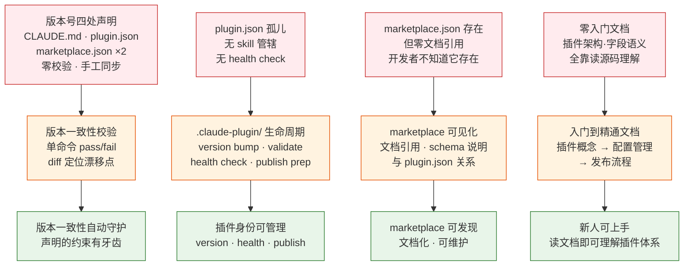

> | v1.4.0 | 2026-05-19 | deepseek-v4-pro | 🌿 feat/plugin-management | 📎 [CLAUDE.md](../../../CLAUDE.md) |

> **导航**: [YrY-02-用户使用场景 →](./YrY-02-用户使用场景.md)

> **来源**: `/rui 插件管理从入门到精通` — 需求驱动生成。外部参考吸收自 [README.md 外部参考](../../../README.md#外部参考) — superpowers（验证门禁·行为纪律）· mattpocock-skills（工程 discipline）· everything-claude-code（harness 优化）· karpathy-skills（LLM 编码陷阱规避）。证据等级 B（可推导，附外部参考路径）。

### §0 基线声明

> **问题空间基线 (Problem Space Baseline)**: 本文档定义插件管理的 WHAT（做什么）与 WHY（为什么做）。所有下游文档的设计、实现、验证、改进决策均必须可追溯至本文档的具体章节。

| 约束 | 规则 |
|------|------|
| 语言边界 | 仅使用业务语言与用户语言。**禁止**包含：代码文件路径、API 路由、组件名称、数据库表名、技术栈选型、框架名称 |
| 下游可追溯 | 03-09 的每个设计决策/实现/测试必须引用本文档的 §1 Story# 或 §2 FP# 或 §3 SC# 或 §5 AC# |
| 版本优先 | 需求变更时本文档先于所有其他文档更新；下游文档偏差必须同步回本文档 |
| 评审门禁 | 文档审查时检查禁止内容：含代码路径/API路由/组件名/技术栈名 = P0 阻断 |

### 需求概述

YrY 是 Claude Code 插件，但其插件身份管理（`.claude-plugin/`）处于孤儿状态——不属于任何 skill 的管辖范围。版本号 `1.4.0` 在 CLAUDE.md、plugin.json、marketplace.json 中四处重复声明却无一致性校验。本故事将插件管理从碎片化推向系统化：建立版本一致性自动校验、将 `.claude-plugin/` 纳入生命周期管理、补齐从入门到精通的教育文档。

### 效果示意

### 主要价值

- 🔒 版本一致性自动校验 — CLAUDE.md 声明的约束从"纸面规则"变成"可执行门禁"
- 🛠️ `.claude-plugin/` 生命周期管理 — 结束孤儿状态，纳入 skill 管辖
- 📦 marketplace 配置可见化 — 从磁盘隐身到文档化、可维护
- 📖 入门到精通教育体系 — 新人无需读源码即可理解插件架构、字段语义、发布流程
- 🔄 与 rui-claude 互补 — `.claude/` 配置管理 + `.claude-plugin/` 身份管理 = 完整插件管理拼图

---

### §1 Story

| # | 作为 | 我想要 | 以便 | 优先级 | 范围边界 | 依赖 |
|---|------|--------|------|--------|---------|------|
| Story-1 | 项目维护者 | 一条命令校验版本号在 CLAUDE.md、plugin.json、marketplace.json 中一致 | 版本升级时不会遗漏任何一处 | P0 | 只读校验，不修改文件 | — |
| Story-2 | 插件开发者 | 管理 `.claude-plugin/` 目录的完整生命周期：版本升级、一致性校验、健康分析、发布准备 | 插件身份管理不再靠手工和记忆 | P1 | `.claude-plugin/` 目录，委托 Story-1 的校验机制 | Story-1 |
| Story-3 | 新加入的开发者 | 阅读插件管理文档即可理解：插件是什么、plugin.json 字段含义、marketplace 作用、与 skill/agent/rule 的关系 | 不读源码也能理解 YrY 的插件架构 | P2 | 只写文档，不改代码 | — |

#### §1.1 User Operations

| # | 操作 | 触发条件 | 操作步骤 | 预期结果 |
|---|------|---------|---------|---------|
| OP-1 | 校验版本一致性 | 版本升级后 / 发布前 / CI 门禁 | 执行校验命令 → 读取四处版本声明 → 逐项比对 → 输出结果 | 一致则 pass，不一致则列出每个位置的版本号与 diff |
| OP-2 | 统一升级版本号 | 新版本发布 | 执行 version bump 命令 → 输入新版本号 → 四处同步更新 | 所有位置版本号一致更新，附变更摘要 |
| OP-3 | 插件健康分析 | 定期巡检 / 发布前检查 | 执行 health 命令 → 检查 plugin.json 字段完整性、marketplace.json 一致性、必需文件存在性 | 输出健康报告：通过项 / 告警项 / 错误项 |
| OP-4 | 学习插件概念 | 新人入职 / 首次接触插件体系 | 打开入门文档 → 按入门→进阶→精通路径阅读 | 理解插件定义、字段含义、配置管理、发布流程 |

---

### §2 Requirements

| FP# | 描述 | 输入 | 输出 | 错误行为 | 优先级 |
|-----|------|------|------|---------|--------|
| FP-1 | 版本一致性校验：读取 plugin.json 版本号，与 CLAUDE.md、marketplace.json（metadata + plugins[0]）比对 | 校验命令 | pass/fail + 每处版本号 + diff | 文件不存在报告缺失；JSON 解析失败报告格式错误 | P0 |
| FP-2 | 版本统一升级：接收新版本号，同步更新所有声明位置 | version bump 命令 + 目标版本号 | 变更摘要（哪些文件被更新） | 版本号格式不合法拒绝；部分更新失败回滚 | P1 |
| FP-3 | 插件健康分析：检查 plugin.json 必填字段、marketplace.json 一致性、skill/agent/rule 目录存在性 | health 命令 | 健康报告（通过/告警/错误） | 文件缺失报告具体路径 | P1 |
| FP-4 | 发布准备检查：验证版本一致性 + plugin.json 完整性 + marketplace.json 就绪 + 必需文档存在 | publish-prep 命令 | 就绪/阻断清单 | 任一项不通过列明阻断原因 | P1 |
| FP-5 | 入门文档：解释插件概念、plugin.json 字段含义、与 skill/agent/rule 的关系 | 文档 | docs/ 下 .md 文件 | — | P2 |
| FP-6 | 进阶文档：版本管理流程、marketplace 配置、发布 checklist | 文档 | docs/ 下 .md 文件 | — | P2 |
| FP-7 | 精通文档：插件 CI/CD 设计、版本漂移检测与修复、自定义 hook 集成 | 文档 | docs/ 下 .md 文件 | — | P2 |

| R# | 描述 | 校验方式 | 证据级别 |
|----|------|---------|---------|
| R-1 | 校验脚本只读不写 — FP-1 不修改任何文件 | 代码审查：无 Write/Edit 调用 | A — 可直接验证 |
| R-2 | version bump 必须原子化 — 四处全部更新或全部回滚 | 测试用例覆盖中途失败场景 | A — Gate A 测试 |
| R-3 | 版本号格式必须符合 semver（`/^\d+\.\d+\.\d+$/`） | 输入校验拒绝非法格式 | A — 单元测试 |
| R-4 | 密钥/token 不落盘 — node 脚本从环境变量读取 | grep 扫描无硬编码 | A — `rules/rui-claude.md` R-5 同模式 |
| R-5 | 文档使用领域语言 — 术语与 README.md §领域语言一致 | 对照领域语言 Avoid 列表扫描 | B — 交叉引用检查 |
| R-6 | `.claude-plugin/` 管理不触达 `.claude/` — 职责边界清晰 | 检查变更文件路径 | A — rui-claude SKILL.md 已定义边界 |

| 约束 | 类型 | 范围/格式 | 来源 |
|------|------|---------|------|
| 版本号格式 | semver | `/^\d+\.\d+\.\d+$/` | CLAUDE.md 版本声明惯例 |
| 版本声明位置 | 固定四处 | CLAUDE.md · plugin.json · marketplace.json(metadata) · marketplace.json(plugins[0]) | 现状基线 |
| plugin.json 必填字段 | schema | name · description · version · author.name · repository · keywords · license | `.claude-plugin/plugin.json` |
| marketplace.json 必填字段 | schema | metadata(workspace, repo, branch) · plugins | `.claude-plugin/marketplace.json` |

---

### §3 成功标准

| SC# | 描述 | 度量方式 | 目标值 | 优先级 | 关联 FP# |
|-----|------|---------|--------|--------|---------|
| SC-1 | 开发者可在 3 秒内完成版本一致性校验 | 从命令执行到结果输出的耗时 | ≤ 3 秒 | P0 | FP-1 |
| SC-2 | 版本号同步升级零遗漏 — bump 命令后四处声明一致 | bump 后立即执行校验命令 | pass | P1 | FP-2 |
| SC-3 | 插件健康报告覆盖 ≥ 5 项检查维度 | 统计 health 命令输出的检查项数量 | ≥ 5 项 | P1 | FP-3 |
| SC-4 | 新人阅读文档后能正确解释 plugin.json 各字段含义 | 对照文档中的字段说明表检查理解 | 字段覆盖率 100% | P2 | FP-5 |
| SC-5 | 文档覆盖入门→进阶→精通三个层级，每层级 ≥ 2 个小节 | 统计文档章节数 | ≥ 3 层级 × ≥ 2 小节 | P2 | FP-5, FP-6, FP-7 |

---

### §4 范围边界

| # | 条目 | 关联 FP# | 边界说明 |
|---|------|---------|---------|
| IN-1 | `.claude-plugin/plugin.json` 的读写与管理 | FP-1, FP-2, FP-3 | 插件身份定义文件 |
| IN-2 | `.claude-plugin/marketplace.json` 的一致性与完整性 | FP-1, FP-3, FP-4 | 市场发现配置 |
| IN-3 | CLAUDE.md 中的版本号声明（`\| 版本 \| 1.4.0 \|` 行） | FP-1, FP-2 | 项目画像表中的版本字段 |
| IN-4 | 插件管理教育文档 3 篇（入门/进阶/精通） | FP-5, FP-6, FP-7 | 存放于 docs/ 或故事目录 |
| IN-5 | 版本一致性校验脚本 | FP-1 | node 脚本，只读 |

| # | 条目 | 排除原因 | 替代方案 |
|---|------|---------|---------|
| OUT-1 | `.claude/` 目录内 skills/agents/rules 的管理 | 属于 rui-claude 管辖范围 | 使用 `/rui-claude` |
| OUT-2 | 插件市场实际发布（上传到 Claude Code Marketplace） | 发布动作依赖外部平台 API，非本故事范围 | FP-4 输出发布就绪报告，实际发布由开发者手动执行 |
| OUT-3 | 自动 git commit/push | rui-claude 铁律 R-7：禁止自动 git 操作 | 开发者手动执行 |
| OUT-4 | 插件依赖管理（如依赖其他插件） | Claude Code 插件体系尚未支持插件间依赖 | 待生态成熟后纳入 |
| OUT-5 | 插件的技能/代理/规则的内容正确性校验 | 属于 rui-claude retro 的范围 | 使用 `/rui-claude retro` |

---

### §5 AC

| AC# | Given | When | Then | 门禁 |
|-----|-------|------|------|------|
| AC-1 | 四处版本声明一致（均为 1.4.0） | 执行版本一致性校验 | 输出 pass，列出四处位置与版本号 | Gate A |
| AC-2 | CLAUDE.md 版本为 1.4.0，plugin.json 为 1.3.7 | 执行版本一致性校验 | 输出 fail，diff 标注 CLAUDE.md=1.4.0 vs plugin.json=1.3.7 | Gate A |
| AC-3 | plugin.json 缺失 version 字段 | 执行版本一致性校验 | 输出 fail，标注 plugin.json 缺少 version 字段 | Gate A |
| AC-4 | 执行 version bump 到 1.4.0，四处当前均为 1.4.0 | 输入目标版本 1.4.0 | 四处全部更新为 1.4.0，输出变更摘要 | Gate B |
| AC-5 | version bump 中途写入失败（模拟磁盘满） | 输入目标版本 1.4.0 | 已更新的文件回滚，输出错误信息，四处保持 1.4.0 | Gate B |
| AC-6 | 输入非法版本号 "1.4" | 执行 version bump | 拒绝执行，输出 "版本号格式不合法，期望 x.y.z" | Gate A |
| AC-7 | plugin.json 完整，marketplace.json 存在且一致 | 执行 health 命令 | 输出健康报告：≥ 5 项检查维度，标注通过/告警/错误 | Gate B |
| AC-8 | marketplace.json 缺失 | 执行 publish-prep 命令 | 阻断，列明 "marketplace.json 缺失" | Gate B |
| AC-9 | 新人打开入门文档 | 按顺序阅读 | 能正确回答：插件是什么、plugin.json 有哪些必填字段、与 skill/agent/rule 什么关系 | Gate B |

---

### §6 风险与假设

| # | 风险/假设 | 类型 | 可能性 | 影响 | 缓解/验证策略 | 关联 FP# |
|---|----------|------|--------|------|-------------|---------|
| RSK-1 | 版本声明位置未来新增（如 CHANGELOG.md）导致校验遗漏 | 风险 | M | M | 校验脚本设计为可配置的声明位置列表，新增位置只需追加配置 | FP-1 |
| RSK-2 | marketplace.json schema 变更导致校验失效 | 风险 | L | M | 校验脚本不假设固定 schema，动态读取字段；schema 变更时同步更新 | FP-3 |
| RSK-3 | version bump 与手动编辑产生竞态 | 风险 | L | H | bump 前检查文件无未提交变更，拒绝在有 dirty state 时执行 | FP-2 |
| RSK-4 | 首次校验即发现版本漂移 | 假设 | M | L | 首次运行可能暴露已有不一致，修复后重新校验即可——这是功能生效的标志 | FP-1 |
| RSK-5 | 教育文档的读者具备 Claude Code 基本使用经验 | 假设 | H | L | 入门文档从"已安装 Claude Code"起步，不解释 Claude Code 基础操作 | FP-5 |
| RSK-6 | 校验脚本可复用为 pre-commit hook | 假设 | M | L | 设计为独立可执行脚本，CI/hook 可直接调用 | FP-1 |

---

### §7 跨文档索引

| 本文档章节 | 基线内容 | 下游文档编号 | 预期覆盖 | 状态 |
|-----------|---------|------------|---------|------|
| §1 Story-1 | 版本一致性校验 | 03-技术评审 · 05-测试用例评审 | 校验脚本设计 · 测试用例 | 待生成 |
| §1 Story-2 | .claude-plugin/ 生命周期管理 | 03-技术评审 · 05-测试用例评审 | skill 设计 · version bump/health/publish-prep 用例 | 待生成 |
| §1 Story-3 | 教育文档三篇 | 03-技术评审 · 05-测试用例评审 | 文档结构设计 · 内容正确性验证 | 待生成 |
| §2 FP-1–FP-4 | 脚本与命令功能点 | 03-技术评审 | 架构设计 · 模块划分 · 数据流 | 待生成 |
| §2 FP-5–FP-7 | 教育文档功能点 | 03-技术评审 | 文档大纲 · 存放位置 · 与领域语言对齐 | 待生成 |
| §3 SC-1–SC-5 | 成功标准 | 05-测试用例评审 | 每 SC 至少 1 条测试用例 | 待生成 |
| §5 AC-1–AC-9 | 验收标准 | 05-测试用例评审 | 每 AC 至少 1 条测试用例 | 待生成 |
| §6 RSK-1–RSK-6 | 风险与假设 | 03-技术评审 | 设计中考量风险缓解 | 待生成 |

---

### 变更记录

| 日期 | 变更 | 触发 | 证据 |
|------|------|------|------|
| 2026-05-19 | 初稿：需求概述、3 Story、7 FP、5 SC、9 AC、6 风险 | `/rui 插件管理从入门到精通` | pm 分析报告，外部参考 superpowers · mattpocock-skills · everything-claude-code |
