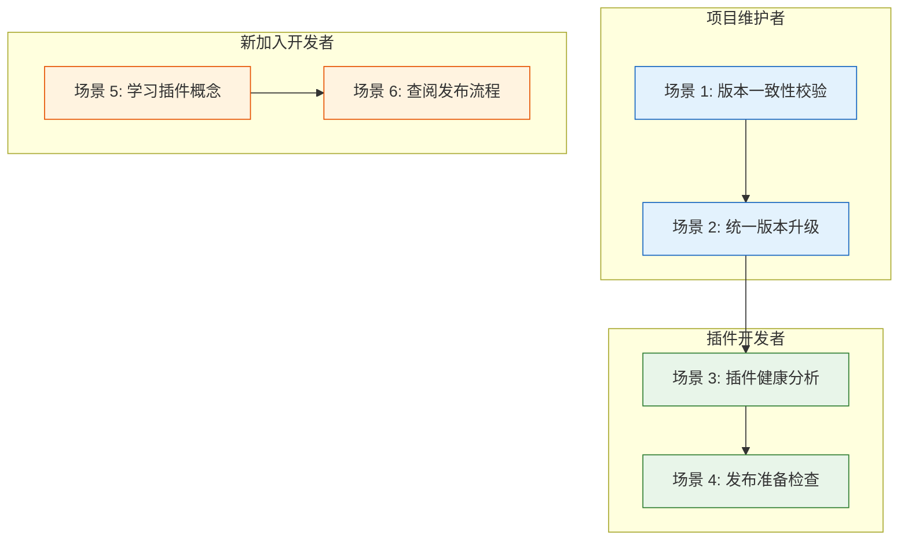
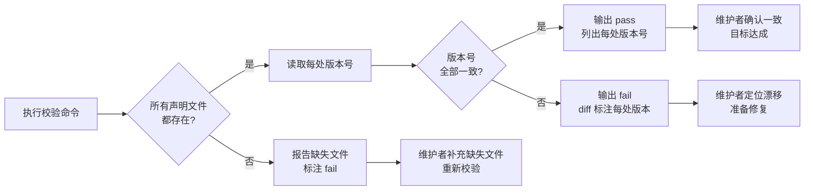
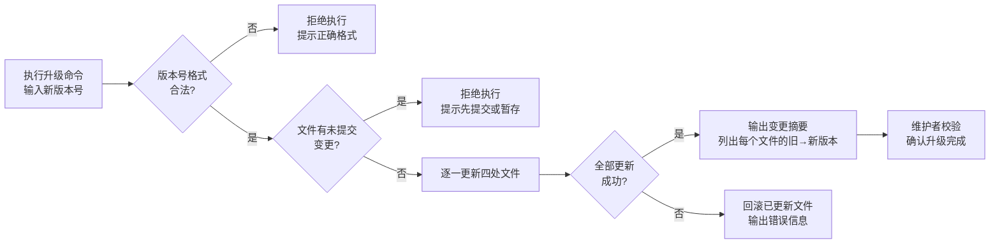
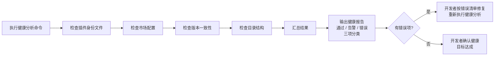
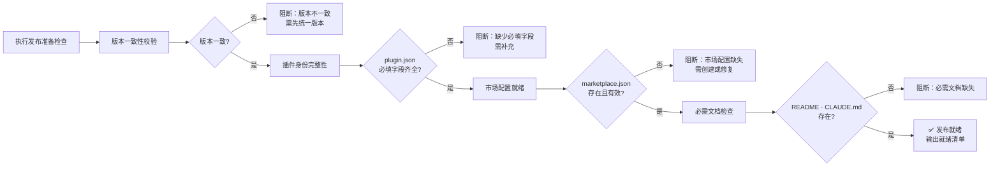
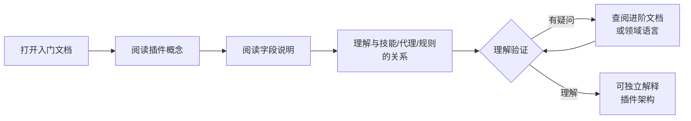
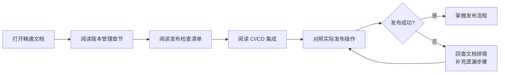

> | v1.4.0 | 2026-05-19 | deepseek-v4-pro | 🌿 feat/plugin-management | 📎 [CLAUDE.md](../../../CLAUDE.md) |

> **导航**: [← YrY-01-故事任务](./YrY-01-故事任务.md) · [YrY-03-技术评审 →](./YrY-03-技术评审.md)

> **来源**: 由故事需求 `插件管理从入门到精通` 驱动生成。外部参考吸收自 ui-ux-pro-max（交互推理规则）· superpowers（spec-driven 场景覆盖）。证据等级 B（可推导，附外部参考路径）。

### §0 基线声明

> **用户空间基线 (User Space Baseline)**: 本文档定义"谁使用(WHO)"和"如何体验(HOW EXPERIENCE)"。所有交互设计(03)、测试用例(05)、验收标准(01 §5)均必须覆盖本文档定义的每个场景。

| 约束 | 规则 |
|------|------|
| 语言边界 | 仅使用目标用户能理解的语言。**禁止**包含：技术术语、组件名称、API 端点、文件路径、数据库概念、框架名称 |
| 完整遍历 | 每个用户旅程必须覆盖：触发器 → 正常路径 → 空状态 → 错误恢复 → 目标达成 |
| 可追溯 | 05-测试用例评审必须覆盖本文档 §2 的每个场景及其异常分支 |
| 评审门禁 | 文档审查时检查禁止内容：含技术术语/组件名/API端点/文件路径 = P0 阻断 |

### 主要价值

- 🧭 三类用户角色全覆盖 — 项目维护者、插件开发者、新加入开发者，各有清晰旅程
- 🔍 从混沌到清晰 — 版本校验、健康分析、文档学习三条主线独立可追踪
- 🛡️ 异常路径前置 — 版本漂移、文件缺失、格式错误等边界情况在场景中显式定义
- 📐 与 01 双基线咬合 — 每场景标注关联 Story# 与 FP#，下游文档可精确溯源

---

### §1 场景全景

---

### §2 场景详述

#### 场景 1: 版本一致性校验

| 角色 | 触发条件 | 核心目标 |
|------|---------|---------|
| 项目维护者 | 版本升级后、发布前、或定期巡检 | 确认版本号在所有声明位置一致 |

| # | 步骤 | 输入 | 系统响应 | 异常分支 |
|---|------|------|---------|---------|
| 1 | 执行校验命令 | 终端输入校验命令 | 开始扫描版本声明位置 | 命令不存在 → 提示安装或检查路径 |
| 2 | 读取版本号 | 四处声明位置 | 逐一读取并记录版本号 | 文件不存在 → 标注缺失，继续检查其余位置 |
| 3 | 逐项比对 | 收集到的所有版本号 | 比对结果：一致输出 pass，不一致输出 diff | 某文件格式损坏无法解析 → 标注格式错误 |
| 4 | 查看结果 | — | 终端显示 pass/fail + 详情 | — |

#### 场景 2: 统一版本升级

| 角色 | 触发条件 | 核心目标 |
|------|---------|---------|
| 项目维护者 | 准备发布新版本 | 所有版本声明同步更新到新版本号 |

| # | 步骤 | 输入 | 系统响应 | 异常分支 |
|---|------|------|---------|---------|
| 1 | 执行升级命令 | 终端输入升级命令 + 新版本号 | 校验版本号格式 | 格式不合法 → 拒绝，提示 `x.y.z` 格式 |
| 2 | 前置检查 | — | 检查是否有未提交变更 | 有 dirty state → 拒绝，提示先处理 |
| 3 | 执行升级 | 确认继续 | 逐一更新四处位置的版本号 | 写入失败 → 回滚已更新文件，报告错误 |
| 4 | 查看摘要 | — | 终端显示每个文件的旧版本→新版本 | — |
| 5 | 确认结果 | 执行校验命令 | pass | fail → 说明升级有遗漏，手动排查 |

#### 场景 3: 插件健康分析

| 角色 | 触发条件 | 核心目标 |
|------|---------|---------|
| 插件开发者 | 发布前检查、定期巡检、或修改插件配置后 | 全面了解插件配置的健康状态 |

| # | 步骤 | 输入 | 系统响应 | 异常分支 |
|---|------|------|---------|---------|
| 1 | 执行健康分析 | 终端输入健康分析命令 | 按维度逐一检查 | 命令不存在 → 提示安装 |
| 2 | 查看报告 | — | 终端输出分类报告：通过项(绿色)、告警项(黄色)、错误项(红色) | 所有检查项均通过 → 仅显示通过摘要 |
| 3 | 处理告警 | 告警项清单 | — | 告警项不阻断但建议修复 |
| 4 | 修复错误 | 错误项清单 | — | 有错误 → 必须先修复才能通过健康检查 |

#### 场景 4: 发布准备检查

| 角色 | 触发条件 | 核心目标 |
|------|---------|---------|
| 插件开发者 | 准备将插件发布到市场 | 确认所有发布前置条件满足 |

| # | 步骤 | 输入 | 系统响应 | 异常分支 |
|---|------|------|---------|---------|
| 1 | 执行发布准备检查 | 终端输入发布准备命令 | 逐项检查发布前置条件 | — |
| 2 | 查看阻断清单 | — | 列出所有阻断项及原因 | 无阻断 → 显示就绪 |
| 3 | 修复阻断项 | 阻断清单 | — | 逐项修复后重新执行检查 |
| 4 | 确认就绪 | 全部通过 | 终端显示发布就绪清单 | — |

#### 场景 5: 学习插件概念

| 角色 | 触发条件 | 核心目标 |
|------|---------|---------|
| 新加入开发者 | 首次接触 YrY 项目，需要理解插件架构 | 不读源码即可理解插件是什么、各配置文件的作用 |

| # | 步骤 | 输入 | 系统响应 | 异常分支 |
|---|------|------|---------|---------|
| 1 | 打开入门文档 | 导航到文档位置 | 显示文档内容 | 文档不存在 → 触发创建需求 |
| 2 | 按顺序阅读 | 阅读时间 | 从概念到具体字段逐层展开 | 术语不理解 → 交叉引用领域语言定义 |
| 3 | 自我验证 | 尝试向同事解释插件概念 | — | 解释有误 → 回到对应章节重读 |
| 4 | 进入进阶 | 入门理解确认 | 打开进阶文档 | — |

#### 场景 6: 查阅发布流程

| 角色 | 触发条件 | 核心目标 |
|------|---------|---------|
| 新加入开发者 | 需要了解如何发布插件新版本 | 掌握完整的发布步骤和检查清单 |

| # | 步骤 | 输入 | 系统响应 | 异常分支 |
|---|------|------|---------|---------|
| 1 | 查阅精通文档 | 打开发布流程章节 | 显示完整发布步骤 | — |
| 2 | 对照执行 | 按步骤操作 | — | 步骤与实际情况不一致 → 文档需更新 |
| 3 | 验证结果 | 发布完成 | — | 发布失败 → 排查是否遗漏步骤 |

---

### §3 场景覆盖矩阵

| 场景 | FP# | AC# | 实现文档(03) | 测试文档(05) | 覆盖状态 | 备注 |
|------|-----|------|------------|------------|---------|------|
| 场景 1: 版本一致性校验 | FP-1 | AC-1, AC-2, AC-3 | §2 校验脚本 | TC-N*, TC-B*, TC-E* | 待生成 | 核心场景 |
| 场景 2: 统一版本升级 | FP-2 | AC-4, AC-5, AC-6 | §2 bump 脚本 | TC-N*, TC-E* | 待生成 | 含回滚路径 |
| 场景 3: 插件健康分析 | FP-3 | AC-7 | §3 health 命令 | TC-N*, TC-B* | 待生成 | ≥ 5 维度 |
| 场景 4: 发布准备检查 | FP-4 | AC-8 | §4 publish-prep | TC-N*, TC-E* | 待生成 | 含阻断路径 |
| 场景 5: 学习插件概念 | FP-5 | AC-9 | §5 入门文档 | TC-N* | 待生成 | 纯文档 |
| 场景 6: 查阅发布流程 | FP-6, FP-7 | — | §5 进阶/精通文档 | TC-N* | 待生成 | 纯文档 |

---

### §4 评审清单

| # | 检查项 | 状态 |
|---|--------|------|
| 1 | 场景 ≥ 2 | ✅ 6 场景 |
| 2 | 每场景有 mermaid 流程图 | ✅ 全部有图 |
| 3 | FP 全覆盖（01 §2 全部 FP# 有对应场景） | ✅ FP-1–FP-7 均有场景 |
| 4 | 异常分支明确（每场景含空状态与错误恢复） | ✅ 每场景含异常分支列 |
| 5 | 无技术术语（无代码路径、API 端点、组件名、框架名） | ✅ 全文使用用户语言 |
| 6 | 覆盖矩阵下游文档齐全 | ✅ 03/05 已映射 |
| 7 | 每场景 ≥ 1 空状态 + ≥ 1 错误恢复 | ✅ 场景 1 含文件缺失/格式错误；场景 2 含格式非法/dirty/写入失败 |

---

### §5 体验基线

| 角色 | 核心旅程 | 情感目标 | 痛点解决 | 成功感知 | 关联场景 |
|------|---------|---------|---------|---------|---------|
| 项目维护者 | 版本校验 → 发现漂移 → 统一升级 → 确认一致 | 安全可控 — 版本管理不再依赖记忆 | 版本号四处手工同步容易遗漏 | 看到 pass 输出，每处版本号一致 | 场景 1, 2 |
| 插件开发者 | 健康分析 → 发现问题 → 修复 → 发布准备检查 → 就绪 | 信心充足 — 发布前有自动化检查兜底 | 发布前不知道是否遗漏配置 | 看到发布就绪清单全部绿色 | 场景 3, 4 |
| 新加入开发者 | 入门文档 → 理解概念 → 进阶文档 → 掌握流程 → 精通文档 → 独立操作 | 清晰易懂 — 文档路径引导而非信息轰炸 | 新人只能读源码理解插件架构 | 能向同事正确解释插件概念和发布流程 | 场景 5, 6 |

---

### 变更记录

| 日期 | 变更 | 触发 | 证据 |
|------|------|------|------|
| 2026-05-19 | 初稿：3 角色、6 场景、完整覆盖矩阵、体验基线 | `/rui 插件管理从入门到精通` → 02 用户空间基线 | 01-故事任务 §1 Story ×3、§2 FP ×7 |
