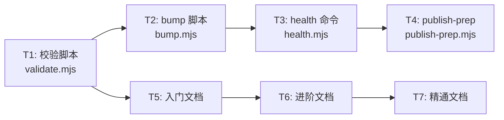
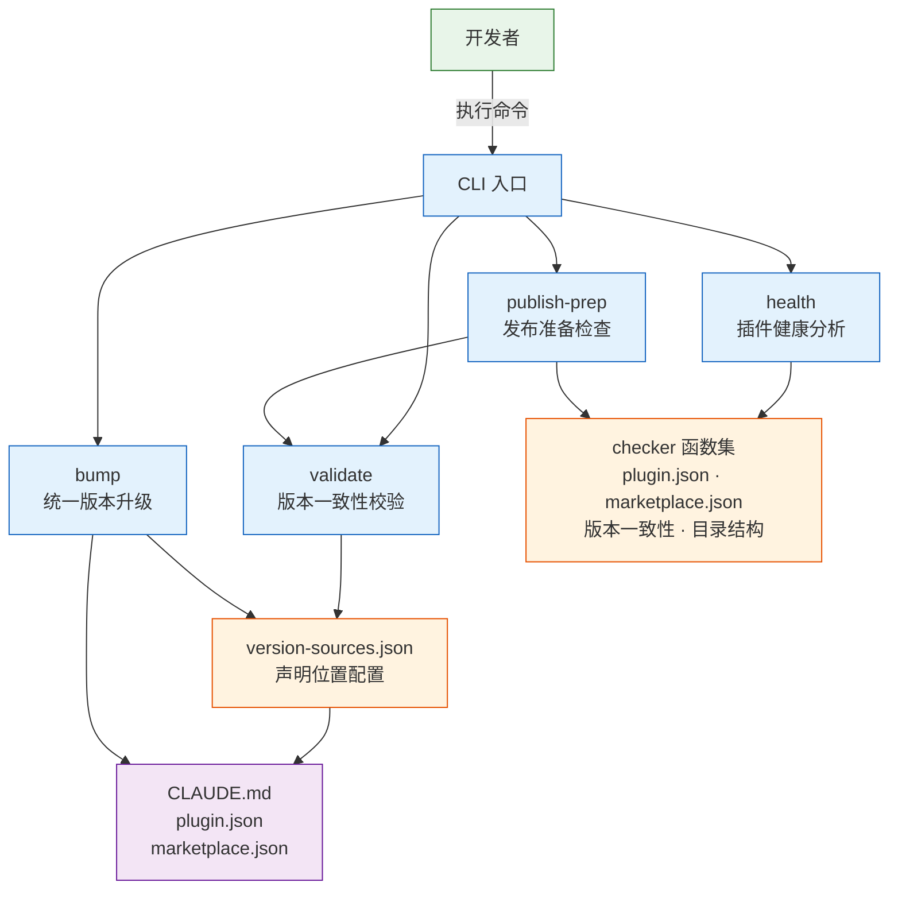
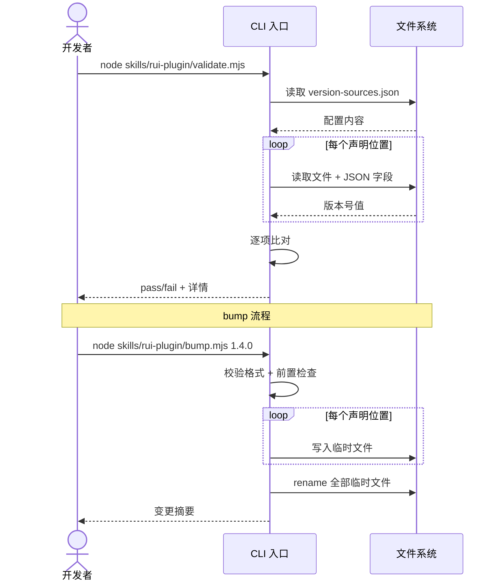

> | v1.4.0 | 2026-05-19 | deepseek-v4-pro | 🌿 feat/plugin-management | 📎 [CLAUDE.md](../../../CLAUDE.md) |

> **导航**: [← YrY-02-用户使用场景](./YrY-02-用户使用场景.md) · [YrY-05-测试用例评审 →](./YrY-05-测试用例评审.md)

> **来源**: 由故事需求 `插件管理从入门到精通` 驱动生成。外部参考吸收自 mattpocock-skills（工程 discipline）· everything-claude-code（harness 优化·研究优先）· superpowers（行为纪律）。证据等级 B（可推导，附外部参考路径）。

### 主要价值

- 🔧 Node.js 同栈设计 — 与项目现有 import-docs/sync.mjs 技术栈一致，零额外依赖
- ⚡ 独立可执行脚本 — validate/bump/health/publish-prep 均可被 CLI、CI、pre-commit hook 直接调用
- 🔒 安全优先 — 版本号严格 semver 校验、路径白名单机制、原子 bump 操作防数据损坏
- 📐 配置驱动扩展 — version-sources.json 声明式管理版本位置，新增位置无需改脚本
- 🧩 职责边界清晰 — `.claude-plugin/` 管理不触达 `.claude/`，与 rui-claude 互补不重叠

### §0 设计决策与任务规划

#### §0.1 设计决策

| 决策领域 | 选定方案 | 选择理由 | 详见 | 实现 01 FP# |
|---------|---------|---------|------|-----------|
| 脚本语言 | Node.js（与 import-docs/sync.mjs 同栈） | 项目已有 node 辅助脚本先例；无额外依赖 | §1.1 | FP-1, FP-2, FP-3, FP-4 |
| 校验脚本定位 | 独立可执行脚本 `skills/rui-plugin/validate.mjs` | 可被 CLI 直接调用、CI/pre-commit hook 集成 | §1.1 | FP-1 |
| 版本声明位置配置化 | JSON 配置文件定义需检查的文件路径与字段 | 新增位置只需追加配置，不修改脚本逻辑 | §3 | FP-1 |
| bump 原子性 | 先写临时文件 → 全部成功后 rename → 失败则 unlink | 简单可靠，无需事务机制 | §2 | FP-2 |
| 健康分析维度 | 可扩展的 checker 模式 — 每个维度一个纯函数 | 新增检查维度无需改动框架 | §3 | FP-3 |
| 教育文档格式 | Markdown，存放于 `docs/` 下，遵循领域语言 | 与项目文档体系一致 | §5 | FP-5, FP-6, FP-7 |

#### §0.2 任务规划



| ID | 描述 | 工作量 | 依赖 | 交付物 | Agent | 门禁 | 交接下游 | 实现 01 FP# |
|----|------|--------|------|--------|-------|------|---------|-----------|
| T1 | 版本一致性校验脚本 | S | — | `skills/rui-plugin/validate.mjs` | coder | Gate A | T2, T4 | FP-1 |
| T2 | 版本统一升级脚本 | M | T1 | `skills/rui-plugin/bump.mjs` | coder | Gate A | T3 | FP-2 |
| T3 | 插件健康分析命令 | M | T2 | `skills/rui-plugin/health.mjs` | coder | Gate A | T4 | FP-3 |
| T4 | 发布准备检查命令 | S | T1, T3 | `skills/rui-plugin/publish-prep.mjs` | coder | Gate A | Gate B | FP-4 |
| T5 | 入门文档 | S | — | `docs/插件管理-入门指南.md` | coder | Gate A | T6 | FP-5 |
| T6 | 进阶文档 | S | T5 | `docs/插件管理-进阶指南.md` | coder | Gate A | T7 | FP-6 |
| T7 | 精通文档 | S | T6 | `docs/插件管理-精通指南.md` | coder | Gate A | Gate B | FP-7 |

---

### §1 服务架构

#### 效果示意



#### 1.1 服务/进程

| 变更类型 | 模块/文件 | 职责 |
|---------|----------|------|
| 新增 | `skills/rui-plugin/validate.mjs` | 读取 version-sources.json → 逐项读取版本号 → 比对 → 输出 pass/fail |
| 新增 | `skills/rui-plugin/bump.mjs` | 校验新版本号格式 → 前置检查 → 原子更新四处文件 |
| 新增 | `skills/rui-plugin/health.mjs` | 加载 checker 集 → 逐项执行 → 分类汇总输出 |
| 新增 | `skills/rui-plugin/publish-prep.mjs` | 串联 validate + checker 集 → 输出就绪/阻断清单 |
| 新增 | `skills/rui-plugin/version-sources.json` | 声明版本号所在文件路径与 JSON 字段路径 |
| 新增 | `skills/rui-plugin/SKILL.md` | rui-plugin 技能规约 |
| 新增 | `docs/插件管理-入门指南.md` | 插件概念、字段说明、与 skill/agent/rule 关系 |
| 新增 | `docs/插件管理-进阶指南.md` | 版本管理流程、marketplace 配置、发布 checklist |
| 新增 | `docs/插件管理-精通指南.md` | CI/CD 集成、版本漂移检测、自定义 hook |

#### 1.2 通信通道

本故事为 CLI 工具，无进程间通信。各脚本独立运行，通过文件系统读写交互。

| 通道 | 方向 | 协议 | Payload | 错误处理 |
|------|------|------|---------|---------|
| 命令行参数 | 用户 → 脚本 | argv | 子命令 + 选项 | 未知子命令输出帮助；非法参数提示正确格式 |
| 标准输出 | 脚本 → 用户 | stdout | pass/fail 报告 / 变更摘要 / 健康报告 | — |
| 标准错误 | 脚本 → 用户 | stderr | 错误信息 | 非零退出码 |
| version-sources.json | 脚本间共享 | 文件读取 | JSON 配置 | 文件不存在或格式错误 → 报告并退出 |

---

### §2 命令接口

#### 2.1 接口清单

| 接口 | 方法 | 路径 | 请求体 | 响应体 | 错误码 |
|------|------|------|--------|--------|--------|
| validate | CLI | `node skills/rui-plugin/validate.mjs` | — | stdout: pass + 版本清单 或 fail + diff | 退出码 1 |
| bump | CLI | `node skills/rui-plugin/bump.mjs <version>` | 目标版本号 | stdout: 变更摘要 | 退出码 1 (格式非法) / 2 (dirty state) / 3 (写入失败) |
| health | CLI | `node skills/rui-plugin/health.mjs` | — | stdout: 分类健康报告 | 退出码 1 |
| publish-prep | CLI | `node skills/rui-plugin/publish-prep.mjs` | — | stdout: 就绪 或 阻断清单 | 退出码 1 |

#### 2.2 请求流程



---

### §3 数据模型

#### 3.1 存储结构

| Key/路径 | 类型 | 默认值 | 读频率 | 写频率 | 说明 |
|----------|------|--------|--------|--------|------|
| `.claude-plugin/plugin.json` | JSON | — | 每次校验/健康分析 | bump 时写入 | 插件身份定义 |
| `.claude-plugin/marketplace.json` | JSON | — | 每次校验/健康分析/publish-prep | 手动维护 | 市场发现配置 |
| `CLAUDE.md` 版本声明行 | 正则匹配 | — | 每次校验 | bump 时写入 | `\| 版本 \| x.y.z \|` |
| `skills/rui-plugin/version-sources.json` | JSON | 见下方 schema | 每次校验/bump | 手动维护 | 声明位置配置 |

**version-sources.json schema**:
```json
{
  "sources": [
    {
      "file": ".claude-plugin/plugin.json",
      "field": "version",
      "label": "plugin.json"
    },
    {
      "file": ".claude-plugin/marketplace.json",
      "field": "metadata.version",
      "label": "marketplace.json (metadata)"
    },
    {
      "file": ".claude-plugin/marketplace.json",
      "field": "plugins[0].version",
      "label": "marketplace.json (plugins[0])"
    },
    {
      "file": "CLAUDE.md",
      "field": "regex:\\| 版本 \\| (\\d+\\.\\d+\\.\\d+) \\|",
      "label": "CLAUDE.md"
    }
  ]
}
```

#### 3.2 数据迁移

无需迁移。本故事为新增功能，不涉及存量数据变更。

---

### §4 安全约束

| # | 威胁 | 信任边界 | 缓解措施 | 优先级 |
|---|------|---------|---------|--------|
| SEC-1 | bump 脚本被传入恶意路径遍历（如 `../../etc/passwd`） | 用户输入 → 文件系统写入 | 版本号仅匹配 `/^\d+\.\d+\.\d+$/`，拒绝所有非 semver 输入；文件路径从 version-sources.json 白名单读取，不接受用户指定 | P0 |
| SEC-2 | version-sources.json 被篡改指向敏感文件 | 配置文件 → 文件系统读取 | 校验时限制读取路径在项目根目录内；对符号链接做解析检查 | P0 |
| SEC-3 | 密钥泄露 — token 出现在脚本或配置中 | 环境变量 → 脚本 | 脚本不读取任何环境变量中的凭据；grep 扫描无硬编码 token | P0 |
| SEC-4 | bump 脚本并发执行导致文件损坏 | 进程间竞态 | bump 前检查无未提交变更作为隐式锁；临时文件 + rename 原子操作 | P1 |

---

### §5 性能与限制

| 维度 | 约束 | 应对 |
|------|------|------|
| 校验耗时 | ≤ 3 秒（01 SC-1） | 纯文件读取，无网络请求 |
| 文件数量 | 当前 4 处声明，可扩展至 ~10 处 | 配置化设计支持扩展 |
| 并发安全 | 不允许并发 bump | 前置 dirty check |
| 内存占用 | < 50MB | 小文件读取，无大量数据 |

---

### §6 评审清单

| # | 检查项 | 状态 |
|---|--------|------|
| 1 | 权限最小化 — 脚本仅读写必要文件 | ✅ version-sources.json 白名单机制 |
| 2 | 通信对齐 — CLI 接口定义明确 | ✅ §2 四命令完整定义 |
| 3 | 存储兼容 — 无新增存储格式 | ✅ 仅读 JSON / Markdown |
| 4 | 输入校验完整 — 版本号格式 + 路径安全 | ✅ semver 正则 + 白名单路径 |
| 5 | 无硬编码密钥 — 脚本不含 token | ✅ 设计决策明确声明 |
| 6 | 基线溯源完备 — 每个设计决策关联 FP# | ✅ §0.1 全部标注 |
| 7 | 效果示意完整 — §1 含 mermaid 全景图 | ✅ |
| 8 | 原子操作覆盖 — bump 回滚机制 | ✅ 临时文件 + rename |

---

### 变更记录

| 日期 | 变更 | 触发 | 证据 |
|------|------|------|------|
| 2026-05-19 | 初稿：设计决策 6 项、任务规划 7 项、架构、命令接口、数据模型、安全、性能 | `/rui 插件管理从入门到精通` → 03 技术评审 | 01-故事任务 §2 FP ×7、02-用户场景 §2 场景 ×6 |
