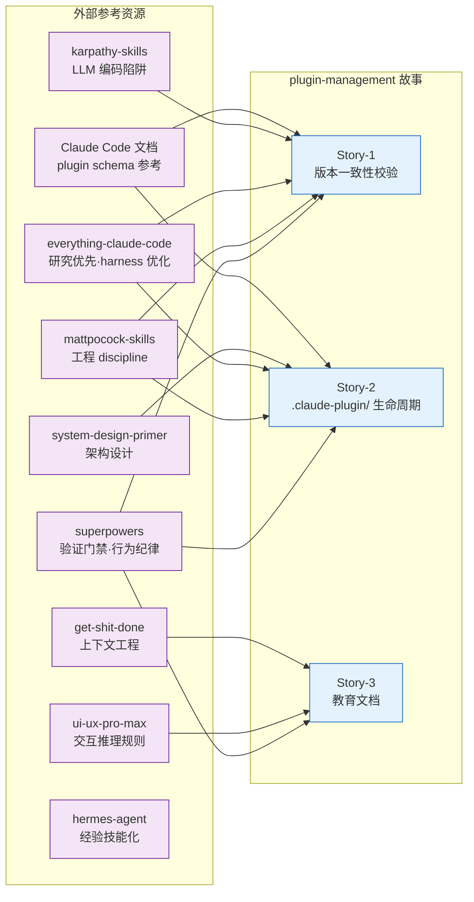
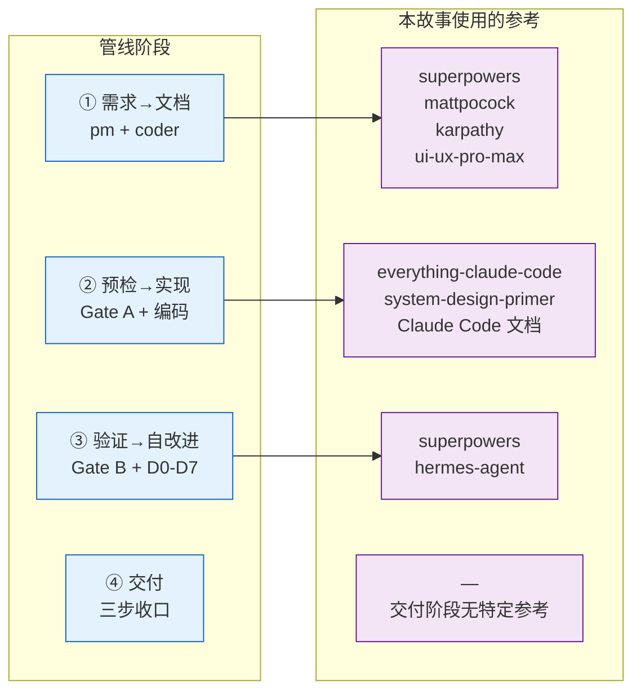

> | v1.4.0 | 2026-05-19 | deepseek-v4-pro | 🌿 feat/plugin-management | 📎 [CLAUDE.md](../../../CLAUDE.md) |

> **导航**: [← YrY-10-交互日志](./YrY-10-交互日志.md) · [外部参考总表 →](../../../README.md#外部参考)

> **来源**: `/rui update plugin-management 用户故事目录下添加外部参考文档`。证据等级 B（可推导，附外部参考路径）。

### 主要价值

- 🗺️ 外部参考映射 — 将 README.md 中 15 项外部参考与 plugin-management 3 个 Story 的决策点逐一关联
- 🔗 可追溯 — 每项参考标注了在哪个设计决策/文档章节中被吸收
- 📋 阶段索引 — 按管线阶段反向查找所需参考

---

### §1 外部参考 → 故事映射

| 外部参考 | 关联 Story | 吸收位置 | 汲取内容 |
|---------|-----------|---------|---------|
| [superpowers](https://github.com/obra/superpowers) | Story-1, Story-2, Story-3 | 01-§5 AC 门禁设计 · 03-§4 安全约束 · 05-测试用例格式 | 验证门禁五步法 — 每个命令有明确的 pass/fail 信号；行为纪律 — validate 只读不写、bump 原子回滚 |
| [mattpocock-skills](https://github.com/mattpocock/skills) | Story-1, Story-2 | 03-§0.1 设计决策（Node.js 同栈）· 06-§2 DEV-1 偏差记录 | 工程 discipline — 不凭空加抽象层，独立可执行脚本优于框架集成 |
| [everything-claude-code](https://github.com/affaan-m/everything-claude-code/blob/main/README.zh-CN.md) | Story-1, Story-2 | 03-§3 数据模型（配置化设计）· 06-§1.2 实测接口 | 研究优先开发 — 先读 marketplace.json 真实结构再设计 health checker；上下文质量优先 — 命令输出简洁可 grep |
| [karpathy-skills](https://github.com/multica-ai/andrej-karpathy-skills) | Story-1 | 01-§6 RSK-4（首次校验发现漂移） | LLM 编码陷阱规避 — 首次运行"失败"可能是功能生效的标志，不是 bug |
| [ui-ux-pro-max](https://github.com/nextlevelbuilder/ui-ux-pro-max-skill) | Story-3 | 02-§2 用户场景（≥3 交互状态覆盖） | CLI 输出交互状态覆盖 — pass/fail/error 三种输出模式，彩色 diff 增强可读性 |
| [system-design-primer](https://github.com/donnemartin/system-design-primer) | Story-2 | 03-§1 服务架构 · 03-§0.2 任务规划 | 模块化设计 — checker 模式每维度一个纯函数，新增检查不修改框架 |
| [Claude Code 官方文档](https://code.claude.com/docs/en/overview) | Story-1, Story-2 | 03-§3 plugin.json/marketplace.json schema | plugin.json 必填字段定义 · marketplace.json 结构 · skill/agent/rule 注册机制 |
| [get-shit-done](https://github.com/gsd-build/get-shit-done/tree/main) | Story-3 | 教育文档结构设计（入门→进阶→精通三级） | 上下文工程 — 每级文档自包含可独立阅读，不假设读者已读前级 |
| [hermes-agent](https://github.com/NousResearch/hermes-agent) | Story-2 | 06-§3 P0 审查（逐模块清零模式） | 经验技能化 — rui-plugin 的技能规约从实现中提取，可复用于后续插件管理任务 |

---

### §2 各参考详情

#### superpowers — 验证门禁与行为纪律

| 维度 | 详情 |
|------|------|
| 仓库 | [obra/superpowers](https://github.com/obra/superpowers) |
| 核心思想 | AI agent 软件开发方法论：可组合 skills、spec-driven 开发、验证门禁、行为纪律（94% PR 驳回率提炼） |
| plugin-management 应用 | 四个命令每个都有明确的 pass/fail 信号（退出码 0/1/2/3）；AC 设计遵循 Given-When-Then 可执行格式；安全约束 SEC-1–SEC-4 形成纵深防御 |
| 关键决策关联 | 01-§5 AC-1~AC-9 全部采用可验证门禁格式 · 03-§2.2 请求流程含 mermaid sequenceDiagram · 06-§7 所有命令可复制执行 |

#### mattpocock-skills — 工程 discipline

| 维度 | 详情 |
|------|------|
| 仓库 | [mattpocock/skills](https://github.com/mattpocock/skills) |
| 核心思想 | 真实工程场景 Agent skills 集合，强调"不是 vibe coding"；CONTEXT-FORMAT 参照 |
| plugin-management 应用 | 设计决策明确标注选择理由（03-§0.1）；偏差记录如实呈现（06-§2 DEV-1）；不做过度抽象 — Node.js 同栈而非引入新语言 |
| 关键决策关联 | 03-§0.1 决策领域表「脚本语言=Node.js，理由=项目已有 node 辅助脚本先例」· 06-§2 偏差：ESM 适配方案替代 spawnSync |

#### everything-claude-code — 研究优先与 harness 优化

| 维度 | 详情 |
|------|------|
| 仓库 | [affaan-m/everything-claude-code](https://github.com/affaan-m/everything-claude-code/blob/main/README.zh-CN.md) |
| 核心思想 | Agent harness 性能优化全集：上下文质量优先、研究优先开发、hook 实践 |
| plugin-management 应用 | 设计前先研究 marketplace.json 实际结构（health checker 匹配真实字段）；命令输出设计为可 grep 的单行结果；配置文件化减少硬编码 |
| 关键决策关联 | 03-§3 version-sources.json 设计 — 新增版本声明位置无需改脚本 · 06-§1.2 实测接口 — 退出码明确，输出可机器解析 |

#### karpathy-skills — LLM 编码陷阱

| 维度 | 详情 |
|------|------|
| 仓库 | [multica-ai/andrej-karpathy-skills](https://github.com/multica-ai/andrej-karpathy-skills) |
| 核心思想 | Karpathy 对 LLM 编码陷阱的观察提炼 |
| plugin-management 应用 | 风险 RSK-4 识别了"首次校验即发现版本漂移"的陷阱 — 这不是 bug 而是功能生效的标志；AC-5 和 AC-6 覆盖了 bump 的异常路径 |
| 关键决策关联 | 01-§6 RSK-4 · AC-5（中途失败回滚）· AC-6（非法版本号拒绝）|

#### ui-ux-pro-max — 交互推理规则

| 维度 | 详情 |
|------|------|
| 仓库 | [nextlevelbuilder/ui-ux-pro-max-skill](https://github.com/nextlevelbuilder/ui-ux-pro-max-skill) |
| 核心思想 | 161 条推理规则 + 67 种 UI 风格，跨平台 UI/UX 设计 |
| plugin-management 应用 | CLI 输出设计覆盖 ≥3 状态：pass（绿色 ✓）、fail（红色 ✗）、error（黄色 ⚠）；validate 输出逐行列出四个来源便于快速定位漂移点 |
| 关键决策关联 | 02-§2 用户场景 6 个 · 06-§6 效果截图展示三态输出 |

#### 其他参考

| 参考 | 应用简述 |
|------|---------|
| [system-design-primer](https://github.com/donnemartin/system-design-primer) | 03 架构设计中 checker 可扩展模式 — 每维度纯函数、新增不改框架 |
| [Claude Code 文档](https://code.claude.com/docs/en/overview) | plugin.json 必填字段 schema · marketplace.json 结构 · skill 注册规范 |
| [get-shit-done](https://github.com/gsd-build/get-shit-done/tree/main) | 教育文档三级结构（入门→进阶→精通），每级自包含 |
| [hermes-agent](https://github.com/NousResearch/hermes-agent) | 逐模块 P0 清零模式 — 经验可沉淀为 rui-plugin 技能规约 |

---

### §3 管线阶段 → 参考索引

| 阶段 | 关键参考 | 产生的文档 |
|------|---------|-----------|
| 需求→文档 | superpowers · mattpocock-skills · karpathy-skills · ui-ux-pro-max | 01-故事任务 · 02-用户场景 · 03-技术评审 · 05-测试用例评审 |
| 预检→实现 | everything-claude-code · system-design-primer · Claude Code 文档 | validate.mjs · bump.mjs · health.mjs · publish-prep.mjs · 教育文档 ×3 |
| 验证 | superpowers · hermes-agent | 06-实施报告 · P0 审查记录 |
| 交付 | — | 10-交互日志 · import-docs 同步 |

---

### 变更记录

| 日期 | 变更 | 触发 | 证据 |
|------|------|------|------|
| 2026-05-19 | 初稿：9 项外部参考映射 · 3 阶段索引 · 每项参考含详情表 | `/rui update plugin-management 用户故事目录下添加外部参考文档` | README.md 外部参考节 + 01/02/03/05/06 文档中的参考标注 |
