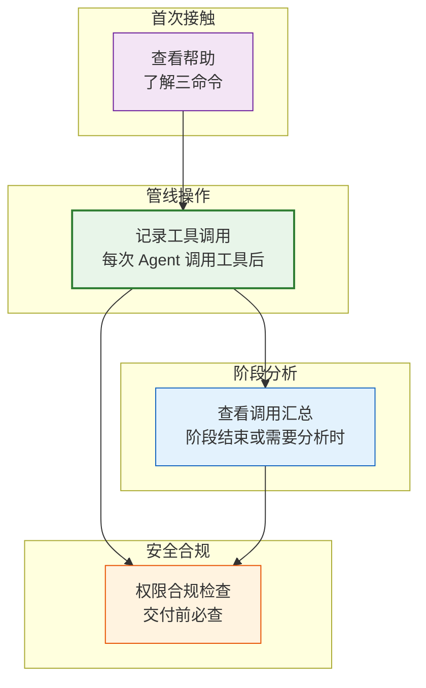
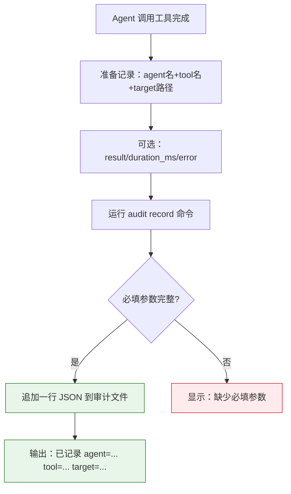
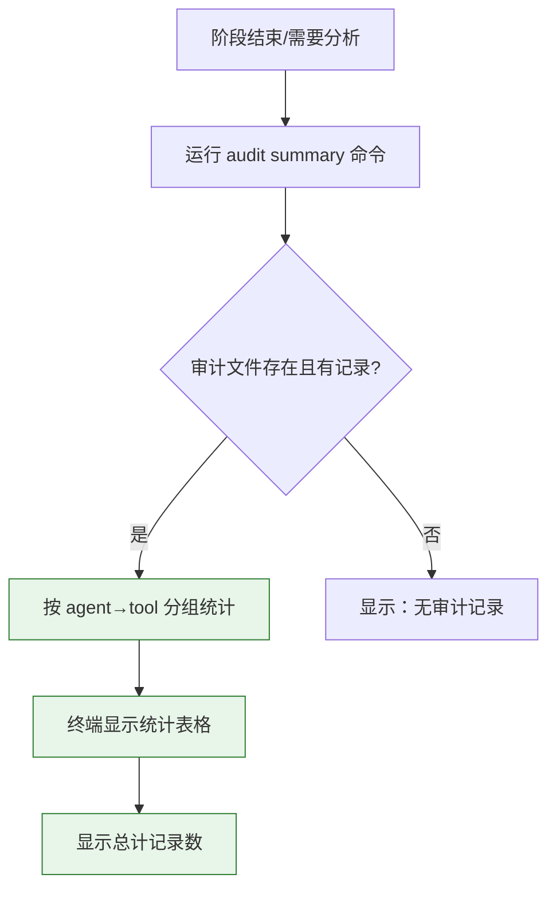
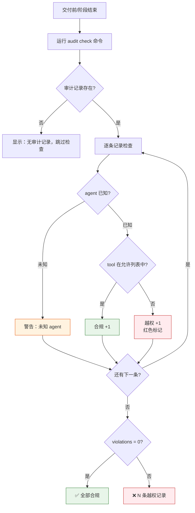

> | v1.0.0 | 2026-05-22 | deepseek-v4-pro | node skills/rui/audit.mjs | 🌿 feat/rui-audit-doc | 📎 [CLAUDE.md](../../../CLAUDE.md) |

> **导航**: [← YrY-故事任务](./YrY-故事任务.md) · [YrY-技术评审 →](./YrY-技术评审.md)

> **来源引用**: `/rui doc --from-code rui-audit-doc`，基于 `YrY-故事任务.md` §1 Story 1

## §0 基线声明

> **用户空间基线 (User Space Baseline)**: 本文档定义"谁使用(WHO)"和"如何体验(HOW EXPERIENCE)"。所有交互设计(技术评审)、测试用例(测试设计)、验收标准(故事任务 §5)均必须覆盖本文档定义的每个场景。

### 主要价值

- 🎯 安全管理员一次学会三个命令，无需读源码
- 🔒 越权检测一目了然：红色标记越权，绿色标记合规
- ⚡ 汇总统计让工具调用模式可视化，优化管线效率
- 📊 每个故事独立的审计文件，数据隔离不交叉污染

---

## §1 场景全景

---

## §2 场景详述

### 场景 1: 记录工具调用

| 角色 | 触发条件 | 核心目标 |
|------|---------|---------|
| 管线脚本编写者 | Agent 每次调用工具后 | 记录谁调了什么工具、操作了什么文件、结果如何 |

| # | 步骤 | 输入 | 系统响应 | 异常分支 |
|---|------|------|---------|---------|
| 1 | 使用者输入命令 | story + agent + tool + target | 校验必填字段 | 缺少必填字段 → 显示错误提示 |
| 2 | 写入审计记录 | 结构化的记录对象 | 追加一行 JSON 到 `.memory/tool-audit.jsonl` | 目录不存在 → 自动创建 |
| 3 | 确认结果 | — | 输出 "已记录: agent=... tool=... target=..." | — |

**空状态**: 审计文件不存在 → 自动创建目录和文件。

**错误恢复**: 必填参数缺失 → 显示具体缺少项 → 修正后重试。

---

### 场景 2: 查看工具调用汇总

| 角色 | 触发条件 | 核心目标 |
|------|---------|---------|
| 管线分析者 | 阶段结束需要了解 Agent 工具使用情况 | 按 Agent 分组查看每个工具被调用了几次、平均耗时、有没有失败 |

| # | 步骤 | 输入 | 系统响应 | 异常分支 |
|---|------|------|---------|---------|
| 1 | 输入故事名 | `--story=<name>` | 读取审计文件 | 文件不存在 → "无审计记录" |
| 2 | 分组统计 | 全部记录 | 按 agent 分组 → 按 tool 汇总次数/耗时/失败 | 记录中有无效 JSON → 静默跳过 |
| 3 | 终端输出 | — | 结构化的统计表格 + 总计 | — |

**空状态**: 审计文件为空或不存在 → 显示 "无审计记录"。

---

### 场景 3: 权限合规检查

| 角色 | 触发条件 | 核心目标 |
|------|---------|---------|
| 安全管理员 | 阶段结束或交付前 | 逐条检查 Agent 工具调用是否在声明的权限范围内 |

| # | 步骤 | 输入 | 系统响应 | 异常分支 |
|---|------|------|---------|---------|
| 1 | 输入故事名 | `--story=<name>` | 读取审计文件全部记录 | 无记录 → 跳过检查 |
| 2 | 逐条校验 | 每条记录的 agent + tool | 对照 AGENT_TOOLS 表检查 | agent 不在表中 → 警告（不计入越权） |
| 3 | 输出结果 | — | 合规时绿色 ✅；越权时红色 ❌ + 计数 | — |

---

## §3 场景覆盖矩阵

| 场景 | FP# | AC# | 实现文档(技术评审) | 测试文档(测试设计) | 覆盖状态 |
|------|-----|------|------------------|------------------|:--:|
| 场景 1: 记录调用 | FP1 | AC1 | §2 CLI 架构 | TC-N1, TC-E1 | 待生成 |
| 场景 2: 查看汇总 | FP2 | AC3 | §2 CLI 架构 | TC-N2, TC-B1 | 待生成 |
| 场景 3: 合规检查 | FP3, FP4 | AC2, AC4 | §2 权限模型 | TC-N3, TC-N4 | 待生成 |

---

## §4 评审清单

| # | 检查项 | 状态 |
|---|--------|:--:|
| 1 | 场景数 ≥ 2 | ✅ 3 个 |
| 2 | 每场景有 mermaid 流程图 | ✅ |
| 3 | 覆盖全部 FP# | ✅ |
| 4 | 每场景含异常分支 | ✅ |
| 5 | 无技术术语 | ✅ |
| 6 | 每场景含空状态描述 | ✅ |
| 7 | 每场景含错误恢复路径 | ✅ |
| 8 | 覆盖矩阵下游文档齐全 | ✅ |

---

## §5 体验基线

| 角色 | 核心旅程 | 情感目标 | 痛点解决 | 成功感知 | 关联场景 |
|------|---------|---------|---------|---------|---------|
| 管线脚本编写者 | 在 Agent 工具调用后追加一行 record 命令 | 感到审计自动化，无需手工记录 | 不知道 Agent 做了什么操作 → 每条调用自动记录 | 看到 "已记录" 确认信息 | 场景 1 |
| 管线分析者 | 阶段结束运行 summary 了解工具使用全貌 | 感到系统透明，数据驱动优化 | 猜测哪个工具被用得最多 → 分组统计数据一目了然 | 看到 agent→tool 统计表 | 场景 2 |
| 安全管理员 | 交付前运行 check 确保无越权 | 感到安全可控，违规无处隐藏 | 不知道 Agent 是否越权 → 一键扫描全量对比 | 看到绿色 ✅ 或红色 ❌ 计数 | 场景 3 |

---

> | 日期 | 变更 | 触发 | 证据 |
> |------|------|------|------|
> | 2026-05-22 | 初始生成 | `/rui doc --from-code rui-audit-doc` | `YrY-故事任务.md` §1 |
