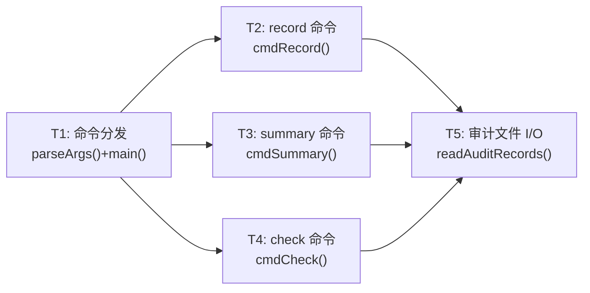
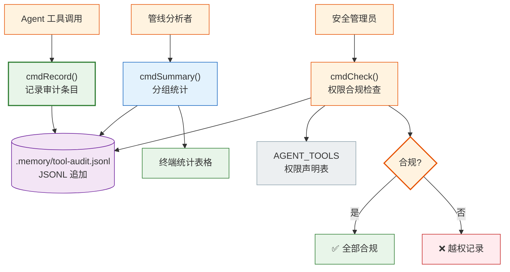
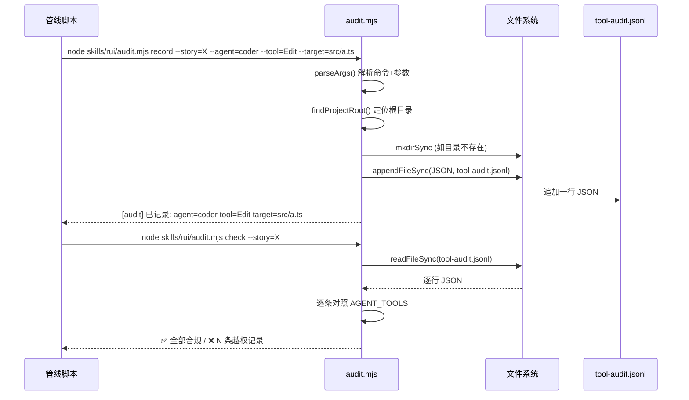

> | v1.0.0 | 2026-05-22 | deepseek-v4-pro | node skills/rui/audit.mjs | 🌿 feat/rui-audit-doc | 📎 [CLAUDE.md](../../../CLAUDE.md) |

> **导航**: [← YrY-使用场景](./YrY-使用场景.md) · [YrY-测试设计 →](./YrY-测试设计.md) · [YrY-安全审计 →](./YrY-安全审计.md)

> **来源引用**: `/rui doc --from-code rui-audit-doc`，源码 `skills/rui/audit.mjs:1-251`

### 主要价值

- 🎯 零外部依赖：纯 Node.js 标准库，永远可独立运行
- 🔒 权限声明即文档：AGENT_TOOLS 硬编码表定义全部 6 个 Agent 权限边界
- ⚡ 三命令闭环：record → summary → check 覆盖全审计生命周期
- 📊 JSONL 数据易消费：每行一条 JSON，jq/grep 即可查询

## §0 设计决策与任务规划

### §0.0 基线溯源

| 本设计章节 | 实现 故事任务 | 服务 使用场景 | 覆盖状态 |
|-----------|-------------|-------------|:--:|
| §1 系统架构 | FP1–FP4 全部功能点 | 场景 1–3 全部用户操作 | ✅ |
| §2 权限模型 | FP3 合规检查, FP4 权限声明 | 场景 3 | ✅ |
| §7 安全约束 | R1–R5 审计规则 | 场景 1, 3 | ✅ |
| §8 性能与限制 | FP2 汇总统计 | 场景 2 | ✅ |

### §0.1 设计决策

| 决策领域 | 选定方案 | 选择理由 | 详见 | 实现 FP# |
|---------|---------|---------|------|---------|
| 权限声明方式 | 硬编码 `AGENT_TOOLS` 对象（6 个 Agent，每个 Set<string>） | 简单直接；代码即文档；新增 Agent 时必须显式添加 | §2 | FP4 |
| 审计数据格式 | JSONL（每行一个 JSON 对象） | 追加友好；jq/grep 直接查询 | §2 | FP1 |
| 越权检测策略 | `AGENT_TOOLS[agent].has(tool)` 检查，未知 agent 警告不放行 | 防御式：未知 = 可疑但不阻断 | §2 | FP3 |
| 数据隔离 | 每故事一个 `tool-audit.jsonl` | 与 rui 故事目录结构一致 | §1 | FP1 |
| TTY 检测 | `process.stdout.isTTY` 控制 ANSI 颜色输出 | 管道友好：非 TTY 时输出纯文本 | §2 | FP2, FP3 |

### §0.2 任务规划

| ID | 描述 | 工作量 | 交付物 | Agent | 门禁 | 实现 FP# |
|----|------|:--:|------|-------|------|---------|
| T1 | CLI 命令分发 + 参数解析 | S | `parseArgs()` + `main()` | coder | 单元测试 | FP1 |
| T2 | record 命令：校验 → 组装记录 → 追加 JSONL | S | `cmdRecord()` | coder | Gate A | FP1 |
| T3 | summary 命令：读取 → 分组统计 → 终端表格 | M | `cmdSummary()` | coder | 集成测试 | FP2 |
| T4 | check 命令：读取 → 逐条对照 AGENT_TOOLS → 输出 | M | `cmdCheck()` | coder | Gate A | FP3, FP4 |
| T5 | 审计文件读取器（JSONL 解析 + 错误容错） | S | `readAuditRecords()` | coder | 单元测试 | FP1, FP2, FP3 |

---

## §1 系统架构

### 效果示意

### 1.1 模块/文件

| 变更类型 | 模块/文件 | 职责 |
|:--:|------|------|
| 现有 | `skills/rui/audit.mjs` | CLI 入口，三命令 + AGENT_TOOLS 声明，251 行 |
| 运行时 | `docs/故事任务面板/<story>/.memory/tool-audit.jsonl` | 审计数据文件（JSONL，每故事独立） |

**函数职责**：

| 函数 | 类型 | 职责 |
|------|------|------|
| `parseArgs()` | 参数解析 | 解析命令 + 全部参数 |
| `findProjectRoot()` | 环境感知 | 向上遍历目录树查找项目根目录 |
| `cmdRecord()` | 核心 | 校验必填参数 → 组装 JSON 记录 → 追加 JSONL |
| `readAuditRecords()` | I/O | 读取 JSONL 文件，逐行解析，容错跳过无效行 |
| `cmdSummary()` | 分析 | 按 agent→tool 分组统计次数/失败率/平均耗时 |
| `cmdCheck()` | 合规 | 逐条对照 AGENT_TOOLS 检测越权调用 |
| `main()` | 入口 | 命令分发：record / summary / check |

### 权限模型

**AGENT_TOOLS 声明表**（定义在 `skills/rui/audit.mjs:14-21`）：

| Agent | 允许的工具 |
|-------|-----------|
| pm | Read, Grep, Glob, Bash |
| coder | Read, Grep, Glob, Edit, Write, Bash |
| tester | Read, Grep, Glob, Bash |
| reporter | Read, Grep, Glob |
| security | Read, Grep, Glob |
| self-improve | Read, Grep, Glob, Bash |

**检测逻辑**：`AGENT_TOOLS[agent].has(tool)` → false → 越权。

### 1.2 通信通道

| 通道 | 方向 | 协议 | Payload | 错误处理 |
|------|------|------|---------|---------|
| CLI → audit | 入站 | `process.argv` 字符串数组 | 命令 + 参数键值对 | 未知命令 → 提示可用命令列表 |
| audit → JSONL | 出站 | `appendFileSync()` | JSON 一行 + `\n` | 文件系统错误 → 异常抛出 |
| JSONL → audit | 入站 | `readFileSync()` → 逐行 JSON.parse | 全部审计记录 | 无效 JSON → 静默跳过（容错） |

---

## §7 安全约束

| # | 威胁 | 信任边界 | 缓解措施 | 优先级 |
|---|------|---------|---------|:--:|
| 1 | 伪造审计记录（注入虚假 agent/tool） | CLI → 审计文件 | 调用方负责传入正确参数；审计文件仅由 audit.mjs 写入 | P1 |
| 2 | 审计文件被外部进程篡改 | 文件系统 → 审计文件 | JSONL 格式可被 `check` 检测（无效 JSON 静默跳过） | P1 |
| 3 | AGENT_TOOLS 表过时导致越权漏检 | 代码维护 → 运行时权限基准 | 新增 Agent 时强制同步更新 AGENT_TOOLS；PR 审查门禁 | P0 |
| 4 | 未知 agent 警告但放行可能被利用绕过检查 | check 命令 → 合规判定 | 未知 agent 输出黄色警告（非红色越权），由人工判定 | P2 |

---

## §8 性能与限制

| 维度 | 约束 | 应对 |
|------|------|------|
| 写入延迟 | `appendFileSync()` 同步阻塞，单次 < 1ms | 串行管线可接受 |
| 审计文件读取 | `readFileSync()` 全量读入内存 | 每故事文件通常 < 100KB |
| 统计计算 | 全量遍历 + 内存聚合 | O(n) 线性，记录 < 1万时 < 5ms |
| 并发 | 单进程模型，无并发控制 | 管线架构保证串行 |
| 依赖 | 仅 `node:path` + `node:fs`，零外部依赖 | 永远可独立运行 |

---

## §9 评审清单

| # | 检查项 | 状态 |
|---|--------|:--:|
| 1 | 效果示意 mermaid 图完整 | ✅ |
| 2 | 基线溯源覆盖全部 FP# 和场景 | ✅ |
| 3 | 设计决策有明确理由 | ✅ |
| 4 | 权限模型 AGENT_TOOLS 表完整（6 Agent） | ✅ |
| 5 | 安全约束覆盖信任边界 | ✅ |
| 6 | 性能限制有量化说明 | ✅ |
| 7 | 项目类型裁剪正确（meta） | ✅ |
| 8 | 三命令职责单一 | ✅ |

---

> | 日期 | 变更 | 触发 | 证据 |
> |------|------|------|------|
> | 2026-05-22 | 初始生成 | `/rui doc --from-code rui-audit-doc` | `skills/rui/audit.mjs:1-251` |
