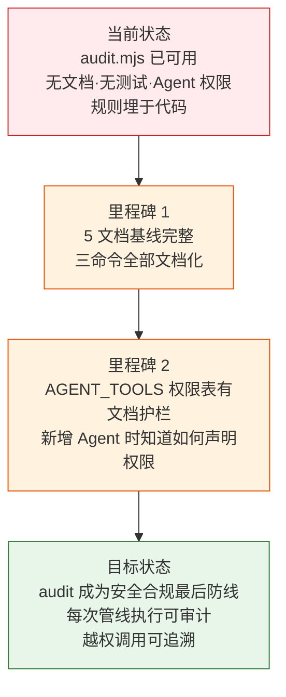

> | v1.0.0 | 2026-05-22 | deepseek-v4-pro | node skills/rui/audit.mjs | 🌿 feat/rui-audit-doc | 📎 [CLAUDE.md](../../../CLAUDE.md) |

> **导航**: [YrY-使用场景 →](./YrY-使用场景.md)

> **来源引用**: `/rui doc --from-code rui-audit-doc`，源码 `skills/rui/audit.mjs` (251 行)

[§0 基线声明](#sec0-baseline) · [§1 Story](#sec1-story) · [§2 Requirements](#sec2-requirements) · [§3 成功标准](#sec3-success) · [§4 范围边界](#sec4-scope) · [§5 AC](#sec5-ac) · [§6 风险与假设](#sec6-risks) · [§7 跨文档索引](#sec7-index) · [§R 关联故事](#secR-related)

## §0 基线声明

> **问题空间基线 (Problem Space Baseline)**: 本文档定义"做什么(WHAT)"和"为什么(WHY)"。所有后续文档(03-09)的设计、实现、验证、改进决策均必须可追溯至本文档的具体章节。

### 需求概述

工具调用审计系统 (`audit.mjs`) 是 rui 管线的权限合规基础设施。它记录每个 Agent 的每次工具调用（agent/tool/target/result/duration），在此基础上提供汇总统计和权限合规检查——对照 Agent YAML frontmatter 声明的 tools 列表检测越权调用。当前状态：脚本已可用但无文档基线，Agent 开发者需读源码理解合规规则。

### 效果示意

### 主要价值

- 🔒 权限合规最后防线：对照 YAML frontmatter 检测越权，越权调用无处隐藏
- 📊 工具调用可观测：按 agent→tool 统计调用次数、失败率、平均耗时
- 🔗 审计链路闭环：record → summary → check 三命令覆盖全审计生命周期
- ⚡ 零外部依赖：纯 Node.js 标准库，数据格式为 JSONL 易于消费
- 🛡️ Agent 权限声明文档驱动：AGENT_TOOLS 定义即文档，新增 Agent 一目了然

---

## §1 Story

### Story 1: 工具审计系统文档基线

| 字段 | 内容 |
|------|------|
| 作为 | rui 管线安全管理员和 Agent 开发者 |
| 我想要 | audit.mjs 有完整的文档基线 |
| 以便 | 管线集成者有清晰的审计接口规约，Agent 开发者知道权限声明规则，越权检测有文档护栏 |
| 优先级 | P0 |
| 范围边界 | 只读源码，生成文档到 `docs/故事任务面板/rui-audit-doc/` |
| 依赖 | 源码 `skills/rui/audit.mjs` 可访问 |

#### 范围外

- 不修改 `audit.mjs` 源码
- 不新增 Agent 类型或权限规则
- 不生成实施报告/测试报告/自改进复盘

##### §1.1 User Operations

| # | 操作 | 触发条件 | 操作步骤 | 预期结果 |
|---|------|---------|---------|---------|
| 1 | 记录工具调用 | Agent 每次调用工具后 | `node skills/rui/audit.mjs record --story=<name> --agent=<name> --tool=<name> --target=<path>` | 一条 JSONL 记录追加到故事目录的 `.memory/tool-audit.jsonl` |
| 2 | 查看工具调用汇总 | 阶段结束或需要分析时 | `node skills/rui/audit.mjs summary --story=<name>` | 按 agent→tool 分组统计：调用次数、平均耗时、失败率 |
| 3 | 权限合规检查 | 阶段结束或交付前 | `node skills/rui/audit.mjs check --story=<name>` | 逐条对比 AGENT_TOOLS 声明，输出越权记录或全部合规 |

---

## §2 Requirements

### 功能点

| FP# | 描述 | 输入 | 输出 | 错误行为 | 优先级 |
|-----|------|------|------|---------|--------|
| FP1 | 记录工具调用（record） | `--story` + `--agent` + `--tool`（必填），可选 `--target/--result/--error/--duration_ms` | 一条 JSONL 行写入 `.memory/tool-audit.jsonl` | 必填参数缺失时输出错误提示 | P0 |
| FP2 | 工具调用汇总（summary） | `--story`（必填） | 终端表格：agent → tool → 次数/平均耗时/失败率 → 总计 | 无审计记录时输出 "无审计记录" | P1 |
| FP3 | 权限合规检查（check） | `--story`（必填） | 逐条对照 AGENT_TOOLS 检测越权 → 合规/越权统计 | 未知 agent 名警告但不报错 | P0 |
| FP4 | Agent 权限声明 | 硬编码 `AGENT_TOOLS` 表（6 个 Agent） | `check` 命令的比对基准 | Agent 不在表中时输出警告 | P1 |

### 业务规则

| R# | 描述 | 校验方式 | 证据级别 |
|----|------|---------|---------|
| R1 | record 必填参数（story/agent/tool）缺失时拒绝记录 | `if (!opts.story \|\| !opts.agent \|\| !opts.tool)` 检查 | A |
| R2 | check 命令逐条对照 AGENT_TOOLS 检测越权 | `AGENT_TOOLS[agent].has(tool)` 检查 | A |
| R3 | 未知 agent 名（不在 AGENT_TOOLS 中）警告但不视为越权 | `if (!allowed)` → 输出警告 + 不计入 violations | A |
| R4 | 未知命令提示可用命令列表 | default 分支 → 输出 "未知命令。可用: record \| summary \| check" | A |
| R5 | 审计数据以 JSONL 格式存储，每故事独立文件 | `.memory/tool-audit.jsonl` 在故事目录下 | A |

### 数据约束

| 约束 | 类型 | 范围/格式 | 来源 |
|------|------|----------|------|
| story | string | 故事名（kebab-case） | `--story` |
| agent | string | pm/coder/tester/reporter/security/self-improve | `--agent` |
| tool | string | Read/Grep/Glob/Edit/Write/Bash 等 | `--tool` |
| target | string | 文件路径或空 | `--target` |
| result | enum | success/failure | `--result` |
| duration_ms | integer | ≥ 0 | `--duration_ms` |

---

## §3 成功标准

| SC# | 描述 | 度量方式 | 目标值 | 优先级 | 关联 FP# |
|-----|------|---------|--------|--------|---------|
| SC1 | 使用者可记录一次工具调用 | `node skills/rui/audit.mjs record --story=test --agent=coder --tool=Edit --target=src/a.ts` | audit 输出 "已记录" + JSONL 追加一行 | P0 | FP1 |
| SC2 | 使用者可查看某故事的工具调用汇总 | `summary --story=test` 显示 agent→tool 分组统计 | 含次数 + 耗时 + 失败率 | P0 | FP2 |
| SC3 | 越权调用被准确检测 | 记录一条 `agent=pm tool=Edit` 后运行 check | 输出越权警告（pm 不能 Edit） | P0 | FP3 |
| SC4 | 新增 Agent 时权限声明机制清晰 | 查看 AGENT_TOOLS 定义即可知道如何添加 | 代码可读 | P1 | FP4 |

---

## §4 范围边界

### 范围内

| # | 条目 | 关联 FP# | 边界说明 |
|---|------|---------|---------|
| 1 | 记录工具调用 | FP1 | 核心功能 |
| 2 | 工具调用汇总 | FP2 | 按 agent→tool 分组统计 |
| 3 | 权限合规检查 | FP3, FP4 | 对照 AGENT_TOOLS 声明 |
| 4 | 6 个 Agent 的权限声明 | FP4 | 硬编码在审计脚本内 |

### 范围外

| # | 条目 | 排除原因 | 替代方案 |
|---|------|---------|---------|
| 1 | 审计数据自动清理 | 存储策略属于运维层面 | 手动管理 |
| 2 | 实时告警（越权时阻断） | 当前为事后检查模式 | 管线脚本调用 check 后判断 |
| 3 | 动态权限配置（从 YAML frontmatter 自动解析） | 当前为硬编码声明 | 后续需求 |

---

## §5 AC

| AC# | Given | When | Then | 门禁 |
|-----|-------|------|------|------|
| AC1 | 审计文件不存在 | 执行 `record --story=test --agent=coder --tool=Edit --target=src/a.ts` | 自动创建目录和文件，追加一条含 timestamp/agent/tool/target 的 JSONL 记录 | Gate A |
| AC2 | 已有 3 条审计记录（含 1 条 pm 调用 Edit） | 执行 `check --story=test` | 输出 1 条越权记录（pm 不在 AGENT_TOOLS 中允许 Edit） | Gate A |
| AC3 | 已有 3 条审计记录 | 执行 `summary --story=test` | 按 agent 分组显示 tool→count 统计 | Gate A |
| AC4 | 记录一条 `agent=unknown` 的调用 | 执行 `check` | 输出未知 agent 警告，不计入 violations | Gate A |

---

## §6 风险与假设

| # | 风险/假设 | 类型 | 可能性 | 影响 | 缓解/验证策略 | 关联 FP# |
|---|----------|------|--------|------|-------------|---------|
| 1 | AGENT_TOOLS 硬编码与实际 YAML frontmatter 不同步 | 风险 | M | H | 新增 Agent 时必须同时更新 audit.mjs 的 AGENT_TOOLS 表 | FP4 |
| 2 | 审计数据量增长 | 风险 | L | L | JSONL 格式支持日志轮转 | FP1 |
| 3 | 未知 Agent 名称警告但放行可能遗漏真正的越权 | 风险 | L | M | 未知 agent 输出警告，由人工判断 | FP3 |
| 4 | Agent 开发者会同步更新 AGENT_TOOLS 表 | 假设 | — | — | 文档规约 + PR 审查门禁 | FP4 |

---

## §7 跨文档索引

| 本文档章节 | 基线内容 | 下游文档编号 | 预期覆盖 | 状态 |
|-----------|---------|-------------|---------|:--:|
| §1 Story 1 | 工具审计系统文档基线 | 02 使用场景 | 3 个用户操作场景 | 待生成 |
| §2 FP1–FP4 | record/summary/check/权限声明 | 03 技术评审 | CLI 架构+安全约束+权限模型 | 待生成 |
| §2 R1–R5 | 审计规则和权限检测逻辑 | 04 测试设计 | 正常/边界/异常/合规测试用例 | 待生成 |
| §2 R2–R3 | 越权检测规则 | 05 安全审计 | 合规检查+权限模型审计 | 待生成 |
| §5 AC1–AC4 | 验收标准 | 04 测试设计 | Gate A 交接信号 | 待生成 |

---

## §R 关联故事

| 关联故事 | 关系类型 | 说明 |
|---------|---------|------|
| `.memory-collector-doc` | 数据供给 | collector 记录执行记忆，audit 记录工具调用——同为管线持久化基础设施 |
| security agent | 权限模型定义 | AGENT_TOOLS 表实现的权限模型由 security agent 在设计阶段定义 |

---

> | 日期 | 变更 | 触发 | 证据 |
> |------|------|------|------|
> | 2026-05-22 | 初始生成 5 文档基线 | `/rui doc --from-code rui-audit-doc` | `skills/rui/audit.mjs:1-251` |
