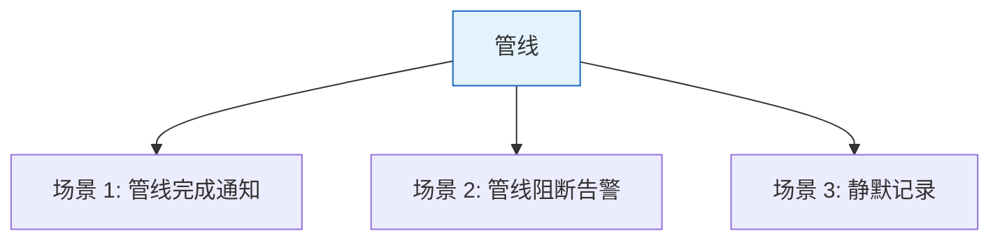
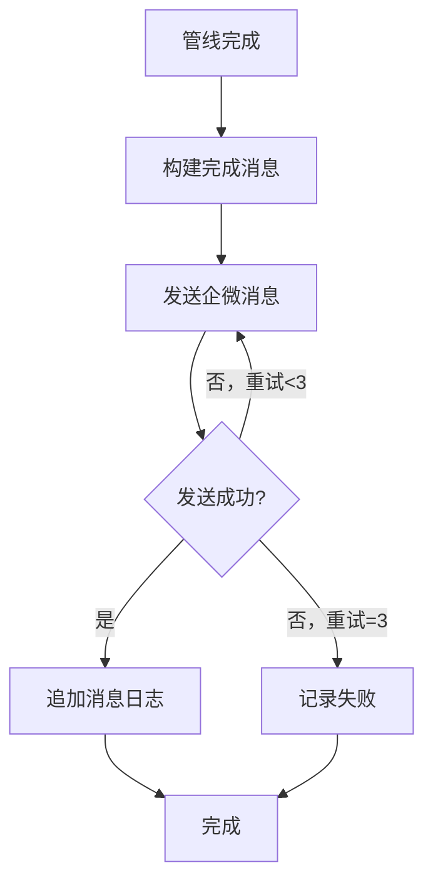

> | v1.0.0 | 2026-05-22 | deepseek-v4-pro | ⏱️ — | 📎 [CLAUDE.md](../../../CLAUDE.md) |

> **导航**: [← YrY-故事任务](./YrY-故事任务.md) · [→ YrY-技术评审](./YrY-技术评审.md)

# YrY-使用场景 · rui-bot-send

## §0 基线声明

> **用户空间基线**

### 主要价值

- 📢 管线操作者实时获知管线状态
- 🚫 阻断时立即收到告警和恢复指引
- 📝 所有通知历史可追溯

---

## §1 场景全景

## §2 场景详述

### 场景 1: 管线完成通知

| 角色 | 触发条件 | 核心目标 |
|------|---------|---------|
| 管线操作者 | rui 管线正常完成 | 收到结构化完成通知 |

| # | 步骤 | 系统响应 | 异常分支 |
|---|------|---------|---------|
| 1 | 管线触发 send | 解析 story/status/content 参数 | 参数缺失：提示用法 |
| 2 | 构建消息 | 按 complete 模板生成 Markdown | 内容超 2000 字符：截断 |
| 3 | 发送消息 | POST 到企微 API | 网络失败：重试 ≤3 次 |
| 4 | 追加日志 | 写入通知列表文件 | — |

### 场景 2: 管线阻断告警

| 角色 | 触发条件 | 核心目标 |
|------|---------|---------|
| 管线操作者 | 管线被阻断 | 收到阻断原因+恢复指引 |

| # | 步骤 | 系统响应 | 异常分支 |
|---|------|---------|---------|
| 1 | 管线阻断 | 构建 blocked 消息含阻断原因和恢复指引 | — |
| 2 | 发送告警 | POST 含 🚫 标记的消息 | 同场景 1 |

### 场景 3: 静默记录

| 角色 | 触发条件 | 核心目标 |
|------|---------|---------|
| 管线操作者 | `--no-send` | 仅追加日志，不发送通知 |

---

## §3 场景覆盖矩阵

| 场景 | FP# | AC# | 实现文档 | 测试文档 | 状态 |
|------|-----|------|---------|---------|:--:|
| 场景 1: 完成通知 | FP1,FP2,FP5 | AC1 | 技术评审 §2 | 测试设计 §2.1 | 待生成 |
| 场景 2: 阻断告警 | FP1,FP2,FP5 | AC2 | 技术评审 §2 | 测试设计 §2.2 | 待生成 |
| 场景 3: 静默记录 | FP6 | AC3 | 技术评审 §2 | 测试设计 §2.3 | 待生成 |

---

## §4 评审清单

| # | 检查项 | 状态 |
|---|--------|:--:|
| 1 | 场景 ≥ 2 | ✅ (3) |
| 2 | 每场景有图 | ✅ |
| 3 | 异常分支明确 | ✅ |

---

## §5 体验基线

| 角色 | 核心旅程 | 情感目标 | 成功感知 | 关联场景 |
|------|---------|---------|---------|---------|
| 管线操作者 | 提交代码→收到完成通知 | 感到流程自动化可靠 | 企微群看到 ✅ 完成消息 | 场景 1 |
| 管线操作者 | 提交代码→收到阻断告警 | 快速定位问题 | 看到阻断原因+恢复指引 | 场景 2 |

---

> | 日期 | 变更 | 触发 | 证据 |
> |------|------|------|------|
> | 2026-05-22 | 初始生成 | /rui doc --from-code rui-bot-send-doc | skills/wework-bot/send.mjs |
