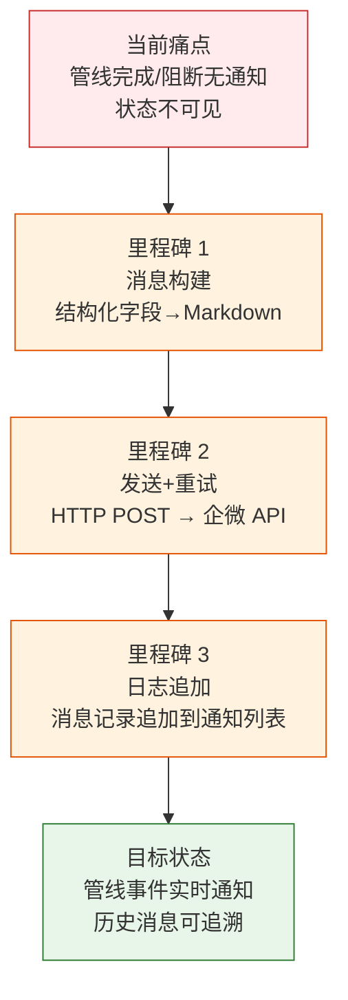

> | v1.0.0 | 2026-05-22 | deepseek-v4-pro | ⏱️ — | 📎 [CLAUDE.md](../../../CLAUDE.md) |

> **导航**: [→ YrY-使用场景](./YrY-使用场景.md)

> **来源引用**: `/rui doc --from-code rui-bot-send-doc` · 源文件 `skills/rui-bot/send.mjs`

# YrY-故事任务 · rui-bot-send

## §0 基线声明

> **问题空间基线**: 本文档定义"做什么(WHAT)"和"为什么(WHY)"。

### 需求概述

企业微信通知机器人是 rui 交付管线的第三步，负责在管线完成或阻断时向企业微信群发送结构化通知消息。支持完整/阻断/门禁失败三种状态的消息模板，含自动重试和内容截断保护。

### 效果示意

### 主要价值

- 📢 实时通知：管线完成/阻断/门禁失败即时推送企业微信
- 📋 结构化消息：按状态使用不同模板，字段对齐故事上下文
- 🔄 自动重试：最多 3 次重试，网络波动容错
- 📝 日志追溯：每条消息追加到通知列表，历史可查

---

## §1 Story

### Story 1: 管线通知发送

| 字段 | 内容 |
|------|------|
| 作为 | 管线操作者 |
| 我想要 | 管线完成或阻断时自动通知到企业微信群 |
| 以便 | 及时获知管线状态，无需手动查看 |
| 优先级 | P0 |
| 范围边界 | 构建消息→发送企微→追加日志 |
| 依赖 | API_X_TOKEN、企微 webhook 配置 |

##### §1.1 User Operations

| # | 操作 | 触发条件 | 操作步骤 | 预期结果 |
|---|------|---------|---------|---------|
| 1 | 完成通知 | 管线正常完成 | 构建完成消息→发送→追加日志 | 群里收到完成通知 |
| 2 | 阻断通知 | 管线被阻断 | 构建阻断消息（含阻断原因+恢复指引）→发送→追加日志 | 群里收到阻断告警 |
| 3 | 仅记录不发 | `--no-send` 参数 | 仅追加日志，不发送消息 | 静默记录 |

---

## §2 Requirements

### 功能点

| FP# | 描述 | 优先级 |
|-----|------|:--:|
| FP1 | 消息构建 — 按状态选择模板，结构化字段→Markdown | P0 |
| FP2 | HTTP 发送 — POST 到企微 API，含 X-Token 鉴权 | P0 |
| FP3 | 自动重试 — 最多 3 次，间隔 1s | P1 |
| FP4 | 内容截断 — 超 2000 字符自动截断 | P1 |
| FP5 | 日志追加 — 发送记录写入消息通知列表 | P0 |
| FP6 | 仅记录模式 — `--no-send` 跳过发送仅写日志 | P1 |

### 业务规则

| R# | 描述 |
|----|------|
| R1 | 消息最长 2000 字符，超出自动截断并标注 |
| R2 | 发送失败最多重试 3 次 |
| R3 | `--no-send` 时静默，不触发网络请求 |

---

## §3 成功标准

| SC# | 描述 | 度量方式 | 优先级 | 关联 FP# |
|-----|------|---------|:--:|---------|
| SC1 | 完成通知成功送达 | 企微群收到消息 | P0 | FP1,FP2 |
| SC2 | 阻断通知含恢复指引 | 消息包含 recovery 字段 | P0 | FP1 |
| SC3 | 消息超长时安全截断 | 输出 ≤ 2000 字符 | P1 | FP4 |

---

## §4 范围边界

### 范围内: 消息构建、发送、重试、日志追加
### 范围外: 企微 webhook 配置管理（属于 config.json）、消息模板设计（属于 SKILL.md）

---

## §5 AC

| AC# | Given | When | Then | 门禁 |
|-----|-------|------|------|------|
| AC1 | 管线完成，有 story/status/content | 执行 send | 企微群收到消息，日志追加 | Gate B |
| AC2 | 管线阻断，有 block_reason | 执行 send | 消息含阻断原因+恢复指引 | Gate B |
| AC3 | `--no-send` 参数 | 执行 send | 仅写日志，不发消息 | Gate B |

---

## §6 风险与假设

| # | 风险/假设 | 类型 | 可能性 | 影响 | 缓解策略 |
|---|----------|------|--------|------|---------|
| 1 | 企微 API 不可达 | 风险 | M | M | 3 次重试 + 降级不阻断管线 |
| 2 | 消息内容超长 | 风险 | M | L | 自动截断至 2000 字符 |
| 3 | Token 缺失 | 假设 | — | — | 降级跳过发送 |

---

## §7 跨文档索引

| 本文档章节 | 下游文档 | 预期覆盖 | 状态 |
|-----------|---------|---------|:--:|
| §2 FP1-FP6 | 03 技术评审 | 消息管线架构 | 待生成 |
| §5 AC1-AC3 | 04 测试设计 | 发送/阻断/仅记录 | 待生成 |
| §2 FP2 | 05 安全审计 | Token 传输安全 | 待生成 |

---

> | 日期 | 变更 | 触发 | 证据 |
> |------|------|------|------|
> | 2026-05-22 | 初始生成 | /rui doc --from-code rui-bot-send-doc | skills/rui-bot/send.mjs |
