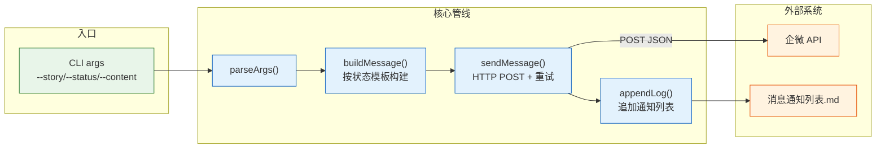

> | v1.0.0 | 2026-05-22 | deepseek-v4-pro | ⏱️ — | 📎 [CLAUDE.md](../../../CLAUDE.md) |

> **导航**: [← YrY-使用场景](./YrY-使用场景.md) · [→ YrY-测试设计](./YrY-测试设计.md) · [→ YrY-安全审计](./YrY-安全审计.md)

[§0 设计决策](#sec0-design) · [§1 消息构建管线](#sec1-message-pipeline) · [§2 HTTP 发送](#sec2-http) · [§3 日志追加](#sec3-log-append) · [§4 错误处理](#sec4-errors) · [§5 P0 检查清单](#sec5-p0-checklist)

# YrY-技术评审 · rui-bot-send

## §0 设计决策

### 效果示意

### 基线溯源

| 来源 | 覆盖 |
|------|------|
| 故事任务 §2 FP1-FP6 | §1-§3 对应章节 |

---

## §1 消息构建管线

> 证据: `skills/rui-bot/send.mjs`

三种状态模板：

| 状态 | 图标 | 必需字段 |
|------|:--:|------|
| complete | ✅ | conclusion, description, scope, nextStep |
| blocked | 🚫 | conclusion, reason, recovery, impact |
| gate-fail | 🔍 | conclusion, gate, gateResult, recovery |

**内容截断**: 消息 > 2000 字符时截断至 2000 并追加 `...(已截断)` 标记。

---

## §2 HTTP 发送

| 参数 | 值 |
|------|-----|
| API URL | `https://api.effiy.cn/wework/send-message` |
| 方法 | POST |
| 鉴权 | `X-Token` Header |
| 超时 | 30s |
| 重试 | 最多 3 次，间隔 1s |

---

## §3 日志追加

> 证据: `skills/rui-bot/send.mjs` — appendFileSync 追加到 `{project}-消息通知列表.md`

每条通知记录含：时间戳、故事名、状态、内容摘要。

---

## §4 错误处理

| 场景 | 行为 |
|------|------|
| Token 缺失 | 降级跳过发送 |
| API 不可达 | 重试 3 次 → 记录失败 |
| 内容超长 | 截断至 2000 字符 |
| 日志目录不存在 | mkdirSync 创建 |

---

## §5 P0 检查清单

| # | 检查项 | 状态 |
|---|--------|:--:|
| 1 | 效果示意 mermaid 图 | ✅ |
| 2 | 基线溯源表 | ✅ |
| 3 | 主要价值 ≥ 4 | ✅ |
| 4 | 回溯链完整 | ✅ |

---

> | 日期 | 变更 | 触发 | 证据 |
> |------|------|------|------|
> | 2026-05-22 | 初始生成 | /rui doc --from-code rui-bot-send-doc | skills/rui-bot/send.mjs |
