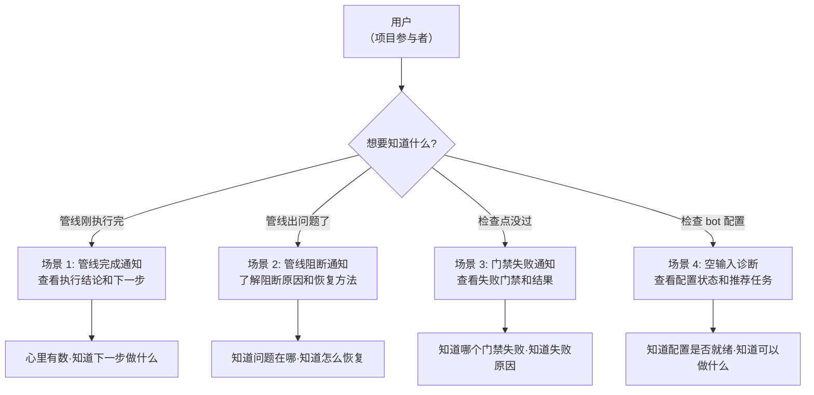
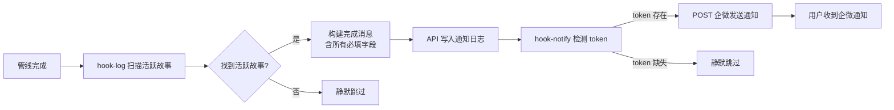
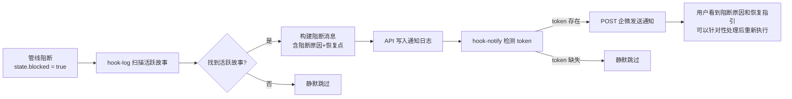
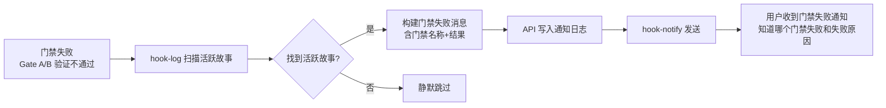
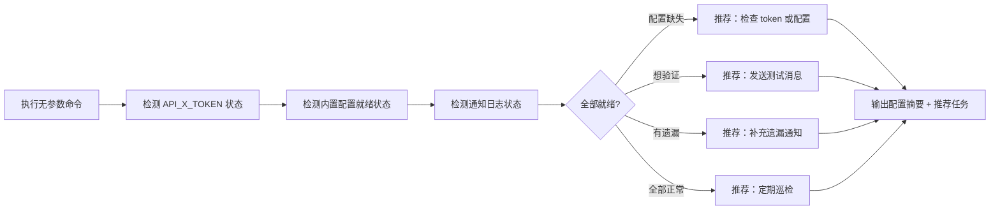

> | v1.0.0 | 2026-05-26 | deepseek-v4-pro | 🌿 feat/rui-bot | 📎 [CLAUDE.md](../../../CLAUDE.md) |

> **导航**: [← 故事任务](./故事任务.md) · [技术评审 →](./技术评审.md)

> **来源引用**: 由 `/rui doc rui-bot` 触发，从 `skills/rui-bot/SKILL.md` 反推用户交互场景。证据 Level B + SKILL.md 命令面定义。

[§1 场景全景](#sec1-overview) · [§2 场景详述](#sec2-detail) · [§3 场景覆盖矩阵](#sec3-matrix) · [§4 评审清单](#sec4-checklist) · [§5 体验基线](#sec5-experience)

---

### 主要价值

- 🎯 覆盖 rui-bot 四类核心场景 — 完成通知/阻断通知/门禁失败通知/空输入诊断
- 🔒 每场景含正常路径 + 空状态 + 错误恢复，异常分支全覆盖
- ⚡ 使用场景对齐故事任务 FP# 和 AC#，形成可验证的用户空间基线
- 📊 语言边界纯净 — 禁止技术术语、API 端点、文件路径、环境变量名

---

## §1 场景全景

---

## §2 场景详述

### 场景 1: 管线完成通知

| 角色 | 触发条件 | 核心目标 |
|------|---------|---------|
| 项目参与者 | rui 管线正常执行完毕 | 获知管线执行结论、影响范围、后续步骤，无需手动检查 |

| # | 步骤 | 输入 | 系统响应 | 异常分支 |
|---|------|------|---------|---------|
| 1 | 管线完成触发 | 管线执行结论（state.blocked = false） | hook-log 扫描 `docs/故事任务面板/` 下最近 1 小时内活跃的故事 | 无活跃故事→静默跳过，退出码 0 |
| 2 | 构建完成消息 | 管线状态数据（技能名、命令、结论、描述、范围、影响、证据、会话时长） | 按完成场景模板构建 emoji:value 格式消息，自动拼接首行项目名 | 字段缺失→补默认值后继续 |
| 3 | 追加通知日志 | 完整消息正文 + 故事标识 | API 写入远端数据库，时间戳行 + 空行 + 正文 | API 不可用→记录 stderr，继续 |
| 4 | 发送企微通知 | 消息正文 + 解析后的 webhook URL | HTTP POST 到企微 webhook，超时 30 秒 | Token 缺失→静默跳过；网络失败→报告错误不阻断 |
| 5 | 用户查看通知 | 企微消息 | 用户看到完整通知：技能名、命令、结论、描述、范围、下一步、影响、证据、会话时长 | 消息超 2000 字→截断明细段 |

---

### 场景 2: 管线阻断通知

| 角色 | 触发条件 | 核心目标 |
|------|---------|---------|
| 项目参与者 | rui 管线被阻断（需求解析失败、分支隔离不通过、P0 未清零等） | 获知阻断原因和恢复点，知道如何恢复管线执行 |

| # | 步骤 | 输入 | 系统响应 | 异常分支 |
|---|------|------|---------|---------|
| 1 | 管线阻断触发 | 管线阻断信号（state.blocked = true, block_reason） | hook-log 扫描活跃故事，识别阻断状态 | 无活跃故事→静默跳过 |
| 2 | 构建阻断消息 | 阻断原因、当前阶段（恢复点） | 按阻断场景模板构建消息，增加 ❌原因 和 🧭恢复点 字段 | block_reason 缺失→取默认值"见 rui-state.json" |
| 3 | 追加通知日志 | 完整阻断消息 | API 写入通知日志 | API 不可用→记录 stderr，继续 |
| 4 | 发送企微通知 | 阻断消息 | POST 企微，用户看到阻断原因和恢复点 | Token 缺失或网络失败→静默跳过 |

---

### 场景 3: 门禁失败通知

| 角色 | 触发条件 | 核心目标 |
|------|---------|---------|
| 项目参与者 | Gate A（测试先行检查）或 Gate B（验证次数超限）失败 | 获知哪个门禁失败和具体失败结果，了解需要修复什么 |

| # | 步骤 | 输入 | 系统响应 | 异常分支 |
|---|------|------|---------|---------|
| 1 | 门禁失败触发 | Gate A 缺失测试设计、Gate B 验证超过 2 轮 | hook-log 扫描活跃故事，识别门禁失败状态 | 无活跃故事→静默跳过 |
| 2 | 构建门禁失败消息 | 门禁名称（Gate A / Gate B）、失败结果 | 按门禁失败场景模板构建消息，增加 🔍门禁 和 📊结果 字段 | 门禁信息缺失→补默认值 |
| 3 | 追加通知日志 | 门禁失败消息 | API 写入通知日志 | API 不可用→记录 stderr |
| 4 | 发送企微通知 | 门禁失败消息 | POST 企微，用户看到门禁名称和失败结果 | Token 缺失或网络失败→静默跳过 |

---

### 场景 4: 空输入诊断

| 角色 | 触发条件 | 核心目标 |
|------|---------|---------|
| 技能使用者 | 执行空命令 `/rui-bot`（无参数） | 了解当前 rui-bot 配置状态，获取推荐操作建议 |

| # | 步骤 | 输入 | 系统响应 | 异常分支 |
|---|------|------|---------|---------|
| 1 | 检测 token | 环境变量 API_X_TOKEN | 输出 token 存在/缺失状态 | 检测过程出错→输出可用部分 |
| 2 | 检测配置 | 内置 robots/agents 映射、webhook URL | 输出配置就绪状态 | 配置缺失→推荐补充配置 |
| 3 | 检测日志 | 通知日志记录 | 输出日志状态，标注是否有遗漏 | 日志查询失败→跳过该检查项 |
| 4 | 输出推荐 | 检测结果汇总 | 根据状态推荐 1-4 条操作建议 | — |

---

## §3 场景覆盖矩阵

| 场景 | FP# | AC# | 技术评审 | 测试设计 | 覆盖状态 |
|------|-----|------|---------|---------|---------|
| 场景 1: 管线完成通知 | FP1, FP2, FP3, FP7, FP8 | AC1, AC5 | §2 API 契约 | §3 用例 | 待生成 |
| 场景 2: 管线阻断通知 | FP1, FP2, FP3, FP7, FP8 | AC2, AC5 | §2 API 契约 | §3 用例 | 待生成 |
| 场景 3: 门禁失败通知 | FP1, FP2, FP3, FP7, FP8 | AC3, AC5 | §2 API 契约 | §3 用例 | 待生成 |
| 场景 4: 空输入诊断 | FP5 | AC8 | §1 架构设计 | §3 用例 | 待生成 |

---

## §4 评审清单

| # | 检查项 | 状态 |
|---|--------|------|
| 1 | 场景 ≥ 2 个 | ✅ 4 场景 |
| 2 | 每场景有 mermaid flowchart | ✅ |
| 3 | FP# 全覆盖（FP1–FP8） | ✅ |
| 4 | 异常分支明确 | ✅ 每场景含异常分支列 |
| 5 | 无技术术语（API 端点/文件路径/环境变量名） | ✅ |
| 6 | 每场景含空状态与错误恢复 | ✅ Token 缺失静默跳过、无活跃故事静默跳过 |
| 7 | 覆盖矩阵下游文档齐全 | ✅ 含技术评审和测试设计 |

---

## §5 体验基线

| 角色 | 核心旅程 | 情感目标 | 痛点解决 | 成功感知 | 关联场景 |
|------|---------|---------|---------|---------|---------|
| 项目维护者 | 管线执行完成后收到企微通知 | 感到可控——系统状态变化第一时间知晓 | 之前需手动检查管线结果，现在自动推送 | 收到企微消息，包含完整执行结论和下一步指引 | 场景 1, 2, 3 |
| 项目审计者 | 回溯历史管线执行记录 | 感到确信——每次执行都有据可查 | 之前无统一通知记录，现在自动持久化 | 能在数据库中查到每次管线执行的通知日志 | 场景 1, 2, 3 |
| 技能使用者 | 诊断 rui-bot 配置状态 | 感到清晰——知道配置哪里有问题、怎么修 | 之前不确定配置是否正确，现在一目了然 | 看到配置状态摘要和具体的推荐操作 | 场景 4 |

---

> **变更记录**
> | 日期 | 变更 | 触发 | 证据 |
> |------|------|------|------|
> | 2026-05-26 | 初始生成 | /rui doc rui-bot | skills/rui-bot/SKILL.md 命令面 |
