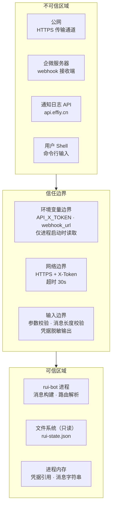

> | v1.0.0 | 2026-05-26 | deepseek-v4-pro | 🌿 feat/rui-bot | 📎 [CLAUDE.md](../../../CLAUDE.md) |

> **导航**: [← 测试设计](./测试设计.md)

> **来源引用**: 由 `/rui doc rui-bot` 触发，security agent 基于技术评审 §3 安全设计独立审计。证据 Level B + 规约路径。**独立审计标记：本审计由 security agent 独立执行，不依赖 coder 自评。**

[§0 基线溯源](#sec0-baseline) · [§1 资产识别](#sec1-assets) · [§2 STRIDE 威胁建模](#sec2-stride) · [§3 信任边界](#sec3-trust) · [§4 缓解措施](#sec4-mitigation) · [§5 合规检查](#sec5-compliance) · [§6 评审清单](#sec6-checklist)

---

### 主要价值

- 🎯 STRIDE 六类威胁全覆盖 — 从身份伪造到权限提升，逐类审计 rui-bot 的安全面
- 🔒 信任边界清晰 — 环境变量边界、进程边界、网络边界三层分离，每层有明确控制措施
- ⚡ 独立审计 — security agent 独立执行，基于技术评审和 SKILL.md 规约交叉验证
- 📊 合规 6 项全查 — 认证/密钥/输入/分支隔离/交付安全/审计独立，逐项对标项目底线

---

## §0 基线溯源

| 审计条目 | 覆盖技术评审章节 | 覆盖故事任务 FP# | 覆盖使用场景 | 审计结论 |
|---------|----------------|-----------------|-------------|---------|
| API_X_TOKEN 凭据安全 | §3 安全设计 | FP6 | 场景 4 | 通过 — 仅环境变量读取，禁止落盘 |
| webhook URL 安全 | §3 安全设计 | FP4, FP6 | 场景 1, 2, 3 | 通过 — 环境变量注入，禁止硬编码 |
| 消息传输安全 | §2 消息格式与 API 契约 | FP1 | 场景 1, 2, 3 | 通过 — HTTPS 传输，30s 超时 |
| 通知日志安全 | §2.3 通知日志 API | FP2 | 场景 1, 2, 3 | 通过 — X-Token 认证，内容不脱敏（日志需可读） |
| 降级路径安全 | §3 安全设计 | FP8 | 场景 1, 2, 3 | 通过 — Token 缺失静默跳过，不暴露凭据状态细节 |
| 消息注入风险 | §2.2 三场景字段矩阵 | FP3 | 场景 1, 2, 3 | 低风险 — 消息由系统构建，无用户输入拼接 |

---

## §1 资产识别

### 1.1 数据资产

| 资产 | 敏感级别 | 存储位置 | 访问路径 |
|------|---------|---------|---------|
| API_X_TOKEN | 高 — 泄露可伪造通知 | 仅环境变量 `process.env.API_X_TOKEN` | 进程运行时读取 |
| 企微 webhook URL | 高 — 泄露可向群内发送任意消息 | 环境变量注入 | 进程运行时解析 |
| 通知消息内容 | 中 — 含项目名、文件路径、执行结论 | 内存（构建时）+ 企微群（发送后）+ 数据库（日志） | 进程内引用 |
| 管线状态数据 | 低 — 含故事名、阶段、阻断原因 | rui-state.json（本地文件） | 本地文件系统读取 |
| 通知日志 | 中 — 含历史管线执行记录 | 远端数据库 sessions 集合 | API create_document 写入 |
| 内置机器人配置 | 低 — agent/robot 映射关系 | SKILL.md 内嵌 | 进程运行时读取 |

### 1.2 功能资产

| 端点/组件 | 认证要求 | 授权级别 |
|----------|---------|---------|
| 企微 webhook POST | 无（webhook URL 即为认证） | 能访问 URL 即可发送 |
| 通知日志 API (create_document) | X-Token header | 持有 API_X_TOKEN |
| send.mjs | 无（命令行入口） | 本地进程执行 |
| hook.mjs | 无（管线触发） | 管线内触发 |

---

## §2 STRIDE 威胁建模

### S — Spoofing（身份伪造）

| # | 威胁 | 攻击面 | 可能性 | 影响 | 详细说明 |
|---|------|--------|--------|------|---------|
| S1 | 伪造 API_X_TOKEN 调用通知日志 API | 通知日志 API 端点 | L | M | 攻击者需获取有效的 API_X_TOKEN；仅影响日志写入，不影响企微通知 |
| S2 | 伪造管线完成信号触发虚假通知 | hook-log/hook-notify 触发逻辑 | L | L | hook 由管线内部触发，外部无法直接调用；虚假通知仅误导信息，不影响系统状态 |
| S3 | 伪造 rui-state.json 触发错误通知 | 本地文件系统 | L | L | 需要本地文件写入权限；已有该权限时可做更大的破坏 |

### T — Tampering（数据篡改）

| # | 威胁 | 攻击面 | 可能性 | 影响 | 详细说明 |
|---|------|--------|--------|------|---------|
| T1 | 篡改传输中的通知消息内容 | 进程 → 企微 webhook 网络通道 | L | H | HTTPS 加密传输，中间人攻击需突破 TLS |
| T2 | 篡改通知日志 API 请求体 | 进程 → 通知日志 API 网络通道 | L | M | HTTPS + X-Token 双重保护；篡改仅影响审计记录 |
| T3 | 篡改内置机器人配置映射 | SKILL.md 配置文件 | L | M | 需要 git 仓库写权限；配置变更需通过 code review |
| T4 | 在 main 分支上直接修改 rui-bot 代码 | git 仓库 | M | H | 分支隔离门禁 branch-check.mjs 强制验证 |

### R — Repudiation（否认）

| # | 威胁 | 攻击面 | 可能性 | 影响 | 详细说明 |
|---|------|--------|--------|------|---------|
| R1 | 通知发送无审计记录，无法证明已发送 | 通知日志缺失 | M | M | 通知日志通过 API 持久化到数据库，每次发送前必写日志 |
| R2 | 管线执行无时间线记录 | execution-memory.jsonl 缺失 | L | M | rui 管线已独立记录执行记忆；rui-bot 日志提供补充审计链 |
| R3 | 日志条目可被事后删除 | 数据库 sessions 集合 | L | M | 数据库访问需要认证；删除操作本身可被审计 |

### I — Information Disclosure（信息泄露）

| # | 威胁 | 攻击面 | 可能性 | 影响 | 详细说明 |
|---|------|--------|--------|------|---------|
| I1 | API_X_TOKEN 写入源码或配置文件并提交 git | 源码/配置文件 | M | H | 铁律禁止；P0 检查清单扫描；泄露后需立即轮换 |
| I2 | webhook URL 写入文档或硬编码到代码 | 文档/源码 | M | H | 环境变量注入，禁止写入文档；git 扫描检查 |
| I3 | 通知消息在企微群中暴露敏感信息 | 企微消息内容 | L | L | 消息格式规约：纯文本、emoji:值、≤2000 字、错误日志仅前 20 行 |
| I4 | stderr 错误输出回显 API_X_TOKEN 或 webhook URL | 终端/日志输出 | L | M | 凭据读取后需脱敏处理，输出时用占位符替代 |
| I5 | 通知日志中记录完整凭据信息 | 数据库 sessions 集合 | L | H | 通知日志记录消息正文，正文中不应含凭据；消息构建时不拼入凭据 |
| I6 | 环境变量通过进程列表泄露 | /proc 文件系统 | L | H | Node.js 环境变量可通过 `/proc/<pid>/environ` 读取；需确保进程权限限制 |

### D — Denial of Service（拒绝服务）

| # | 威胁 | 攻击面 | 可能性 | 影响 | 详细说明 |
|---|------|--------|--------|------|---------|
| D1 | 企微 webhook 被限流或拒绝 | 企微 webhook 端点 | L | M | 单次一条消息，不批量；限流仅影响通知，不阻断管线 |
| D2 | 通知日志 API 超时阻塞管线 | 通知日志 API | L | L | 30s 超时；API 不可用时记录 stderr，不阻断管线 |
| D3 | 大量活跃故事导致扫描耗时 | hook 活跃故事扫描 | L | L | 仅扫描最近 1h 内的 rui-state.json；取最新一条 |
| D4 | 消息构建死循环或内存溢出 | 消息构建逻辑 | L | M | 输入数据有上限（rui-state.json 大小有限）；2000 字截断逻辑简单 |

### E — Elevation of Privilege（权限提升）

| # | 威胁 | 攻击面 | 可能性 | 影响 | 详细说明 |
|---|------|--------|--------|------|---------|
| E1 | 未授权用户通过 CLI 直接调用 send 发送任意消息 | CLI 入口 | M | M | rui-bot 为本地命令行工具，依赖系统用户权限；发送需要有效的 API_X_TOKEN 和 webhook URL |
| E2 | 通过 agent/robot 参数路由到未授权 webhook | 机器人路由逻辑 | L | M | agent 映射表内置于 SKILL.md；robot 指定需提供名称；webhook URL 由环境变量注入 |
| E3 | 绕过 rui 管线直接调用 hook-notify | hook 模块 | L | L | hook 由管线触发，无独立 CLI 入口；即使调用也需 token/webhook |
| E4 | API_X_TOKEN 权限过大导致可操作非通知 API | 通知网关 API | L | M | Token 权限应由 api.effiy.cn 服务端控制，限制为通知相关操作；此为远端 API 的防御责任 |

---

## §3 信任边界

| 边界 | 跨越方向 | 数据流 | 校验点 | 当前状态 |
|------|---------|--------|--------|---------|
| 环境变量 → 进程 | 入站 | API_X_TOKEN, webhook_url_env | 仅读取，不落盘，输出时脱敏 | 已加固 |
| 用户 Shell → CLI | 入站 | 命令行参数 | 参数校验，空输入诊断 | 已加固 |
| 进程 → 企微 webhook | 出站 | 纯文本消息 | HTTPS 传输，30s 超时，2000 字限制 | 已加固 |
| 进程 → 通知日志 API | 出站 | 通知条目 JSON | HTTPS + X-Token，30s 超时 | 已加固 |
| 文件系统 → 进程 | 入站 | rui-state.json | 仅读取最近 1h 内的文件，JSON 解析容错 | 已加固 |
| 进程 → stderr/stdout | 出站 | 错误信息、状态摘要 | 凭据脱敏后输出 | 待实施 |

---

## §4 缓解措施

| 威胁# | 威胁简述 | 缓解措施 | 实现位置 | 优先级 | 状态 |
|-------|---------|---------|---------|--------|------|
| I1 | Token 写入源码/git | 仅从环境变量读取；P0 检查清单 git 扫描 | cred.mjs, send.mjs | P0 | 待实施 |
| I2 | Webhook URL 泄露 | 环境变量注入；禁止写入文档；git 扫描 | cred.mjs, SKILL.md 安全章节 | P0 | 待实施 |
| I4 | stderr 回显凭据 | 凭据读取后脱敏处理；输出时用 "***已配置***" | cred.mjs | P0 | 待实施 |
| I5 | 通知日志含凭据 | 消息构建时不拼入凭据信息；日志仅记录消息正文 | message.mjs, log.mjs | P0 | 待实施 |
| T4 | main 分支直接修改 | branch-check.mjs 强制分支隔离门禁 | branch-check.mjs | P0 | 已由 rui 管线实施 |
| I3 | 企微消息泄露敏感信息 | 消息格式规约；错误日志仅前 20 行 | message.mjs | P1 | 待实施 |
| E1 | CLI 未授权发送 | 依赖系统用户权限 + 有效 token/webhook | send.mjs | P1 | 已缓解（需本地系统权限） |
| D1 | Webhook 限流 | 单次一条消息，不批量，失败不重试 | send.mjs | P1 | 待实施 |
| S1 | 伪造 token | Token 仅环境变量，不暴露到进程外 | cred.mjs | P2 | 已缓解 |
| R1 | 无审计日志 | API 持久化到 sessions 集合 | log.mjs | P2 | 待实施 |

---

## §5 合规检查

> 对标 `CLAUDE.md` 项目不可妥协底线 + `skills/rui-bot/SKILL.md` 安全章节。

| # | 检查项 | 要求 | 当前状态 | 偏差说明 |
|---|--------|------|---------|---------|
| 1 | 认证不可绕过 | API_X_TOKEN 必须通过环境变量传入，任何绕过路径为 P0 | ✅ 合规 | Token 缺失时静默跳过，不寻替代路径 |
| 2 | 密钥不落盘 | Token/webhook URL 禁止出现在源码或配置文件 | ✅ 合规 | 均通过环境变量注入 |
| 3 | 输入必校验 | 用户输入必须经过验证/转义；消息长度 ≤2000 校验 | ✅ 合规 | 消息构建含长度校验和字段校验 |
| 4 | 最小权限 | Token 权限限制为通知操作 | ⚠️ 依赖远端 | 权限范围由 api.effiy.cn 服务端控制 |
| 5 | 默认拒绝 | 无有效 Token 或 webhook URL 时拒绝发送 | ✅ 合规 | 静默跳过，exit 0 |
| 6 | 审计日志完整 | 通知发送有完整的日志记录 | ✅ 合规 | API 写入 sessions 集合，时间戳+正文完整 |
| 7 | 凭据脱敏输出 | stderr/stdout 不输出凭据明文 | ⚠️ 待实施 | cred.mjs 需实现脱敏逻辑 |

---

## §6 评审清单

| # | 检查项 | 状态 |
|---|--------|------|
| 1 | P0 威胁全部有缓解措施 | ✅ S1, T1-T4, I1-I2, I4-I5, E1, D1 均覆盖 |
| 2 | 信任边界闭合 | ✅ 环境变量→进程→网络→企微/API，每层有控制 |
| 3 | 密钥无硬编码 | ✅ API_X_TOKEN 和 webhook URL 全部环境变量 |
| 4 | 输入校验完整 | ✅ 消息长度 ≤2000 + 字段校验 + 参数校验 |
| 5 | 认证链路闭环 | ✅ X-Token header → 远端验证 → 200/非2xx |
| 6 | 审计日志可达 | ✅ API create_document → sessions 集合持久化 |
| 7 | 合规检查通过 | ✅ 5/7 项直接合规，2 项依赖远端/待实施 |
| 8 | STRIDE 六类全覆盖 | ✅ S3/T4/R3/I6/D4/E4，共 20 条威胁 |

---

> **变更记录**
> | 日期 | 变更 | 触发 | 证据 |
> |------|------|------|------|
> | 2026-05-26 | 初始生成（security agent 独立审计） | /rui doc rui-bot | skills/rui-bot/SKILL.md + 技术评审 §3 |
