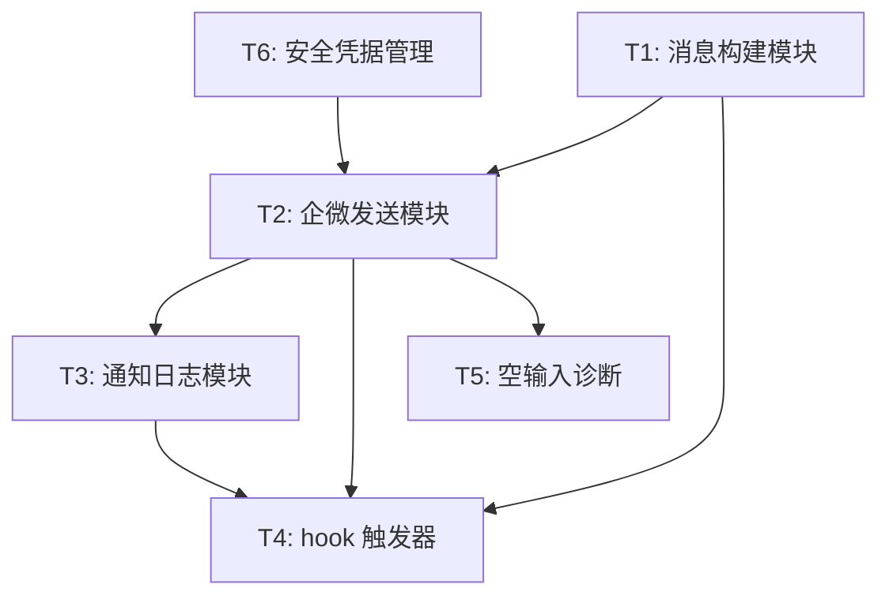
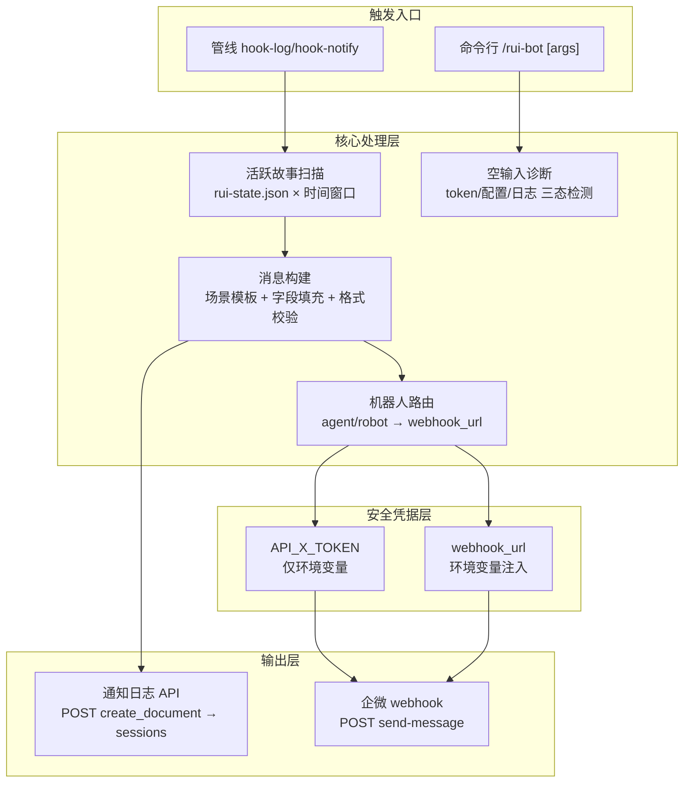
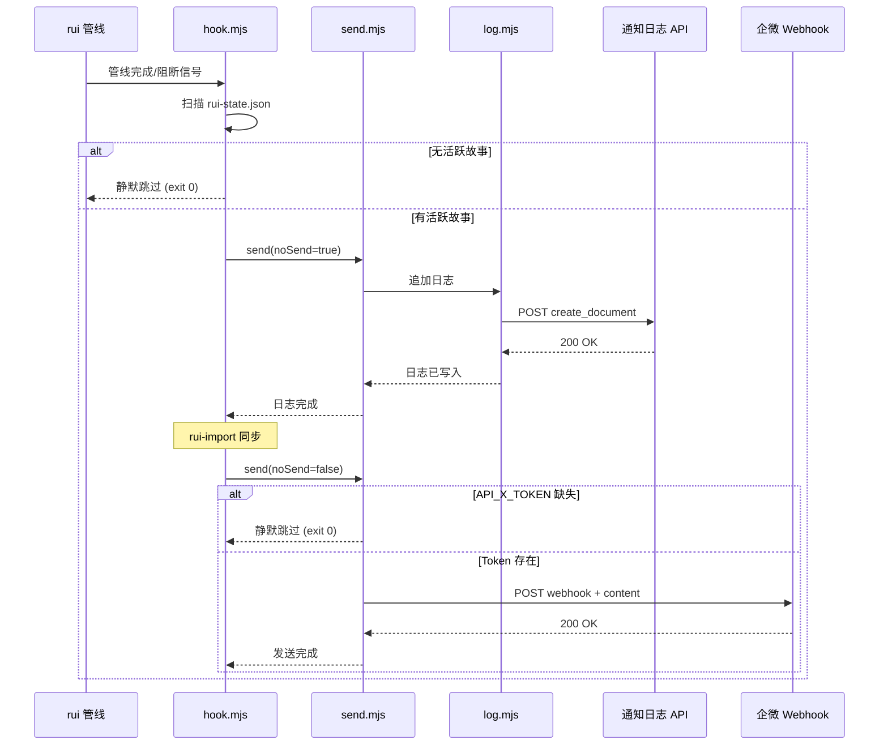
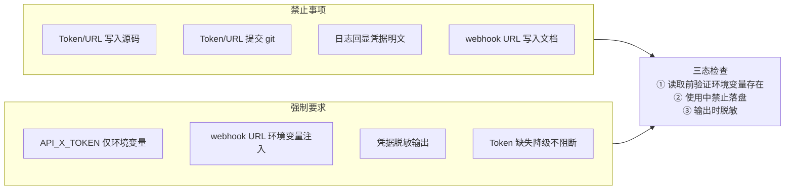

> | v1.0.0 | 2026-05-26 | deepseek-v4-pro | 🌿 feat/rui-bot | 📎 [CLAUDE.md](../../../CLAUDE.md) |

> **导航**: [← 使用场景](./使用场景.md) · [测试设计 →](./测试设计.md) · [安全审计 →](./安全审计.md)

> **来源引用**: 由 `/rui doc rui-bot` 触发，从 `skills/rui-bot/SKILL.md` 反推技术方案。证据 Level A + 规约路径。

[§0 基线溯源](#sec0-baseline) · [§1 架构设计](#sec1-arch) · [§2 消息格式与 API 契约](#sec2-api) · [§3 安全设计](#sec3-security) · [§4 性能与限制](#sec4-perf) · [§5 评审清单](#sec5-checklist)

---

### 主要价值

- 🎯 全链路消息管线 — 扫描活跃故事→构建场景消息→追加日志→文档同步→企微发送，五步闭环
- 🔒 安全凭据隔离 — API_X_TOKEN 和 webhook URL 仅从环境变量注入，三态检查确保不落盘
- ⚡ 场景驱动消息构建 — 完成/阻断/门禁失败三场景，各有专用字段模板，格式校验自动截断
- 📊 降级不阻断 — Token 缺失或 API 不可用时静默跳过，不阻碍管线主流程

---

<a id="sec0-baseline"></a>

## §0 基线溯源

### §0.0 溯源表

| 本设计章节 | 实现 故事任务 | 服务 使用场景 | 覆盖状态 |
|-----------|-------------|-------------|---------|
| §1 架构设计 | FP1, FP7, FP8 | 场景 1, 2, 3 | 已覆盖 |
| §2 消息格式与 API 契约 | FP3, FP4 | 场景 1, 2, 3 | 已覆盖 |
| §2.3 通知日志 API | FP2 | 场景 1, 2, 3 | 已覆盖 |
| §3 安全设计 | FP6 | 场景 4 | 已覆盖 |
| §4 性能与限制 | FP1, FP3 | 场景 1, 2, 3 | 已覆盖 |

### §0.1 设计决策

| 决策领域 | 选定方案 | 选择理由 | 详见 | 实现 FP# |
|---------|---------|---------|------|---------|
| 消息传输通道 | 企业微信机器人 webhook | 团队使用企微协作，webhook 无需额外鉴权中间件 | §2 | FP1 |
| 消息格式 | 纯文本 emoji:value 分行格式 | 企微机器人不支持 markdown；纯文本确保跨客户端一致 | §2 | FP3 |
| 日志持久化 | 远端 API 写入 sessions 集合 | 与项目面板数据同库，便于查询审计 | §2.3 | FP2 |
| 凭据管理 | 仅环境变量读取 | 铁律要求密钥不落盘；CI/CD 环境兼容 | §3 | FP6 |
| 降级策略 | Token 缺失静默跳过 | 通知是辅助功能，不应阻断管线主流程 | §3, §4 | FP8 |
| 机器人路由 | agent > robot > default_robot 三级解析 | 灵活映射，新 agent 只需注册映射关系 | §2 | FP4 |

### §0.2 任务规划

| ID | 描述 | 工作量 | 依赖 | 交付物 | Agent | 门禁 | 交接下游 | 实现 FP# |
|----|------|--------|------|--------|-------|------|---------|---------|
| T1 | 实现消息构建模块 — 三场景模板 + 格式校验 + 截断逻辑 | M | 无 | skills/rui-bot/message.mjs | coder | Gate A | T2, T3 | FP3 |
| T2 | 实现企微发送模块 — webhook POST + 超时 + 错误处理 | M | T1 | skills/rui-bot/send.mjs | coder | Gate A | T3 | FP1, FP4 |
| T3 | 实现通知日志模块 — API create_document 写入 | S | T2 | skills/rui-bot/log.mjs | coder | Gate A | T4 | FP2 |
| T4 | 实现 hook 触发器 — 活跃故事扫描 + 自动消息构建 | M | T1, T2, T3 | skills/rui-bot/hook.mjs | coder | Gate B | tester | FP7, FP8 |
| T5 | 实现空输入诊断 — 配置检测 + 推荐任务 | S | T2 | skills/rui-bot/diag.mjs | coder | Gate A | tester | FP5 |
| T6 | 实现安全凭据管理 — 环境变量读取 + 脱敏 + 验证 | S | 无 | skills/rui-bot/cred.mjs | coder + security | Gate A | T2, T3 | FP6 |



---

<a id="sec1-arch"></a>

## §1 架构设计

### 效果示意



### 1.1 模块清单

| 变更类型 | 模块/文件 | 职责 |
|---------|----------|------|
| 新增 | `skills/rui-bot/message.mjs` | 消息构建：三场景模板 + emoji:value 格式化 + 长度截断 + 字段校验 |
| 新增 | `skills/rui-bot/send.mjs` | 企微发送：webhook URL 路由 + HTTP POST + 超时 + 重试 + 错误报告 |
| 新增 | `skills/rui-bot/log.mjs` | 通知日志：API create_document 调用 + 时间戳格式化 + 条目构建 |
| 新增 | `skills/rui-bot/hook.mjs` | hook 触发器：活跃故事扫描 + hook-log/hook-notify 编排 |
| 新增 | `skills/rui-bot/cred.mjs` | 安全凭据：环境变量读取 + 存在性验证 + 脱敏输出 |
| 新增 | `skills/rui-bot/diag.mjs` | 空输入诊断：三态检测 + 推荐任务生成 |
| 新增 | `skills/rui-bot/help.mjs` | 帮助输出：格式说明 + 场景示例 |

### 1.2 通信通道



| 通道 | 方向 | 协议 | Payload | 错误处理 |
|------|------|------|---------|---------|
| rui 管线 → hook.mjs | 函数调用 | 进程内 | 管线状态对象 + story 标识 | hook 异常不传播至管线 |
| send.mjs → 通知日志 API | 出站 | HTTPS POST | `{ document: { content, story } }` | 非 2xx→stderr，不阻断 |
| send.mjs → 企微 webhook | 出站 | HTTPS POST | `{ webhook_url, content }` | 非 2xx→stderr，不阻断 |
| 用户 → rui-bot CLI | 入站 | 命令行 | 参数 `agent/robot/project/name/content/contentFile/noSend` | 参数校验失败→输出帮助 |

---

<a id="sec2-api"></a>

## §2 消息格式与 API 契约

### 2.1 消息结构规范

```
【项目名】                           ← 首行自动追加
🤖 技能: <skill_name>               ← 必填，第1行
📋 命令: /<skill_name> <command>    ← 必填，第2行
🎯 结论: <结论文本>                 ← 必填
📝 描述: <描述文本>                 ← 必填
📌 范围: <范围路径>                 ← 必填
{场景特有字段}                      ← 按场景
🌐 影响: <影响说明>                 ← 必填
📎 证据: <证据引用>                 ← 必填
⏱️ 会话: <时间范围> | <N> agents   ← 必填

———                                ← 分隔线，至多一条

变更文件: <统计或清单>              ← 明细段
```

### 2.2 三场景字段矩阵

| 字段 | 完成 | 阻断 | 门禁失败 |
|------|:---:|:---:|:------:|
| 🤖 技能 | ✅ | ✅ | ✅ |
| 📋 命令 | ✅ | ✅ | ✅ |
| 🎯 结论 | ✅ 含 story + 阶段 | ✅ 含 story | ✅ 含 story |
| 📝 描述 | ✅ | ✅ 含阻断阶段 | ✅ |
| 📌 范围 | ✅ | ✅ | ✅ |
| 👉 下一步 | ✅ | — | — |
| ❌ 原因 | — | ✅ | — |
| 🧭 恢复点 | — | ✅ | — |
| 🔍 门禁 | — | — | ✅ |
| 📊 结果 | — | — | ✅ |
| 🌐 影响 | ✅ | ✅ | ✅ |
| 📎 证据 | ✅ | ✅ | ✅ |
| ⏱️ 会话 | ✅ | ✅ | ✅ |

### 2.3 通知日志 API

```
POST {api_url}/create_document
Headers:
  Content-Type: application/json
  X-Token: <API_X_TOKEN>
Body:
  {
    "document": {
      "collection": "sessions",
      "data": {
        "story": "<story_name>",
        "content": "<完整消息正文含首行项目名>",
        "timestamp": "<ISO 8601>"
      }
    }
  }

超时: 30s
成功: HTTP 200-299 → 日志写入确认
失败: 非 2xx → 记录 stderr，不阻断管线
```

### 2.4 企微发送 API

```
POST <apiUrl>  (默认 https://api.effiy.cn/wework/send-message)
Headers:
  Content-Type: application/json
  X-Token: <API_X_TOKEN>
Body:
  {
    "webhook_url": "<解析后的 webhook URL>",
    "content": "<纯文本消息>"
  }

超时: 30s
成功: HTTP 200-299
失败: 非 2xx → 报告错误，调用方决定是否阻断
```

| 要素 | 来源 |
|------|------|
| `apiUrl` | 参数 > `WEWORK_BOT_API_URL` 环境变量 > 默认值 |
| webhook URL | 环境变量 > `robots[robot].webhook_url` > 默认空值 |
| `API_X_TOKEN` | 仅环境变量 |
| `content` | `content` 参数 > `contentFile` 文件内容（必须二选一） |

### 2.5 机器人路由解析

```
优先级: robot 参数 > agents[agent] > default_robot ("general")

1. robot="xxx" 直接指定 → 查找 robots["xxx"].webhook_url
2. agent="rui" → 查找 agents["rui"] 得到 robot 名 → 再查 webhook_url
3. 均未指定 → 使用 default_robot = "general"
```

| 配置项 | 默认值 | 覆盖方式 |
|--------|--------|---------|
| `default_robot` | `general` | `robot` 参数 |
| `agents.rui` | `general` | `robot` 参数 |
| `robots.general.webhook_url` | 空 | 环境变量注入 |

---

<a id="sec3-security"></a>

## §3 安全设计

### 3.1 安全架构



### 3.2 凭据生命周期

| 阶段 | 操作 | 约束 |
|------|------|------|
| 读取 | `process.env.API_X_TOKEN` | 仅从环境变量，不读文件 |
| 使用 | `X-Token` header | 仅 HTTPS 传输 |
| 输出 | `token ? "***已配置***" : "未配置"` | 禁止回显明文 |
| 存储 | 不存在 | 禁止写入任何文件或变量持久化 |
| 轮换 | 更新环境变量 + 重启 | 泄露后立即轮换 |

---

<a id="sec4-perf"></a>

## §4 性能与限制

| 维度 | 约束 | 应对 |
|------|------|------|
| 消息长度 | ≤ 2000 字符 | 构建后检查 len；超限截断明细段（错误日志前 20 行，文件 > 10 个列统计） |
| HTTP 超时 | 30s | 单次请求超时即报告，不重试（避免雪崩） |
| 活跃故事扫描 | 仅最近 1h | 限制 rui-state.json 扫描范围，避免遍历所有历史 |
| 并发 | 单次执行一个通知 | 不批量，避免 webhook 限流 |
| 降级策略 | Token 缺失静默跳过 | 通知是辅助功能，不阻断管线主流程 |
| 消息构建 | 字段缺失补默认值 | 关键字段（技能、命令、结论）缺失时用占位值，不抛异常 |

---

<a id="sec5-checklist"></a>

## §5 评审清单

| # | 检查项 | 状态 |
|---|--------|------|
| 1 | 权限最小化 — Token 仅用于通知网关 | ✅ |
| 2 | API 鉴权 — X-Token header 认证 | ✅ |
| 3 | 无硬编码密钥 — Token/URL 全部环境变量 | ✅ |
| 4 | 输入校验完整 — 消息长度/格式/参数校验 | ✅ |
| 5 | 消息格式规范 — emoji:value 纯文本 ≤2000 字 | ✅ |
| 6 | 降级不阻断 — Token 缺失不影响管线 | ✅ |
| 7 | 安全凭据生命周期完整 — 读/用/输出/存储/轮换 | ✅ |
| 8 | 基线溯源完备 — 每个决策关联 FP# 和场景 | ✅ |
| 9 | 效果示意完整 — 全链路 mermaid 图覆盖入口到输出 | ✅ |
| 10 | 错误处理 — 网络失败不传播异常 | ✅ |

---

> **变更记录**
> | 日期 | 变更 | 触发 | 证据 |
> |------|------|------|------|
> | 2026-05-26 | 初始生成 | /rui doc rui-bot | skills/rui-bot/SKILL.md |
