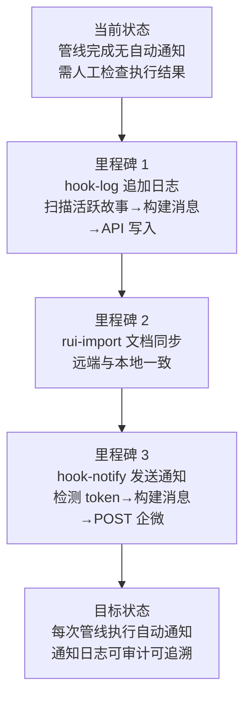

> | v1.0.0 | 2026-05-26 | deepseek-v4-pro | 🌿 feat/rui-bot | 📎 [CLAUDE.md](../../../CLAUDE.md) |

> **导航**: [YrY-使用场景 →](./YrY-使用场景.md)

> **来源引用**: 由 `/rui doc rui-bot` 触发，从 `skills/rui-bot/SKILL.md` 基线反推。证据 Level A + SKILL.md 路径。

[§1 Story](#sec1-story) · [§2 Requirements](#sec2-requirements) · [§3 成功标准](#sec3-success) · [§4 范围边界](#sec4-scope) · [§5 AC](#sec5-ac) · [§6 风险与假设](#sec6-risks) · [§7 跨文档索引](#sec7-index)

---

### §0 基线声明

> **问题空间基线 (Problem Space Baseline)**: 本文档定义"做什么(WHAT)"和"为什么(WHY)"。所有后续文档的设计、实现、验证、改进决策均必须可追溯至本文档的具体章节。

---

### 需求概述

rui-bot 是 rui 管线末端的强制交付步骤，负责将管线执行结果（完成/阻断/门禁失败）通过企业微信机器人通知到相关人员，同时将通知日志持久化到远端数据库。该技能确保每次 rui 管线执行都有可追溯的审计记录，管线的完成状态对项目参与者实时可见。

### 效果示意

### 主要价值

- 🎯 管线完成自动通知 — 每次 rui 执行结束时，自动通过企业微信机器人推送执行结论，无需人工检查
- 🔒 通知日志持久化 — 通过 API 写入远端数据库 sessions 集合，每次通知可回溯审计
- ⚡ 三场景全覆盖 — 完成/阻断/门禁失败三种管线结论各有专用消息模板，字段齐全
- 📊 安全凭据隔离 — API_X_TOKEN 和 webhook URL 仅从环境变量读取，禁止落盘或提交仓库

---

## §1 Story

### Story 1: 管线完成时自动发送通知

| 字段 | 内容 |
|------|------|
| 作为 | 项目维护者 |
| 我想要 | rui 管线每次执行完成/阻断/门禁失败时自动收到企业微信通知 |
| 以便 | 无需手动检查管线状态即可知晓执行结果，并在阻断/失败时第一时间获知恢复点 |
| 优先级 | P0 |
| 范围边界 | 仅发送企微通知和追加通知日志，不涉及管线编排逻辑 |
| 依赖 | rui 管线完成/阻断信号，API_X_TOKEN 环境变量，webhook URL 环境变量 |

#### 范围外

- 不负责管线阶段的编排决策（那是 rui 的职责）
- 不负责文档远端同步（那是 rui-import 的职责）
- 不管理 git 分支或版本号

#### §1.1 User Operations

| # | 操作 | 触发条件 | 操作步骤 | 预期结果 |
|---|------|---------|---------|---------|
| 1 | 管线完成时自动通知 | rui 管线正常完成 | hook-log 扫描活跃故事→构建完成消息→API 写入日志→hook-notify 检测 token→POST 企微 | 企微收到完成通知，通知日志已写入 |
| 2 | 管线阻断时自动通知 | rui 管线被阻断 | hook-log 扫描活跃故事→构建阻断消息(含阻断原因+恢复点)→API 写入日志→hook-notify 通知 | 企微收到阻断通知，含恢复指引 |
| 3 | 门禁失败时自动通知 | Gate A/B 验证失败 | hook-log 扫描活跃故事→构建门禁失败消息(含门禁名+结果)→API 写入日志→hook-notify 通知 | 企微收到门禁失败通知 |

---

### Story 2: 通知日志持久化与审计

| 字段 | 内容 |
|------|------|
| 作为 | 项目审计者 |
| 我想要 | 每次管线通知都被持久化记录到数据库，关联故事标识和时间戳 |
| 以便 | 可回溯历史通知，审计管线执行时间线和交付节奏 |
| 优先级 | P1 |
| 范围边界 | 仅通过 API 写入通知日志，不管理数据库 schema 或查询接口 |
| 依赖 | 远端 API `create_document` 可用，name 参数指定故事标识 |

#### 范围外

- 不提供通知日志的查询检索界面
- 不管理通知日志的清理策略

#### §1.1 User Operations

| # | 操作 | 触发条件 | 操作步骤 | 预期结果 |
|---|------|---------|---------|---------|
| 1 | 通知日志自动写入 | 指定了 name 参数且有通知内容 | 构建通知条目(时间戳+正文)→POST API create_document→sessions 集合持久化 | 通知日志写入 sessions 集合 |
| 2 | 静默跳过日志写入 | 未指定 name 参数 | 检测 name 缺失→跳过日志写入，不报错 | 静默跳过，退出码 0 |
| 3 | 仅日志不发通知 | noSend=true | 构建消息→API 写入日志→跳过 HTTP POST 企微 | 日志已写入，企微未发送 |

---

### §2 Requirements

#### 功能点

| FP# | 描述 | 输入 | 输出 | 错误行为 | 优先级 |
|-----|------|------|------|---------|--------|
| FP1 | 企微消息发送 — 通过 webhook POST 发送纯文本消息到企业微信群 | content(消息正文), webhook_url(解析后的 URL), API_X_TOKEN | HTTP 200-299 响应 | 非 2xx 响应→报告错误，不阻断管线 | P0 |
| FP2 | 通知日志追加 — 通过 API 将通知条目写入远端数据库 sessions 集合 | name(故事标识), content(完整正文含首行项目名) | 数据库持久化确认 | API 不可用→记录 stderr，不阻断管线 | P1 |
| FP3 | 消息格式构建 — 按场景(完成/阻断/门禁失败)构建 emoji:value 格式消息 | 场景类型, 管线状态数据, 文件变更信息 | ≤2000 字纯文本消息 | 字段缺失→补默认值后继续；内容超限→截断明细段 | P0 |
| FP4 | 机器人路由 — 通过 agent 或 robot 参数解析目标 webhook URL | agent 名称 或 robot 名称, 内置配置映射 | 解析后的 webhook_url | 无法解析→报告错误并阻断 | P0 |
| FP5 | 空输入检测 — 无参数时检测 API_X_TOKEN/配置/日志状态并输出推荐任务 | 无 | 配置状态摘要 + 推荐任务列表 | 检测过程中出错→输出可用部分 | P2 |
| FP6 | 安全凭据管理 — API_X_TOKEN 和 webhook URL 读取与脱敏 | 环境变量 API_X_TOKEN, 机器人配置的 webhook_url_env | 脱敏后的凭据引用 | Token 缺失→静默跳过通知发送 | P0 |
| FP7 | hook-log 自动触发 — 管线完成时扫描活跃故事并追加日志 | rui-state.json(s), 时间窗口(1h) | 活跃故事的通知日志已写入 | 无活跃故事→静默跳过 | P1 |
| FP8 | hook-notify 自动触发 — log+sync 完成后实际发送企微通知 | rui-state.json(s), API_X_TOKEN, webhook_url | 企微通知已发送 | Token 缺失或网络失败→静默跳过 | P1 |

#### 业务规则

| R# | 描述 | 校验方式 | 证据级别 |
|----|------|---------|---------|
| R1 | 消息首行自动追加 `【项目名】`，正文不重复 | 构建消息时拼接首行，检查重复 | B |
| R2 | 每条消息 ≤ 2000 字，超限截断明细段 | 发送前 len(content) ≤ 2000 检查 | A |
| R3 | 分隔线仅用 `———`，至多一条 | 构建消息时检查分隔线格式和条数 | B |
| R4 | 错误日志仅取前 20 行，文件 > 10 个时只列统计 | 构建明细段时截断 | B |
| R5 | `🤖 技能` 和 `📋 命令` 必须为消息前两行（首行项目名之后） | 构建消息时按序拼接 | A |
| R6 | Token 缺失时静默跳过通知发送，不阻断管线 | 发送前检查，无 token→skip | B |
| R7 | 通知日志条目格式：时间戳行 + 空行 + 完整正文 | API 写入前构建 | B |
| R8 | hook 自动消息不含首行 `【项目名】`，由 send 步骤拼接 | hook 构建消息时检查 | B |

#### 数据约束

| 约束 | 类型 | 范围/格式 | 来源 |
|------|------|----------|------|
| 消息最大长度 | integer | ≤ 2000 字符 | 企微机器人限制 |
| 场景枚举 | enum | complete / block / gate-fail | rui 管线状态 |
| Token 来源 | env var | 仅 `API_X_TOKEN` 环境变量 | 安全设计 |
| Webhook URL 来源 | env var | 环境变量注入，禁止硬编码 | 安全设计 |
| 技能标识符 | enum | rui / rui-story / rui-claude / rui-bot / rui-import | SKILL.md 规约 |
| 活跃故事时间窗口 | duration | 最近 1 小时内 | hook-log 扫描策略 |
| 通知日志时间戳格式 | string | `【YYYY-MM-DD HH:mm:ss】` | SKILL.md 规约 |
| 分隔线 | string | 仅 `———` | 格式约束 |

---

### §3 成功标准

| SC# | 描述 | 度量方式 | 目标值 | 优先级 | 关联 FP# |
|-----|------|---------|--------|--------|---------|
| SC1 | 管线每次完成时用户能在企业微信收到通知 | 检查企微消息到达 + 消息字段齐全 | 100% 触发率 | P0 | FP1, FP3 |
| SC2 | 通知日志在每次管线执行后被持久化记录 | 查询远端数据库 sessions 集合确认条目存在 | 100% 日志写入率（name 非空时） | P1 | FP2, FP7 |
| SC3 | 管线阻断时通知包含阻断原因和恢复点 | 检查阻断消息中 ❌原因 和 🧭恢复点 字段非空 | 100% 含恢复信息 | P0 | FP3 |
| SC4 | API_X_TOKEN 或 webhook URL 缺失时不阻断管线 | 检查管线在 token 缺失时仍正常完成 | 100% 降级不阻断 | P0 | FP6, FP8 |
| SC5 | 通知消息在 30 秒内发送完成 | 度量 HTTP POST 耗时 | ≤30s | P1 | FP1 |

---

### §4 范围边界

#### 范围内

| # | 条目 | 关联 FP# | 边界说明 |
|---|------|---------|---------|
| 1 | 企微通知发送 | FP1, FP3, FP4 | 通过 webhook POST 纯文本消息 |
| 2 | 通知日志追加 | FP2 | 通过 API 写入远端数据库 sessions 集合 |
| 3 | 消息格式构建 | FP3 | 三场景消息模板 + 格式约束校验 |
| 4 | 机器人路由 | FP4 | agent/robot 参数解析到 webhook URL |
| 5 | 安全凭据管理 | FP6 | API_X_TOKEN 和 webhook URL 环境变量读取+脱敏 |
| 6 | hook 自动触发 | FP7, FP8 | 管线末端 hook-log + hook-notify 自动执行 |
| 7 | 空输入检测 | FP5 | 无参数时检测配置状态并推荐任务 |

#### 范围外

| # | 条目 | 排除原因 | 替代方案 |
|---|------|---------|---------|
| 1 | 管线阶段编排决策 | 属于 rui 技能职责 | rui SKILL.md 定义阶段顺序 |
| 2 | 文档远端同步 | 属于 rui-import 技能职责 | rui-import sync.mjs |
| 3 | 通知日志查询检索 | 属于故事面板功能 | 直接查询远端数据库 |
| 4 | 企业微信机器人创建与管理 | 属于企微管理后台操作 | 手动在企微后台添加机器人 |
| 5 | 多通道通知（邮件/短信/Slack） | 超出当前范围 | 未来扩展 |
| 6 | 通知订阅偏好设置 | 超出当前范围 | 未来扩展 |

---

### §5 AC

| AC# | Given | When | Then | 门禁 |
|-----|-------|------|------|------|
| AC1 | 管线正常完成，API_X_TOKEN 和 webhook URL 已配置 | hook-notify 触发发送 | 企微收到完成通知，消息含全部必填字段（🤖技能 📋命令 🎯结论 📝描述 📌范围 🌐影响 📎证据 ⏱️会话 👉下一步），通知日志已写入 | Gate B |
| AC2 | 管线被阻断，state.blocked = true | hook-notify 触发发送 | 企微收到阻断通知，消息含 ❌原因 和 🧭恢复点 字段，通知日志已写入 | Gate B |
| AC3 | Gate A/B 验证失败 | hook-notify 触发发送 | 企微收到门禁失败通知，消息含 🔍门禁 和 📊结果 字段，通知日志已写入 | Gate B |
| AC4 | API_X_TOKEN 缺失 | hook-notify 触发发送 | 静默跳过发送，退出码 0，hook-log 仍执行日志写入 | Gate B |
| AC5 | 消息内容超过 2000 字符 | send 发送前校验 | 截断明细段（错误日志前 20 行，文件 > 10 个时只列统计），确保最终消息 ≤ 2000 字符 | Gate B |
| AC6 | name 参数为空 | hook-log 触发追加日志 | 跳过日志写入，不报错 | Gate B |
| AC7 | 活跃故事不存在（最近 1h 内无管线执行） | hook-log/hook-notify 扫描 | 静默跳过，退出码 0 | Gate B |
| AC8 | 无参数调用 `/rui-bot` | 执行空输入检测 | 检测 API_X_TOKEN 是否存在、内置配置是否就绪、通知日志状态，输出推荐任务 | Gate A |

---

### §6 风险与假设

| # | 风险/假设 | 类型 | 可能性 | 影响 | 缓解/验证策略 | 关联 FP# |
|---|----------|------|--------|------|-------------|---------|
| 1 | 远端 API (api.effiy.cn) 不可用导致通知日志写入失败 | 风险 | M | M | 报告 stderr，不阻断管线；日志写入失败不阻塞通知发送 | FP2 |
| 2 | 企微 webhook 限流导致通知丢失 | 风险 | L | M | 单次发送一条消息，不批量；失败记录到 stderr，不阻断 | FP1 |
| 3 | API_X_TOKEN 泄露导致未授权发送 | 风险 | M | H | 仅环境变量读取；git 扫描禁止提交；泄露后立即轮换 | FP6 |
| 4 | webhook URL 变更导致通知静默丢失 | 风险 | L | H | 环境变量管理，变更后重启生效；发送失败记录 stderr | FP1, FP4 |
| 5 | 消息格式错误导致企微无法正确显示 | 风险 | L | L | 格式规约束；构建消息时逐字段校验 | FP3 |
| 6 | hook 扫描活跃故事时 rui-state.json 损坏 | 风险 | L | L | JSON 解析失败→静默跳过该故事 | FP7, FP8 |
| 7 | API_X_TOKEN 环境变量已正确配置 | 假设 | — | — | 空输入检测时输出 token 状态 | FP6 |
| 8 | 企微机器人 webhook URL 有效且可达 | 假设 | — | — | 发送前不验证可达性，发送失败后报告 | FP1 |

---

### §7 跨文档索引

| 本文档章节 | 下游文档 | 状态 |
|-----------|---------|------|
| §1 Story 1–2 | 使用场景 | 待生成 |
| §2 FP1–FP8 | 技术评审 | 待生成 |
| §5 AC1–AC8 | 测试设计 | 待生成 |
| §6 风险 1–8 | 安全审计 | 待生成 |

---

> **变更记录**
> | 日期 | 变更 | 触发 | 证据 |
> |------|------|------|------|
> | 2026-05-26 | 初始生成 | /rui doc rui-bot | skills/rui-bot/SKILL.md |
